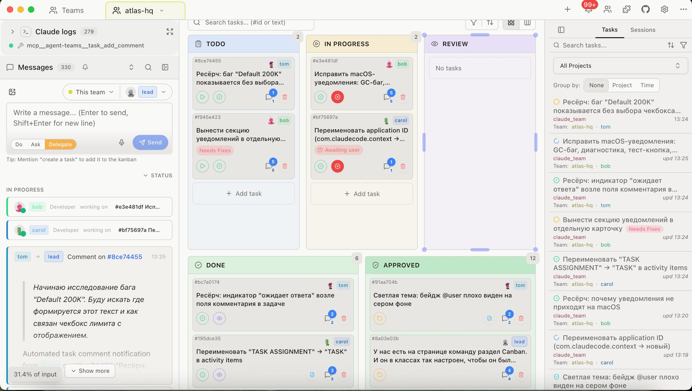
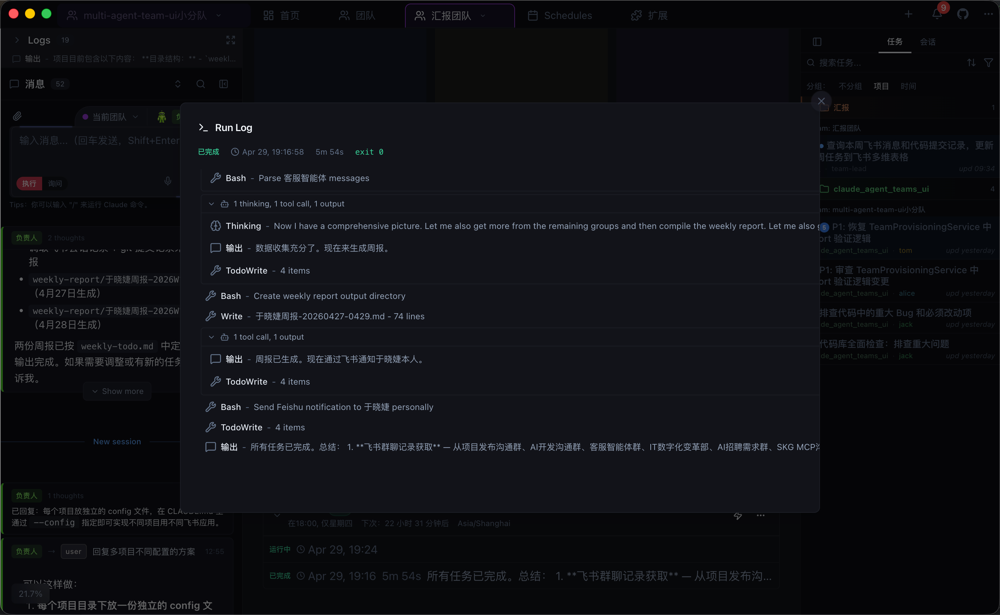
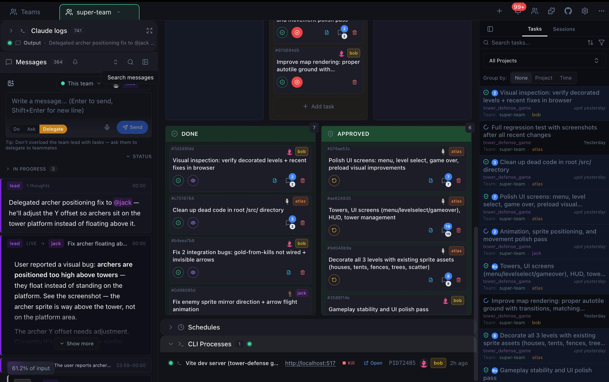
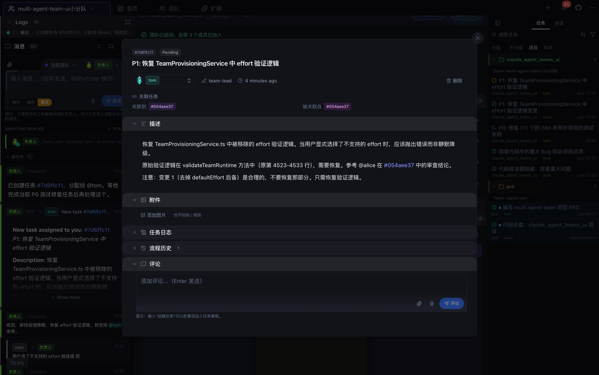
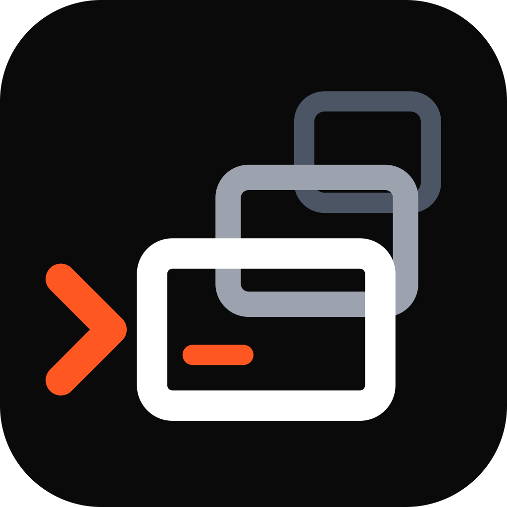
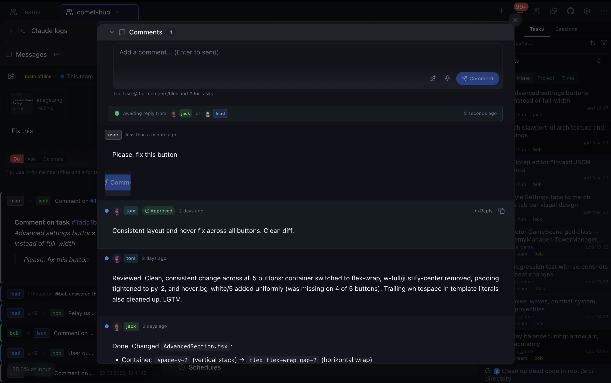
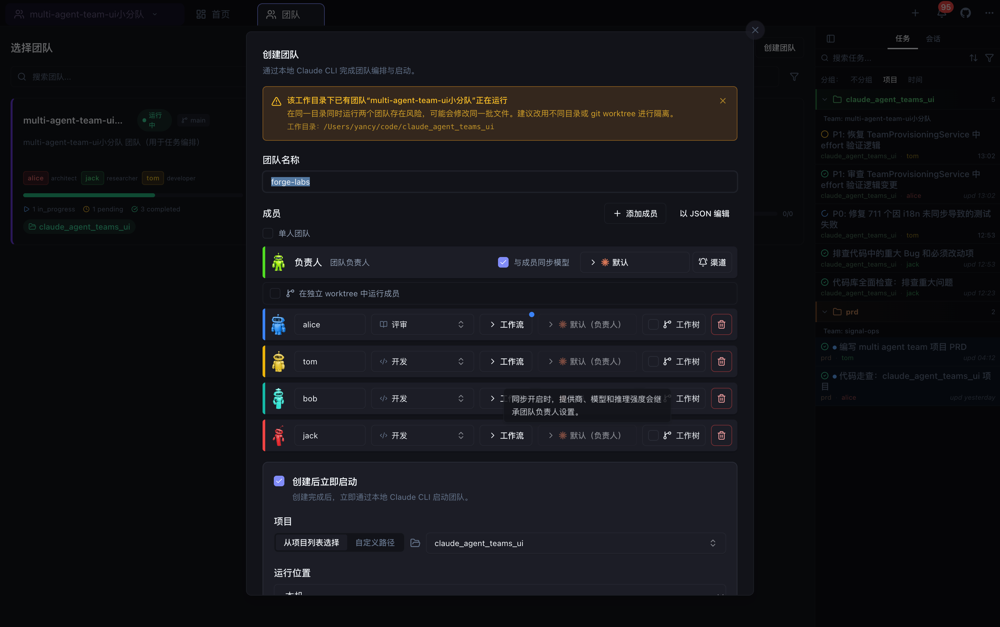
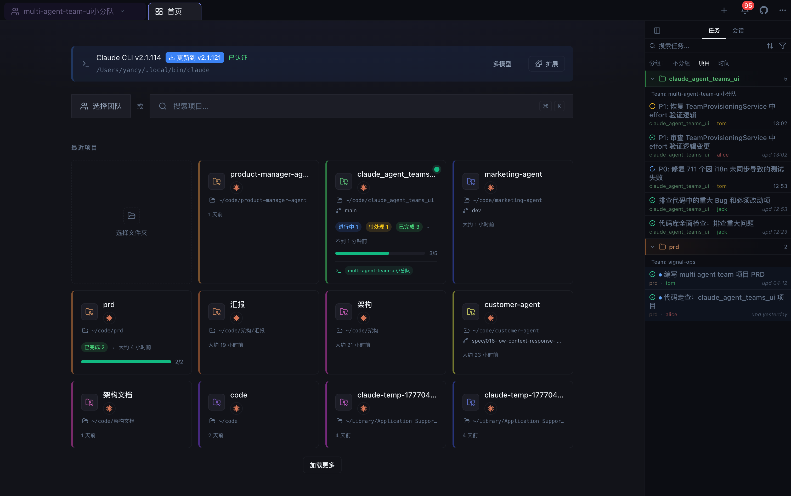

<p align="center">
  <a href="docs/screenshots/1.jpg"></a>&nbsp;
  <a href="docs/screenshots/7.png"></a>&nbsp;
  <a href="docs/screenshots/2.jpg"></a>&nbsp;
  <a href="docs/screenshots/8.png"></a>&nbsp;
  &nbsp;
  <a href="docs/screenshots/9.png"></a>&nbsp;
  <a href="docs/screenshots/3.jpg"></a>&nbsp;
  <a href="docs/screenshots/4.png"></a>&nbsp;
  <a href="docs/screenshots/6.png"></a>
</p>

<h1 align="center"><a href="https://github.com/lazy-agent/multi-agent-workbench">Multi Agent Teams</a></h1>

<p align="center">
  <strong><code>你负责定方向，智能体团队负责拆任务、协作、执行和互相审查。你只需要看着看板推进。</code></strong>
</p>

<p align="center">
  <a href="https://github.com/lazy-agent/multi-agent-workbench/releases/latest"></a>&nbsp;
  <a href="https://github.com/lazy-agent/multi-agent-workbench/actions/workflows/ci.yml"></a>&nbsp;
  <a href="https://discord.gg/qtqSZSyuEc"></a>
</p>

<p align="center">
  <sub>面向 AI 智能体团队的免费桌面应用。默认使用本机 Claude Code/Claude CLI，也可接入 Codex、OpenCode 和远程机器。支持中文界面、中文团队名和成员名。</sub>
</p>


<table>
<tr>
<td width="50%">

https://github.com/user-attachments/assets/9cae73cd-7f42-46e5-a8fb-ad6d41737ff8

</td>
<td width="50%">

https://github.com/user-attachments/assets/35e27989-726d-4059-8662-bae610e46b42

</td>
</tr>
</table>

<br />

## 安装

当前中文本地版默认检测普通 `claude`/Claude Code，不再要求预装 `claude-multimodel`。如果从 macOS 图形界面启动后找不到 Claude CLI，请确认 Claude Code 已安装，或在设置中配置可执行文件路径。

如果需要最新开发版本，可以 clone 仓库后从 `dev` 分支运行。

<table align="center">
<tr>
<td align="center">
  <a href="https://github.com/lazy-agent/multi-agent-workbench/releases/latest/download/Multi-Agent-Teams-arm64.dmg">
    
  </a>
  <br />
  <a href="https://github.com/lazy-agent/multi-agent-workbench/releases/latest/download/Multi-Agent-Teams-x64.dmg">
    
  </a>
</td>
<td align="center">
  <a href="https://github.com/lazy-agent/multi-agent-workbench/releases/latest/download/Multi-Agent-Teams-Setup.exe">
    
  </a>
  <br />
  <sub>May trigger SmartScreen — click "More info" → "Run anyway"</sub>
</td>
<td align="center">
  <a href="https://github.com/lazy-agent/multi-agent-workbench/releases/latest/download/Multi-Agent-Teams.AppImage">
    
  </a>
  <br />
  <a href="https://github.com/lazy-agent/multi-agent-workbench/releases/latest/download/Multi-Agent-Teams-amd64.deb">
    
  </a>&nbsp;
  <a href="https://github.com/lazy-agent/multi-agent-workbench/releases/latest/download/Multi-Agent-Teams-x86_64.rpm">
    
  </a>&nbsp;
  <a href="https://github.com/lazy-agent/multi-agent-workbench/releases/latest/download/Claude-Agent-Teams-UI.pacman">
    
  </a>
</td>
</tr>
</table>

## 目录

- [安装](#安装)
- [这是什么](#这是什么)
- [快速开始](#快速开始)
- [多机分布式执行](#多机分布式执行)
- [开发说明](#开发说明)
- [FAQ](#faq)
- [技术栈](#技术栈)
- [许可证](#license)

## 这是什么

这是一个 Claude Code / Claude CLI 的智能体团队管理界面。你可以创建一个团队，让负责人拆解任务、分配成员、推进看板、互相审查代码，并在必要时给成员发消息或介入决策。

- **中文优先**：主流程、导航栏、团队创建/启动、模型选择、角色选择等界面默认中文；团队名和成员名支持中文输入。
- **Claude Code 优先**：本地默认使用普通 `claude` CLI，自动检测 Homebrew、npm/nvm、`~/.claude/local` 等常见安装路径。
- **团队看板**：任务状态实时更新，支持待办、进行中、审查、完成等工作流。
- **成员协作**：成员可以互相发消息、创建任务、评论任务、请求审查。
- **代码审查**：按任务查看 diff，逐个 hunk 接受、拒绝或评论，体验接近 Cursor 的 review flow。
- **会话与日志**：按任务查看运行日志、工具调用、会话消息和执行状态，便于追踪问题。
- **单人团队**：可以只启动团队负责人，像普通 Claude 会话一样使用，但保留任务看板和后续扩展能力。
- **多机 MVP**：支持按团队选择本地或 SSH 主机执行，第一期采用文件式控制，不做复杂集群编排。

<details>
<summary><strong>More features</strong></summary>

- **Task creation with attachments** — send a message to the team lead with any attached images. The lead will automatically create a fully described task and attach your files directly to the task for complete context.

- **Auto-resume after rate limits** — when the lead hits a Claude rate limit and the reset time is known, the app can automatically nudge the lead to continue once the cooldown has passed

- **Deep session analysis** — detailed breakdown of what happened in each agent session: bash commands, reasoning, subprocesses

- **Smart task-to-log/changes matching** — automatically links session logs/changes to specific tasks

- **Advanced context monitoring system** — comprehensive breakdown of what consumes tokens at every step: user messages, Claude.md instructions, tool outputs, thinking text, and team coordination. Token usage, percentage of context window, and session cost are displayed for each category, with detailed views by category or size.

- **Recent tasks across projects** — browse the latest completed tasks from all your projects in one place

- **Zero-setup onboarding** — built-in runtime detection and provider authentication

- **Built-in code editor** — edit project files with Git support without leaving the app

- **Branch strategy** — choose via prompt: single branch or git worktree per agent

- **Team member stats** — global performance statistics per member

- **Attach code context** — reference files or snippets in messages, like in Cursor. You can also mention tasks using `#task-id`, or refer to another team with `@team-name` in your messages.

- **Notification system** — configurable alerts when tasks complete, agents need your response, new comments arrive, or errors occur

- **MCP integration** — supports the built-in `mcp-server` (see [mcp-server folder](./mcp-server)) for integrating external tools and extensible agent plugins out of the box

- **Post-compact context recovery** — when the active runtime compacts its context, the app restores the key team-management instructions so kanban/task-board coordination stays consistent and important operational context is not lost

- **Task context is preserved** — thanks to task descriptions, comments, and attachments, all essential information about each task remains available for ongoing work and future reference

- **Workflow history** — see the full timeline of each task: when and how its status changed, which agents were involved, and every action that led to the current state

</details>

## Developer architecture docs

For feature architecture and implementation guidance:

- Canonical standard - [docs/FEATURE_ARCHITECTURE_STANDARD.md](docs/FEATURE_ARCHITECTURE_STANDARD.md)
- Repo working instructions - [CLAUDE.md](CLAUDE.md)
- Feature root guidance - [src/features/README.md](src/features/README.md)
- Reference implementation - `src/features/recent-projects`

## Comparison

| Feature | Agent Teams | Vibe Kanban | Aperant | Cursor | Claude Code CLI |
|---|---|---|---|---|---|
| **Cross-team communication** | ✅ | ❌ | ❌ | — | ❌ |
| **Agent-to-agent messaging** | ✅ Native real-time mailbox | ❌ Agents are independent | ❌ Fixed pipeline | ❌ | ✅⚠️ Built-in (no UI) |
| **Linked tasks** | ✅ Cross-references in messages | ⚠️ Subtasks only | ❌ | ❌ | ❌ |
| **Session analysis** | ✅ 6-category token tracking | ❌ | ⚠️ Execution logs | ❌ | ❌ |
| **Task attachments** | ✅ Auto-attach, agents read & attach files | ❌ | ✅ Images + files | ⚠️ Chat session only | ❌ |
| **Hunk-level review** | ✅ Accept / reject individual hunks | ❌ | ❌ | ✅ | ❌ |
| **Built-in code editor** | ✅ With Git support | ❌ | ❌ | ✅ Full IDE | ❌ |
| **Full autonomy** | ✅ Agents create, assign, review tasks end-to-end | ❌ Human manages tasks | ❌ Fixed pipeline | ⚠️ Isolated tasks only | ✅⚠️ (no UI) |
| **Task dependencies (blocked by)** | ✅ Guaranteed ordering | ❌ | ⚠️ Within plan only | ❌ | ✅⚠️ (no UI, no notifications) |
| **Review workflow** | ✅ Agents review each other | ❌ | ⚠️ Auto QA pipeline | ❌ | ✅⚠️ (no UI) |
| **Zero setup** | ✅ | ❌ Config required | ❌ Config required | ✅ | ⚠️ CLI install required |
| **Kanban board** | ✅ 5 columns, real-time | ✅ | ✅ 6 columns (pipeline) | ❌ | ❌ |
| **Execution log viewer** | ✅ Tool calls, reasoning, timeline | ❌ | ✅ Phase-based logs | ✅ | ❌ |
| **Live processes** | ✅ View, stop, open URLs in browser | ❌ | ❌ | ✅ | ❌ |
| **Per-task code review** | ✅ Accept / reject / comment | ⚠️ PR-level only | ⚠️ File-level only | ✅ BugBot on PRs | ❌ |
| **Flexible autonomy** | ✅ Granular settings, per-action approval, notifications | ❌ | ⚠️ Plan approval only | ✅ | ✅ |
| **Git worktree isolation** | ✅ Optional | ⚠️ Mandatory | ⚠️ Mandatory | ✅ | ✅ |
| **Multi-agent backend** | ✅ Codex, Claude, and 75+ providers | ✅ 6+ agents | ✅ 11 providers | ✅ Multi-model | — |
| **Price** | **Free** | Free / $30 user/mo | Free | $0–$200/mo | Provider subscription |

---

## 快速开始

1. **安装并启动**：打开应用后会自动检测本机 `claude`。
2. **选择项目**：从最近项目列表选择，或输入自定义路径。
3. **创建团队**：填写中文团队名、成员名、角色和启动提示。
4. **启动执行**：团队负责人会拆任务、分配成员并推进看板。
5. **随时介入**：你可以在看板、消息、任务详情、代码审查里直接给成员补充指令。

## 多机分布式执行

当前 MVP 是“团队级调度”，不是成员级调度。

- 在机器管理里添加 SSH 主机，配置主机、端口、用户名、认证方式和远程工作目录。
- 创建或启动团队时选择运行目标：本机或某台 SSH 主机。
- 本地 UI 通过 SSH/SFTP 读写远程项目目录、`.claude/teams` 和控制文件。
- 远程机器上的 Claude Code/Claude CLI 负责实际执行；第一期不做 skills 同步、卷挂载、复杂远程进程编排。
- 所有团队管理都尽量通过文件完成，便于今晚可用、后续再演进为自动调度。

---

## FAQ

<details>
<summary><strong>必须先安装运行时吗？</strong></summary>
<br />
需要本机或远程机器能运行 Claude Code/Claude CLI。当前默认查找普通 `claude`，不强制依赖 `claude-multimodel`。
</details>

<details>
<summary><strong>会读取或上传我的代码吗？</strong></summary>
<br />
应用本身不是云端代码同步服务。它会读取本地或你配置的远程项目目录、Claude 会话数据和团队状态文件来展示 UI。实际模型请求由你选择的 Claude/Codex/OpenCode 等运行时发起。
</details>

<details>
<summary><strong>智能体之间能沟通吗？</strong></summary>
<br />
可以。成员之间可以发送消息、创建共享任务、评论任务，并通过团队看板协调进度。
</details>

<details>
<summary><strong>免费吗？</strong></summary>
<br />
应用本身免费开源。运行智能体需要你已有的 Claude Code、Codex、OpenCode 或对应 provider 访问权限。
</details>

<details>
<summary><strong>能在应用里审查代码改动吗？</strong></summary>
<br />
可以。每个任务都可以查看 diff，并对具体 hunk 接受、拒绝或评论。
</details>

<details>
<summary><strong>智能体卡住了怎么办？</strong></summary>
<br />
可以直接发消息纠偏，也可以停止并重启团队。需要你输入时，任务和通知区域会提示。
</details>

<details>
<summary><strong>支持多个项目和团队吗？</strong></summary>
<br />
支持。你可以在一个项目中运行多个团队，也可以跨项目运行。为了减少 Git 冲突，可以启用独立 worktree。
</details>

---

## 开发说明

## 技术栈

Electron 40、React 19、TypeScript 5、Tailwind CSS 3、Zustand 4。数据主要来自 `~/.claude/`、项目目录和应用自有状态目录。

<details>
<summary><strong>从源码运行</strong></summary>

<br />

**依赖：** Node.js 20+、pnpm 10+

```bash
git clone https://github.com/lazy-agent/multi-agent-workbench.git
cd claude_agent_teams_ui
pnpm install
pnpm dev
```

应用会从 `~/.claude/` 自动发现 Claude Code 项目。

### 打包发布

```bash
pnpm dist:mac:arm64  # macOS Apple Silicon (.dmg)
pnpm dist:mac:x64    # macOS Intel (.dmg)
pnpm dist:win        # Windows (.exe)
pnpm dist:linux      # Linux (AppImage/.deb/.rpm/.pacman)
pnpm dist            # macOS + Windows + Linux
```

### 常用脚本

| 命令 | 说明 |
|---------|-------------|
| `pnpm dev` | 开发模式，支持热更新 |
| `pnpm build` | 生产构建 |
| `pnpm typecheck` | TypeScript 类型检查 |
| `pnpm lint` | 代码检查，不自动修复 |
| `pnpm lint:fix` | 代码检查并自动修复 |
| `pnpm format` | 使用 Prettier 格式化 |
| `pnpm test` | 运行全部测试 |
| `pnpm test:watch` | 测试 watch 模式 |
| `pnpm check` | 完整质量门禁 |

</details>

---

## Roadmap

- [ ] Planning mode to organize agent plans before execution
- [ ] Visual workflow editor ([@xyflow/react](https://github.com/xyflow/xyflow)) for building and orchestrating agent pipelines with drag & drop
- [ ] Support more models/providers (including local) e.g OpenCode (with many providers)
- [ ] Remote agent execution via SSH: launch and manage agent teams on remote machines over SSH (stream-json protocol over SSH channel, SFTP-based file monitoring for tasks/inboxes/config)
- [ ] CLI runtime: Run not only on a local PC but in any headless/console environment (web UI), e.g. VPS, remote server, etc.
- [ ] 2 modes: current (agent teams), and a new mode: regular subagents (no communication between them)
- [ ] Curate what context each agent sees (files, docs, MCP servers, skills)
- [ ] Slash commands
- [ ] Outgoing message queue — queue user messages while the lead (or agent) is busy; clear agent-busy status in the UI; flush to stdin or relay from inbox when idle (durable queue on disk for the lead inbox path)
- [ ] `createTasksBatch` — IPC/service API to create many team tasks in one call (playbooks, markdown checklist import, scripts); complements single `createTask`
- [ ] Command palette — extend Cmd/Ctrl+K beyond project/session search to runnable actions (quick commands, navigation shortcuts, team/task operations) in a keyboard-first flow
- [ ] Custom kanban columns
- [ ] Run terminal commands
- [ ] Monitor agents processes/stats
- [ ] Reusable agents with SOUL.md
- [ ] Сommunicate via messenger

---

## Contributing

See [CONTRIBUTING.md](.github/CONTRIBUTING.md) for development guidelines. Please read our [Code of Conduct](.github/CODE_OF_CONDUCT.md).

## Security

IPC and standalone HTTP handlers validate IDs, paths, and payload shape at the boundary. Project editing and write operations are constrained to the selected project root, while read-only discovery also accesses local Claude data under `~/.claude/` and app-owned state paths when required. Path traversal and sensitive config/credential targets are blocked. See [SECURITY.md](.github/SECURITY.md) for details.

## License

[AGPL-3.0](LICENSE)
