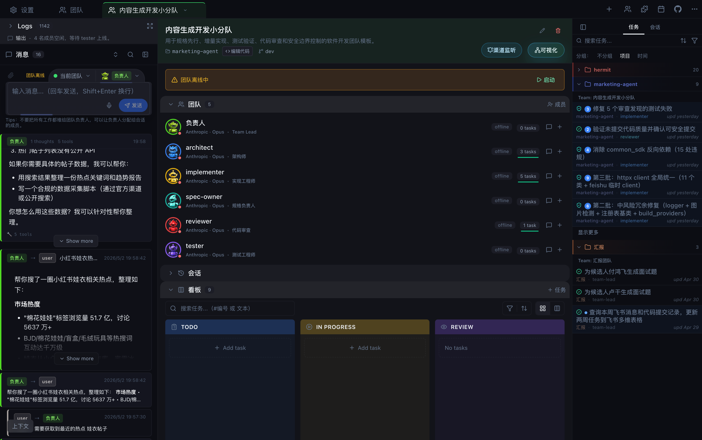
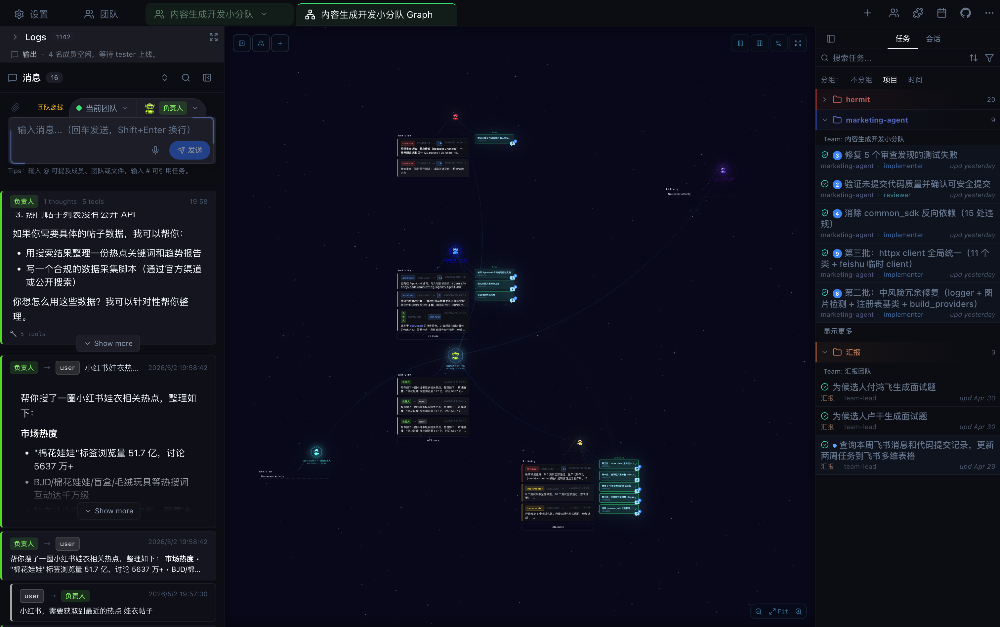
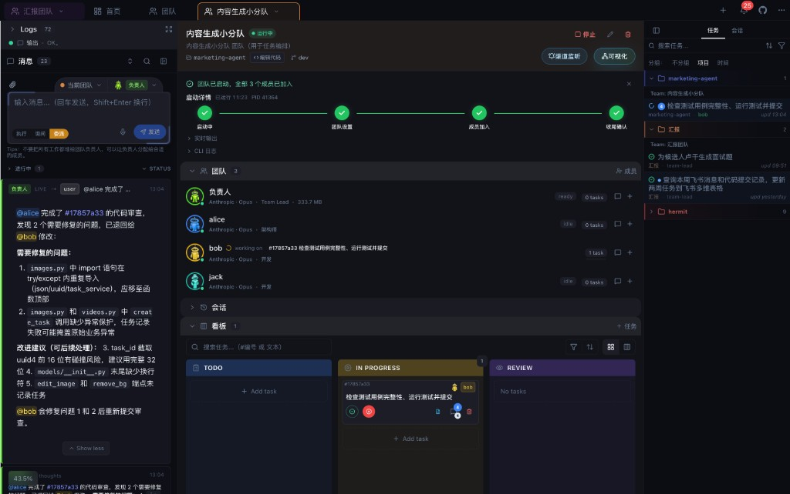

<p align="center">
  <a href="docs/screenshots/1.jpg"></a>&nbsp;
  <a href="docs/screenshots/7.png"></a>&nbsp;
  <a href="docs/screenshots/2.png"></a>&nbsp;
  <a href="docs/screenshots/8.png"></a>&nbsp;
  &nbsp;
  <a href="docs/screenshots/9.png"></a>&nbsp;
  <a href="docs/screenshots/3.png"></a>&nbsp;
  <a href="docs/screenshots/4.png"></a>&nbsp;
  <a href="docs/screenshots/6.png"></a>
</p>

<h1 align="center"><a href="https://github.com/yancyuu/Hermit">Hermit</a></h1>

<p align="center">
  <strong>企业级 AI Agent 团队协作与管理工作台。</strong><br />
  像管理真实工程组织一样管理数字员工：团队、角色、任务、消息、审查、日志和知识资产都在同一个本地优先控制面里。
</p>

<p align="center">
  <a href="https://github.com/yancyuu/Hermit/releases/latest"></a>&nbsp;
  <a href="https://github.com/yancyuu/Hermit/actions/workflows/ci.yml"></a>&nbsp;
  <a href="https://yancyuu.github.io/Hermit/zh"></a>&nbsp;
  <a href="LICENSE"></a>
</p>

<p align="center">
  <a href="https://github.com/yancyuu/Hermit/releases/latest/download/Hermit-arm64.dmg">
    
  </a>
  <a href="https://github.com/yancyuu/Hermit/releases/latest/download/Hermit-x64.dmg">
    
  </a>
  <a href="https://github.com/yancyuu/Hermit/releases/latest/download/Hermit-Setup.exe">
    
  </a>
</p>

<p align="center">
  <a href="https://github.com/yancyuu/Hermit/releases/latest/download/Hermit.AppImage">
    
  </a>
  <a href="https://github.com/yancyuu/Hermit/releases/latest/download/Hermit-amd64.deb">
    
  </a>
  <a href="https://github.com/yancyuu/Hermit/releases/latest/download/Hermit-x86_64.rpm">
    
  </a>
  <a href="https://github.com/yancyuu/Hermit/releases/latest/download/Hermit.pacman">
    
  </a>
</p>

> 如果稳定下载链接暂时不可用，请到 [Releases](https://github.com/yancyuu/Hermit/releases/latest) 页面选择对应平台资产。



## Hermit 是什么

Hermit 是一个面向软件工程场景的 AI Agent 工作台。它不重新发明模型，也不把自己做成云端代码托管平台，而是把已经很强的编程运行时（当前默认是官方 Claude Code / `claude` CLI）放进一个可管理的团队系统里。

在 Hermit 里，你创建的不是一次性的 prompt，而是一个团队：负责人理解目标、拆分任务、分配成员；成员在独立上下文中执行；看板记录进度；评论沉淀讨论；代码审查承接 diff；日志展示真实执行过程。你像管理一个小型工程团队一样管理 AI Agent。

Hermit 基于 `claude_agent_teams_ui` 二次开发，保留本地优先的 Claude Code 团队协作能力，并强化中文体验、团队看板、代码审查、成员运行诊断、跨团队消息、运行时适配和仓库化团队资产方向。

## 为什么需要它

编程 Agent 越来越强之后，新的问题不是“能不能写代码”，而是“如何稳定交付”。

一个真实工程任务往往包含需求澄清、上下文收集、实现、测试、审查、返工、发布和复盘。把这些全部塞进单个聊天窗口，很快会失去结构：任务散落在对话里，成员状态不可见，代码改动难审查，经验也无法复用。

Hermit 解决的是这层组织问题：

- **把目标变成任务**：负责人把用户请求拆成看板任务，任务有状态、负责人、评论和审查记录。
- **把 Agent 变成成员**：成员有角色、工作方式、Inbox、运行时和日志，而不是一次性子任务。
- **把执行变成证据**：每个任务的消息、工具调用、代码变更和审查意见都能回看。
- **把经验变成资产**：团队模板和 Skills 可以通过 GitHub / 企业 Git 源版本化、审查、同步和复用。
- **把运行时变成可替换底座**：Claude Code 是当前默认能力，Cursor CLI 作为可选运行时方向逐步探索。

## 产品理念

### 少造底座，多沉淀组织资产

Hermit 不试图成为所有模型、消息平台和工具调用的总网关。模型和代码执行能力会持续进化，Hermit 更关注长期不该丢失的部分：任务事实、协作协议、审查标准、团队分工、运行记录和企业内部知识。

### 本地优先，不托管核心代码

Hermit 运行在你的机器上，读取你选择的项目目录和本地 Claude 数据。真实代码执行发生在本地工作站或你信任的运行环境里。Hermit 负责组织、观察和记录，而不是把代码交给一个额外的中心控制面。

### 仓库同步，而不是远程遥控

多机协同的默认方向不是 SSH/SFTP 式分布式调度。每台机器安装 Hermit，连接同一组团队模板源和 Skills 源，通过 Git 分支、PR 和企业代码库完成协作。仓库就是跨机器和跨团队的边界。

### 中文优先，团队名和成员名支持中文

Hermit 默认面向中文用户。可见文案、团队创建、成员管理、任务评论、确认对话和错误提示都优先使用简体中文。团队名、成员名、角色、工作流等用户输入支持中文；内部目录和标识会单独做安全 slug。

## 核心能力

### Agent 团队

- 创建负责人和多个成员组成的团队。
- 成员可以拥有不同角色、工作流、模型和运行方式。
- 团队启动按小批次并发拉起成员，减少限流和慢机器误判。
- 支持团队重启、成员重启、运行状态检查和启动诊断。

### 看板任务流

- 任务从待办、进行中、审查到完成形成闭环。
- 任务支持评论、附件、成员分配、状态历史和结构化任务引用。
- 成员完成任务前需要沉淀结果，负责人可以继续追问、返工或审查。

### 消息与协作

- 负责人和成员通过 Inbox 进行消息协作。
- 支持用户直接给成员发消息、成员给用户回复、跨团队沟通和任务引用链接。
- 团队消息和任务评论可以互相沉淀，不再散落在一次性聊天上下文里。

### 代码审查

- 按任务查看文件变更和 diff。
- 支持接受、拒绝或评论具体变更块。
- 审查结果和任务状态联动，适合实现、审查、返工的工程闭环。

### 执行日志与诊断

- 展示 Claude CLI / Agent 运行日志、工具调用、思考片段、消息和错误。
- 支持成员运行状态、进程状态、启动超时、权限阻塞等诊断信息。
- Windows 慢启动场景下，成员启动等待窗口和批量启动并发做了更保守的默认值。

### 运行时适配方向

- 当前默认运行时：官方 Claude Code / `claude` CLI。
- 已建立 Cursor CLI runtime adapter 的基础切片，用于 headless / solo 场景探索。
- Cursor CLI 按独立适配器方向探索，不污染 Claude Teams 主路径。

### Skills 与团队模板

Hermit 的长期方向是让企业把自己的工程经验沉淀成可版本化资产：

- 多个 GitHub / 企业 Git Skills 源。
- 多个 GitHub / 企业 Git 团队模板源。
- 角色、工作流、审查标准、排障手册、发布规范和工具使用方式通过仓库同步。
- 不同项目、不同机器、不同团队可以复用同一套数字团队能力。

## 典型使用场景

### 产品工程交付

把“实现设置页运行时配置”“修复 Windows 启动卡顿”“重构代码审查视图”这类需求交给负责人。负责人拆任务，成员实现，审查成员看 diff，最终结果沉淀在看板和评论里。

### 线上故障响应

为线上故障准备固定团队：负责人接收告警上下文，排障成员查日志和代码路径，修复成员提交变更，审查成员确认风险。整个过程形成任务、评论、结论和复盘线索。

### 代码审查与质量门禁

为仓库配置专门审查团队，把内部代码规范、安全规则、性能检查清单和发布要求写成 Skills。实现成员完成后进入审查，审查意见直接落到任务和 diff 上。

### 内部平台自动化

平台团队可以把依赖升级、CI 失败排查、Release Note、文档同步、测试补齐、代码库巡检变成固定团队。团队不只是运行一次脚本，而是留下过程、证据和可复用模板。

### 个人增强工作台

也可以只使用负责人，获得任务看板、消息记录、执行日志和代码审查能力。适合个人项目、独立开发者或技术负责人管理长周期任务。

## 和常见方案的区别

| 能力 | Hermit | Claude Dashboard | OpenClaw 类个人 Agent | Hermes 类通用网关 | Vibe Kanban / OpenHands 类产品 |
| --- | ---: | ---: | ---: | ---: | ---: |
| 直接复用 Claude Code Runtime | 是 | 是 | 否 | 否 | 部分 |
| 负责人 + 成员的团队模型 | 是 | 否 | 部分 | 部分 | 部分 |
| 成员独立 Inbox / 消息协作 | 是 | 否 | 部分 | 部分 | 否 |
| 看板任务闭环 | 是 | 部分 | 否 | 否 | 是 |
| 代码审查 / diff 审批 | 是 | 部分 | 否 | 否 | 部分 |
| 本地优先，不托管核心代码 | 是 | 是 | 是 | 部分 | 部分 |
| Skills / 团队模板版本化 | 规划中 | 否 | 部分 | 否 | 否 |
| 多机协同通过仓库同步 | 规划中 | 否 | 否 | 否 | 部分 |
| 文件、任务、评论沉淀为长期记忆 | 是 | 部分 | 部分 | 否 | 部分 |

Hermit 的核心取舍是：不重新发明 Agent 大脑，而是在强运行时之上补齐团队控制平面和可复用组织资产。

## 快速开始

1. 安装并启动 Hermit。
2. 确保本机已安装并登录官方 Claude Code / `claude` CLI。
3. 选择一个项目目录。
4. 创建团队，填写团队目标、成员、角色和工作方式。
5. 启动团队，观察成员启动状态和看板任务。
6. 在消息、任务详情、执行日志和代码审查中介入协作。

如果 macOS 图形界面启动后找不到 `claude`，请确认 Claude Code 已安装，或在设置里配置 CLI 路径。常见路径包括 Homebrew、npm/nvm、`~/.claude/local/bin` 等。

## 架构概览

```text
GitHub / 企业 Git 源
        |
        +--> Skills / 团队模板 / 运行时预设
        |
        v
Hermit 本地工作台
        |
        +--> 团队负责人 team-lead
        |       |
        |       +--> 任务拆解 / 成员分配 / 对外沟通
        |
        +--> 成员 inbox / 消息 / 评论
        |
        +--> 看板任务 / 代码审查 / 执行日志
        |
        +--> Agent Runtime
        |       |
        |       +--> Claude Code / Cursor CLI ...
        |
        +--> 本地项目目录 / 用户可信执行环境
```

关键原则：

- 负责人是团队入口，不是全局代理服务器。
- 成员是独立执行单元，不让负责人代替成员消费普通成员 Inbox。
- 任务、消息、审查和运行状态都要落到可追踪状态里。
- 多机协同优先通过 Git 仓库同步，不提前引入复杂分布式调度。
- 长期记忆优先沉淀到任务、评论、审查记录、模板和 Skills。

## 开发

依赖：Node.js 20+、pnpm 10+。

```bash
git clone https://github.com/yancyuu/Hermit.git
cd Hermit
pnpm install
pnpm dev
```

常用命令：

```bash
pnpm typecheck
pnpm build
pnpm test
pnpm dist:mac:arm64
pnpm dist:win
pnpm dist:linux
```

项目技术栈：

- Electron 40
- React 19
- TypeScript 5
- Tailwind CSS 3
- Zustand
- Claude Code / `claude` CLI
- MCP
- Git / GitHub / 企业仓库源

## 当前边界

- 当前主线优先支持官方 Claude Code / `claude` CLI。
- Cursor CLI runtime adapter 处于基础探索阶段，优先用于 headless / solo 运行时评估，不等价于 Claude Agent Teams。
- 当前产品不要假设存在 OpenCode、Codex 或 Gemini 运行时；这些不作为默认可用能力宣传。
- 不把 SSH/SFTP 分布式调度作为新功能默认方向；多机协同优先通过 GitHub / 企业 Git 仓库同步 Skills、团队模板和代码变更。
- Hermit 不是云端代码托管服务；真实执行发生在本地项目目录或你配置的可信运行环境中。
- 团队成员启动采用小批次并发和较宽的启动等待窗口，以降低慢机器、Windows、杀软或磁盘 I/O 导致的误判失败。

## 路线图

- Cursor CLI / SDK Runtime：把 Cursor Agent Runtime 作为可编程运行时接入。
- Skills Git 源：支持配置多个 GitHub / 企业 Git 源，导入、审查、更新和回滚 Skills。
- 团队模板 Git 源：支持多个团队模板源，复用成员角色、工作流和运行时预设。
- 仓库化协同：通过 Git 分支和 PR 管理团队知识、Skills 和模板演进。
- 计划模式：执行前先生成并审查团队计划。
- 更细粒度的成员上下文权限。
- CLI / Web 控制台。
- 自定义看板列和工作流。

## 安全

IPC 和主进程 handler 会校验 ID、路径和 payload 结构。项目编辑和写入操作限制在当前选择的项目根目录内；只读发现流程会访问 `~/.claude/` 下的 Claude 数据和应用自有状态目录。敏感配置、凭据路径和路径穿越会被阻止。

## 许可证

[AGPL-3.0](LICENSE)
