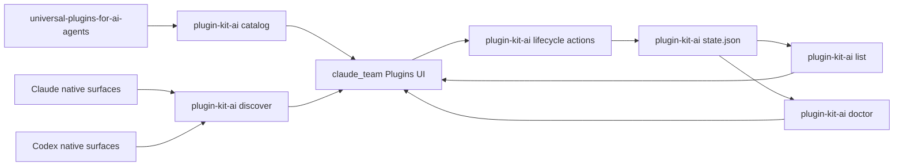

# plugin-kit-ai Integration Plan for Extensions Plugins

**Status**: Draft  
**Date**: 2026-04-18  
**Owner repos**:

- `claude_team`
- `plugin-kit-ai`

## Purpose

Replace the current Claude-only plugin backend in `claude_team` with a provider-aware backend powered by `plugin-kit-ai`, while keeping the existing `Extensions -> Plugins` UI.

The integration must support two different truths at the same time:

- **Universal plugins** managed through `plugin-kit-ai`
- **Native external installed plugins** that already exist in Claude or Codex and are not yet part of universal managed state

Those are different objects and must remain different in UI, state, and actions.

## How To Use This Plan

This document is intentionally long because it combines:

- product model
- backend contract spec
- rollout spec
- app integration rules

Use it in this order:

1. read `One-Page Summary`
2. read `Phase 0 Decision Checkpoints`
3. read `Current backend blockers that shape the plan`
4. for backend work:
   - read `Recommended Backend Basis By Surface`
   - read `Managed Lifecycle Model`
   - read `JSON Contract Style`
   - read `Recommended Contract Drafts`
5. for app work:
   - read `Entry Derivation and Conflict Resolution`
   - read `UI and Entry Model in claude_team`
   - read `claude_team Changes Required`
6. before shipping:
   - read `Rollout Phases`
   - read `PR Exit Criteria`
   - read `No-Go Conditions`

If any implementation decision contradicts the earlier sections, the earlier sections win.

## One-Page Summary

### What we are building

- keep the current `Extensions -> Plugins` UI in `claude_team`
- bundle `plugin-kit-ai` as a backend engine
- use `plugin-kit-ai` for:
  - universal catalog
  - native discovery
  - universal lifecycle actions

### What we are not building

- not embedding a second plugin UI
- not parsing prose CLI output
- not scraping repo layout from `claude_team`
- not pretending native installed plugins are the same thing as universal managed plugins
- not promising `local` scope before backend really supports it

### User-visible outcome

- installed plugins come first
- universal plugins are the main storefront
- native installed Claude/Codex plugins stay visible and are labeled honestly
- install/update/remove/repair results stay target-granular
- mutation results do not lie about partial progress:
  - applied
  - rolled back
  - degraded state persisted

### Phase 1 can and cannot promise

Phase 1 can safely promise:

- truthful mixed rendering of universal and native external entries
- truthful managed lifecycle status for installed universal entries
- explicit degraded / rolled-back mutation outcomes
- explicit adopted-target update semantics when backend provides them

Phase 1 must **not** promise:

- parallel managed installs of the same integration across scopes or workspaces
- fake `local` scope parity
- destructive actions for native external entries
- instant local-only previews for every lifecycle action
- shared universal card metadata that silently reflects one target override
- invisible policy-driven target adoption during update
- target-scoped `update` or `remove` UX until the public backend command surface exposes that capability consistently

### Quick truth map

| User question | Backend surface |
|---|---|
| What universal plugins exist? | `catalog` |
| What native plugins already exist outside managed state? | `discover` |
| What universal plugins are managed right now? | `list` |
| Which managed targets need attention or repair? | `doctor` |
| How fresh is the managed lifecycle truth? | lifecycle grouped metadata such as `last_checked_at` and `last_updated_at` |
| Can I install/update/remove/repair this universal plugin? | lifecycle `plan/result` contracts |
| What detail text and README should the storefront show? | `catalog` detail path |
| What detail explains current target drift or activation? | lifecycle target-detail payload |

### Command quick reference

| Command surface | Can be networked in preview? | Can mutate native state? | Phase-1 app expectation |
|---|---|---|---|
| `catalog` | no | no | fast storefront truth |
| `discover` | no | no | fast native-installed truth |
| `list` | no | no | fast managed ownership truth |
| `doctor` | no | no | fast health + recovery truth |
| `add` dry-run | yes | no | review can show source-checking state |
| `update` dry-run | yes | no | review can show source-checking state and adopted-target work; phase-1 public command surface is integration-wide, not target-filtered |
| `remove` dry-run | no | no | cheap review, no source resolution required; phase-1 public command surface is integration-wide, not target-filtered |
| `repair` dry-run | no | no | cheap review, no source resolution required |
| apply mutations | yes | yes | explicit progress + explicit outcome class |

### Lifecycle action families from current code

Current `integrationctl` already has several different action families.

They are not interchangeable and the app should not flatten them into one generic “plugin action” concept.

| Action family | Current action ids | Key behavior from code | Phase-1 app status |
|---|---|---|---|
| add new managed integration | `add` | resolves requested source, plans/installs one or more targets | in scope |
| mutate existing managed integration | `update_version` | resolves current source, may also adopt newly supported targets | in scope |
| remove managed targets | `remove_orphaned_target` | dry-run can stay local, apply may resolve source and mutate state | in scope |
| repair managed drift | `repair_drift` | dry-run can stay local, apply may resolve source and persist degraded state on failure | in scope |
| toggle managed target | `enable_target`, `disable_target` | single-target toggle lane, distinct summary and apply path | out of scope for phase 1 |

### Phase-1 action subset

Phase 1 plugin lifecycle in `claude_team` should expose only:

- `add`
- `update_version`
- `remove_orphaned_target`
- `repair_drift`

Phase 1 should not expose:

- `enable_target`
- `disable_target`
- `sync`
- target-scoped `update` or `remove` controls unless backend command contracts add them explicitly

Why:

- they are lower-value than core lifecycle
- they have distinct semantics that would widen the UI surface
- they are better added only after mixed-entry rendering and primary lifecycle flows are proven
- current public command surface is not yet symmetric for target-filtered existing mutations

### Safe delivery order

1. add stable JSON contracts to `plugin-kit-ai`
2. add universal catalog in `plugin-kit-ai`
3. add native discovery in `plugin-kit-ai`
4. integrate read-only mixed plugin view in `claude_team`
5. add universal lifecycle actions in `claude_team`
6. consider optional native convenience flows only later

### Current backend blockers that shape the plan

These come from current code and are the main reason the rollout has to stay phased:

- managed state is effectively keyed by `integration_id`, not by a richer record key
- project-sensitive service construction still depends on implicit `cwd`
- current `integrations` manage commands still do not accept explicit `--workspace-root`
- current `update_version` planning may also produce adopted-target work based on manifest drift and policy
- current `update_version` dry-run already resolves current source and may therefore clone/fetch remote source before review is shown
- dry-run planning can look clean and still fail later on apply because same-`integration_id` conflict is enforced only under state lock
- current public CLI command surface is asymmetric for existing-target filtering:
  - `repair` exposes `--target`
  - `enable/disable` can require `--target`
  - `update/remove` currently do not expose `--target`, even though the underlying usecase model already has a target field
- current lifecycle `Report.Targets` are too flat for app use and lose integration-level grouping
- current lifecycle `TargetReport` also drops some adapter-level detail that the app will need for truthful detail views
- current lifecycle `TargetReport` currently drops concrete detail such as:
  - target warnings
  - owned native objects
  - observed native objects
  - settings files
  - config precedence context
  - paths touched
  - commands
- current lifecycle report also drops managed freshness fields such as `last_checked_at` and `last_updated_at`

### Execution blueprint

| Step | Repo | Main packages | What changes | Why this step exists |
|---|---|---|---|---|
| 0 | `plugin-kit-ai` | `integrationctl`, CLI command layer | freeze state identity, conflict timing, app-mode workspace semantics | prevents bad contracts from being versioned |
| 1 | `plugin-kit-ai` | CLI JSON output layer | add versioned lifecycle JSON envelopes | gives app a stable machine-readable seam |
| 2 | `plugin-kit-ai` | lifecycle usecase/domain | add managed grouping and target-detail fidelity | makes lifecycle usable for app cards/detail views |
| 3 | `plugin-kit-ai` | service construction + request context | add explicit `workspace_root` handling | removes hidden `cwd` coupling |
| 4 | `plugin-kit-ai` | authored inspection/catalog projection | add universal catalog JSON | provides storefront truth |
| 5 | `plugin-kit-ai` | new discovery usecase + adapters | add native discovery JSON | provides native installed truth |
| 6 | `claude_team` | main services + renderer normalized model | read-only mixed plugin page | validates catalog + discover + list + doctor interplay |
| 7 | `claude_team` | lifecycle actions + store refresh | universal install/update/remove/repair | completes managed plugin flow |

### Backend readiness gate before any `claude_team` plugin-kit PR

`claude_team` should not start real plugin-kit-backed plugin rendering or lifecycle work until the backend can already guarantee all of the following.

This gate is intentionally stricter than “some JSON exists”.

| Required backend guarantee | Why the app needs it | Current code reality |
|---|---|---|
| explicit `workspace_root` request context for project-sensitive commands | prevents plan/apply from using hidden `cwd` semantics | missing at CLI manage-command layer |
| stable `managed_entry_key` for grouped lifecycle entries | prevents app cache keys from collapsing to raw `integration_id` | missing as a public grouped contract field |
| grouped lifecycle JSON with `requested_source_ref`, `resolved_source_ref`, `policy.scope`, and `workspace_root` | lets app render ownership truth without row reconstruction heuristics | current report is target-row oriented |
| lifecycle freshness fields such as `last_checked_at` and `last_updated_at` | prevents app from implying live remote verification when it only has stored-state truth | stored in state, not projected publicly |
| structured target-detail fidelity | lets detail panes explain drift, blocking, and owned objects without renderer-side probing | current target report drops key adapter detail |
| structured top-level `doctor` recovery warnings | keeps degraded/interrupted recovery truth first-class | warnings exist in backend but not yet in app-facing JSON |
| explicit target `action_class` and mutation `outcome` in plan/result | keeps `update` vs `adopt_new_target` and `applied` vs `rolled_back` vs `degraded` distinct | backend semantics exist but are not yet pinned in an app contract |
| explicit public policy for target-filtered existing mutations | prevents renderer from inventing target-scoped `update/remove` UX that current CLI surface does not actually support | usecase model has a target field, public command surface is still asymmetric |

Recommended rule:

- until this gate is green, `claude_team` may build only isolated types and fixtures behind a feature flag
- it must not ship real plugin-kit-backed mixed rendering or lifecycle actions

### Top implementation anti-patterns

These are the fastest ways to create bugs in this migration:

- using authored target names as installability truth
- using raw `integration_id` as the only managed entry key in the app
- reusing current adapter `Inspect` as discovery backend
- inferring project context from Electron process cwd
- merging native external entries into universal entries by display name
- letting target-specific metadata override shared universal card identity
- treating process exit as the only JSON command outcome signal
- reconstructing managed entry groups from flat target rows in renderer code

### Non-negotiable no-go items

- no auto-merge by display name
- no silent `local -> project` downgrade
- no destructive actions on native external entries unless backend explicitly declares them safe
- no app-side inference where backend truth is missing
- no accidental `enable/disable` app surface in phase 1 just because backend already has those actions

## Glossary

### Universal plugin

A plugin from the universal plugin catalog that can be managed through `plugin-kit-ai`.

### Native external plugin

A plugin that already exists in a native agent surface such as Claude or Codex, but is not part of `plugin-kit-ai` managed state.

### Managed universal plugin

A universal plugin that `plugin-kit-ai` has installed or is tracking in `~/.plugin-kit-ai/state.json`.

### Catalog

The backend surface that answers:

- what universal plugins exist
- what targets and scopes they support
- what storefront metadata should be shown

### Discover

The backend surface that answers:

- what native plugins already exist outside managed universal state
- what target and scopes they belong to
- whether the app may safely manage them

### List

The backend surface that answers:

- what universal plugins are already managed

### Doctor

The backend surface that answers:

- which managed universal plugins need attention because of drift, auth, or activation state

## Hard Product Decisions

These are fixed unless a new ADR explicitly changes them.

### 1. Two plugin classes

The page shows:

- `Universal`
- `Native external installed`

They are never silently merged.

### 2. Installed-first ranking

Ranking order:

1. installed universal
2. installed native external
3. available universal

### 3. Universal is the main storefront

Universal plugins are the default source for new installs.
Native external plugins are primarily visibility and compatibility surfaces.

### 4. `discover` before `adopt`

Phase 1 needs visibility, not ownership conversion.

### 5. No fake scope parity

If the backend target does not support a scope, the UI must not pretend it does.

## Definition of Done

This migration is done only when all of the following are true:

- `plugin-kit-ai` exposes stable machine-readable `catalog`, `discover`, and lifecycle contracts
- `claude_team` renders universal and native external entries as distinct classes
- direct Claude mode works end-to-end for universal install/update/remove/repair
- multimodel Anthropic + Codex mode works end-to-end with target-granular results
- native external plugins remain visible and truthfully labeled
- the page stays useful when one backend view fails or is stale
- rollback is possible through a feature flag without destructive cleanup

If any of these is false, the migration is still in progress.

## Phase 0 Decision Checkpoints

Before app integration starts, these questions must already have explicit answers in backend contracts or documented policy:

1. **Managed state identity**
   - default phase-1 answer: single-record-per-integration
2. **Conflict timing for `add`**
   - default phase-1 answer: conflict is surfaced during planning/preflight, not only after confirm
3. **Workspace semantics**
   - default phase-1 answer: project-sensitive app mode never depends on implicit `cwd`
4. **Planning context**
   - default phase-1 answer: project-sensitive planning uses explicit workspace context, not hidden service-wide defaults
5. **Capability projection**
   - default phase-1 answer: installability comes from projected backend capabilities, not from authored target names alone
6. **Catalog truth**
   - default phase-1 answer: storefront metadata comes from the richer authored inspection path, not the narrow lifecycle loader
7. **Discovery truth**
   - default phase-1 answer: `discover` is read-only, scanner-oriented, and overlap-aware
8. **Target detail fidelity**
   - default phase-1 answer: app-facing lifecycle JSON keeps target warnings, object ownership, and blocking status instead of dropping them into prose or internal-only fields
9. **Adopted-target update semantics**
   - default phase-1 answer: update plans expose newly adopted targets explicitly instead of burying them as generic update rows or warnings
10. **Doctor warning fidelity**
   - default phase-1 answer: `doctor` warnings are treated as structured recovery guidance, not decorative text
11. **Managed freshness semantics**
   - default phase-1 answer: grouped lifecycle payloads expose stored-state freshness timestamps and the app does not imply live remote verification unless a source-resolving action actually ran

If any of these stays fuzzy, the implementation will drift into app-side heuristics.

## Hard Defaults For Low-Confidence Seams

These defaults should be used unless a later ADR deliberately changes them.

| Seam | Default |
|---|---|
| managed state identity | one managed record per `integration_id` in phase 1 |
| install-intent conflict timing | surface during planning/preflight, not only after confirm |
| project context | explicit `workspace_root`, never implicit `cwd` |
| lifecycle grouping key | `managed_entry_key`, not reconstructed from rows |
| discovery backend | separate scanner surface, not current adapter `Inspect` |
| native-to-universal matching | advisory only unless evidence is exact |
| Codex ambiguous state | downgrade to `observed_degraded` |
| target-specific metadata | detail-only enhancement, never shared card identity |
| mutation outcome | keep `applied`, `rolled_back`, and `degraded` distinct |
| adopted targets during update | show as explicit `adopt_new_target` work, not generic update noise |
| doctor warnings | surface as recovery guidance, not ignorable banner copy |
| plan/review latency | assume `update` preview may resolve remote source; do not design UX as instant/local-only |
| action surface breadth | keep `enable/disable` out of phase 1 |
| lifecycle freshness | show stored-state timestamps, do not imply live remote verification unless a source-resolving action just ran |
| unsupported fields | omit or degrade, never synthesize in renderer |
| parallel managed installs for same integration | unsupported until backend state identity is upgraded |

## What Is Already True in plugin-kit-ai

This plan should build on real current code, not on an imagined backend.

### Already present today

- `integrationctl` already exposes a public lifecycle facade
- target adapters already expose:
  - `Capabilities`
  - `Inspect`
  - `Plan*`
  - `Apply*`
  - `Repair`
- post-apply verification already re-inspects the target and rejects false-positive installs
- managed lifecycle state already exists in `~/.plugin-kit-ai/state.json`
- read-only managed views already exist conceptually:
  - `list`
  - `doctor`
- lifecycle update/remove already re-resolve the source and reject identity drift if the resolved manifest no longer matches the stored `integration_id`

### Important current gaps

- `integrations` CLI currently prints prose, not versioned JSON
- there is no public `catalog` surface yet
- there is no public `discover` surface yet
- current managed `Report.Targets` do not carry enough integration-level context for the app
- current managed `TargetReport` also drops adapter-level detail such as target warnings, owned-object context, settings files, and precedence context
- current service composition still depends on `os.Getwd()` for workspace semantics
- current CLI manage commands do not yet carry explicit `workspace_root` request context

### Important current model split

There are two useful metadata layers today:

- the richer authored plugin model used by `pluginmodel` / `pluginmanifest`
- the narrower `integrationctl.IntegrationManifest`

Current `integrationctl` manifest loading preserves:

- name
- version
- description
- targets
- derived deliveries
- derived capability surface

But it currently drops richer authored metadata such as:

- homepage
- repository
- keywords
- author
- license

Practical consequence:

- lifecycle can already use the current `IntegrationManifest`
- storefront catalog cannot get all desired detail fields from the current `IntegrationManifest` alone

### Packaging nuance from current code

- evidence registry already has an embedded fallback, which lowers packaging risk
- workspace-lock storage is still repo-root oriented

Practical consequence:

- `list`, `doctor`, `add`, `update`, `remove`, and `repair` are the right first app surfaces
- `sync` is not a phase-1 or phase-2 app surface
- `enable` and `disable` can stay out of the first app rollout

## Current Adapter Truth From Code

These are backend facts the plan must respect.

### Claude adapter

- install mode: `native_cli`
- supports native update: yes
- supports native remove: yes
- supports scopes: `user`, `project`
- does not currently advertise `local`
- currently advertises supported source kinds:
  - `local_path`
  - `github_repo_path`
  - `git_url`
- requires reload after install

### Codex adapter

- install mode: `marketplace_prepare`
- supports native update: no
- supports native remove: no
- supports scopes: `user`, `project`
- does not currently advertise `local`
- currently advertises supported source kinds:
  - `local_path`
  - `github_repo_path`
  - `git_url`
- requires restart and a new thread
- current inspect logic distinguishes:
  - fully installed
  - disabled
  - prepared but not activated
  - degraded

### Consequence for the app

The app must treat scope support as backend-owned truth.

That means:

- phase 1 and phase 2 should expose only `user` and `project` for plugin-kit-backed universal installs
- if `local` is important later, it must be added as a real backend capability first

## Architecture Boundary

### Correct boundary

- `plugin-kit-ai` = lifecycle engine, universal catalog backend, native discovery backend
- `claude_team` = frontend, state, UX, feature-flagged rollout

### Wrong boundaries

- do not embed a second plugin UI
- do not parse human CLI output
- do not scrape universal repo layout directly in `claude_team`
- do not link Go code directly into Electron instead of using the CLI contract

## Recommended Backend Basis By Surface

Different backend surfaces should be built on different existing code paths.
Trying to force one internal model to answer every question would make the result worse.

| Surface | Best current basis in `plugin-kit-ai` | Why |
|---|---|---|
| `catalog` | `pluginmanifest.Inspect` + `publicationmodel` + `targetcontracts` | richer authored metadata and stronger target/output truth |
| `list` | `integrationctl` managed state and current `list` service | managed universal truth already exists here |
| `doctor` | `integrationctl` current `doctor` service | managed drift/auth/activation truth already exists here |
| lifecycle mutate | `integrationctl` facade and adapters | real install/update/remove/repair engine already exists here |
| `discover` | new dedicated native discovery layer built using native surface readers and inspect helpers | external observed truth is different from managed lifecycle truth |

### Recommended decision

- build `catalog` from the richer authored-model path
- build `list`, `doctor`, and lifecycle mutations from `integrationctl`
- build `discover` as a new surface that may reuse inspect helpers, but is not just `Inspect`

This is the cleanest way to avoid overloading one narrow model with too many jobs.

## Recommended plugin-kit-ai Implementation Ownership

One of the highest-risk failure modes is building the right contract in the wrong layer.
This section fixes ownership up front.

### Chosen seam by package

| Concern | Recommended home in `plugin-kit-ai` | Why |
|---|---|---|
| CLI flags, `--format json`, envelopes, exit semantics | `cli/plugin-kit-ai/cmd/plugin-kit-ai` | command boundary belongs here, not business truth |
| catalog projection for app consumption | new helper near `cli/plugin-kit-ai/internal/pluginmanifest` such as `internal/catalogview` | catalog truth comes from authored inspection and needs a stable projection layer |
| managed lifecycle grouping and integration-level fields | `install/integrationctl/domain` + `install/integrationctl/usecase` | lifecycle truth already lives here and should not be reconstructed in the CLI |
| native discovery orchestration | new discovery usecase under `install/integrationctl/usecase` with types in `install/integrationctl/domain` | discovery is backend truth, not a frontend heuristic |
| target-specific native enumeration and evidence collection | existing adapter packages under `install/integrationctl/adapters/<target>` | adapters already own target-specific path and native-surface knowledge |
| source resolution | `install/integrationctl/adapters/source` | canonical source resolution already lives here |
| workspace-root normalization into target-specific native roots | `install/integrationctl/adapters/pathpolicy` plus adapter path helpers | app must not duplicate `ProjectRoot` vs `EffectiveGitRoot` logic |

### Raw internal models must not leak as app contracts

The app should not consume any of these raw internal shapes directly:

- raw `pluginmanifest.Inspection`
- raw `integrationctl` lifecycle `domain.Report`
- raw adapter `InspectResult`

Instead:

- CLI commands should project them into stable app-facing JSON contracts
- projection should happen once in `plugin-kit-ai`
- `claude_team` should consume only those projected contracts

### Why this chosen seam is safer

- it keeps target/path/source truth backend-owned
- it avoids Electron reconstructing lifecycle groupings or source provenance
- it allows `plugin-kit-ai` to change internal models without breaking the app contract
- it makes E2E failures easier to localize to one layer

## Which Backend Surface Answers Which UI Question

| UI question | Backend surface | Why |
|---|---|---|
| What universal plugins can I install? | `catalog` | storefront availability |
| What universal plugins are already managed? | `list` | managed truth |
| What managed universal plugins need attention? | `doctor` | drift, auth, activation |
| What native plugins already exist outside plugin-kit management? | `discover` | observed external truth |
| Can this plugin be installed for Claude? | `catalog` capability + scope metadata | install intent |
| Can this plugin be installed for Codex? | `catalog` capability + scope metadata | install intent |
| Can I safely uninstall this native external plugin from the app? | `discover.manageability` | destructive authority must come from backend |
| What exactly happened after install/update/remove? | lifecycle result JSON | target-granular mutation truth |

Rule:

- if the answer is not available from one of these surfaces, the app should not invent it

## Backend View Consistency Matrix

This section makes cross-surface ownership explicit.
It should be possible to answer every “which surface wins?” question from this table alone.

| Field or question | Winning surface | Allowed fallback | Forbidden fallback |
|---|---|---|
| managed existence | `list` | none | `catalog`, `discover`, app heuristics |
| managed health / degraded / auth-pending | `doctor` | `list` only for neutral installed state | `catalog`, `discover` |
| universal availability | `catalog` | stale cached catalog with explicit stale marker | `discover`, app heuristics |
| native external existence | `discover` | stale cached discovery with explicit stale marker | `catalog`, `list` |
| destructive authority for native external entries | `discover.manageability` | none | app heuristics |
| installability by target/scope | `catalog` plus lifecycle capability projection | conservative disable in app | inferred support from authored target alone |
| managed target result after mutation | lifecycle mutate result | immediate `doctor` refresh | app optimism without payload evidence |
| storefront detail metadata | `catalog` detail projection | explicit missing-detail UI | generated operational docs |

### Required contradiction handling

If surfaces disagree:

- `list` vs `catalog`
  - keep the managed entry
  - mark catalog/detail support degraded if needed
- `discover` vs `catalog`
  - keep both truths
  - do not rewrite ownership
- `doctor` vs `list`
  - prefer `doctor` for health state
  - prefer `list` for managed existence
- lifecycle mutate result vs stale cached `list`
  - prefer the fresh mutate payload, then refetch
  - do not let stale cache overwrite the mutation outcome

## Data Flow



## Target Naming and Mapping

Authored target names and app-facing provider labels are not always the same thing.

Examples from current code:

- authored `claude` maps to app/runtime target `claude`
- authored `codex-package` maps to app/runtime target `codex`
- authored `gemini` maps to app/runtime target `gemini`
- authored `cursor` maps to app/runtime target `cursor`
- authored `opencode` maps to app/runtime target `opencode`

### Surface-specific target id rule

The same plugin may be described through different target vocabularies depending on the backend surface:

- authored/catalog truth:
  - `claude`
  - `codex-package`
  - `codex-runtime`
  - `gemini`
  - `cursor`
  - `cursor-workspace`
  - `opencode`
- lifecycle-manageable truth:
  - `claude`
  - `codex`
  - `gemini`
  - `cursor`
  - `opencode`
- app-facing provider labeling:
  - `Anthropic`
  - `Codex`
  - optionally later other providers

This is already visible in current code:

- authored plugin metadata and `pluginmanifest` preserve `codex-package`
- `integrationctl` normalizes that into lifecycle target `codex`
- the UI should render a provider lane label such as `Codex`, not leak raw lifecycle ids everywhere

Recommended rule:

- never force one single `target` field to carry all three meanings
- preserve target ids separately by surface
- use explicit fields such as:
  - `authored_targets`
  - `manageable_targets`
  - `available_app_targets`

### Recommended catalog rule

Catalog entries should preserve both:

- authored target identifiers
- normalized app/runtime target identifiers

Why:

- authored compatibility and generated outputs still care about authored target names
- the app needs stable provider-level labels like `Anthropic` and `Codex`
- this avoids lossy translation

## App-Facing Target Subset

`plugin-kit-ai` understands more targets than the `claude_team` plugin page needs to action directly.

For this integration, the primary app-facing actionable subset should be:

- `claude`
- `codex-package`

These map to the current app-facing provider lanes:

- `Anthropic`
- `Codex`

### Out of scope for first actionability

These may still exist in authored metadata, but they should not drive primary install buttons in the first rollout:

- `codex-runtime`
- `gemini`
- `cursor`
- `cursor-workspace`
- `opencode`

### Recommended UI rule

- the backend catalog may preserve full authored target support
- `claude_team` should derive primary provider labels and actions only from the app-relevant subset
- broader target support may appear as secondary detail later, but should not confuse the main install surface

### Important nuance

This is not because those other targets are “fake”.
It is because this app rollout has a narrower action surface than the full authored/plugin backend target space.

For example:

- `plugin-kit-ai` lifecycle already knows targets like `gemini`, `cursor`, and `opencode`
- `pluginmanifest` and `targetcontracts` know even broader authored/runtime distinctions such as `codex-package` vs `codex-runtime`

But the first plugin page rollout in `claude_team` should optimize for a clear and reliable main surface, not for exposing the entire backend target universe at once.

### Why packaged support still does not mean first-class app actionability

Current `platformmeta` already exposes packaged profiles for:

- `claude`
- `codex-package`
- `codex-runtime`

That still does **not** mean all three should become first-class action lanes in `claude_team`.

Recommended rule:

- packaged/backend support answers “can the backend understand this target family?”
- app-primary actionability answers “should this app expose install/manage actions for this target in the first rollout?”
- those questions are related but not identical

This is one of the most important places where the plan must stay conservative.

## Catalog Support Projection Rules

Catalog generation should preserve three different truths without collapsing them:

### 1. Authored targets

What the plugin repo declares in `plugin.yaml`.

Examples:

- `claude`
- `codex-package`
- `codex-runtime`
- `gemini`
- `cursor`
- `cursor-workspace`
- `opencode`

### 2. Backend-manageable lifecycle targets

What the current `integrationctl` lifecycle can actually manage today.

From current code, that target set is:

- `claude`
- `codex-package`
- `gemini`
- `cursor`
- `opencode`

Notably, it does **not** include:

- `codex-runtime`
- `cursor-workspace`

Important nuance from current code:

- target adapters expose `Capabilities()`
- but current add planning does not use adapter capabilities as one central authoritative gate before all plan work
- current planning first resolves manifest deliveries and then inspects/plans target-specific installs

Practical consequence:

- the app must not infer real installability from authored targets alone
- the backend contract should project lifecycle-manageable truth explicitly
- if capability-based limits such as supported source kinds or scopes matter, they should come from backend projection, not renderer heuristics

### 3. App-primary action targets

What `claude_team` should expose as first-class install lanes in this rollout.

Recommended set:

- `claude`
- `codex-package`

### Current public target universe in `plugin-kit-ai`

From current `platformmeta` code, the public target universe is already split into:

- packaged profiles:
  - `claude`
  - `codex-package`
  - `codex-runtime`
- tooling profiles:
  - `gemini`
  - `cursor`
  - `cursor-workspace`
  - `opencode`

This is useful context because it shows that the backend target universe is intentionally broader than the first plugin-page rollout.

### Required contract rule

A catalog entry should be able to preserve all three layers separately, for example:

- `authored_targets`
- `manageable_targets`
- `primary_action_targets`

This keeps the system honest:

- authored truth stays intact
- backend actionability stays explicit
- app UI stays focused

### Capability projection rule

For app-facing plugin installability, the contract should project at least:

- manageable targets
- supported scopes by target
- supported source kinds by target when relevant
- target-level lifecycle capabilities that materially affect UX such as:
  - update support
  - remove support
  - repair support
  - restart / reload / new-thread requirements

Recommended rule:

- the app should render from this projected capability layer
- not from authored target names
- and not by trying to call low-level capability methods itself

## Product Model

### Universal plugins

Source:

- [universal-plugins-for-ai-agents/plugins](https://github.com/777genius/universal-plugins-for-ai-agents/tree/main/plugins)

Properties:

- installable through `plugin-kit-ai`
- available for one or more targets
- primary browse/search source
- explicit target support labels

### Native external installed plugins

Properties:

- already installed in a native agent surface
- not necessarily managed by `plugin-kit-ai`
- still visible in UI
- clearly labeled by target ownership

Example labels:

- `Installed - Anthropic only`
- `Installed - Codex only`

## Source of Truth Model

| Surface | Owner | Meaning |
|---|---|---|
| `catalog` | `plugin-kit-ai` | what universal plugins are available |
| `discover` | `plugin-kit-ai` | what native plugins are already observed |
| `list` | `plugin-kit-ai` | what universal plugins are managed |
| `doctor` | `plugin-kit-ai` | health and drift for managed universal plugins |
| renderer cache | `claude_team` | temporary UI cache only |

### Consistency rules

- every rendered `universal_installed` entry must be explainable by `list`
- every degraded managed universal entry must be explainable by `doctor`
- `discover` may overlap conceptually with universal entries, but never redefines managed ownership
- `catalog` must not advertise target/scope support that lifecycle will reject under normal supported conditions

### Freshness and partial-view rules

These rules matter because `catalog`, `discover`, `list`, and `doctor` do not have the same source or refresh cost.

- `list` is authoritative for managed existence, even if `catalog` is stale or temporarily missing an entry
- `doctor` is authoritative for managed health, even if `catalog` is stale
- `discover` is authoritative for observed native external existence, unless suppressed by stronger managed-overlap evidence
- failed or stale `catalog` must not make a managed entry disappear from the page
- failed or stale `discover` must not invent that native external entries were removed
- the app may mark data stale, but it must not rewrite ownership because one backend view is temporarily unavailable

### Consistency invariants the backend contract should preserve

1. every managed entry returned by `doctor` must also be representable in `list` by the same managed grouping key
2. `discover` must either suppress managed overlap or mark it explicitly, but must not silently contradict `list`
3. `catalog` may omit optional storefront metadata, but must not change canonical `integration_id`
4. `claude_team` must never resolve a contradiction by guessing - it should preserve both truths and degrade the UI honestly

## Identity, Matching, and Dedupe

### Universal identity

Canonical key:

- `integration_id`

### Native external identity

Canonical key:

- `native_target + native_plugin_id + scope-set`

### Matching rule

`matched_integration_id` is advisory only.
It does not convert a native external entry into a universal entry.

### Match confidence

Recommended values:

- `match_confidence`: `exact | heuristic | none`
- `match_basis`: `same_repo_same_plugin_id | same_marketplace_identity | manual_mapping | name_heuristic | unknown`

### Target-specific matching ladder

The backend should classify matches conservatively.

Recommended ladder:

#### Claude native external -> universal

`exact` only when the backend can prove the same marketplace identity, for example:

- same native plugin ref
- or same marketplace identity pair such as:
  - plugin id
  - marketplace name

`heuristic` only when:

- display name matches strongly
- and target is the same
- and there is no stronger conflicting candidate

`none` when:

- only loose name similarity exists
- or more than one universal plugin could plausibly match

Important note:

- current managed Claude installs use synthetic refs such as `integration_id@integrationctl-<integration_id>`
- native external Claude installs from official or third-party marketplaces may use different marketplace identities
- therefore name equality alone is not enough for `exact`

#### Codex native external -> universal

`exact` only when the backend can prove the same native plugin identity, for example:

- marketplace entry name equals integration id
- and the same plugin reference is observed consistently in:
  - marketplace catalog
  - config toggle ref
  - or managed plugin root path

`heuristic` only when:

- marketplace entry name strongly matches integration id
- but not every supporting surface is available

`none` when:

- only title-level similarity exists
- or multiple universal integrations could map to the same observed native name

Important note:

- current Codex-managed installs use `integration_id` as the marketplace entry name
- they also create related evidence in:
  - `.agents/plugins/marketplace.json`
  - plugin root path under `plugins/<integration_id>`
  - config plugin ref `<integration_id>@<marketplace_name>`
- that is good raw evidence, but the backend should still keep external discovery conservative

### Preferred matching evidence by target

| Target | Strongest evidence | Weaker evidence | Unsafe alone |
|---|---|---|---|
| Claude | plugin ref, marketplace name + plugin id pair | stable display name + target | display name alone |
| Codex | marketplace entry name + config plugin ref + plugin root agreement | marketplace entry name only | title similarity alone |

Recommended rule:

- only the strongest evidence column may justify `exact`
- weaker evidence may justify `heuristic`
- the unsafe column must map to `none`

### Matching invariants

- `exact` must be explainable from stable identity-bearing fields, not from display text
- `heuristic` must never unlock destructive actions
- `heuristic` must never collapse two entries into one
- if confidence is below `exact`, the UI should treat the relation as advisory only
- the app must not recalculate confidence differently from the backend
- overlap suppression and matching are different decisions
- an entry may be suppressed as managed overlap without ever being exposed as a native external match candidate

Renderer rule:

- only strong bases may drive stronger UI hints
- heuristic matches must never auto-merge entries or unlock stronger actions

## Catalog Production Model

This must be explicit because the universal repo is the source of truth for available universal plugins, but it must not become the app contract directly.

### Source of universal entries

Universal catalog entries should be generated from:

- `777genius/universal-plugins-for-ai-agents/plugins/*`

using `plugin-kit-ai`, not using app-side parsing.

### Recommended pipeline

1. select a pinned revision of `universal-plugins-for-ai-agents`
2. enumerate plugin directories under `plugins/*`
3. load each plugin through the richer authored plugin model, ideally the same `pluginmanifest.Inspect` path that already exposes:
   - manifest metadata
   - publication model
   - target contract details
4. derive normalized catalog entries
5. write a bundled snapshot for app packaging
6. optionally refresh from the same source later

### Why `publicationmodel` is helpful but not enough on its own

Current `publicationmodel.Model` is useful for catalog generation because it already normalizes:

- package targets
- package families
- channel families
- install model
- authored docs
- managed artifacts

But by itself it does **not** carry the full storefront metadata set the app wants, such as:

- homepage
- repository
- keywords
- author
- license

Those live in the richer authored manifest path exposed through `pluginmanifest.Inspection.Manifest`.

Recommended rule:

- catalog generation should use `pluginmanifest.Inspect` as the main authored inspection entry point
- then combine:
  - `Inspection.Manifest` for storefront metadata
  - `Inspection.Publication` for publication/channel/package projection
  - `Inspection.Targets` plus target contracts for support and surface details

The app must not try to reconstruct that combination on its own.

### Why this should not use the current narrow lifecycle loader only

The current `integrationctl` manifest loader is enough for lifecycle planning, but it preserves only:

- name
- version
- description
- targets
- derived deliveries

That is not enough on its own for the desired storefront contract.

Recommended resolution:

- treat catalog generation as its own backend translation layer
- allow that layer to read richer authored metadata
- still keep the final catalog output normalized and versioned

### Why `pluginmanifest.Inspect` is a better catalog basis than the current lifecycle loader

From current code, `pluginmanifest.Inspect` already carries much richer input than `integrationctl.Loader`, including:

- authored manifest metadata
- publication model
- target contract fields such as install model, activation model, native root, portable kinds, native surfaces, and managed artifacts

That makes it a much better source for storefront and support badges.

### Performance boundary

Current source resolution for lifecycle work may clone GitHub or git URL sources.
That is acceptable for install/update style mutations.

It is not acceptable as the way to build the storefront catalog.

Catalog generation should work from:

- a pinned local checkout
- a prepared snapshot
- or another batch-friendly backend path

It should not resolve each storefront entry by cloning sources independently at runtime.

### Alias rule

The first-party alias map is useful for CLI shortcuts like `plugin-kit-ai add notion`.
It is not the storefront contract.

## Source Reference Semantics

Source semantics must stay explicit.
This is another place where the app should not invent meaning.

### Current lifecycle source truth

From current `integrationctl` code, lifecycle source resolution already distinguishes:

- requested source ref
- resolved source ref
- local materialized path
- source digest

Examples:

- local path request:
  - requested kind `local_path`
  - resolved kind `local_path`
- GitHub repo-path request:
  - requested kind `github_repo_path`
  - resolved kind `git_commit`
- git URL request:
  - requested kind `git_url`
  - resolved kind `git_commit`

This is good and should be preserved in the app-facing lifecycle contract.

### Alias semantics

Current first-party aliases are only convenience input forms such as:

- `context7`
- `stripe`
- `notion`

They resolve to concrete GitHub repo-path refs under the universal plugin repository.

Recommended rule:

- aliases are accepted CLI input
- aliases are not canonical identity
- aliases should not become the only stored source value in app state

### Catalog source semantics

Catalog source semantics are different from lifecycle source semantics.

For the first app rollout, catalog entries should be treated as coming from a curated catalog snapshot with its own provenance, for example:

- snapshot source kind
- catalog revision
- generated-by backend version

The catalog should not pretend that every card was individually resolved through runtime lifecycle source resolution.

### Recommended contract rule

Keep these source layers separate:

- `requested_source_ref`
  - lifecycle input truth
- `resolved_source_ref`
  - lifecycle resolved truth
- `catalog_source`
  - storefront snapshot provenance

The app should never collapse those into one ambiguous `source` string.

### Recommended UI rule

- install detail may show requested and resolved source refs for managed universal installs
- storefront cards should usually show catalog provenance only when needed for debugging or advanced detail
- aliases may be accepted in user-facing install flows, but the stored and rendered lifecycle truth should remain normalized requested/resolved refs

## Workspace Root and Project Scope Semantics

Project-scoped installs need one more rule-set because current target adapters do not all interpret project roots the same way.

### Current code reality

`plugin-kit-ai` already distinguishes:

- user scope
- project scope
- stored `workspace_root` on managed installation records

But current adapters derive effective native roots differently:

- `Claude`
  - project settings path uses `ProjectRoot(workspace_root, project_root)`
- `Codex`
  - project marketplace root uses `EffectiveGitRoot(workspace_root, project_root)`
- `OpenCode`
  - project assets/config roots also use `EffectiveGitRoot(workspace_root, project_root)`
- `Cursor`
  - project config path currently uses `ProjectRoot(workspace_root, project_root)`

This means the same raw workspace path can lead to different effective native roots depending on target semantics.

There is one more critical current reality:

- current `integrationctl.newService()` still derives:
  - current workspace root from `os.Getwd()`
  - repo-root-oriented files such as workspace lock and evidence paths from discovered repo root
  - default adapter project roots from that same cwd

That is acceptable for a human CLI launched from the intended repo.
It is not a safe default for a bundled desktop app.

There is also a more subtle planning seam:

- current add planning calls adapter `Inspect(...)` with:
  - `IntegrationID`
  - `Scope`
- but no explicit `workspace_root` field in `InspectInput`
- project context therefore reaches adapters indirectly through service construction and adapter defaults, not through an explicit per-request planning field

That may be acceptable for the current CLI composition, but it is too implicit for app integration.

### Why this matters

If the app assumes one global meaning for `workspace_root`, it can easily:

- install into the wrong repo root
- render the wrong project target path in detail
- refresh the wrong context after mutation
- mis-explain project scope differences between providers

### Recommended rule

- the app passes the raw user-selected `workspace_root`
- the backend owns target-specific effective-root normalization
- the app must not try to emulate `EffectiveGitRoot` or `ProjectRoot` logic itself

### Recommended contract additions

Where useful, lifecycle and discovery payloads may expose explicit derived fields such as:

- `workspace_root`
  - raw project context that was requested or persisted
- `effective_native_root`
  - target-specific derived root actually used for native files
- `native_scope_root`
  - optional friendlier alias if that reads better in the contract

Phase-1 minimum:

- `workspace_root` is required for project-scoped managed installs
- missing project `workspace_root` must remain a hard backend error
- target-specific effective root may be additive if not ready immediately

### Required service-construction rule for app mode

For app integration, `plugin-kit-ai` should not rely on implicit process cwd semantics.

Recommended rule:

- add an explicit app/CLI service-construction path that accepts:
  - `workspace_root`
  - optional repo-root-oriented paths only where they are still needed
- project-sensitive commands should use that explicit workspace input
- packaged app execution must not depend on what directory the Electron process happened to launch from

Recommended phase-1 default:

- keep repo-root-oriented flows such as workspace lock and `sync` out of app mode
- require explicit `workspace_root` for project-scoped lifecycle and discovery commands
- treat missing explicit workspace context as usage error, not as permission to fall back to `os.Getwd()`

### Planning-context rule

For app integration, project-sensitive planning must also receive explicit context.

Recommended rule:

- either service construction per request must bind explicit workspace context before planning
- or planning interfaces must grow explicit workspace-root context

What must not happen:

- “plan” uses one implicit project context
- “apply” uses a different explicit project context
- and the app presents them as if they were the same decision

### Recommended app rule

- UI selection should talk in terms of the chosen project/workspace
- backend detail and diagnostics may show the effective native root when it differs
- app logic for mutation, refresh, and cache keys should continue to use the raw workspace context plus target, not a home-grown rewritten root

### Why this should stay backend-owned

Current target adapters already encode platform-specific expectations.

Examples:

- Codex project installs intentionally anchor to effective git root
- Claude project installs intentionally target project-local settings path

Trying to centralize those rules in Electron would duplicate platform policy and create drift.

## Metadata Truth Table

One of the biggest ways this migration can go wrong is promising metadata that the backend does not actually know reliably.

### Metadata that already exists today in authored source

From current authored plugin source, `plugin-kit-ai` can already obtain:

- `integration_id`
- `version`
- `description`
- `homepage`
- `repository`
- `license`
- `keywords`
- declared `targets`

### Important caveat

The current `integrationctl` manifest loader does not carry all of those fields forward today.

So there are two safe paths:

1. extend `integrationctl` manifest loading to preserve richer metadata
2. build `catalog` from the richer authored-model path and translate it into the catalog contract

What must not happen:

- the app inventing those fields
- the app scraping raw repo files directly
- two different backend paths returning contradictory storefront metadata

### Metadata the backend can derive safely

The backend can also derive:

- generated `delivery_kinds`
- `available_targets`
- `supported_scopes_by_target` from target adapter capabilities
- `readme` location using a stable default rule
- provenance fields such as source ref, revision, manifest digest, generated-by version

### Metadata that is not a safe phase-1 assumption

These fields are optional curation data, not phase-1 requirements:

- `category`
- `icon_url`
- `install_count`
- `popularity`
- `featured_rank`

### Recommended default

Phase 1 should require only:

- name
- description
- version
- homepage / repository
- keywords
- target support
- scope support
- README/detail

If `category`, `icon`, or popularity are absent, the UI should hide or degrade those features honestly.

## Storefront Detail and README Semantics

The plugin detail surface must use the authored human guide, not arbitrary generated root docs.

### Current code reality

`plugin-kit-ai` already generates root-facing docs such as:

- `README.md`
- `GENERATED.md`
- boundary guidance docs

But those are operational/generated root entrypoints.
They are not the best source of storefront detail content.

Current code also makes the authored README explicit:

- the managed root `README.md` points readers back to `plugin/README.md`
- generated docs inventory also treats root docs differently from managed outputs

That is a strong signal that the authored README remains the source of truth for human-facing plugin detail.

### Recommended detail rule

For universal catalog entries, the default detail source should be:

- authored `plugin/README.md`

Not:

- generated root `README.md`
- `GENERATED.md`
- boundary docs like `AGENTS.md`

### Why this matters

If the app accidentally uses generated root docs as storefront detail:

- the detail view becomes noisy and operational
- it may emphasize generate/normalize workflows instead of plugin value
- the same plugin can appear to have unstable detail content depending on packaging mode

### Recommended contract shape

The catalog contract should prefer an explicit detail reference such as:

- `detail_kind: "authored_readme"`
- `detail_ref`

Recommended phase-1 default:

- `detail_kind = "authored_readme"`
- `detail_ref` points to the authored README location within the catalog source snapshot

### Recommended app rule

- plugin cards use catalog summary fields
- plugin detail loads the authored detail reference when available
- if detail content is missing, the app should degrade honestly instead of substituting generated operational docs

## Catalog Field Ownership Matrix

This makes the contract much easier to implement because it is explicit about where each field should come from.

| Catalog field | Recommended source in `plugin-kit-ai` | Notes |
|---|---|---|
| `integration_id` | authored manifest `name` | stable universal identity |
| `display_name` | authored manifest `name` initially | future curation can improve presentation |
| `description` | authored manifest `description` | required |
| `version` | authored manifest `version` | required |
| `homepage_url` | richer authored model | not present in current narrow lifecycle manifest |
| `repository_url` | richer authored model | not present in current narrow lifecycle manifest |
| `keywords` | richer authored model | phase-1 safe metadata |
| `authored_targets` | authored manifest `targets` | preserve exact authored truth |
| `manageable_targets` | lifecycle target mapping / registered adapters | what backend can actually act on |
| `primary_action_targets` | app rollout policy | narrower than full backend target universe |
| `available_app_targets` | backend target projection | provider-facing labels for `claude_team` |
| `supported_scopes_by_target` | target adapter capabilities | backend-owned truth |
| `capabilities` | delivery mapping and/or target contract data | do not invent in app |
| `readme_url` | catalog translation layer | use a stable default rule |
| `category` | optional curation metadata | do not block phase 1 |
| `icon_url` | optional curation metadata | do not block phase 1 |
| `catalog_revision` | catalog generation pipeline | provenance |
| `generated_by_plugin_kit_version` | CLI/backend build info | provenance |

### Important rule

If a field does not have a trustworthy backend source yet, phase 1 should omit or degrade it instead of synthesizing it in the app.

## Effective Metadata Projection

Catalog generation must distinguish between:

- shared plugin metadata
- target-specific effective metadata

This matters because current `plugin-kit-ai` code already allows target-specific metadata overlays, especially for package-style targets such as `codex-package`.

### Shared metadata

Shared metadata should come from the authored manifest layer:

- `name`
- `version`
- `description`
- base `homepage`
- base `repository`
- base `license`
- base `keywords`
- base `author`

This is the safest metadata for:

- mixed-target storefront cards
- cross-target search
- universal identity

### Target-specific effective metadata

For some targets, especially `codex-package`, the effective generated package metadata is:

- base manifest metadata
- plus allowed target-specific overrides from `targets/<target>/package.yaml`

Current code already proves this path exists:

- `codex-package` generation merges base manifest metadata with optional `targets/codex-package/package.yaml`
- validation checks the generated Codex package metadata against that merged expectation

Current code also proves the override boundary is intentionally narrow.

For `codex-package`, the effective metadata overlay is currently designed for:

- `author`
- `homepage`
- `repository`
- `license`
- `keywords`

It is **not** the same thing as “target can override any storefront field”.

Recommended rule:

- phase 1 should treat only these currently-proven metadata fields as safe `codex-package` effective overrides
- the app should not assume per-target overrides for:
  - `name`
  - `version`
  - `description`
  - entry identity
  - universal card title
  - universal card summary

### Recommended catalog rule

The catalog contract should preserve both layers explicitly:

- shared metadata for the universal entry itself
- optional `effective_target_metadata` for targets that project different package metadata

Example shape:

- `shared_metadata`
- `effective_target_metadata.codex`

At minimum, per-target effective metadata may include:

- `homepage`
- `repository`
- `license`
- `keywords`
- `author`

### Recommended UI rule

- list cards should use shared metadata
- provider-specific effective metadata should appear only in target detail sections or provider-specific support details
- the app must not silently replace universal card metadata with one target's override
- the app must not let `codex-package` override:
  - universal `display_name`
  - universal `description`
  - universal search identity

Why:

- otherwise a `codex-package` override could accidentally become the visible truth for a plugin that is still conceptually universal
- that would make shared cards unstable and misleading across providers

### Recommended phase-1 default

If effective target metadata is not yet emitted in the contract:

- use shared metadata only
- do not guess target-specific homepage/repository/license in the app
- add effective target metadata later as an additive contract field

### Conservative phase-1 metadata rule

For phase 1, treat target-specific effective metadata as enhancement, not as a dependency.

That means:

- search, ranking, and primary cards use shared metadata only
- target-specific metadata appears only when backend emits it explicitly
- absence of effective target metadata must never block installability rendering
- the app must not read target-specific docs or package manifests directly to reconstruct this layer

## Native Discovery Model

`discover` is a genuinely new backend surface.
It must not be implemented as a thin wrapper over current `List` or current per-target `Inspect`.

### Why current per-target `Inspect` is not a safe discovery backend

This needs to be explicit because reusing current adapter `Inspect` can look tempting, but it is the wrong abstraction for external discovery.

#### Claude

Current Claude inspect logic is still strongly lifecycle-oriented:

- it resolves inspect identity from:
  - `in.IntegrationID`
  - or `in.Record.IntegrationID`
- native plugin-list confirmation then looks for a specific plugin ref:
  - defaulting to `integration_id@integrationctl-<integration_id>`
  - or a managed plugin ref from record metadata
- if that specific confirmation path does not resolve, current inspect can still fall back to `installed` when native files or CLI availability make the managed candidate look plausible

That is appropriate for managed lifecycle verification.
It is not appropriate for general native external discovery, because external installs may use:

- a different marketplace name
- a different plugin ref
- or no managed lifecycle record at all

#### Codex

Current Codex inspect logic is also lifecycle-oriented:

- inspect inputs derive `integration_id` from the managed record
- scope/path construction depends on that managed integration identity
- state classification assumes it is inspecting a known candidate plugin root
- current observed-surface logic is built around a specific expected catalog path, plugin root, and config path
- current lifecycle classification then reasons from managed cache presence plus that expected surface bundle

That is useful for verifying a managed installation.
It is not enough for general native external enumeration, which first needs to discover candidates before it can classify them.

### Recommended backend rule

- `discover` must be its own scanner-oriented surface
- it may reuse helper functions from adapters where useful
- but it must not simply loop over current adapter `Inspect` without an independent candidate-enumeration layer

### Critical discovery anti-patterns

These are explicitly forbidden:

1. calling current adapter `Inspect` on arbitrary filesystem hits and treating the result as native discovery truth
2. suppressing a discovered entry before comparing it against managed lifecycle evidence
3. upgrading a heuristic name match into an exact overlap suppression signal
4. deriving native manageability from UI assumptions instead of backend evidence
5. hiding a discovered entry only because catalog lookup failed or was stale

If implementation pressure pushes toward any of these shortcuts, the correct fix is to extend backend discovery evidence, not to make the app smarter.

### Practical implementation shape

Recommended backend structure:

1. enumerate native candidates from target-specific sources
2. derive native identity and evidence for each candidate
3. suppress candidates already explained by managed lifecycle state
4. classify observed state
5. compute advisory relation to universal catalog
6. emit normalized discovery entries

This keeps `discover` honest:

- enumeration first
- classification second
- matching last
- read-only throughout

### Claude discovery sources

- `~/.claude/plugins/installed_plugins.json`
- `~/.claude/settings.json`
- `<project>/.claude/settings.json`
- `<project>/.claude/settings.local.json`

### Codex discovery sources

- `~/.agents/plugins/marketplace.json`
- `<project>/.agents/plugins/marketplace.json`
- `~/.agents/plugins/plugins/<integration-id>`
- `<project>/.agents/plugins/plugins/<integration-id>`
- `~/.codex/plugins/cache/<marketplace>/<integration-id>/local`
- `~/.codex/config.toml`

### Required observed states

- `observed_active`
- `observed_disabled`
- `observed_prepared`
- `observed_degraded`

### Recommended observed-state derivation rules

Observed-state classification should be target-specific and evidence-driven.

#### Codex

Current adapter code already implies a practical state ladder:

- `observed_active`
  - cache bundle exists
  - and marketplace catalog + plugin root are present
  - and config does not mark the plugin disabled
- `observed_disabled`
  - cache bundle exists
  - and config toggle is present and disabled
- `observed_prepared`
  - marketplace entry exists and plugin root exists
  - but activation evidence such as cache bundle is not present yet
- `observed_degraded`
  - only part of the expected prepared/install surface exists
  - or cache exists while managed marketplace source is missing or drifted

Important rule:

- `discover` should keep this richer observed-state truth
- the app should not collapse everything into plain `installed/not installed`
- the app should not promote `observed_active` from cache evidence alone
- when evidence is missing or contradictory, downgrade to `observed_degraded`

### Codex evidence mapping table

The first implementation should stay conservative and evidence-driven.

| Evidence seen by discovery | Recommended observed state | Why |
|---|---|---|
| marketplace entry + plugin root + installed cache, config not disabled | `observed_active` | strongest “prepared and activated” signal available today |
| installed cache + config toggle present and disabled | `observed_disabled` | disable state is explicit |
| marketplace entry + plugin root, but no installed cache yet | `observed_prepared` | package is staged but native activation is not complete |
| only one of marketplace entry or plugin root exists | `observed_degraded` | partial native surface |
| installed cache exists but marketplace entry or plugin root is missing | `observed_degraded` | drifted or partially removed managed/native surface |
| config references plugin, but marketplace entry and plugin root are both absent | `observed_degraded` | stale toggle or orphaned config |

### Conservative phase-1 defaults for Codex discovery

Until discovery evidence is richer, prefer these defaults:

- if evidence is ambiguous, downgrade to `observed_degraded`
- do not claim `observed_active` from config evidence alone
- do not claim `observed_active` from cache evidence alone when marketplace entry or plugin root is missing
- do not infer exact universal matching from marketplace entry name alone
- do not infer safe removal from discovered Codex paths alone
- do not suppress a discovered Codex entry unless managed-overlap evidence includes owned objects or stable lifecycle evidence

#### Claude

For phase 1, Claude discovery may stay simpler:

- `observed_active`
  - plugin appears in native plugin list and is enabled
- `observed_disabled`
  - plugin appears in native plugin list and is disabled
- `observed_degraded`
  - settings or install evidence exists but plugin list cannot confirm a clean state
- `observed_prepared`
  - optional future state only if backend gains a meaningful pre-install or staged marketplace concept for external Claude installs

Recommended rule:

- do not force artificial state parity between Claude and Codex
- preserve richer Codex states where the backend can actually justify them

### Required extra fields

- `native_target`
- `native_plugin_id`
- `installed_scopes`
- `detected_source`
- `manageability`
- `matched_integration_id`
- `match_confidence`
- `match_basis`
- `identity_evidence`
- `activation_hint`

### Discovery manageability rule

The backend must declare whether a native external entry is:

- `display_only`
- `safe_remove`
- `safe_adopt`
- or another explicit future mode

The app must not infer destructive authority.

### Discovery overlap suppression rule

`discover` must not blindly report every observed native install as `native_external_installed`.

Why this is necessary:

- managed universal installs also materialize into native agent surfaces
- a naive scanner would rediscover those same installs and duplicate them as native external entries

Recommended backend rule:

- `discover` should load managed lifecycle state, or equivalent managed evidence, before finalizing external entries
- if an observed native install is already explained by managed lifecycle state with high confidence, it should either:
  - be suppressed from discovery output, or
  - be explicitly marked as managed overlap for app-side filtering

Recommended default:

- suppress managed-overlap entries in the discovery payload
- discovery should describe only installs that are not already explained by managed lifecycle state

### Managed-overlap evidence examples

Claude examples from current code:

- synthetic marketplace name pattern `integrationctl-<integration_id>`
- managed plugin ref recorded in lifecycle metadata
- managed materialized marketplace root under `~/.plugin-kit-ai/materialized/claude/<integration_id>`

Codex examples from current code:

- managed plugin root under `.agents/plugins/plugins/<integration_id>`
- managed catalog entry name equal to `integration_id` together with lifecycle-owned native objects
- managed config ref `<integration_id>@<catalog_name>` when that catalog name is already tied to a managed installation

Important rule:

- suppression should prefer owned native object evidence and managed lifecycle state over name heuristics
- name equality alone is not enough to classify something as managed overlap

## Managed Lifecycle Model

### Existing lifecycle surfaces

- `list` for managed installations
- `doctor` for managed drift / activation / auth attention
- `add`, `update`, `remove`, `repair` for mutations

### Important current gap

Current `Report.Targets` do not identify which integration a target belongs to.

The app needs lifecycle JSON to include integration-level context such as:

- `integration_id`
- `managed_entry_key`
- source refs
- policy scope
- workspace root

### Important current state-identity constraint

Current managed state logic is narrower than it may look at first glance.

From current `integrationctl` code:

- `StateFile.Installations` is an array of `InstallationRecord`
- but `findInstallation`, `upsertInstallation`, and `removeInstallation` all key records only by `IntegrationID`
- existing plan and mutation flows also load records by integration name only

Practical consequence:

- current backend behavior effectively supports only one managed installation record per `integration_id`
- it does **not** yet describe a first-class model where the same integration can safely exist as parallel managed records for different scopes or workspaces
- current add flow also checks this conflict only at apply time after loading locked state, not during the earlier dry-run planning path

This is a critical contract seam, not an implementation detail.

### Install-intent conflict timing

Current behavior is stricter than it first appears, but also later than the app would ideally want:

- `add --dry-run` can still produce a plan without surfacing “integration already exists in state”
- `applyAdd(...)` then acquires the state lock, loads state, and fails with:
  - `ErrStateConflict`
  - `integration already exists in state: <integration_id>`

Why this matters:

- the app can otherwise show a plausible install plan and only fail after the user confirms the mutation
- that is acceptable for a CLI, but it is weak UX for a structured desktop integration

Recommended phase-0 rule:

- either backend planning surfaces existing-state conflicts explicitly
- or the app must perform an authoritative managed-state preflight before presenting install as cleanly applyable

Recommended default:

- prefer surfacing the conflict in backend planning/contract, not only at apply time
- if that is not ready yet, app UI must at least treat same-`integration_id` managed presence as a preflight blocker

### Why the current raw lifecycle report is not enough for app integration

Today the raw `integrationctl` lifecycle query shape is still too flat for the plugin page.

In current code:

- `domain.Report` contains only:
  - `summary`
  - `targets`
  - `warnings`
- `domain.TargetReport` contains per-target state such as:
  - `target`
  - `delivery_kind`
  - `state`
  - `activation_state`
  - `environment_restrictions`
  - `manual_steps`

What it does **not** preserve at the same level:

- `integration_id`
- `requested_source_ref`
- `resolved_source_ref`
- `resolved_version`
- `policy.scope`
- `workspace_root`
- a stable grouping boundary between one integration and another

And for planning/apply UX it also drops important target-plan semantics that do exist one layer below in `ports.AdapterPlan`, such as:

- explicit `blocking`
- plan `summary`
- `paths_touched`
- `commands`

That matters because the app needs to render cards and detail views at the integration-entry level, not as an ungrouped stream of target facts.

Recommended rule:

- `plugin-kit-ai` should keep its current internal normalized lifecycle model
- but the app-facing JSON contract must expose managed entries grouped by integration
- `claude_team` must not try to reconstruct integration grouping from flat target rows by heuristics
- app-facing plan/result contracts must also preserve enough per-target semantics to tell:
  - whether the action is actually applyable
  - why it is blocked
  - what manual steps are advisory vs blocking

### Current report also drops target-detail fidelity the app will care about

Today there is another mismatch between the internal adapter layer and the public lifecycle report.

Current adapter-level structs already carry richer target detail:

- `InspectResult`
  - `Warnings`
  - `OwnedNativeObjects`
  - `ObservedNativeObjects`
  - `SettingsFiles`
  - `ConfigPrecedenceContext`
- `ApplyResult`
  - `Warnings`
  - `OwnedNativeObjects`
  - `AdapterMetadata`
- `AdapterPlan`
  - `Blocking`
  - `Summary`
  - `PathsTouched`
  - `Commands`

Current `TargetReport` keeps only a subset of that.

Practical consequence:

- the current lifecycle report is enough for a terminal summary
- it is not yet a strong enough truth surface for a desktop detail view
- if phase 1 exposes only the current flat report shape, `claude_team` will eventually be forced to guess or hide important state

Recommended rule:

- app-facing lifecycle JSON should include a structured target-detail block
- it does not need to expose every low-level adapter internal
- but it must preserve at minimum:
  - target warnings
  - owned native objects
  - blocking vs advisory status
  - settings or config files when they are part of the activation story
  - enough context to explain precedence or override issues truthfully

### Required grouped lifecycle identifiers

For app-facing lifecycle JSON, each managed entry should include at minimum:

- `managed_entry_key`
- `integration_id`
- `requested_source_ref`
- `resolved_source_ref`
- `resolved_version`
- `policy.scope`
- `workspace_root`
- `last_checked_at`
- `last_updated_at`

Recommended rule:

- `managed_entry_key` should be stable for one stored installation record
- it should not depend on target row order
- it should be safe for the app to use as the primary cache and merge key for managed lifecycle entries

Without this, the frontend will eventually drift into reconstructing groups from target arrays, which is fragile and unnecessary.

### Freshness semantics from current code

Current managed lifecycle state is persisted with freshness timestamps.

From current code:

- successful `add` persists:
  - `last_checked_at`
  - `last_updated_at`
- successful `update/remove/repair/toggle` also update those timestamps
- degraded persistence paths also update stored record timestamps
- current `list` and `doctor` reports read state and journal, but they do not currently project these timestamps into public report rows

Practical consequence:

- current lifecycle truth is primarily stored-state truth
- it is not the same thing as “this source was remotely revalidated just now”
- without explicit timestamps, the app can easily overstate freshness

Recommended rule:

- grouped lifecycle payloads should expose at least:
  - `last_checked_at`
  - `last_updated_at`
- the app should use those fields for freshness copy and stale-state heuristics
- the app should not imply remote source freshness unless a source-resolving lifecycle action actually ran

### Conservative phase-1 grouped lifecycle rule

Until the backend exposes a more formal record identifier, phase 1 should still require:

- one grouped managed entry per stored installation record
- stable ordering of `managed_entries`
- stable ordering of nested `targets`
- explicit grouping keys in payload, not implied grouping by adjacent rows

The app must treat missing grouping keys as a compatibility problem, not as an invitation to reconstruct them heuristically.

### Managed multiplicity rule

Phase 1 must choose one of these backend truths explicitly and reflect it in the contract:

1. **single-record-per-integration**
   - one `integration_id` can have only one managed record at a time
   - conflicting install intents must fail explicitly
2. **multi-record-per-integration**
   - the backend introduces a real record key beyond `integration_id`
   - lifecycle and state mutations become record-key aware

Recommended phase-1 default:

- keep the current single-record-per-integration model explicit
- do **not** let the app imply parallel managed `user` and `project` installs of the same universal plugin unless backend state identity is upgraded first
- if the user attempts a conflicting install intent, backend should return a structured conflict instead of silently replacing the existing record

### Mutation outcome fidelity from current code

Current mutation paths already distinguish more than plain success vs failure.

From current code:

- `add`
  - may finish `committed`
  - may finish `rolled_back`
  - may finish `degraded` if rollback was incomplete and degraded state was persisted
- `update`
  - may finish `committed`
  - may finish `degraded`
- `remove`
  - may finish `committed`
  - may finish `rolled_back`
  - may finish `degraded`
- `repair`
  - may finish `committed`
  - may finish `degraded`

Practical consequence:

- app-facing mutation contracts should not flatten all non-success paths into one generic `failed`
- the app needs to know whether native changes were rolled back cleanly or whether degraded managed state was persisted

Recommended rule:

- payload-level mutation outcome should distinguish at least:
  - `applied`
  - `rolled_back`
  - `degraded`
  - `failed`
- target-level results should remain visible inside that higher-level operation outcome

### Update-time adopted target semantics from current code

Current `update_version` planning already has a second behavior beyond “update existing targets”.

From current code:

- `update_version` resolves the next manifest/source
- if the next manifest exposes deliveries for targets not currently present in the managed record
- planning may also produce adopted-target work
- that adopted work is policy-sensitive:
  - if `adopt_new_targets=manual`, planning emits warnings instead of auto-adopt work
  - if `adopt_new_targets=auto`, planning may produce target plans with action class `adopt_new_target`

Practical consequence:

- an update plan is not always only “update current targets”
- it may also include “new target becomes managed as part of update policy”

Recommended rule:

- app-facing lifecycle plan/result payloads should preserve whether a target is:
  - ordinary update work
  - adopted new target work
- the app should render adopted targets explicitly in review/results instead of burying them inside generic update output

Conservative phase-1 default:

- if adopted-target semantics are not explicitly present in payloads, the app should not silently assume there are none
- update UX should stay conservative until backend carries that signal clearly

### Adopted-target apply path from current code

Current apply logic makes this even more important.

From current code:

- ordinary `update_version` target work uses `ApplyUpdate`
- adopted target work uses `ApplyInstall`

Practical consequence:

- adopted target work is not just cosmetic plan labeling
- it is a materially different mutation path

Recommended rule:

- plan and result payloads must preserve target `action_class`
- `action_class` must survive from preview to final result
- the app must not treat every target in an update result as if it came from the same mutation path

### Critical CLI semantic to freeze

Current `integrations` mutating commands default to `--dry-run=true`.

That is good for humans in a terminal, but dangerous for app integration.

Recommended rule:

- machine-readable mutating calls from `claude_team` must always pass explicit execution mode
- either:
  - `--dry-run=false`, or
  - a future clearer flag such as `--apply`

The app must never rely on CLI defaults for mutating behavior.

## JSON Contract Style

`plugin-kit-ai` already has a public JSON contract style in surfaces like `validate` and `publication`.
The new integrations contracts should follow that style instead of inventing a second JSON dialect.

### Required envelope rules

- top-level `format`
- top-level `schema_version`
- explicit request context fields where relevant
- top-level `warning_count`
- top-level `warnings`
- one canonical payload field rather than many competing summary shapes

### Requested context rule

Current public JSON reports in `plugin-kit-ai` already use request-context fields such as:

- `requested_target`
- `requested_platform`

Recommended rule for the integrations surfaces:

- include explicit request-context fields when the command accepts them
- examples:
  - `requested_targets`
  - `requested_scope`
  - `requested_workspace_root`
  - `requested_integration_id`

This makes automation and debugging much safer than inferring invocation context from payload shape.

### Required array guarantees

In schema version `1`, the following fields should be arrays, never `null`:

- `warnings`
- `entries`
- `managed_entries`
- `targets`

### Compatibility rules

- additive fields are allowed within the same `schema_version`
- semantic changes to existing fields require a new `schema_version`
- removing a field the app depends on requires a new `schema_version`
- enum meaning changes require a new `schema_version`

### App behavior on unsupported versions

If the backend returns a newer unsupported schema:

- read-only views may continue only if safe
- lifecycle actions must be disabled
- the UI must explain the compatibility mismatch clearly

### Process exit and payload semantics

This must be explicit because current `plugin-kit-ai` already has public JSON commands that can:

- print a valid JSON payload to stdout
- then still exit non-zero because the payload describes a failing or issue-bearing report

Current examples in code:

- `validate --format json`
- `publication doctor --format json`

Recommended rule for the integrations surfaces:

- stdout JSON is the canonical machine-readable payload
- process exit code is still meaningful, but it must not be the only signal the app uses
- `claude_team` should:
  - first attempt to parse a valid JSON payload from stdout
  - then interpret payload-level fields such as `outcome`, `ok`, `warning_count`, `failure_count`, `issue_count`
  - only fall back to process-exit-only handling when no valid contract payload exists

Without this rule, the app will misclassify structured partial failures as transport failures.

### Recommended outcome semantics

For machine-readable integrations surfaces, outcome should be explicit in the payload instead of inferred only from process exit:

- read-only reports:
  - may expose `ok`, `warning_count`, and optional `issue_count`
- mutating results:
  - should expose explicit `outcome`
  - recommended values:
    - `planned`
    - `applied`
    - `rolled_back`
    - `degraded`
    - `partial_success`
    - `failed`

The exact enum may still evolve, but the contract must keep payload-level outcome explicit.

### Recommended identifiers

- `plugin-kit-ai/integrations-report`
- `plugin-kit-ai/integrations-result`
- `plugin-kit-ai/integrations-catalog`
- `plugin-kit-ai/integrations-discovery`

### Summary-string rule

Current backend summary strings are useful for humans, but they are not strong enough to be canonical machine truth.

Examples from current code:

- `Updated integration "demo".`
- `Removed managed targets from integration "demo".`
- `Repaired managed targets for integration "demo".`

Those are helpful, but they do not by themselves preserve:

- adopted-target work
- degraded vs rolled-back outcome
- target-level action classes
- target-level manual steps or restrictions

Recommended rule:

- app contracts may keep human-readable `summary`
- but the app must never infer machine semantics from `summary` alone
- target rows and explicit payload fields always win

### Minimum contract by command

| Command | Minimum request context | Minimum payload truth |
|---|---|---|
| `catalog` | optional requested targets | universal entries, target projection, freshness |
| `discover` | requested targets, requested workspace root when relevant | native entries, observed state, manageability, match metadata |
| `list` | optional requested targets | grouped managed entries, `managed_entry_key`, source refs, scope, workspace, freshness timestamps |
| `doctor` | optional requested targets | everything from `list` plus top-level recovery warnings and target manual steps |
| `add` plan/apply | source ref, targets, scope, workspace root when relevant | grouped target plans/results, blocking, action class, mutation outcome |
| `update` plan/apply | integration id, workspace root when relevant; optional target filter only after the public command contract adds it | grouped target plans/results, adopted-target semantics, mutation outcome |
| `remove` plan/apply | integration id, workspace root when relevant; optional target filter only after the public command contract adds it | grouped target plans/results, mutation outcome |
| `repair` plan/apply | integration id, optional target filter, workspace root when relevant | grouped target plans/results, repair guidance, mutation outcome |

### Plan fidelity rule

For app integration, a machine-readable dry-run plan is not useful unless it preserves the distinction between:

- applyable plan with advisory manual steps
- blocked plan with required manual intervention

Recommended rule:

- app-facing plan payloads should expose target-level fields such as:
  - `blocking`
  - `summary`
  - `manual_steps`
  - optional `paths_touched`
  - optional `commands`
- if backend wants to omit some operational detail from the public app contract, it may omit `commands`
- but it must not omit whether the plan is blocked

Without this rule, the app can only discover some blocking cases after the user already tries to apply the mutation.

### Target detail fidelity rule

For app integration, lifecycle JSON is not good enough if it flattens all interesting target detail into:

- one summary string
- a few booleans
- or process-exit semantics

Recommended rule:

- app-facing lifecycle entry payloads should expose a structured target-detail section, either inline or under a nested field such as `target_detail`
- that section should be allowed to include fields such as:
  - `warnings`
  - `owned_native_objects`
  - `observed_native_objects`
  - `settings_files`
  - `config_precedence_context`
  - `adapter_metadata` only when the value is intentionally public and stable

Conservative phase-1 default:

- `warnings`
- `owned_native_objects`
- `settings_files`
- `blocking`
- `manual_steps`

must be preserved

Current-code note:

- raw `domain.TargetReport` already keeps useful basics such as:
  - `action_class`
  - `manual_steps`
  - lifecycle booleans and restrictions
- but it still drops higher-fidelity adapter truth the app will need for honest detail panes, including:
  - target warnings
  - owned-object and observed-object context
  - settings-file context
  - config precedence context
  - paths touched
  - command detail

Why:

- this is enough for truthful card/detail UX
- it avoids forcing the app to inspect native filesystem state itself
- it keeps app-side remediation copy grounded in backend truth

### Action-class persistence rule

For app integration, target-level `action_class` is part of the contract, not decorative text.

Why:

- current backend already distinguishes different mutation kinds at target level
- during `update`, some targets may be ordinary updates while others are `adopt_new_target`
- those may even go through different apply paths

Recommended rule:

- app-facing plan payloads must expose target `action_class`
- app-facing result payloads must also expose target `action_class`
- the app must not reconstruct it from summary prose

Conservative phase-1 default:

- if a mutating result payload loses target `action_class`, treat that payload as reduced-fidelity and avoid pretending the result was semantically complete

### Doctor warning fidelity rule

Current `doctor` output is not only a list of target states.

From current code:

- `doctor` top-level warnings already include open journal / operation recovery guidance
- examples:
  - previously degraded operation guidance
  - interrupted `in_progress` operation guidance
  - failed-before-commit guidance
- target-level manual steps are also derived from:
  - degraded state
  - auth pending state
  - activation restrictions

Recommended rule:

- app-facing `doctor` JSON must preserve:
  - top-level recovery warnings
  - target-level manual steps
  - activation and restriction-derived guidance
- the app must not treat top-level `doctor` warnings as incidental text that can be hidden without replacement

Why:

- these warnings already encode recovery truth from journal state
- hiding them would make desktop UX less informative than the existing backend

## Recommended Contract Drafts

These drafts are intentionally close to the current `integrationctl` domain model.
They should extend the existing normalized result shape, not invent a second unrelated response model.

### Managed lifecycle list

```json
{
  "format": "plugin-kit-ai/integrations-report",
  "schema_version": 1,
  "report_kind": "managed_list",
  "requested_targets": [],
  "warning_count": 0,
  "warnings": [],
  "summary": "1 managed integration(s) in state.",
  "managed_entries": [
    {
      "managed_entry_key": "project:/repo:context7",
      "integration_id": "context7",
      "requested_source_ref": {
        "kind": "github_repo_path",
        "value": "github:777genius/universal-plugins-for-ai-agents//plugins/context7"
      },
      "resolved_source_ref": {
        "kind": "git_commit",
        "value": "https://github.com/777genius/universal-plugins-for-ai-agents@abc123"
      },
      "resolved_version": "0.1.0",
      "workspace_root": "/repo",
      "last_checked_at": "2026-04-18T12:00:00Z",
      "last_updated_at": "2026-04-18T12:00:00Z",
      "policy": {
        "scope": "project",
        "auto_update": true,
        "adopt_new_targets": "manual"
      },
      "targets": [
        {
          "target_id": "claude",
          "delivery_kind": "claude-marketplace-plugin",
          "capability_surface": ["mcp"],
          "state": "installed",
          "activation_state": "reload_pending",
          "source_access_state": "ok",
          "target_detail": {
            "warnings": [
              "reload required before the plugin becomes active in existing Claude sessions"
            ],
            "owned_native_objects": [
              {
                "kind": "config_file",
                "path": "/repo/.claude/settings.json"
              }
            ],
            "settings_files": [
              "/repo/.claude/settings.json"
            ]
          }
        }
      ]
    }
  ]
}
```

### Doctor report with recovery warnings

```json
{
  "format": "plugin-kit-ai/integrations-report",
  "schema_version": 1,
  "report_kind": "doctor",
  "requested_targets": [],
  "warning_count": 2,
  "warnings": [
    "Operation op-degraded for context7 ended degraded - run plugin-kit-ai integrations repair context7.",
    "Operation op-in-progress for context7 is still marked in_progress - inspect the journal and rerun repair if the process was interrupted."
  ],
  "summary": "Doctor: 1 installation(s), 2 open operation journal(s), 1 degraded target(s), 0 activation-pending target(s), 0 auth-pending target(s).",
  "managed_entries": [
    {
      "managed_entry_key": "project:/repo:context7",
      "integration_id": "context7",
      "policy": {
        "scope": "project"
      },
      "targets": [
        {
          "target_id": "claude",
          "state": "degraded",
          "manual_steps": [
            "run plugin-kit-ai integrations repair context7"
          ]
        }
      ]
    }
  ]
}
```

### Universal catalog

```json
{
  "format": "plugin-kit-ai/integrations-catalog",
  "schema_version": 1,
  "requested_targets": ["claude", "codex"],
  "warning_count": 0,
  "warnings": [],
  "source": {
    "kind": "bundled_snapshot",
    "fetched_at": "2026-04-18T12:00:00Z",
    "revision": "abc123",
    "stale": false
  },
  "entries": [
    {
      "entry_kind": "universal_catalog",
      "integration_id": "context7",
      "display_name": "Context7",
      "description": "Shared MCP plugin for documentation lookup.",
      "authored_targets": ["claude", "codex-package"],
      "manageable_targets": ["claude", "codex-package"],
      "primary_action_targets": ["claude", "codex-package"],
      "available_app_targets": ["claude", "codex"],
      "keywords": ["mcp", "docs"],
      "category": null,
      "homepage_url": "https://context7.com",
      "repository_url": "https://github.com/upstash/context7",
      "readme_url": "https://raw.githubusercontent.com/777genius/universal-plugins-for-ai-agents/main/plugins/context7/plugin/README.md",
      "version": "0.1.0",
      "effective_target_metadata": {
        "codex": {
          "homepage_url": "https://context7.com",
          "repository_url": "https://github.com/upstash/context7",
          "keywords": ["mcp", "docs"]
        }
      },
      "supported_scopes_by_target": {
        "claude": ["user", "project"],
        "codex": ["user", "project"]
      },
      "capabilities": ["mcp"],
      "source_ref": "github:777genius/universal-plugins-for-ai-agents//plugins/context7",
      "catalog_revision": "abc123",
      "generated_by_plugin_kit_version": "0.0.0"
    }
  ]
}
```

### Native discovery

```json
{
  "format": "plugin-kit-ai/integrations-discovery",
  "schema_version": 1,
  "requested_targets": ["claude", "codex"],
  "requested_workspace_root": "/repo",
  "warning_count": 0,
  "warnings": [],
  "entries": [
    {
      "entry_kind": "native_external_installed",
      "native_target": "claude",
      "native_plugin_id": "context7@claude-plugins-official",
      "display_name": "Context7",
      "description": "Installed from Claude marketplace.",
      "installed_scopes": ["user"],
      "detected_source": "claude_marketplace",
      "manageability": "display_only",
      "matched_integration_id": "context7",
      "match_confidence": "exact",
      "match_basis": "same_marketplace_identity",
      "identity_evidence": [
        "native_plugin_ref=context7@official-marketplace",
        "marketplace_name=official-marketplace"
      ],
      "observed_state": "observed_active",
      "activation_hint": "none"
    }
  ]
}
```

### Dry-run lifecycle plan with blocking target

```json
{
  "format": "plugin-kit-ai/integrations-report",
  "schema_version": 1,
  "report_kind": "plan_add",
  "requested_integration_id": "context7",
  "requested_targets": ["claude"],
  "requested_scope": "project",
  "requested_workspace_root": "/repo",
  "ok": true,
  "warning_count": 0,
  "warnings": [],
  "summary": "Dry-run plan for integration \"context7\" at version 0.1.0.",
  "managed_entries": [
    {
      "managed_entry_key": "planned:context7",
      "integration_id": "context7",
      "policy": {
        "scope": "project"
      },
      "targets": [
        {
          "target_id": "claude",
          "action_class": "install_target",
          "blocking": true,
          "summary": "Install Claude plugin through a managed local marketplace",
          "manual_steps": [
            "managed policy blocks adding this marketplace",
            "ask an administrator to update the allowlist or seed configuration"
          ],
          "target_detail": {
            "warnings": [
              "this target is currently blocked by managed policy"
            ],
            "settings_files": [
              "/repo/.claude/settings.json"
            ]
          },
          "paths_touched": [
            "/Users/example/.plugin-kit-ai/materialized/claude/context7",
            "/repo/.claude/settings.json"
          ]
        }
      ]
    }
  ]
}
```

### Dry-run update with adopted target

```json
{
  "format": "plugin-kit-ai/integrations-report",
  "schema_version": 1,
  "report_kind": "plan_update",
  "requested_integration_id": "context7",
  "requested_targets": ["claude", "codex"],
  "requested_scope": "user",
  "ok": true,
  "warning_count": 0,
  "warnings": [],
  "summary": "Dry-run update plan for \"context7\".",
  "managed_entries": [
    {
      "managed_entry_key": "user::context7",
      "integration_id": "context7",
      "policy": {
        "scope": "user",
        "adopt_new_targets": "auto"
      },
      "targets": [
        {
          "target_id": "claude",
          "action_class": "update_version",
          "blocking": false,
          "summary": "Update managed Claude target"
        },
        {
          "target_id": "codex",
          "action_class": "adopt_new_target",
          "blocking": false,
          "summary": "Adopt newly supported target codex"
        }
      ]
    }
  ]
}
```

### Mutating lifecycle result

```json
{
  "format": "plugin-kit-ai/integrations-result",
  "schema_version": 1,
  "requested_integration_id": "context7",
  "requested_targets": ["claude", "codex"],
  "requested_scope": "project",
  "requested_workspace_root": "/repo",
  "ok": false,
  "warning_count": 0,
  "warnings": [],
  "outcome": "partial_success",
  "report": {
    "operation_id": "add-context7-...",
    "summary": "Managed targets processed for integration \"context7\".",
    "integration_id": "context7",
    "managed_entry_key": "project:/repo:context7",
    "targets": [
      {
        "target_id": "claude",
        "action_class": "install_target",
        "state": "installed",
        "activation_state": "reload_pending",
        "environment_restrictions": ["reload_required"],
        "manual_steps": ["reload Claude plugins"]
      },
      {
        "target_id": "codex",
        "action_class": "install_target",
        "state": "activation_pending",
        "activation_state": "restart_pending",
        "environment_restrictions": ["native_activation_required", "new_thread_required"],
        "manual_steps": ["restart Codex", "open a new thread"]
      }
    ]
  }
}
```

### Mutating lifecycle result with degraded persistence

```json
{
  "format": "plugin-kit-ai/integrations-result",
  "schema_version": 1,
  "requested_integration_id": "context7",
  "requested_targets": ["claude"],
  "requested_scope": "project",
  "requested_workspace_root": "/repo",
  "ok": false,
  "warning_count": 1,
  "warnings": [
    "apply failed after partial progress; degraded state was persisted"
  ],
  "outcome": "degraded",
  "report": {
    "operation_id": "add-context7-...",
    "summary": "Managed targets processed for integration \"context7\".",
    "integration_id": "context7",
    "managed_entry_key": "project:/repo:context7",
    "targets": [
      {
        "target_id": "claude",
        "action_class": "install_target",
        "state": "degraded",
        "activation_state": "reload_pending",
        "manual_steps": [
          "run repair before trusting this installation"
        ],
        "target_detail": {
          "warnings": [
            "rollback could not fully restore native state"
          ],
          "owned_native_objects": [
            {
              "kind": "config_file",
              "path": "/repo/.claude/settings.json"
            }
          ]
        }
      }
    ]
  }
}
```

## Entry Derivation and Conflict Resolution

This is the most important renderer rule-set in the whole integration.

The app must derive the plugin list deterministically from four backend surfaces:

- `catalog`
- `discover`
- `list`
- `doctor`

It must **not** invent entries or merge classes by guesswork.

### Backend surface ownership

Each backend surface owns a different truth:

- `catalog`
  - universal storefront truth
  - metadata for universal plugins
  - target support projection
  - provider-facing installability projection
- `list`
  - managed universal installed truth
  - policy scope
  - workspace root
  - resolved source
  - installed targets
- `doctor`
  - managed universal health augmentation
  - degraded/auth/activation attention
  - target-level restrictions and manual steps
- `discover`
  - native external installed truth
  - observed scopes
  - detected source
  - explicit manageability
  - optional relation hints to universal entries

### Entry derivation algorithm

Recommended deterministic algorithm:

1. Load `list` and build a managed map keyed by `managed_entry_key`.
2. Overlay `doctor` onto that managed map by `managed_entry_key + target_id`.
3. Load `catalog` and build a universal catalog map keyed by `integration_id`.
4. For every managed entry:
   - create one `universal_installed` entry
   - enrich it from matching catalog metadata when available
   - keep lifecycle-owned fields from `list/doctor`
5. For every catalog entry without a managed match:
   - create one `universal_available` entry
6. For every discovery entry:
   - create one `native_external_installed` entry
   - keep it separate even if it matches a universal integration
7. Attach relation metadata between `native_external_installed` and universal entries only as advisory linkage, never as a merge.
8. Sort using the installed-first ranking rules already defined in this plan.

### Non-negotiable derivation invariants

- `doctor` may augment managed entries, but must never create standalone entries
- `catalog` may create only universal entries
- `discover` may create only native external entries
- `catalog` must never mark an entry as installed
- `discover` must never mark an entry as managed
- advisory matching must never change `entry_kind`
- if two surfaces disagree, the surface that owns that truth wins

### Field precedence rules

For `universal_installed` entries:

- identity:
  - from `list`
- installed state:
  - `doctor` if present
  - otherwise `list`
- lifecycle actions:
  - from lifecycle capabilities and current runtime support
- scope and workspace root:
  - from `list`
- display metadata:
  - `catalog` first
  - lifecycle fallback only when catalog is missing

For `universal_available` entries:

- identity and metadata:
  - from `catalog`
- supported targets and scopes:
  - from `catalog`
- installed state:
  - none

For `native_external_installed` entries:

- identity:
  - from `discover`
- observed state and scopes:
  - from `discover`
- manageability:
  - from `discover`
- relation to universal entries:
  - advisory only

### Conflict resolution rules

If `catalog` says a universal plugin exists, but `list` has no managed installation:

- render `universal_available`

If `list` has a managed installation, but `catalog` entry is missing because the catalog snapshot is stale or incomplete:

- still render `universal_installed`
- mark catalog metadata as unavailable
- do not hide the installed entry

If `discover` finds a native external install that strongly matches a universal plugin:

- show both entries
- add relation hints such as `Also available as universal plugin`
- do not collapse them into one card

If `doctor` returns a degraded target while `list` shows the same target as installed:

- `doctor` wins for health/status presentation
- `list` remains the source of integration ownership and policy context

### Renderer field ownership

Recommended renderer ownership matrix:

- `entry_kind`
  - derived by the app from surface class, never from heuristics
- `entry_id`
  - `managed_entry_key` for `universal_installed`
  - stable catalog `integration_id` for `universal_available`
  - stable discovery identity for `native_external_installed`
- `integration_id`
  - `catalog` or `list`
  - never guessed from discovery display name alone
- `display_name`
  - `catalog` for universal entries
  - `discover` for native external entries
- `description`
  - `catalog` for universal entries
  - `discover` for native external entries
- `supported_targets`
  - `catalog`
- `manageable_targets`
  - `catalog`
- `primary_action_targets`
  - `catalog`
- `installed_targets`
  - `list`, augmented by `doctor`
- `health_state`
  - `doctor`
- `observed_scopes`
  - `discover`
- `manageability`
  - `discover`
- `resolved_source_ref`
  - `list`
- `workspace_root`
  - `list`

### Why this section matters

Without these derivation rules, the app will almost certainly drift into one of the following failure modes:

- silently merging universal and native external installs
- showing `available` when something is already installed
- losing managed entries when the catalog snapshot is stale
- inventing manageability for discovered native installs
- letting `catalog` or `discover` override lifecycle truth they do not own

## Worked Examples

These examples are intentionally concrete.
They should be used as golden fixtures for both backend contracts and app normalization.

### Example 1 - managed universal install with overlap suppression

Situation:

- `catalog` contains universal `context7`
- `list` contains managed installation `context7`
- `doctor` says target is healthy
- native surfaces also visibly contain the installed plugin because managed lifecycle already materialized it there

Expected result:

- render one `universal_installed` entry for `context7`
- do **not** render a second `native_external_installed` copy for the same managed install
- health comes from `doctor`
- metadata comes from `catalog`

Why:

- discovery overlap suppression should remove the duplicate native observation

### Example 2 - native Claude marketplace install with no managed lifecycle record

Situation:

- `catalog` contains universal `context7`
- `list` does not contain `context7`
- `discover` finds a Claude-native install from a marketplace source
- backend can only establish an advisory relation to universal `context7`

Expected result:

- render one `native_external_installed` entry
- optionally render the universal `context7` catalog card separately if not installed through `plugin-kit-ai`
- show relation hint such as `Also available as universal plugin`
- do not collapse them into one entry
- do not show destructive managed actions unless discovery explicitly says they are safe

### Example 3 - stale or partial catalog snapshot

Situation:

- `list` contains managed `demo-plugin`
- `doctor` contains managed `demo-plugin`
- `catalog` snapshot does not contain `demo-plugin`

Expected result:

- still render `demo-plugin` as `universal_installed`
- preserve lifecycle actions and managed state
- degrade catalog-derived metadata gracefully
- do not hide the entry just because storefront metadata is missing

Why:

- managed installation truth belongs to `list`
- catalog absence is not permission to erase installed truth

### Example 4 - Codex prepared but not activated yet

Situation:

- `discover` finds:
  - marketplace entry
  - plugin root
  - no cache bundle yet
- backend classifies the Codex plugin as prepared but not active

Expected result:

- render `native_external_installed`
- show observed state `prepared`
- do not claim it is fully active
- if the backend has an activation hint, show it
- do not pretend this equals a healthy managed universal install

### Example 5 - degraded Codex native install

Situation:

- cache bundle exists
- but expected marketplace source or plugin root is missing or drifted

Expected result:

- render `native_external_installed`
- show observed state `degraded`
- do not auto-remove or auto-adopt
- keep relation to universal entries advisory only

### Example 6 - heuristic match only

Situation:

- `discover` finds native plugin display name `Notes`
- `catalog` contains more than one plausible universal candidate with similar wording

Expected result:

- either no match or `heuristic`
- no merge
- no stronger action unlock
- no `exact` badge or stronger “same plugin” copy

### Example 7 - conflicting managed install intent for the same integration

Situation:

- backend still uses single-record-per-integration state identity
- `list` already contains managed `context7` in `user` scope
- user now requests managed `context7` in `project` scope for `/repo`

Expected result:

- backend returns structured conflict or explicit unsupported-state error
- app explains that the same integration is already present in managed state under a different install context
- app does not pretend both managed installs now coexist
- app does not silently overwrite the existing entry in UI optimism

### Example 8 - update plans newly adopted target support

Situation:

- managed `context7` currently exists only for `claude`
- next manifest now also supports `codex`
- managed policy says `adopt_new_targets=auto`

Expected result:

- update review shows ordinary update work for existing targets
- update review also shows explicit `adopt_new_target` work for `codex`
- app does not bury this inside generic update prose
- if policy were `manual`, app would instead surface a warning, not pretend adoption will happen

## Command Semantics Matrix

The app integration should treat command classes differently.

| Surface | Command class | Side effects | App expectation |
|---|---|---|---|
| `catalog` | read-only | none | safe to retry, safe to cache |
| `discover` | read-only | none | safe to retry, safe to cache |
| `list` | read-only | none | safe to retry, source of managed ownership |
| `doctor` | read-only | none | may report issues and still return structured JSON |
| `add` | mutating | yes | must pass explicit apply mode and explicit context |
| `update` | mutating | yes | must pass explicit apply mode |
| `remove` | mutating | yes | must pass explicit apply mode |
| `repair` | mutating | yes | must pass explicit apply mode |

### Read-only command rules

- read-only commands must never mutate native state
- read-only commands may return structured issues without that meaning a transport failure
- the app may cache read-only payloads
- the app may retry read-only commands automatically

### Mutating command rules

- mutating commands must never rely on CLI defaults for apply behavior
- mutating commands must always receive explicit context:
  - target selection where relevant
  - scope where relevant
  - workspace root where relevant
- post-mutation refresh in the app must use the origin operation context, not global last-view state
- for `add`, state-conflict semantics must be explicit:
  - either surfaced in planning/preflight
  - or represented as a known late-apply conflict the app blocks before confirm

### Source-resolution and preview cost rule

Current backend behavior is not symmetric across lifecycle previews.

From current code:

- `add`
  - plan resolves requested source
  - may clone/fetch remote source
- `update_version`
  - dry-run plan resolves current stored source
  - may clone/fetch remote source before review is shown
- `remove_orphaned_target`
  - dry-run plan does **not** resolve source
  - apply does resolve source
- `repair_drift`
  - dry-run plan does **not** resolve source
  - apply does resolve source

Recommended rule:

- app UX should not assume every preview is cheap or local-only
- update review in particular should be allowed a slower “checking source / comparing manifest” state
- timeout policy should distinguish:
  - cheap state-only views like `list` and `doctor`
  - potentially source-resolving lifecycle previews like `add` and `update`

### Mutation outcome matrix

| Payload outcome | Meaning | UI expectation |
|---|---|---|
| `planned` | dry-run only, no mutation applied | show review state, not success |
| `applied` | mutation committed | show success with target details |
| `rolled_back` | mutation failed after progress but native/state effects were rolled back | show failure, but do not imply degraded managed state remains |
| `degraded` | mutation failed and degraded managed state was persisted | show failure with high-visibility repair guidance |
| `partial_success` | some requested targets succeeded while others did not | keep target-granular result rendering |
| `failed` | no structured recovery class beyond failure | show failure with backend reason |

### Payload vs process-failure rule

For app integration there are two different failure classes:

- transport/process failure
  - no valid contract payload
  - process spawn failure
  - timeout
  - malformed JSON
- structured domain failure
  - valid contract payload exists
  - payload says `ok=false`, `outcome=failed`, `issue_count>0`, or equivalent

The app must distinguish those two classes clearly.

### Why this section matters

Without a command semantics matrix, the app will eventually do one or more of these:

- treat every non-zero exit as an unstructured crash
- lose useful report payloads on domain failures
- accidentally rely on `--dry-run=true`
- retry mutating commands as if they were read-only

## UI and Entry Model in claude_team

### Normalized entry kinds

- `universal_available`
- `universal_installed`
- `native_external_installed`

### Ranking order

1. installed universal
2. installed native external
3. available universal

### Card labels

Universal:

- `Universal`
- `Anthropic + Codex`
- `Anthropic only`
- `Codex only`

Native external:

- `Installed - Anthropic only`
- `Installed - Codex only`

### Detail requirements

Universal detail must show:

- keywords or tags
- category only when curated metadata exists
- target support
- scope support
- managed freshness when installed:
  - last checked
  - last updated
- README/detail content
- lifecycle actions where supported
- lifecycle target detail from backend truth:
  - warnings
  - owned native objects when relevant
  - settings/config files when relevant
  - blocking or activation guidance without app-side inference

Native external detail must show:

- native target
- detected source
- observed scopes
- manageability
- relation to universal plugin when matched

### Empty and degraded states

If `catalog` fails but `discover` works:

- show native external entries
- show a warning for universal catalog unavailability

If `discover` fails but `catalog` works:

- show universal entries
- do not claim “no installed plugins”
- show a warning that native discovery is unavailable

If backend version is unsupported:

- keep read-only view if safe
- disable lifecycle actions
- show explicit compatibility message

## App Integration Mode

`claude_team` should integrate with `plugin-kit-ai` as a bundled CLI binary with versioned JSON I/O.

Not as:

- parsed human terminal output
- direct repo scraping
- an embedded second UI
- a Go library linked into Electron

Why:

- Electron already knows how to run bundled binaries
- JSON contracts are versionable and testable
- rollout and rollback stay simple
- the same backend surface can be exercised in dev and packaged builds

## plugin-kit-ai Changes Required

### Must-have for phase 0

1. `integrations --format json` around the current normalized lifecycle model
   🎯 10   🛡️ 10   🧠 4
   Approximate change size: `150-300` lines

2. integration-level fields in managed lifecycle JSON
   Needed because current `Report.Targets` do not identify which integration a target belongs to.
   🎯 10   🛡️ 10   🧠 5
   Approximate change size: `120-240` lines

3. explicit managed-state identity policy
   Needed because current state upsert/find/remove is keyed only by `integration_id`.
   🎯 10   🛡️ 10   🧠 5
   Approximate change size: `80-180` lines

4. explicit conflict-timing policy for `add`
   Needed because current dry-run planning can succeed while apply later fails with `integration already exists in state`.
   🎯 10   🛡️ 9   🧠 4
   Approximate change size: `60-140` lines

5. plan blocking fidelity in app-facing JSON
   Needed because current `AdapterPlan` knows `Blocking`, but current target report projection does not preserve it.
   🎯 10   🛡️ 10   🧠 4
   Approximate change size: `60-140` lines

6. target-detail fidelity in app-facing lifecycle JSON
   Needed because current adapter layer already knows warnings, owned objects, and settings context, but current `TargetReport` drops them.
   🎯 10   🛡️ 10   🧠 4
   Approximate change size: `80-180` lines

7. `integrations catalog --format json`
   🎯 10   🛡️ 9   🧠 5
   Approximate change size: `180-350` lines

8. `integrations discover --format json`
   🎯 10   🛡️ 10   🧠 6
   Approximate change size: `220-450` lines

9. explicit app-mode service construction decoupled from implicit cwd
   Needed because current `newService()` still derives workspace/repo context from `os.Getwd()`.
   🎯 10   🛡️ 10   🧠 5
   Approximate change size: `100-220` lines

10. `--workspace-root` and explicit request-context propagation across plan and apply
   🎯 9   🛡️ 10   🧠 4
   Approximate change size: `80-180` lines

11. capability, scope, and source-kind projection in catalog/discovery
   🎯 9   🛡️ 9   🧠 4
   Approximate change size: `80-160` lines

12. stable detail path or detail endpoint
   🎯 8   🛡️ 8   🧠 4
   Approximate change size: `60-140` lines

13. discovery trust/manageability metadata
   🎯 8   🛡️ 9   🧠 5
   Approximate change size: `80-180` lines

14. provenance metadata
   🎯 8   🛡️ 9   🧠 4
   Approximate change size: `60-140` lines

### Explicitly not required for the first app rollout

- `integrations sync`
- workspace-lock driven desired-state workflows
- `enable` / `disable` UI
- native convenience uninstall
- adopt

Reason:

- they are either repo-lock oriented, lower-value than core lifecycle, or too risky before `discover` is proven out

## claude_team Changes Required

### Main-process additions

- `PluginKitBinaryResolver`
- `PluginKitService`
- `PluginKitCatalogService`
- `PluginKitDiscoveryService`
- `PluginKitLifecycleService`

### Current app touchpoints this migration must replace or bypass

Current plugin flow in `claude_team` is still Claude-marketplace-shaped:

- `src/main/services/extensions/catalog/PluginCatalogService.ts`
- `src/main/services/extensions/state/PluginInstallationStateService.ts`
- `src/main/services/extensions/install/PluginInstallService.ts`
- `src/main/services/extensions/ExtensionFacadeService.ts`
- `src/shared/types/extensions/plugin.ts`
- `src/renderer/store/slices/extensionsSlice.ts`
- `src/renderer/components/extensions/plugins/*`

Recommended rule:

- do not keep stretching the current `EnrichedPlugin` model until it represents two different product classes badly
- introduce a new normalized plugin-entry layer for the plugin-kit-backed flow
- keep the legacy Claude-only model behind the feature flag until rollout is complete

### Migration-safe IPC and API boundary

Current preload and IPC plugin APIs are shaped around the legacy Claude-marketplace model:

- `getAll(projectPath?, forceRefresh?) -> EnrichedPlugin[]`
- legacy install and uninstall request shapes

Recommended rule:

- do not silently change the meaning of the legacy plugin IPC payloads during rollout
- introduce a plugin-kit-backed API boundary separately, or clearly version the payload shape
- keep legacy and plugin-kit flows selectable behind the feature flag until the mixed-entry model is proven

Why:

- this reduces rollout blast radius
- it keeps renderer tests and preload contracts easier to reason about
- it avoids “same method name, different product model” ambiguity

### Required app-side model split

Current `EnrichedPlugin` is shaped around one catalog plus installed counts:

- one canonical `pluginId`
- one marketplace-oriented metadata shape
- one merged installed-state view

That is not a safe long-term shape for mixed:

- `universal_catalog`
- `universal_installed`
- `native_external_installed`

Recommended rule:

- phase 1 should add a new normalized entry model for the plugin page
- old `EnrichedPlugin` can remain only inside the legacy backend path
- the new renderer/store layer should be built around explicit `entry_kind`, not around legacy marketplace assumptions

### Responsibilities

#### `PluginKitBinaryResolver`

- resolve bundled binary
- resolve dev binary
- report version

#### `PluginKitService`

- execute commands
- validate `format` and `schema_version`
- apply timeouts
- normalize errors
- redact diagnostics

#### `PluginKitCatalogService`

- call `catalog`
- cache normalized results

#### `PluginKitDiscoveryService`

- call `discover`
- normalize native external entries

#### `PluginKitLifecycleService`

- call `add/update/remove/repair/list/doctor`
- normalize target-level results

### Store and cache rules

- only one mutating operation per `entryId + scope + projectPath`
- `catalog` and `discover` may refresh in parallel
- stale responses must never overwrite newer state
- post-mutation refresh must use the origin operation context

Recommended keying rule:

- `universal_installed` cache and mutation keys should use `managed_entry_key`, not only `integration_id`
- `integration_id` alone is not a safe future-proof cache key for managed lifecycle entries
- the app should treat payloads that omit `managed_entry_key` as legacy-incompatible for the plugin-kit-backed flow
- mutation UI state should also preserve backend outcome class:
  - `applied`
  - `rolled_back`
  - `degraded`
  instead of collapsing every non-success into one generic failure bucket

### Feature flag

Recommended app flag:

- `extensions.plugins.backend = legacy | plugin-kit`

## Rollout Phases

### Phase 0 - plugin-kit-ai contracts first

🎯 10   🛡️ 10   🧠 5  
Approximate change size: `400-900` lines

Ship:

- JSON envelopes
- `catalog`
- `discover`
- app-safe service construction
- `--workspace-root`
- target-detail fidelity for warnings / owned objects / blocking state
- schema docs
- source/provenance metadata

Acceptance:

- contracts are versioned and testable
- command classes are clearly read-only vs mutating
- managed lifecycle JSON includes integration-level context
- managed-state identity policy is explicit and testable
- blocked vs applyable plans are distinguishable in machine-readable payloads
- views are internally consistent across `catalog`, `discover`, `list`, and `doctor`
- project-sensitive app mode no longer depends on implicit `cwd`

### Phase 1 - read-only app integration

🎯 9   🛡️ 9   🧠 5  
Approximate change size: `300-650` lines

Ship:

- bundled binary
- catalog rendering
- discovery rendering
- mixed-entry normalization
- ranking and labels
- feature-flagged backend switch

Acceptance:

- native external entries render truthfully
- universal catalog renders truthfully
- target detail renders from backend truth, not renderer guesses
- target-specific effective metadata does not leak into shared universal card identity or summary
- no misleading install button on native external entries
- page remains useful when `catalog` or `discover` partially fail
- source-resolving previews such as `update` have truthful loading and timeout behavior
- warm-load performance remains acceptable
- plugin-kit-backed renderer state uses the new normalized entry model instead of overloading legacy `EnrichedPlugin`

### Phase 2 - universal lifecycle actions

🎯 9   🛡️ 9   🧠 6  
Approximate change size: `300-700` lines

Ship:

- install
- update
- remove
- repair
- target-level result rendering

Acceptance:

- direct Claude path green
- multimodel Anthropic + Codex path green
- user/project installs stable
- partial target results rendered truthfully
- safe retries do not corrupt state

### Phase 3 - optional native convenience flows

🎯 7   🛡️ 8   🧠 7  
Approximate change size: `150-400` lines

Optional:

- native uninstall where backend declares safe
- adopt where backend declares safe

Acceptance:

- no ambiguity between universal managed and native external state

## Recommended First PR Sequence

### PR 0 - freeze backend semantics that shape every later contract

Ship:

- explicit managed-state identity policy
- explicit conflict-timing policy for `add`
- explicit app-mode service-construction policy
- explicit planning-context policy for project-sensitive commands

Must not do:

- silently preserve current implicit behavior just because the CLI can tolerate it
- let the app contract depend on hidden `cwd` or late state-lock conflicts

### PR 1 - JSON envelopes for existing lifecycle commands

Ship:

- `integrations {list|doctor|add|update|remove|repair} --format json`
- schema identifiers
- contract docs

Must not do:

- change lifecycle semantics
- invent `catalog` or `discover` early

### PR 2 - managed lifecycle integration context

Ship:

- `integration_id`
- `managed_entry_key`
- source refs
- policy scope
- workspace root
- target grouping under managed entries
- target-detail fidelity for warnings / owned objects / settings context

Must not do:

- flatten per-target state into one integration status

### PR 3 - explicit workspace root control

Ship:

- `--workspace-root`
- app-safe service construction for project-sensitive flows
- project-sensitive commands stop depending on implicit `cwd`

Must not do:

- silently rewrite missing workspace root into current cwd for project commands

### PR 4 - universal catalog

Ship:

- normalized universal catalog JSON
- bundled snapshot story
- freshness metadata
- README/detail default rule

Must not do:

- block on category, icon, or popularity

### PR 5 - native discovery

Ship:

- native external discovery JSON
- observed state
- activation hints
- manageability and match metadata

Must not do:

- auto-merge native and universal entries
- expose destructive actions without explicit backend manageability

### PR 6 - claude_team read-only integration

Ship:

- bundled binary
- read-only mixed-entry rendering
- ranking
- degraded-state handling

Must not do:

- wire mutating actions before backend contracts are pinned

## PR Exit Criteria

These checks are intentionally strict. A PR is not “basically done” if these are still fuzzy.

### Backend contract PRs

Required:

- schema id is documented
- schema version is documented
- arrays are never `null`
- one golden fixture exists
- one failure fixture exists
- one compatibility test exists
- one fixture proves target-detail fidelity for warnings or owned-object context
- one fixture proves adopted-target update semantics or explicit adopted-target warning behavior
- one fixture proves grouped lifecycle freshness fields are projected

### Backend discovery PRs

Required:

- at least one Claude discovery fixture
- at least one Codex discovery fixture
- explicit observed-state coverage
- explicit Codex `prepared` and `degraded` fixture coverage
- explicit manageability coverage
- no destructive side effects in read-only commands

### Backend doctor/report PRs

Required:

- one fixture proves top-level `doctor` recovery warnings survive JSON projection
- one fixture proves target-level manual steps survive JSON projection
- interrupted/degraded operation guidance is not flattened away

### App read-only integration PRs

Required:

- mixed-entry rendering works with only `catalog`
- mixed-entry rendering works with only `discover`
- degraded-state copy is truthful
- unsupported-version handling is visible and safe

### App lifecycle PRs

Required:

- explicit dry-run protection
- target-level partial success rendering
- `rolled_back` vs `degraded` outcome rendering is distinct and truthful
- source-resolving preview states are handled explicitly, not as generic loading guesswork
- stale-response protection
- safe retry behavior

## Risks and Lowest-Confidence Areas

### 1. Manifest model split between lifecycle and catalog

🎯 8   🛡️ 8   🧠 6

Why this is hard:

- the richer authored model and the narrower lifecycle model do not preserve the same metadata
- catalog wants richer storefront fields
- lifecycle wants compact normalized install truth

Best resolution:

- keep lifecycle and catalog as separate backend surfaces
- allow catalog generation to read the richer authored model
- normalize both into explicit JSON contracts

### 2. Codex native external discovery fidelity

🎯 7   🛡️ 8   🧠 7

Why this is hard:

- current Codex inspect logic distinguishes installed, activation pending, disabled, and degraded by combining multiple native surfaces
- that is richer than installed yes/no, but still not a full external discovery surface

Best resolution:

- backend-owned discovery
- explicit `observed_state`
- explicit `activation_hint`
- never collapse prepared Codex state into fully active installed state

### 3. Workspace-root and repo-root coupling

🎯 8   🛡️ 9   🧠 6

Why this is hard:

- current service construction still derives important paths from `os.Getwd()`
- workspace-lock paths are repo-root oriented
- packaged Electron app must not inherit the wrong working directory semantics

Best resolution:

- add explicit `--workspace-root`
- reject missing workspace root for project-sensitive commands
- keep `sync` and workspace-lock flows out of the first app rollout

### 4. Source resolution cost for lifecycle vs catalog

🎯 8   🛡️ 9   🧠 5

Why this is hard:

- lifecycle source resolution may legitimately clone remote sources
- storefront catalog must stay fast and bounded

Best resolution:

- keep catalog generation batch-oriented
- keep lifecycle resolution source-oriented
- never build the app catalog by doing one source clone per entry at runtime

### 5. Popularity parity

🎯 6   🛡️ 9   🧠 5

Best resolution:

- make popularity optional
- add it later only from a first-class universal metric

### 6. Safe native convenience actions

🎯 6   🛡️ 8   🧠 7

Best resolution:

- delay to phase 3
- require backend-declared manageability

### 7. App-facing target subset confusion

🎯 8   🛡️ 9   🧠 5

Why this is hard:

- `plugin-kit-ai` knows more targets than the app should expose as first-class plugin lanes
- if the app shows every authored target equally, users will see support the app cannot actually manage yet

Best resolution:

- preserve full authored support in backend catalog
- use only `claude` and `codex-package` for primary actionability in `claude_team`
- keep broader support as secondary metadata only

### 8. Target projection drift between authored, manageable, and app-primary targets

🎯 8   🛡️ 9   🧠 6

Why this is hard:

- these three target sets are related but not identical
- if they collapse into one field, the UI will eventually lie about support or actionability

Best resolution:

- preserve separate target fields in catalog
- test them with golden fixtures
- never let renderer heuristics rebuild one layer from another

### 9. Managed state identity and multiplicity

🎯 7   🛡️ 10   🧠 7

Why this is hard:

- current state operations are keyed only by `integration_id`
- that may be fine for the current CLI mental model, but it is not enough if the app later wants parallel managed records for the same integration across scopes or workspaces
- if this stays implicit, the app can easily promise install combinations the backend will silently overwrite or collapse

Best resolution:

- make the current single-record-per-integration rule explicit in phase 0, or upgrade backend state identity before the app promises multiplicity
- return structured conflicts instead of silent replacement for incompatible install intents

### 10. Adopted-target update semantics

🎯 7   🛡️ 9   🧠 6

Why this is hard:

- current `update_version` planning may also create `adopt_new_target` work
- that behavior is policy-sensitive and depends on next manifest deliveries
- if the app hides this inside generic update review, users can approve broader changes than they realized

Best resolution:

- preserve adopted-target work as explicit target-level semantics in plan/result payloads
- show it distinctly in review and result UI
- if backend cannot expose it clearly yet, keep update UX conservative instead of pretending it is plain update-only work

### 11. Managed freshness truth

🎯 8   🛡️ 9   🧠 4

Why this is hard:

- current managed state already tracks freshness timestamps
- but current public lifecycle report does not project them
- without them, desktop UI can accidentally present stored state as if it were freshly revalidated remote truth

Best resolution:

- expose `last_checked_at` and `last_updated_at` in grouped lifecycle JSON
- use explicit freshness copy in UI
- never imply remote verification unless a source-resolving action actually ran

## E2E and Contract Testing

### plugin-kit-ai

Must add:

- JSON contract tests for `catalog`, `discover`, `list`, `doctor`
- JSON contract tests for `add/update/remove/repair`
- temp-home tests
- temp-project tests
- target adapter tests for Claude and Codex
- golden fixture tests against at least one real universal plugin

### claude_team

Must add:

- `PluginKitService` parsing tests
- mixed-entry normalization tests
- ranking tests
- badge tests
- manual-step rendering tests
- project-context tests

### Failure checks

- bundled binary missing
- bundled binary wrong architecture
- schema mismatch
- project install without workspace root
- unsupported scope for selected target
- partial target success
- stale catalog with failed refresh
- repeated idempotent retries

## No-Go Conditions

Do not enable by default if any of these remain true:

- universal and native external entries still auto-merge by display name
- lifecycle still depends on parsing prose
- `local` scope is silently remapped
- partial target failures are flattened into one misleading status
- native external entries expose destructive actions without backend-declared manageability

## Open Questions With Recommended Defaults

### 1. Should the app call GitHub directly for universal plugins?

Recommended default: **No**.

Use backend `catalog`.

### 2. Should native external entries merge into universal entries when matching looks obvious?

Recommended default: **No**.

Keep separate and use soft relations only.

### 3. Should `local` scope be shown for universal installs in phase 1?

Recommended default: **No**.

Only show scopes explicitly supported by backend target metadata.

### 4. Should popularity sorting block the migration?

Recommended default: **No**.

Hide or degrade it if there is no stable universal metric.

### 5. Should `adopt` block phase 1?

Recommended default: **No**.

Phase 1 needs `discover`, not `adopt`.

### 6. Should native uninstall for discovered entries ship immediately?

Recommended default: **No**.

Only where backend declares safe manageability.

### 7. Should category or icon metadata block phase 1?

Recommended default: **No**.

Ship phase 1 with honest minimum storefront metadata, then add optional curation metadata later.

### 8. Should `discover` be implemented by reusing current per-target `Inspect` directly?

Recommended default: **No**.

Use `Inspect` as one building block, but build a real native discovery scanner above it because external discovery and managed inspection are not the same problem.

### 9. Should catalog be generated from the current `integrationctl` manifest loader only?

Recommended default: **No**.

Prefer the richer authored-model path such as `pluginmanifest.Inspect/publication/targetcontracts`, or enrich the lifecycle loader first.

### 10. Should the `claude_team` plugin page expose every target known to `plugin-kit-ai` as a first-class action lane?

Recommended default: **No**.

Use the app-relevant target subset for primary actions:

- `claude`
- `codex-package`

Keep broader authored support as optional secondary detail, not as primary actionability.

### 11. Should the catalog expose only one target field?

Recommended default: **No**.

Keep separate fields for:

- authored target support
- backend-manageable lifecycle support
- app-primary action targets

### 12. Should phase 1 support multiple parallel managed installs of the same integration across scopes or workspaces?

Recommended default: **No**.

Keep the current single-record-per-integration model explicit until backend state identity is upgraded.

That means:

- same-`integration_id` managed installs should conflict
- the app should not promise parallel managed `user` + `project` presence for one universal plugin yet

## Phase-1 Conservative Defaults

These defaults are intentional.
They should not be treated as missing polish or as accidental gaps.

| Risky seam | Phase-1 default | Why |
|---|---|---|
| `local` scope for universal plugins | hide it | backend does not honestly support it yet |
| native external uninstall | do not expose | destructive authority is not proven yet |
| `adopt` | do not expose | visibility is needed before ownership conversion |
| popularity sorting | optional, not blocking | migration should not depend on a metric the backend does not yet own |
| target-specific metadata | enhance detail only | shared storefront truth should stay stable |
| heuristic universal matching | advisory only | avoids false ownership merge |
| ambiguous Codex observed state | degrade to `observed_degraded` | safer than over-claiming active state |
| stale catalog while managed installs exist | keep managed entry visible | `list` wins for managed existence |
| stale discover while catalog works | keep catalog visible and warn | do not claim “no installed plugins” |
| grouped lifecycle keys missing | treat as incompatible payload | do not reconstruct entry groups in app |
| same integration across multiple managed scopes/workspaces | do not promise it until backend identity model supports it | avoids silent state overwrite |

## Final Recommendation

Build this integration in three layers:

1. make `plugin-kit-ai` expose stable JSON contracts
2. make `plugin-kit-ai` the normalized backend for universal catalog, discovery, and lifecycle
3. make `claude_team` a frontend over those contracts

This is the most reliable path because it:

- keeps the current app UX
- reuses the existing lifecycle engine in `plugin-kit-ai`
- avoids false parity and false merging
- keeps rollout reversible
