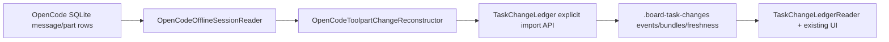

# OpenCode Ledger Bridge Plan

Date: 2026-04-26

## Summary

Chosen direction: **keep OpenCode `snapshot: false`, build our own OpenCode Ledger Bridge from completed `write` / `edit` toolparts**.

Rating after this hardening pass: 🎯 9.5   🛡️ 9.6   🧠 9.0

Expected scope: roughly **2800-5400 LOC** including tests and fixtures. The increase is mostly from the platform path adapter, SQLite snapshot-read discipline, bounded JSON row handling, trigger state machine tests, text availability matrix, immutable import policy, source fingerprint invalidation, workspace identity gates, explicit project-dir tests, desktop bridge-contract tests, OpenCode delivery-context tests, and fixture coverage for stale OpenCode sessions.

The goal is to make OpenCode teammate file changes visible through the same Task Change Ledger path used by the rest of the app. OpenCode SQLite is only an input/recovery source. The UI should continue reading `.board-task-changes/**` through `TaskChangeLedgerReader`, and review/apply/reject should continue using strict ledger-native semantics.

This plan intentionally does **not** enable OpenCode snapshots globally. Snapshots may be useful later as opt-in enrichment, but they do not solve task attribution by themselves and may add runtime/disk cost on large repositories.

## Current Problem

OpenCode teammates can write files, but those tool calls do not currently reach `TaskChangeLedgerService`.

Observed in local teams:

- `signal-ops-10`
  - OpenCode `bob` wrote `478/index.html`, `478/style.css`, `478/calculator.js`.
  - OpenCode `tom` later wrote/edited the same `478/*` files.
  - Current disk reflects Tom's final state, so Bob's historical changes are real but no longer equal current disk.
- `vector-room-10000`
  - OpenCode `tom` wrote `227/index.html` and `227/styles.css`.
  - OpenCode `jack` wrote/rewrote `227/operations.js` and `227/state.js`.
  - `.opencode-runtime/lanes.json` is empty now, but `session-store.json` and OpenCode SQLite still contain the sessions and toolparts.

Project ledger artifacts are absent:

```text
/Users/belief/dev/projects/test_project/sol_team_proj/.board-task-changes
/Users/belief/dev/projects/test_project/sol_team_proj/.board-task-change-freshness
/Users/belief/dev/projects/test_project/sol_team_proj/.board-task-log-freshness
```

That means UI has no primary source for Changes, so it either shows nothing or falls back to legacy heuristics.

## Deepest Uncertainties Rechecked

The weakest parts of the initial plan were checked against the current code. These corrections matter most:

- CLI registration is in `src/main.tsx`, not only in `src/cli/handlers/runtime.ts`. Any new runtime command must be wired in both places.
- Desktop reads ledger artifacts from the Claude project dir returned by `TeamMemberLogsFinder.getLogSourceWatchContext()`. Backfill must write to that same `projectDir` using an explicit parameter or `CLAUDE_CODE_TASK_LEDGER_PROJECT_DIR`, not blindly into the target git repo root.
- `TaskChangeLedgerReader` in the desktop repo has a strict local `LedgerEvent.source` union. It must accept OpenCode source values, otherwise imported events may be ignored or fail validation.
- `ReviewApplierService` already has strict `manual-review-required` behavior for unavailable ledger state. The bridge should lean on this instead of inventing new review semantics.
- `OpenCodeSessionBridge.projectLogMessages()` already has stale-session log projection, but the stale path still requires a host/client. Offline SQLite should be a fallback under that path, not a replacement.
- OpenCode local data includes errored `edit` toolparts with `oldString/newString`. The reconstructor must explicitly ignore `state.status !== 'completed'`.
- Existing ledger writer already supports `CLAUDE_CODE_TASK_LEDGER_PROJECT_DIR`. The bridge should use that contract instead of adding a second artifact-root mechanism.
- The first observed OpenCode `write` against an existing file is **not** a create. It is `operation: 'modify'` with unavailable before-content. This is important because reject must be manual-only, not "delete created file".
- Desktop OpenCode bridge commands are contract-gated in `src/main/services/team/opencode/bridge/OpenCodeBridgeCommandContract.ts`. If desktop uses the bridge envelope path, the new command must be added there, to handshake `supportedCommands`, and to orchestrator `SUPPORTED_COMMANDS`.
- `ChangeExtractorService` is currently constructed without an OpenCode backfill dependency. The desktop change should use an injected `OpenCodeLedgerBackfillPort`, not import a singleton or shell out from deep inside change extraction.
- The existing OpenCode prompt-delivery ledger already contains `taskRefs`, `deliveredUserMessageId`, `observedAssistantMessageId`, `prePromptCursor`, and `postPromptCursor`. The plan should reuse that ledger as delivery context instead of inventing a parallel desktop attribution store.
- Runtime task attribution already exists in `opencode-task-log-attribution.json`, but its `member_session_window` scope is broad. It is useful as a weak task/member/session hint, not as enough proof to attribute file changes without parent prompt or delivery evidence.
- OpenCode `edit` metadata includes a unified diff and additions/deletions, but not full before-content. The bridge may use `metadata.filediff` for display stats only; strict reject still requires reconstructed full before text.
- In the current OpenCode runtime adapter, desktop sends `teamId: input.teamName` and `teamName: input.teamName`. The orchestrator session store key is therefore effectively `teamName + laneId + memberName`, despite the field name `teamId`.
- OpenCode side lanes use ids like `secondary:opencode:<member>`. A team can have multiple records for a member across lanes/runs, so backfill must not assume member name alone uniquely identifies a session.

Local SQLite check against the observed profile found the exact shape that drives the first implementation:

```json
[
  { "tool": "edit", "status": "completed", "c": 6 },
  { "tool": "edit", "status": "error", "c": 8 },
  { "tool": "write", "status": "completed", "c": 17 }
]
```

So the bridge should start with completed `write` and completed `edit`. It should not import errored edits even if they contain plausible `oldString/newString`.

Real toolpart payload check:

```text
write.completed:
  state.input.filePath: absolute path
  state.input.content: full text when metadata.truncated=false
  state.metadata.exists: boolean
  state.metadata.truncated: boolean

edit.completed:
  state.input.filePath: absolute path
  state.input.oldString/newString: present
  state.metadata.filediff.additions/deletions: present
  state.metadata.truncated: boolean
  no full original/updated file content

edit.error:
  oldString/newString may still be present
  must be ignored as a file change
```

## Prototype Findings Before Implementation

A read-only prototype was run against the real local OpenCode `session-store.json` and SQLite DB for `signal-ops-10` and `vector-room-10000`. It did not write ledger files.

What worked:

- Real completed OpenCode `write` toolparts recover actual files and contents.
- Real completed OpenCode `edit` toolparts are present, but only safe when a previous known text baseline exists.
- Errored `edit` toolparts are present and must be ignored.
- `message.parentID` links assistant toolpart messages back to the user prompt that caused them.
- The task delivery text is stored in `part` rows for the user message, not only in `message.data`.

Recovered dry-run examples:

```text
vector-room-10000/tom
  131aea9a -> 227/index.html create exact
  07be4b17 -> 227/styles.css create exact

vector-room-10000/jack
  c4627f03 -> 227/operations.js create exact
  c4f5f2e4 -> 227/state.js create/modify exact
  72a11528 -> 227/state.js modify exact
  errored edit attempts skipped

signal-ops-10/bob
  02cf0ecf -> 478/index.html create exact
  02cf0ecf -> 478/style.css create exact
  02cf0ecf -> 478/calculator.js create exact

signal-ops-10/tom
  6e1f9e13 -> 478/index.html modify, before unavailable
  6e1f9e13 -> 478/style.css modify, before unavailable
  calculator.js edits skipped because baseline was not proven
```

Parent-graph attribution probe:

```text
vector-room-10000/tom
  parent prompt exact taskRefs: 2/2 completed file tools

vector-room-10000/jack
  parent prompt exact taskRefs: initial operations/state writes
  follow-up state.js writes: parent prompt had #72a11528 but no exact taskRefs JSON

signal-ops-10/tom
  parent prompt exact taskRefs: write/edit tools for 6e1f9e13

signal-ops-10/bob
  parent prompt exact taskRefs: 3/3 completed file tools
```

This is the key confidence result: parent message attribution is real and works for most recovered tools, but a narrow `#displayId` fallback is needed for real follow-up prompts. The same probe also found non-task 8-hex-looking tokens such as `00000000`, so marker fallback must never match arbitrary bare hex substrings.

Important correction from the prototype: a naive "last task context in the session" strategy can recover more events, but it is too broad. The production bridge must use the OpenCode message parent graph and only use broader fallbacks under strict conditions.

## Why Not `snapshot: true` Now

OpenCode has its own snapshot/diff mechanism. The managed config currently sets:

```ts
// src/services/opencode/OpenCodeProfileManager.ts
snapshot: false,
```

Changing this globally is not the preferred first move.

Reasons:

- It changes runtime behavior for every OpenCode teammate.
- It may add disk/runtime cost on large repositories.
- It still does not answer "which board task owns this diff".
- It does not replace our strict apply/reject contract.
- It does not help old sessions that already ran with `snapshot: false`.

Better approach:

- Keep `snapshot: false`.
- Use completed `write` and `edit` toolparts as exact file-change inputs.
- Write normalized events into our Task Change Ledger.
- Add snapshots later only as opt-in enrichment for `bash`, deletes, and unknown baselines.

## Design Principle

**The Task Change Ledger remains the source of truth.**

OpenCode SQLite is an adapter input. It must never become a second UI path with different review semantics.

Flow:



## Top Options Considered

1. **Strict OpenCode write/edit bridge, no snapshots** - 🎯 9.4   🛡️ 9.3   🧠 8.0 - roughly 1800-3300 LOC.
   Best immediate option. Low blast radius, fixes real observed cases, keeps OpenCode runtime behavior unchanged.

2. **Strict bridge + optional future snapshot enrichment** - 🎯 9.0   🛡️ 9.5   🧠 8.5 - roughly 2200-3800 LOC.
   Best long-term design. Add bridge first, then opt-in snapshots for shell/delete/unknown-baseline cases.

3. **Enable snapshots and read OpenCode diffs** - 🎯 6.8   🛡️ 7.0   🧠 5.5 - roughly 500-1200 LOC.
   Not recommended as the primary solution. It may help with session diffs, but attribution and review safety still belong to our ledger.

## Backfill Invocation Options

1. **Non-state-changing bridge command + manual CLI wrapper** - 🎯 9.2   🛡️ 9.3   🧠 6.8 - roughly 260-520 LOC.
   Recommended. Desktop already has OpenCode bridge handshake, diagnostics, temp-envelope plumbing, and capability negotiation. Add `opencode.backfillTaskLedger` to the bridge contract and expose `runtime opencode-ledger-backfill` as a manual/debug wrapper around the same service. The command writes ledger artifacts, but it should own idempotency internally instead of using OpenCode launch/run preconditions.

2. **State-changing bridge command through existing command ledger/preconditions** - 🎯 7.7   🛡️ 9.0   🧠 8.6 - roughly 420-750 LOC.
   Strong auditing, but too coupled to active OpenCode run preconditions. Backfill must work for stale historical sessions, where active run/capability preconditions may no longer be valid.

3. **Direct CLI command only from desktop** - 🎯 8.0   🛡️ 8.3   🧠 5.0 - roughly 140-280 LOC.
   Faster, but it bypasses OpenCode bridge capability negotiation and duplicates some command/diagnostic behavior that the runtime adapter already solved.

4. **Desktop reads SQLite directly** - 🎯 5.2   🛡️ 5.5   🧠 6.0 - roughly 400-800 LOC.
   Not recommended. It creates a second data path in the UI app, pulls OpenCode local-storage assumptions into desktop, and makes review semantics easier to drift from the orchestrator ledger.

## Non-Goals

- Do not enable OpenCode `snapshot: true` globally.
- Do not support `bash` mutations as exact changes without a future snapshot mechanism.
- Do not treat OpenCode `session_diff` as primary source.
- Do not change Claude Code / tmux / in-process ledger capture behavior.
- Do not make UI read OpenCode SQLite directly.
- Do not auto-apply/reject recovered changes when baseline/current hashes are not proven.
- Do not auto-merge worktree or OpenCode changes into main.

## Reliability Contract

The bridge must fail closed.

Allowed behavior:

- Exact change if we have exact before and after text.
- Metadata/manual-only if after is known but before is unknown.
- Notice/diagnostic if task attribution is ambiguous.
- Conflict when current disk does not match expected ledger after hash.
- No event if the input is malformed or unsafe.

Forbidden behavior:

- Do not attribute changes to a task based only on assistant comments.
- Do not import errored `edit` attempts as file changes.
- Do not infer deletes from missing files unless a reliable future source exists.
- Do not overwrite existing ledger events with reconstructed events.
- Do not create duplicate events on repeated backfill.
- Do not let OpenCode recovery change non-OpenCode agent behavior.

## Weakest Areas and Hardening Decisions

These are the parts with the lowest certainty. The implementation should treat them as explicit acceptance gates, not nice-to-have checks.

1. **Task attribution for follow-up prompts** - 🎯 8.6   🛡️ 9.3   🧠 8.0 - roughly 250-500 LOC.
   Weakness: some real follow-up prompts include only `#displayId`, not full `taskRefs` JSON. Fix: parent graph exact refs win, delivery ledger refs are second, `#displayId` fallback is allowed only for a single explicit requested task and only with a `#` marker. Broad team backfill must skip marker-only prompts unless desktop supplies trusted delivery context.

2. **First known write to an existing file** - 🎯 9.0   🛡️ 9.6   🧠 6.6 - roughly 180-360 LOC.
   Weakness: OpenCode gives full after content but no before content. Fix: import as visible `modify` with `beforeState.unavailableReason`, not as create. Full reject and partial reject are manual-only. The UI should still show the changed file row, after-content metadata, and warning, but must not synthesize a fake before side.

3. **Concurrent SQLite writes while backfill reads** - 🎯 8.7   🛡️ 9.2   🧠 6.2 - roughly 120-260 LOC.
   Weakness: message rows and part rows can be read from slightly different moments if not transaction-bound. Fix: open read-only, set `query_only`, set `busy_timeout`, start a read transaction, read messages and parts, then close in `finally`. If transaction setup fails, return diagnostics and skip import rather than reading a torn view.

4. **Windows path correctness on non-Windows CI** - 🎯 9.1   🛡️ 9.5   🧠 7.2 - roughly 250-500 LOC.
   Weakness: host `path` cannot validate foreign Windows-style fixture paths on macOS/Linux. Fix: dedicated platform path adapter using `path.win32` or `path.posix` based on the record root, plus native `windows-latest` smoke.

5. **`edit` reconstruction when `oldString` is ambiguous** - 🎯 9.2   🛡️ 9.6   🧠 5.8 - roughly 80-180 LOC.
   Weakness: applying one replacement when `oldString` occurs multiple times can reconstruct the wrong file. Fix: exact edit import requires exactly one match unless OpenCode later exposes explicit replace-all/range metadata. Multiple matches become diagnostic/manual-only or skip.

6. **Lazy backfill trigger loops and UI latency** - 🎯 8.8   🛡️ 9.1   🧠 7.0 - roughly 220-450 LOC.
   Weakness: a missing ledger can cause repeated SQLite scans during board rendering. Fix: summary calls enqueue once and return immediately, detail calls wait once with bounded timeout, in-flight and negative-result caches are keyed by task/project/log generation, and successful imports invalidate ledger caches exactly once.

7. **Privacy leaks from diagnostics and fixtures** - 🎯 9.0   🛡️ 9.4   🧠 5.5 - roughly 80-160 LOC.
   Weakness: OpenCode rows can contain full prompts and full file contents. Fix: diagnostics are count/id/relative-path only, delivery context excludes prompt/file content, fixtures are minimized and scrubbed, and no raw SQLite DB is committed.

8. **Multi-task prompts** - 🎯 8.4   🛡️ 9.6   🧠 6.8 - roughly 120-260 LOC.
   Weakness: a single OpenCode user prompt can contain more than one task ref. Without per-tool task proof, file-path guesses would be unsafe. Fix: if parent exact refs or delivery refs resolve to multiple tasks, skip attribution unless there is a stronger single-task signal for that exact tool turn. Do not split by folder names, comments, or assistant prose.

9. **Future import upgrades** - 🎯 8.8   🛡️ 9.4   🧠 7.4 - roughly 140-300 LOC.
   Weakness: duplicate skipping by `sourceImportKey` prevents a future richer reconstruction from silently replacing a previous manual-only event. Fix: v1 imports are immutable. A future upgrade must use an explicit import revision/supersede policy, not mutate old journal lines in place.

10. **Negative cache stale after OpenCode DB changes** - 🎯 8.8   🛡️ 9.2   🧠 6.8 - roughly 140-280 LOC.
    Weakness: a deterministic no-history result can become false if OpenCode writes more rows later. Fix: negative cache keys include source fingerprints from session-store, SQLite DB stat, delivery-context generation, task id, projectDir, and bridge adapter version.

11. **Historical changes overwritten on disk** - 🎯 9.2   🛡️ 9.6   🧠 5.6 - roughly 80-180 LOC.
    Weakness: current disk may no longer equal a historical OpenCode event's after-state, especially when another teammate edited the same files later. Fix: import historical events without requiring current disk to match. Strict review apply/reject handles current hash mismatch as conflict later.

12. **Partial multi-task import failure** - 🎯 8.7   🛡️ 9.2   🧠 7.0 - roughly 120-260 LOC.
    Weakness: one task's import can fail after another task from the same backfill command succeeded. Fix: import atomically per task under the task ledger lock, return partial outcome with per-task counts, and rely on source-key idempotency for retry.

13. **Workspace identity mismatch** - 🎯 8.8   🛡️ 9.7   🧠 7.2 - roughly 180-380 LOC.
    Weakness: the same team name can theoretically point at a different project later, while old OpenCode session records still exist. Fix: automatic UI backfill requires the OpenCode record `projectPath` to match the current log-source workspace identity, after platform-aware normalization and optional Git/head metadata checks. Mismatches become diagnostics or manual dry-run only.

14. **Oversized SQLite JSON before parsing** - 🎯 8.6   🛡️ 9.3   🧠 7.0 - roughly 160-340 LOC.
    Weakness: the `part.data` JSON can contain full file contents, so blindly parsing every row can create CPU/memory spikes. Fix: query `length(data)` first, cap row size and total bytes, parse only candidate rows when possible, and degrade oversized write rows to metadata-only only when file path/content status can still be safely extracted.

15. **Cross-session ordering** - 🎯 8.3   🛡️ 9.1   🧠 8.0 - roughly 180-420 LOC.
    Weakness: multiple OpenCode sessions for the same member/lane can contain writes to the same file. Fix: reconstruct state per session by default. Do not carry file state across sessions unless a future source proves continuity. Historical ordering across sessions is for display only, not for reconstructing before-content.

16. **Read-trigger side effects** - 🎯 8.7   🛡️ 9.2   🧠 6.8 - roughly 140-300 LOC.
    Weakness: opening Changes normally feels read-only, but backfill writes ledger artifacts. Fix: feature flag, capability gate, bounded timeout, count-only diagnostics, and a manual retry/debug path. Failed recovery must fall back to the old read path without changing non-OpenCode tasks.

17. **Stale absolute paths in ledger** - 🎯 8.5   🛡️ 9.3   🧠 6.2 - roughly 120-260 LOC.
    Weakness: imported historical file paths can point to a workspace that was moved or deleted. Fix: automatic import requires the workspace root to exist and match current team context. Manual dry-run can report stale paths, but v1 should not write reviewable file events to dead roots.

## Privacy and Diagnostics Contract

The bridge reads local OpenCode storage and task delivery metadata, so diagnostics must stay conservative.

Rules:

- Do not log full OpenCode prompts, tool input content, or file contents.
- Diagnostics may include counts, ids, member names, task ids, source part ids, and relative paths.
- Delivery-context temp files must contain only task/session/message ids and taskRefs, never file contents or prompt text.
- Create delivery-context temp files with owner-only permissions where the platform supports it.
- Delete temp delivery-context files in `finally`.
- Fixture files must be minimized and scrubbed. Do not commit real SQLite DBs, auth paths, or raw full prompts from user projects.

## Rollout and Feature Flag

This feature touches both repos and a best-effort external data shape, so rollout should be explicit.

Options:

1. **Enabled behind desktop + orchestrator capability gate** - 🎯 9.2   🛡️ 9.4   🧠 5.8 - roughly 120-240 LOC.
   Recommended. Desktop only attempts recovery when the bridge handshake advertises `opencode.backfillTaskLedger`, and a local feature flag is not disabled.

2. **Always enabled after merge** - 🎯 7.2   🛡️ 7.6   🧠 3.0 - roughly 40-80 LOC.
   Faster, but harder to disable if OpenCode changes SQLite shape in the wild.

3. **Manual CLI only at first** - 🎯 7.9   🛡️ 8.8   🧠 3.5 - roughly 80-160 LOC.
   Safest operationally, but it does not solve the UI problem for users until a second rollout.

Recommended gates:

- Orchestrator advertises `opencode.backfillTaskLedger`.
- Desktop environment/config flag does not disable it, for example `CLAUDE_TEAM_OPENCODE_LEDGER_BACKFILL !== '0'`.
- Backfill only runs for teams with OpenCode runtime metadata/session records.
- Backfill is bounded by timeout, event cap, and negative-result cache.
- Negative-result cache is invalidated when the source fingerprint changes.
- Manual UI retry/debug command can bypass negative cache for the current task.

Telemetry/logging should be count-only:

- attempted/skipped/imported events;
- skip reason;
- duration bucket;
- no prompt text or file content.

Source fingerprint for cache keys:

```ts
type OpenCodeBackfillSourceFingerprint = {
  adapterVersion: 1
  teamName: string
  taskId?: string
  projectDir: string
  workspaceIdentityHash?: string
  sessionStoreMtimeMs?: number
  sessionStoreSizeBytes?: number
  sqliteDbMtimeMs?: number
  sqliteDbSizeBytes?: number
  sqliteWalMtimeMs?: number
  sqliteWalSizeBytes?: number
  deliveryContextGeneration?: string
  logSourceGeneration?: string
}
```

Do not use raw DB path as a cache key exposed to renderer state. Keep path-sensitive data main-process only.

## Storage Root Contract

This is the highest-risk integration detail.

There are two different roots and they must not be mixed:

- `workspaceRoot` - the real repository/worktree where the file path points and where review apply/reject will later read or write the file.
- `projectDir` - the Claude project transcript directory where `.board-task-changes/**`, `.board-task-change-freshness/**`, and `.board-task-log-freshness/**` are stored.

Desktop already reads ledger artifacts through `TaskChangeLedgerReader.readTaskChanges({ projectDir, taskId })`, where `projectDir` comes from `TeamMemberLogsFinder.getLogSourceWatchContext()`. Therefore the OpenCode backfill command must receive this `projectDir` explicitly from desktop, or run with `CLAUDE_CODE_TASK_LEDGER_PROJECT_DIR=<projectDir>`.

Correct write target:

```ts
await importTaskChangeLedgerEvents({
  projectDir: context.projectDir,
  workspaceRoot: record.projectPath,
  // ...
})
```

Incorrect write target:

```ts
await importTaskChangeLedgerEvents({
  projectDir: record.projectPath, // wrong for desktop-managed teams
  workspaceRoot: record.projectPath,
  // ...
})
```

If this contract is wrong, the CLI may successfully create ledger artifacts that the desktop UI never sees. Tests must assert this directly by writing into a temp `projectDir` that differs from `workspaceRoot`.

### Workspace Identity Contract

This is separate from the storage root contract. `projectDir` decides where ledger artifacts live. `workspaceRoot` decides which real files review actions will mutate. OpenCode session records also contain `record.projectPath`. Automatic UI backfill must prove these point at the same current workspace.

Required automatic-backfill checks:

- `record.projectPath` is absolute.
- `record.projectPath` exists on disk.
- `record.projectPath` matches the current team/log-source workspace root after platform-aware normalization.
- If both paths exist, compare `realpath` results as an additional guard.
- If the directory is a Git repo, include `git rev-parse --show-toplevel` and `HEAD` in debug-only diagnostics/fingerprint when cheap. Do not require Git for non-Git projects.
- If the workspace is a teammate worktree, use the worktree root as `workspaceRoot`, not the leader repo root.
- If the team context has no trustworthy workspace root, automatic backfill must skip and return `unsafe-input` or `no-workspace-identity`.

Manual CLI behavior:

- `--dry-run` may inspect stale records and report what would be imported.
- Non-dry-run manual import should require explicit `--project-dir` and either `--workspace-root` or a validated session record project path.
- If the path no longer exists, manual non-dry-run should refuse by default. A future explicit `--allow-stale-paths` could import metadata-only diagnostics, but v1 should not add it.

Why this is strict: a stale OpenCode session-store entry from another project with the same team/member names must never create Changes rows that apply/reject against the wrong workspace.

## Identity and Lane Contract

This is the second highest-risk integration detail.

Names in the existing code:

- Desktop team name: `teamName`.
- Orchestrator OpenCode session record field: `teamId`.
- Current adapter value: `teamId === teamName`.
- OpenCode member lane: `laneId`, often `secondary:opencode:<member>` for mixed teams.
- Canonical board task id: UUID-like `taskId`.
- Display task id: short `displayId`, used as visible `#<displayId>`.

Rules:

- Treat orchestrator `OpenCodeSessionRecord.teamId` as the desktop `teamName` for this feature.
- Always pass both `teamName` and `teamId` through bridge bodies for compatibility, but validate that if both exist they are equal.
- Do not derive `teamName` from task id, project path, or lane id.
- Do not use display id as ledger `taskId`; it is only a matching/display hint.
- When `laneId` is present from desktop runtime metadata, use it to select the session record.
- When `laneId` is absent:
  - if exactly one record matches `teamName/memberName`, use it;
  - if multiple records match, scan all matching records but keep session-specific diagnostics;
  - never collapse multiple lanes into one source identity.

Backfill eligibility:

- If task owner is an OpenCode teammate and lane metadata is available, prefer that member/lane first.
- If task owner is unknown, scan OpenCode records for the team, but keep attribution strict.
- If no OpenCode session records exist for the team, skip backfill without warning in normal UI flow.
- Single-task UI backfill may use `#displayId` fallback; broad manual `--team` backfill may not.
- OpenCode-led teams and mixed side-lane teams should use the same session-store path; do not special-case by lead provider.

## Compatibility Gate

OpenCode SQLite is not a public UI contract for our app. Treat it as a best-effort recovery source with explicit compatibility checks.

Gate conditions:

- `session-store.json` record exists for the team/session.
- SQLite DB exists for `profileRootKey`.
- `message` and `part` tables have the required columns.
- At least one toolpart row has a recognized `type/tool/state` shape.
- The reader can resolve message parent links for toolparts that need attribution.

If any gate fails, return diagnostics and skip ledger import. Do not fall back to assistant comments or broad file-system diffs.

Versioning:

- Add `opencodeSqliteAdapterVersion: 1` to backfill diagnostics/results.
- Add fixture tests for unknown extra columns and missing required columns.
- Keep the bridge feature behind accepted command support. Older orchestrator binaries simply do not advertise `opencode.backfillTaskLedger`.

## Data Sources

### OpenCode Session Store

Existing file:

```text
<envPaths('claude-multimodel').data>/opencode/session-store.json
```

Do not hardcode the observed macOS suffix `claude-multimodel-nodejs`. It is produced by `env-paths` for this app name/runtime. Always resolve through `envPaths('claude-multimodel')` inside orchestrator.

This maps:

```ts
type OpenCodeSessionRecord = {
  teamId: string
  laneId?: string
  memberName: string
  providerId: 'opencode'
  opencodeSessionId: string
  profileRootKey: string
  projectPath: string
  staleReason?: string | null
}
```

### OpenCode SQLite DB

Observed location:

```text
<envPaths('claude-multimodel').data>/opencode/profiles/<profileRootKey>/data/opencode/opencode.db
```

Use `bun:sqlite`, not external `sqlite3`.

Why:

- It is available in the current Bun runtime.
- It avoids shell quoting issues.
- It is cross-platform enough for our build target.
- It does not add a native dependency to the desktop app.

Open SQLite in read-only mode and handle missing/corrupt DB as diagnostics, not fatal app errors. Do not copy or commit the live `.db` file as a fixture, because SQLite may rely on adjacent `-wal`/`-shm` files. Tests should use minimized JSON row fixtures or create a temp SQLite DB inside the test.

Only orchestrator code should read SQLite. Desktop/UI should continue calling orchestrator commands.

SQLite safety defaults:

- Open the database with `{ readonly: true }`.
- Execute `PRAGMA query_only = ON` after opening when supported.
- Execute a short `PRAGMA busy_timeout = 1000` to avoid failing during a concurrent OpenCode write.
- Start a read transaction before reading `message` and `part`, then commit/rollback in `finally`. This keeps the parent graph and toolpart rows from being read across different SQLite snapshots.
- Never run `VACUUM`, checkpoint, migration, or write pragmas.
- Treat `SQLITE_BUSY`, missing DB, missing WAL, corrupt DB, and schema drift as diagnostics.
- Cap read volume: for example max 20,000 messages, 80,000 parts, 256 KiB prompt text scanned per parent message, 4 MiB total tool input content per import batch before degrading to metadata-only.
- Cap raw row `data` length before JSON parse. Query `length(data)` with each row and skip or degrade rows above the per-row limit.
- Prefer two-stage reads for change backfill: first fetch lightweight ids/timestamps/tool names when possible, then fetch full `data` only for candidate messages/parts needed for attribution and write/edit reconstruction.
- Sort by `time_created asc, id asc`; observed `time_created`/`time_updated` are Unix milliseconds.
- Do not rely on SQLite rowid, because it is not part of the contract.
- Close the DB handle before deleting any temp fixture directory, especially on Windows.

Profile path safety:

- Treat `profileRootKey` from `session-store.json` as untrusted input even though it is locally generated.
- Resolve DB path under `<envPaths('claude-multimodel').data>/opencode/profiles`.
- Reject profile keys that resolve outside that profiles root.
- Reject empty, absolute, or traversal-like profile keys before opening SQLite.
- Do not include resolved DB path in normal UI diagnostics. Debug logs may include a redacted path.

### Relevant Tables

Observed schema:

```sql
message(id TEXT primary key, session_id TEXT, time_created INTEGER, time_updated INTEGER, data TEXT)
part(id TEXT primary key, message_id TEXT, session_id TEXT, time_created INTEGER, time_updated INTEGER, data TEXT)
```

`message.data` is JSON but does not necessarily include `id`, so the reader must inject it into `info.id` for projector compatibility.

`part.data` is JSON and should be normalized with `id` from the row.

Schema drift handling:

- If `message` or `part` table is absent, return diagnostics and no changes.
- If required columns are absent, return diagnostics and no changes.
- If extra columns exist, ignore them.
- If individual `data` JSON parse fails, skip that row and record a diagnostic count, not the raw content.
- If a `part` row references a missing `message_id`, skip attribution for that toolpart and record a diagnostic.
- Query by `session_id` whenever possible instead of loading all rows for the profile.
- If `session_id` is absent or null in rows, allow a bounded compatibility path only when the record has exactly one session candidate in the fixture/profile.
- If multiple sessions share a profile and rows cannot be scoped to the requested session, return diagnostics and skip import.
- Capture a DB stat fingerprint before and after the read transaction. If size/mtime changes during the read but the transaction succeeds, keep the snapshot result and include a warning count. If the transaction cannot start, skip import.

Bounded JSON strategy:

1. Read candidate row ids using `session_id`, `time_created`, `id`, `message_id`, and `length(data)`.
2. Reject rows above the absolute raw JSON limit before `JSON.parse`.
3. Parse parent user messages only up to the prompt scan cap.
4. Parse assistant/tool parts only if they are candidate tool rows for `write` or `edit`.
5. For oversized `write` rows, do not parse the huge content just to extract a diff. If the row cannot be parsed within limits, emit diagnostic and skip rather than risking a memory spike.

This means some enormous OpenCode writes may not appear in v1. That is better than making task rendering block or crash.

## New Components

### 1. OpenCodeOfflineSessionReader

File:

```text
src/services/opencode/OpenCodeOfflineSessionReader.ts
```

Responsibility:

- Resolve OpenCode DB path from `profileRootKey`.
- Validate that expected tables/columns exist.
- Read `message` and `part` rows by `session_id`.
- Enforce row-count and prompt-scan caps.
- Parse JSON defensively.
- Return `OpenCodeMessage[]` compatible with `OpenCodeTranscriptProjector`.
- Provide lower-level raw rows for change reconstruction.

Sketch:

```ts
import { Database } from 'bun:sqlite'
import envPaths from 'env-paths'
import path from 'node:path'
import { stat } from 'node:fs/promises'

import type { OpenCodeMessage, OpenCodeSessionRecord } from './types.js'

const MAX_OPENCODE_MESSAGES_PER_SESSION = 20_000
const MAX_OPENCODE_PARTS_PER_SESSION = 80_000
const MAX_OPENCODE_MESSAGE_JSON_BYTES = 256 * 1024
const MAX_OPENCODE_PART_JSON_BYTES = 2 * 1024 * 1024

type OpenCodeSqliteMessageRow = {
  id: string
  session_id: string
  time_created: number
  time_updated: number
  dataLengthBytes: number
  data: string
}

type OpenCodeSqlitePartRow = {
  id: string
  message_id: string
  session_id: string
  time_created: number
  time_updated: number
  dataLengthBytes: number
  data: string
}

export type OpenCodeOfflineSessionReadResult = {
  source: 'opencode-sqlite'
  dbPath: string
  messages: OpenCodeMessage[]
  rawMessages: OpenCodeSqliteMessageRow[]
  rawParts: OpenCodeSqlitePartRow[]
  diagnostics: string[]
}

export class OpenCodeOfflineSessionReader {
  resolveDbPath(profileRootKey: string): string {
    const paths = envPaths('claude-multimodel')
    return path.join(
      paths.data,
      'opencode',
      'profiles',
      profileRootKey,
      'data',
      'opencode',
      'opencode.db',
    )
  }

  async readSession(record: OpenCodeSessionRecord): Promise<OpenCodeOfflineSessionReadResult | null> {
    const dbPath = this.resolveDbPath(record.profileRootKey)
    try {
      const fileStat = await stat(dbPath)
      if (!fileStat.isFile()) return null
    } catch {
      return null
    }

    const db = new Database(dbPath, { readonly: true })
    let transactionOpen = false
    try {
      db.exec('PRAGMA query_only = ON')
      db.exec('PRAGMA busy_timeout = 1000')
      this.assertSchema(db)
      db.exec('BEGIN')
      transactionOpen = true
      const rawMessages = db.query(
        'select id, session_id, time_created, time_updated, length(data) as dataLengthBytes, data from message where session_id = ? order by time_created asc, id asc',
      ).all(record.opencodeSessionId) as OpenCodeSqliteMessageRow[]
      const rawParts = db.query(
        'select id, message_id, session_id, time_created, time_updated, length(data) as dataLengthBytes, data from part where session_id = ? order by time_created asc, id asc',
      ).all(record.opencodeSessionId) as OpenCodeSqlitePartRow[]
      db.exec('COMMIT')
      transactionOpen = false
      if (rawMessages.length > MAX_OPENCODE_MESSAGES_PER_SESSION) {
        throw new Error(`OpenCode SQLite message cap exceeded for ${record.opencodeSessionId}`)
      }
      if (rawParts.length > MAX_OPENCODE_PARTS_PER_SESSION) {
        throw new Error(`OpenCode SQLite part cap exceeded for ${record.opencodeSessionId}`)
      }
      if (rawMessages.some(row => row.dataLengthBytes > MAX_OPENCODE_MESSAGE_JSON_BYTES)) {
        throw new Error(`OpenCode SQLite message row cap exceeded for ${record.opencodeSessionId}`)
      }
      if (rawParts.some(row => row.dataLengthBytes > MAX_OPENCODE_PART_JSON_BYTES)) {
        throw new Error(`OpenCode SQLite part row cap exceeded for ${record.opencodeSessionId}`)
      }

      return {
        source: 'opencode-sqlite',
        dbPath,
        rawMessages,
        rawParts,
        messages: this.normalizeMessages(rawMessages, rawParts),
        diagnostics: [],
      }
    } finally {
      if (transactionOpen) {
        try {
          db.exec('ROLLBACK')
        } catch {
          // Best-effort cleanup before closing the read-only handle.
        }
      }
      db.close()
    }
  }

  private assertSchema(db: Database): void {
    const messageColumns = new Set(
      (db.query('pragma table_info(message)').all() as Array<{ name: string }>).map(row => row.name),
    )
    const partColumns = new Set(
      (db.query('pragma table_info(part)').all() as Array<{ name: string }>).map(row => row.name),
    )
    for (const column of ['id', 'session_id', 'time_created', 'data']) {
      if (!messageColumns.has(column)) throw new Error(`OpenCode SQLite message.${column} missing`)
    }
    for (const column of ['id', 'message_id', 'session_id', 'time_created', 'data']) {
      if (!partColumns.has(column)) throw new Error(`OpenCode SQLite part.${column} missing`)
    }
  }

  private normalizeMessages(
    rows: OpenCodeSqliteMessageRow[],
    parts: OpenCodeSqlitePartRow[],
  ): OpenCodeMessage[] {
    const partsByMessage = new Map<string, unknown[]>()
    for (const part of parts) {
      const parsed = safeParseJsonRecord(part.data)
      if (!parsed) continue
      parsed.id = part.id
      const bucket = partsByMessage.get(part.message_id) ?? []
      bucket.push(parsed)
      partsByMessage.set(part.message_id, bucket)
    }

    return rows.flatMap(row => {
      const info = safeParseJsonRecord(row.data)
      if (!info) return []
      info.id = row.id
      return [{ info, parts: partsByMessage.get(row.id) ?? [] } as OpenCodeMessage]
    })
  }
}
```

### 2. OpenCodeToolpartChangeReconstructor

File:

```text
src/services/opencode/OpenCodeToolpartChangeReconstructor.ts
```

Responsibility:

- Read normalized SQLite rows.
- Extract delivered app prompt `taskRefs exactly`.
- Extract completed `write` and `edit` toolparts.
- Ignore errored toolparts.
- Sort by tool execution time.
- Reconstruct per-file before/after state.
- Produce explicit import events for `TaskChangeLedgerService`.

Important: It must produce **candidate ledger changes**, not write files directly.

#### Toolpart Rules

`write`:

- Require `state.status === 'completed'`.
- Require `state.input.filePath` string.
- If previous reconstructed file state exists, before is that state.
- If no previous reconstructed state exists and `metadata.exists === false`, before is absent.
- If `metadata.exists === true` and no previous reconstructed state exists, before is unavailable and operation is `modify`, not `create`.
- If `metadata.exists` is missing, treat before as unavailable and operation as `modify` unless a previous reconstructed state exists.
- Require `state.input.content` string for exact text import.
- If `state.metadata.truncated === true`, do not treat `state.input.content` as full text and do not compute an after hash from it.
- If `state.input.content` is larger than ledger text-blob limits but is not marked truncated, compute metadata/hash from the full string if available, but do not store the text blob. Review remains manual-only because full text is unavailable to the UI.
- If content contains NUL bytes or fails the ledger text classifier, treat it as binary/metadata-only even if OpenCode serialized it as a string.

`edit`:

- Require `state.status === 'completed'`.
- Require `state.input.filePath`, `oldString`, `newString`.
- Require previous reconstructed state for exact reconstruction.
- Require previous content contains `oldString` exactly once.
- Apply one replacement only when there is exactly one occurrence unless OpenCode exposes explicit replace-all/range metadata in future.
- If `oldString` is empty, skip exact reconstruction and record diagnostic.
- If `state.metadata.truncated === true`, skip exact reconstruction unless future OpenCode metadata proves the full edit intent.
- If exact replacement cannot be proven, produce diagnostic/manual-only or skip.
- Use `state.metadata.filediff.additions/deletions` only as optional diff stats. Do not use the unified diff as a substitute for full before/after content in ledger-native reject.

Errored `edit`:

- Ignore as a file change.
- Optionally record diagnostic only.

#### Text Availability Matrix

The bridge should decide reviewability from content availability, not from operation name alone.

| Input state | Ledger text blob | Hash | UI/review behavior |
| --- | --- | --- | --- |
| Full text under limit | store before/after text | compute SHA-256 | exact diff, strict apply/reject allowed when current hash matches |
| Full text over blob limit | do not store text | compute SHA-256 if full string available | metadata row, manual-review-required |
| `metadata.truncated === true` | do not store text | do not compute actual-content SHA from truncated string | metadata row, manual-review-required |
| Binary/NUL content | do not store text | compute only if full bytes/string are available and classifier allows stable hashing | metadata row, manual-review-required |
| Unknown before, known after | store after text if safe | compute after hash | visible modify, reject manual-only because before is unavailable |
| Known before, exact edit | store before/after text | compute both hashes | exact diff, strict apply/reject allowed |

Do not create fake empty before-content for an unknown existing file. Synthetic empty sides are only valid for proven create/delete display semantics, not for OpenCode unknown-baseline writes.

Path rules:

- Accept absolute file paths under `record.projectPath`.
- Accept relative paths only by resolving them under `record.projectPath`.
- Reject paths that escape the project root after normalization.
- On Windows, compare descendants case-insensitively but preserve the original absolute path in ledger metadata.
- If the file does not currently exist, do not require `realpath`; use lexical normalized containment so old create/delete history can still be represented.

### Cross-Platform Path Contract

This bridge must be Windows-safe from the first implementation. The OpenCode rows contain filesystem paths from the host that ran OpenCode, and review apply/reject later uses ledger `filePath` as the target path. That means we need two separate concepts:

- **Original path**: the exact absolute path written into ledger metadata and used for later filesystem operations.
- **Comparison key**: normalized only for containment, duplicate detection, sorting, and tests.

Do not replace backslashes with slashes in the persisted `filePath` that review actions use. Normalize only in helper functions.

Implementation options:

1. **Dedicated platform path adapter for bridge import** - 🎯 9.4   🛡️ 9.5   🧠 6.8 - roughly 220-420 LOC.
   Recommended. Add a small orchestrator helper that detects `win32`, `posix`, or `unc` path style from `record.projectPath` and `filePath`, then uses `path.win32` or `path.posix` explicitly for `isAbsolute`, `resolve`, `relative`, basename, and comparison. This makes Windows fixtures testable on macOS/Linux CI and avoids accidentally using host `path` for foreign-style fixture paths.

2. **Use host `node:path` only** - 🎯 7.0   🛡️ 7.2   🧠 3.0 - roughly 60-120 LOC.
   Too weak for this feature. It works on the real Windows host, but Windows-style fixture paths such as `C:\repo\file.ts` are not absolute on macOS, so cross-platform tests can pass/fail for the wrong reason.

3. **Persist all paths as POSIX-style strings** - 🎯 5.0   🛡️ 5.8   🧠 4.0 - roughly 120-220 LOC.
   Not recommended. It makes display and grouping easy, but can break review apply/reject on Windows because `filePath` stops being the exact OS path originally touched by OpenCode.

Required path behavior:

- Determine path style from the project root first. If `record.projectPath` is `C:\repo`, use `path.win32` rules for all descendant checks in that record.
- Accept both `C:\repo\file.ts` and `C:/repo/file.ts` on Windows-style records.
- Compare Windows drive letters case-insensitively: `C:\Repo` and `c:\repo` are the same root for containment.
- Preserve original case and separators in persisted `filePath`.
- Reject mixed-style absolute paths where the project is POSIX but the file is Windows absolute, or the project is Windows but the file is POSIX absolute.
- Handle spaces and parentheses in paths by passing paths through JSON/argv arrays, never through shell-quoted command strings.
- Handle normal UNC roots like `\\server\share\repo` only when both project root and file path are UNC and the file is a descendant after `path.win32.relative`.
- Reject or downgrade Windows device paths such as `\\?\C:\...` and `\\.\...` in v1 unless the path helper explicitly normalizes and tests them. Do not pass device paths through silently.
- For relative paths, resolve under `record.projectPath` using the detected path style.
- Reject `..` escapes after resolving and normalizing.
- If the file exists, optionally use `realpath` for an additional containment check. If `realpath` points outside the project root through a symlink/junction, downgrade to diagnostic/manual-only or skip.
- If the file does not exist, use lexical containment only, because historical create/delete rows may refer to files that no longer exist.
- Hash and duplicate keys should use the comparison key, not the display/original path.
- Review apply/reject must use original absolute `filePath`, and hash guards must decide safety.

Suggested helper shape:

```ts
type BridgePathStyle = 'posix' | 'win32' | 'unc'

type NormalizedBridgePath = {
  originalPath: string
  absolutePath: string
  comparisonKey: string
  relativePath: string
  style: BridgePathStyle
}

function normalizeOpenCodeFilePath(params: {
  projectPath: string
  filePath: string
}): NormalizedBridgePath | { skipped: true; diagnostic: string } {
  // Detect path style from projectPath.
  // Resolve relative filePath under projectPath.
  // Use path.win32/path.posix explicitly, not host path by default.
  // Lowercase comparisonKey only for win32/unc.
  // Preserve absolutePath/originalPath for ledger review operations.
}
```

This should live near the OpenCode bridge/reconstructor, not in renderer code. The desktop renderer already has `src/shared/utils/platformPath.ts`, but that helper is for display/comparison and cannot be used for orchestrator filesystem operations.

#### Reconstructor State Machine

Keep reconstructed file state by normalized comparison key, not raw path string. This matters for Windows drive-case and separator variants.

```ts
type ReconstructedFileState = {
  comparisonKey: string
  lastOriginalPath: string
  text: string | null
  textAvailability: 'full-text' | 'metadata-only' | 'unavailable'
  exists: boolean
  lastSourcePartId: string
}
```

Rules:

- `fileStates` key is `comparisonKey`.
- Each emitted event keeps `filePath` as the original absolute path from that toolpart.
- When the same comparison key appears with a different original path spelling, preserve the newest original path on the emitted event and add a diagnostic count for path spelling drift.
- Previous reconstructed state has higher precedence than `metadata.exists`. If OpenCode first writes a file as create and later writes it again with `metadata.exists === false`, the second write is still a modify because the bridge already knows the previous state.
- A metadata-only state cannot become an exact edit baseline. If the previous state is metadata-only or unavailable, a later `edit` must be skipped or manual-only.
- A full-text `write` after an unavailable baseline can seed future exact edits, but it does not make the earlier unknown before-content recoverable.
- Event timestamps use OpenCode toolpart time. Import time is stored separately as `importedAt`.
- If two toolparts have the same timestamp, preserve deterministic order by session id, message time, message id, part time, and part id. Do not sort by generated ledger event id.
- If ordering is still ambiguous after all stable keys, keep input row order from the read transaction and add a diagnostic. Do not reorder randomly.

#### Task Attribution Rules

Never use a session-global "last task wins" context as the production algorithm. OpenCode sessions can receive follow-up prompts, retries, visible messages, and task handoffs in the same runtime session.

Primary source A - parent prompt exact refs:

- Build `messageById` from `message` rows.
- Build `partsByMessageId` from `part` rows.
- For each `write/edit` toolpart:
  - read its `message_id`;
  - read the assistant message;
  - read assistant `parentID`;
  - inspect that parent user message's parts;
  - extract delivered prompt text containing:

```text
If your reply is about these tasks, include taskRefs exactly: [{"taskId":"...","displayId":"...","teamName":"..."}]
```

This is the preferred attribution signal. It ties the file tool to the specific OpenCode turn that caused it.

Primary source B - desktop delivery ledger refs:

- When desktop invokes backfill, it can optionally pass delivery context from `opencode-prompt-delivery-ledger.json` or runtime delivery records.
- If a record maps `deliveredUserMessageId` or `inboxMessageId` to exactly one `taskRefs[]` entry, use that signal.
- This is stronger than text markers because the app created the delivery record.
- If a delivery record maps the message to multiple task refs, it is not enough to attribute a file event.
- If delivery context and parent exact refs both exist but point to different single tasks, parent exact refs win and the conflict is recorded as a diagnostic count.
- If delivery context is stale and references a message id absent from SQLite, it is ignored for attribution.
- Current old teams may not have this file anymore, so this cannot be the only mechanism.
- The real desktop store lives in lane-scoped `.opencode-runtime/**/opencode-prompt-delivery-ledger.json` and has fields:
  - `teamName`, `memberName`, `laneId`, `runtimeSessionId`;
  - `inboxMessageId`, `prePromptCursor`, `postPromptCursor`;
  - `deliveredUserMessageId`, `observedAssistantMessageId`;
  - `taskRefs`.

Secondary source - task tool calls:

- Board tool calls such as `task_get`, `task_start`, `task_complete`, `task_add_comment` with `teamName` and `taskId`.
- Runtime task events with explicit `taskId`.
- Desktop `opencode-task-log-attribution.json` records can narrow candidate session/member/time windows, but they are not enough to attribute a file event unless paired with parent prompt refs, delivery ledger refs, or explicit board tool calls.

Tertiary source - constrained requested-task marker:

- Only allowed when the CLI is invoked for one explicit `--task`.
- The parent user prompt must contain either:
  - the full requested canonical `taskId`; or
  - an exact display marker `#${displayId}` from the requested task.
- Do not match arbitrary bare 8-hex substrings. They are noisy in real prompts and can include placeholders or unrelated ids.
- Do not match display ids without `#` unless they came from a trusted delivery context record.
- If the prompt contains an explicit different `teamName` or a different canonical task id, skip.
- If the prompt contains multiple `#<displayId>` task markers and the requested display id is not the only task marker, skip.
- Do not enable this fallback for broad `--team` backfills unless desktop passes a task inventory and a delivery context.
- Mark imported event metadata with `attributionMethod: 'requested-task-marker'` and a warning.

This fallback is needed for real follow-up/retry prompts such as:

```text
По #72a11528 (фикс /227/state.js) важное уточнение...
```

Those prompts caused real OpenCode writes but did not include the exact JSON `taskRefs` instruction again.

Do not use:

- Free-form assistant text.
- Comment text claiming a file was changed.
- File path guesses.
- A stale task context from a previous unrelated OpenCode turn.
- Folder naming conventions such as `227/` or `478/` as a task identity signal.
- Multi-task prompt order as a tool-to-task mapping.

If a `write/edit` toolpart occurs before `task_start`, it must still be attributed if it is within the delivered prompt taskRef boundary. This happened in `vector-room-10000`.

#### Attribution Strategy Options

1. **Parent graph exact refs + delivery ledger + constrained requested-task marker** - 🎯 9.1   🛡️ 9.3   🧠 7.8 - roughly 350-650 LOC.
   Recommended. It captures the real `72a11528` follow-up case while keeping broad/team-wide recovery fail-closed.

2. **Parent graph exact refs only** - 🎯 8.5   🛡️ 9.7   🧠 5.2 - roughly 180-320 LOC.
   Safest but misses real follow-up/retry writes that do not repeat JSON `taskRefs`.

3. **Session-global rolling task context** - 🎯 6.4   🛡️ 5.8   🧠 4.5 - roughly 120-220 LOC.
   Not acceptable for production. It recovered local samples, but can attribute a later unrelated prompt to the previous task.

Sketch:

```ts
type OpenCodeTaskRef = {
  taskId: string
  displayId?: string
  teamName: string
}

type ReconstructedOpenCodeToolChange = {
  taskId: string
  taskRef: string
  taskRefKind: 'canonical'
  teamName: string
  memberName: string
  sessionId: string
  parentUserMessageId?: string
  assistantMessageId?: string
  toolUseId: string
  sourcePartId: string
  filePath: string
  beforeContent: string | null
  afterContent: string | null
  beforeState?: {
    exists?: boolean
    sha256?: string
    sizeBytes?: number
    unavailableReason?: string
  }
  afterState?: {
    exists?: boolean
    sha256?: string
    sizeBytes?: number
    unavailableReason?: string
  }
  operation: 'create' | 'modify'
  confidence: 'exact' | 'high' | 'medium' | 'low'
  attributionMethod:
    | 'parent-taskrefs-exact'
    | 'delivery-ledger-taskrefs'
    | 'board-tool-call'
    | 'requested-task-marker'
  oldString?: string
  newString?: string
  warnings?: string[]
}

export class OpenCodeToolpartChangeReconstructor {
  reconstruct(params: {
    teamName: string
    memberName: string
    sessionId: string
    projectPath: string
    rawMessages: OpenCodeSqliteMessageRow[]
    rawParts: OpenCodeSqlitePartRow[]
  }): {
    changes: ReconstructedOpenCodeToolChange[]
    notices: OpenCodeLedgerBridgeNotice[]
    diagnostics: string[]
  } {
    const messageGraph = this.buildMessageGraph(params.rawMessages, params.rawParts)
    const toolparts = this.extractWriteEditToolparts(params.rawParts, messageGraph)
    const fileStates = new Map<string, ReconstructedFileState>()
    const changes: ReconstructedOpenCodeToolChange[] = []

    for (const toolpart of toolparts.sort(compareToolparts)) {
      if (toolpart.status !== 'completed') continue
      const normalizedPath = normalizeOpenCodeFilePath({
        projectPath: params.projectPath,
        filePath: toolpart.filePath,
      })
      if ('skipped' in normalizedPath) {
        // Unsafe or outside-project path. Fail closed.
        continue
      }
      const taskContext = this.resolveTaskContextForToolpart(toolpart, messageGraph, params)
      if (!taskContext) {
        // fail closed
        continue
      }

      if (toolpart.tool === 'write') {
        const previousState = fileStates.get(normalizedPath.comparisonKey)
        const previous =
          previousState?.textAvailability === 'full-text' ? previousState.text : null
        const hasPrevious = previousState !== undefined
        const beforeKind =
          hasPrevious
            ? previousState.exists === false
              ? 'known-absent'
              : previousState.textAvailability === 'full-text'
                ? 'known-text'
                : 'unavailable-existing'
            : toolpart.metadataExists === false
              ? 'known-absent'
              : 'unavailable-existing'
        const beforeContent = beforeKind === 'known-text' ? previous : null
        const afterContent = toolpart.content
        fileStates.set(normalizedPath.comparisonKey, {
          comparisonKey: normalizedPath.comparisonKey,
          lastOriginalPath: normalizedPath.absolutePath,
          text: afterContent,
          textAvailability: 'full-text',
          exists: true,
          lastSourcePartId: toolpart.partId,
        })

        changes.push({
          taskId: taskContext.taskRef.taskId,
          taskRef: taskContext.taskRef.taskId,
          taskRefKind: 'canonical',
          teamName: taskContext.taskRef.teamName,
          memberName: params.memberName,
          sessionId: params.sessionId,
          parentUserMessageId: toolpart.parentUserMessageId,
          assistantMessageId: toolpart.messageId,
          toolUseId: toolpart.callId ?? toolpart.partId,
          sourcePartId: toolpart.partId,
          filePath: normalizedPath.absolutePath,
          beforeContent,
          afterContent,
          operation: beforeKind === 'known-absent' ? 'create' : 'modify',
          confidence: beforeKind === 'unavailable-existing' ? 'high' : 'exact',
          attributionMethod: taskContext.method,
          warnings: beforeKind === 'unavailable-existing' ? [
            'OpenCode write overwrote an existing file before the bridge had a known baseline; reject is manual-only.',
          ] : undefined,
          beforeState: beforeKind === 'unavailable-existing'
            ? { exists: true, unavailableReason: 'opencode-before-content-unavailable' }
            : beforeKind === 'known-absent'
              ? { exists: false, sizeBytes: 0 }
              : contentStateForKnownText(beforeContent),
          afterState: contentStateForKnownText(afterContent),
        })
        continue
      }

      if (toolpart.tool === 'edit') {
        const previousState = fileStates.get(normalizedPath.comparisonKey)
        const previous =
          previousState?.textAvailability === 'full-text' ? previousState.text : null
        if (typeof previous !== 'string' || countOccurrences(previous, toolpart.oldString) !== 1) {
          // Do not fabricate an exact diff.
          continue
        }
        const afterContent = previous.replace(toolpart.oldString, toolpart.newString)
        fileStates.set(normalizedPath.comparisonKey, {
          comparisonKey: normalizedPath.comparisonKey,
          lastOriginalPath: normalizedPath.absolutePath,
          text: afterContent,
          textAvailability: 'full-text',
          exists: true,
          lastSourcePartId: toolpart.partId,
        })
        changes.push({
          taskId: taskContext.taskRef.taskId,
          taskRef: taskContext.taskRef.taskId,
          taskRefKind: 'canonical',
          teamName: taskContext.taskRef.teamName,
          memberName: params.memberName,
          sessionId: params.sessionId,
          parentUserMessageId: toolpart.parentUserMessageId,
          assistantMessageId: toolpart.messageId,
          toolUseId: toolpart.callId ?? toolpart.partId,
          sourcePartId: toolpart.partId,
          filePath: normalizedPath.absolutePath,
          beforeContent: previous,
          afterContent,
          operation: 'modify',
          confidence: 'exact',
          attributionMethod: taskContext.method,
          oldString: toolpart.oldString,
          newString: toolpart.newString,
          beforeState: contentStateForKnownText(previous),
          afterState: contentStateForKnownText(afterContent),
        })
      }
    }

    return { changes, notices: [], diagnostics: [] }
  }
}
```

### 3. TaskChangeLedger explicit import API

File:

```text
src/services/taskChangeLedger/TaskChangeLedgerService.ts
```

Add a narrow public API for external/imported changes. Do not expose internal `persistEvents` wholesale.

Important downstream contract: the desktop reader type in:

```text
/Users/belief/dev/projects/claude/claude_team/src/main/services/team/TaskChangeLedgerReader.ts
```

also has to accept the new `source` values. Otherwise the orchestrator can write valid JSONL that the UI does not understand.

New source:

```ts
type TaskChangeSource =
  | 'file_edit'
  | 'file_write'
  | 'notebook_edit'
  | 'bash_simulated_sed'
  | 'shell_snapshot'
  | 'powershell_snapshot'
  | 'post_tool_hook_snapshot'
  | 'opencode_toolpart_write'
  | 'opencode_toolpart_edit'
```

New optional event metadata:

```ts
type TaskChangeEventV1 = {
  // existing fields
  sourceRuntime?: 'opencode'
  sourceProvider?: 'opencode'
  sourceSessionId?: string
  sourcePartId?: string
  sourceMessageId?: string
  parentUserMessageId?: string
  attributionMethod?: 'parent-taskrefs-exact' | 'delivery-ledger-taskrefs' | 'board-tool-call' | 'requested-task-marker'
  sourceImportKey?: string
  importedAt?: string
  importBatchId?: string
  importSchemaVersion?: 1
}
```

These fields are additive. Old ledger readers can ignore them, but current desktop code should include them in its local `LedgerEvent` interface for type safety and debugging.

### Source Compatibility Contract

The source enum is duplicated across orchestrator writer code and desktop reader code. This is intentionally simple today, but it creates a failure mode: orchestrator can write valid JSONL while desktop maps the event to no tool name or throws a type/runtime assertion in a future stricter reader.

Required desktop changes:

```ts
// claude_team/src/main/services/team/TaskChangeLedgerReader.ts
source:
  | 'file_edit'
  | 'file_write'
  | 'notebook_edit'
  | 'bash_simulated_sed'
  | 'shell_snapshot'
  | 'powershell_snapshot'
  | 'post_tool_hook_snapshot'
  | 'opencode_toolpart_write'
  | 'opencode_toolpart_edit'
```

Mapping:

```ts
private mapToolName(eventSource: LedgerEvent['source']): SnippetDiff['toolName'] {
  switch (eventSource) {
    // existing cases...
    case 'opencode_toolpart_write':
      return 'Write'
    case 'opencode_toolpart_edit':
      return 'Edit'
  }
}

private mapSnippetType(event: LedgerEvent): SnippetDiff['type'] {
  if (event.source === 'opencode_toolpart_write') {
    return event.operation === 'create' ? 'write-new' : 'write-update'
  }
  if (event.source === 'opencode_toolpart_edit') {
    return 'edit'
  }
  // existing cases...
}
```

Add a fixture-backed test where a real imported OpenCode event passes through `TaskChangeLedgerReader` and preserves `ledger.source`.

Required orchestrator changes:

- Add `opencode_toolpart_write` and `opencode_toolpart_edit` to `TaskChangeSource`.
- Add `sourceImportKey` and OpenCode metadata fields to `TaskChangeEventV1`.
- Add OpenCode notice codes such as `opencode-import-skipped`, `opencode-attribution-ambiguous`, and `opencode-baseline-unavailable` only as optional additive codes.
- Keep summary `schemaVersion: 2`. Do not introduce v3 just for optional OpenCode metadata.

Public import function:

```ts
export async function importTaskChangeLedgerEvents(params: {
  projectDir?: string
  scope: {
    taskId: string
    task: BoardTaskLocator
    phase: BoardTaskPhase
    executionSeq: number
  }
  sessionId: string
  agentId?: AgentId
  memberName?: string
  workspaceRoot: string
  toolStatus: TaskChangeToolStatus
  changes: Array<ExactFileChange & {
    source: Extract<TaskChangeSource, 'opencode_toolpart_write' | 'opencode_toolpart_edit'>
    toolUseId: string
    timestamp: string
    sourceImportKey: string
    sourceRuntime?: 'opencode'
    sourceSessionId?: string
    sourcePartId?: string
    sourceMessageId?: string
    parentUserMessageId?: string
    attributionMethod?: TaskChangeEventV1['attributionMethod']
    importBatchId?: string
  }>
}): Promise<{
  importedFilePaths: string[]
  importedEventCount: number
  skippedDuplicateCount: number
  skippedUnsafeCount: number
  diagnostics: string[]
}> {
  // Validate explicit scope.
  // Validate projectDir when provided and use it as the artifact root.
  // Validate workspaceRoot absolute.
  // Validate every file path is under workspaceRoot unless existing normalization allows it.
  // Use existing enqueue/write/summary helpers, but preserve per-change timestamp/toolUseId.
}
```

Important: This API should not call `resolveTaskScopeForLedger`, because old OpenCode sessions are not active in `RuntimeBoardTaskExecutionStore`.

It should also accept an explicit `projectDir` or respect `CLAUDE_CODE_TASK_LEDGER_PROJECT_DIR`. The desktop lazy trigger must write artifacts into the same `projectDir` that `TaskChangeLedgerReader` later reads from.

Safer import signature:

```ts
export async function importTaskChangeLedgerEvents(params: {
  projectDir?: string
  scope: {
    taskId: string
    task: BoardTaskLocator
    phase: BoardTaskPhase
    executionSeq: number
  }
  sessionId: string
  agentId?: AgentId
  memberName?: string
  workspaceRoot: string
  toolStatus: TaskChangeToolStatus
  changes: ImportedExactFileChange[]
}): Promise<{
  importedFilePaths: string[]
  importedEventCount: number
  skippedDuplicateCount: number
  skippedUnsafeCount: number
  diagnostics: string[]
}>
```

Do not overload `toolUseId` at the batch level. Each imported change should carry its own stable `toolUseId` from the OpenCode tool call or part id.

Implementation note: `ResolvedTaskScope` is currently an internal type. The import API can reuse the same shape internally, but its exported parameter should not force callers to import private runtime scope helpers.

Implementation risk: current `persistEvents` uses one batch `timestamp`, one batch `toolUseId`, and `getLedgerProjectDir()` from process context. The import API should share lower-level helpers where possible, but it cannot simply call `persistEvents(changes, params)` unchanged. Imported OpenCode events need per-change stable timestamps/tool ids and explicit `projectDir`.

Refactor target:

```ts
async function persistPreparedEvents(params: {
  projectDir: string
  scope: ResolvedTaskScope
  sessionId: string
  agentId?: AgentId
  events: TaskChangeEventV1[]
}): Promise<void>
```

Existing live capture can keep using `persistEvents(...)`, but `persistEvents` should become a thin builder that calls `persistPreparedEvents`. OpenCode import should build prepared events directly because it owns per-change timestamps and source ids.

#### Writer Lock and Derived Artifacts Contract

The import path must use the same writer discipline as live ledger capture:

- Serialize writes per `taskId` with `enqueueTaskWrite`.
- Acquire `TaskChangeWriterLock` under the supplied `projectDir`.
- Append all imported events for that task.
- Append any import notices.
- Rebuild summary bundle and freshness inside the same lock by reusing `writeDerivedArtifacts`.
- If bundle write fails, write partial freshness the same way live ledger writes do.
- Release the lock in `finally`.

Do not append OpenCode events directly from `OpenCodeLedgerBridgeService`. That would bypass bundle/freshness rebuilding and the UI might keep reading a stale summary.

Recommended helper:

```ts
async function appendPreparedTaskChangeEvents(params: {
  projectDir: string
  scope: ResolvedTaskScope
  sessionId: string
  agentId?: AgentId
  representativeToolUseId: string
  events: TaskChangeEventV1[]
  notices?: TaskChangeNoticeV1[]
}): Promise<void> {
  await enqueueTaskWrite(params.scope.taskId, async () => {
    await runTaskLedgerWrite({
      scope: params.scope,
      sessionId: params.sessionId,
      agentId: params.agentId,
      toolUseId: params.representativeToolUseId,
      projectDir: params.projectDir,
      write: async () => {
        for (const event of params.events) await appendEvent(event, params.projectDir)
        for (const notice of params.notices ?? []) await appendNotice(notice, params.projectDir)
      },
    })
  })
}
```

Test this by asserting that after import, all three artifacts are consistent:

- journal contains event;
- bundle includes visible file;
- freshness stamp matches current journal stamp.

#### Recovered Scope Contract

Old OpenCode toolparts are imported after the live task scope has ended, so `RuntimeBoardTaskExecutionStore` cannot provide an active scope. Use a deterministic recovered scope:

```ts
const recoveredScope = {
  taskId,
  task: { ref: taskId, refKind: 'canonical' as const },
  phase: 'work' as const,
  executionSeq: 0,
}
```

Do not invent a display id if the delivered `taskRefs` did not include one. If a delivered display id exists, keep it only as optional metadata/diagnostic; the ledger's identity should remain canonical `taskId`.

#### Idempotency

The event id must be stable across repeated imports.

Current `buildEventId(eventBase)` hashes event content. That is only safe if imported events use stable timestamps and stable metadata. For imports, do not use `new Date()` as the event timestamp. Use the OpenCode toolpart execution timestamp when available.

Recommended:

```ts
timestamp = new Date(toolpart.state.time.end ?? toolpart.state.time.start ?? part.time_created).toISOString()
toolUseId = toolpart.callId ?? toolpart.partId
sourcePartId = toolpart.partId
```

For imported events, prefer an explicit deterministic event id based on source identity:

```ts
eventId = `opencode-import-${sha256(sourceImportKey).slice(0, 32)}`
```

Do not include `operation`, `beforeHash`, `afterHash`, or warning text in that event id. Those can change if reconstruction improves, but the source OpenCode toolpart identity is still the same event.

The import writer should skip already-known source keys before appending.

Add helper:

```ts
async function readExistingSourceImportKeys(taskId: string, projectDir: string): Promise<Set<string>> {
  // read existing events jsonl
  // collect event.sourceImportKey when present
  // fallback collect `${sourceRuntime}:${sourceSessionId}:${sourcePartId}:${filePath}`
}
```

Then skip duplicates before appending.

The duplicate key should include normalized file path but should not include `operation`, `beforeHash`, or `afterHash`, because a repeated import of the same OpenCode part must be treated as the same source event even if later code changes alter reconstruction details. A test should intentionally run the same fixture twice and assert one visible file event, not two.

#### Import Upgrade Policy

V1 imports are immutable once appended to the task ledger journal.

Why this matters:

- Re-running the bridge after code improvements might classify the same OpenCode part differently.
- A future snapshot enrichment could provide a before-state that v1 did not have.
- Mutating old journal lines would make bundle/freshness recovery harder to reason about and could invalidate review decisions the user already saw.

Options:

1. **Immutable v1 + explicit future supersede event** - 🎯 9.0   🛡️ 9.5   🧠 7.5 - roughly 180-380 LOC when needed.
   Recommended. V1 skips duplicate `sourceImportKey`. If future enrichment needs to replace a manual-only event, add an explicit `sourceImportRevision` and `supersedesEventId` contract, and teach the reader to prefer the newest non-superseded event.

2. **In-place journal rewrite under lock** - 🎯 6.8   🛡️ 7.2   🧠 8.0 - roughly 300-600 LOC.
   Not recommended for this iteration. It can be made correct, but recovery, auditability, and cache invalidation get much more complex.

3. **Append improved duplicate event with same visible identity** - 🎯 5.5   🛡️ 5.8   🧠 4.5 - roughly 120-240 LOC.
   Not acceptable. It risks duplicate file rows or inconsistent review decisions unless the reader has a supersede contract.

V1 tests should assert that:

- repeated import with improved reconstruction still skips the old source key;
- the returned result says `duplicates-only`, not `imported`;
- no visible duplicate row appears in the bundle;
- a manual-only imported event still counts as a real file event for Changes presence.

#### Event Ordering Contract

OpenCode writes can happen multiple times to the same file in one session. Ordering must be deterministic:

- Primary sort: `part.time_created`.
- Secondary sort: `message.time_created`.
- Tertiary sort: `message.id`.
- Quaternary sort: `part.id`.
- Final tie-breaker: input row order from the read transaction, with diagnostic count.
- Never sort by `eventId`.
- Preserve this order before reconstructing previous file state.

If two toolparts have the same timestamp, stable id ordering plus input row order is acceptable because it is deterministic for the same persisted DB snapshot. Add a fixture with same timestamp toolparts for one file.

### 4. OpenCodeLedgerBridgeService

File:

```text
src/services/opencode/OpenCodeLedgerBridgeService.ts
```

Responsibility:

- Given `teamName`, optional `taskId`, optional `memberName`, load OpenCode session records.
- Read SQLite messages/parts.
- Reconstruct changes.
- Import safe changes into Task Change Ledger.
- Return a structured result for CLI/desktop.

Sketch:

```ts
export type OpenCodeLedgerBridgeBackfillResult = {
  schemaVersion: 1
  providerId: 'opencode'
  teamName: string
  taskId?: string
  projectDir?: string
  dryRun: boolean
  scannedSessions: number
  scannedToolparts: number
  candidateEvents: number
  importedEvents: number
  skippedEvents: number
  outcome:
    | 'imported'
    | 'duplicates-only'
    | 'no-history'
    | 'no-attribution'
    | 'manual-only'
    | 'skipped-capability'
    | 'transient-error'
    | 'unsafe-input'
  notices: Array<{ severity: 'warning'; message: string; code: string }>
  diagnostics: string[]
}

export class OpenCodeLedgerBridgeService {
  constructor(
    private readonly sessionStore = openCodeSessionStore,
    private readonly offlineReader = new OpenCodeOfflineSessionReader(),
    private readonly reconstructor = new OpenCodeToolpartChangeReconstructor(),
  ) {}

  async backfill(params: {
    teamName: string
    taskId?: string
    taskDisplayId?: string
    memberName?: string
    workspaceRoot?: string
    projectDir?: string
    deliveryContextPath?: string
    dryRun?: boolean
  }): Promise<OpenCodeLedgerBridgeBackfillResult> {
    const records = await this.resolveRecords(params)
    const result: OpenCodeLedgerBridgeBackfillResult = {
      schemaVersion: 1,
      providerId: 'opencode',
      teamName: params.teamName,
      taskId: params.taskId,
      projectDir: params.projectDir,
      dryRun: params.dryRun === true,
      scannedSessions: 0,
      scannedToolparts: 0,
      candidateEvents: 0,
      importedEvents: 0,
      skippedEvents: 0,
      outcome: 'no-history',
      notices: [],
      diagnostics: [],
    }

    for (const record of records) {
      const workspace = await this.validateWorkspaceIdentity({
        record,
        workspaceRoot: params.workspaceRoot,
        dryRun: params.dryRun === true,
      })
      if (!workspace.ok) {
        result.skippedEvents += 1
        result.diagnostics.push(workspace.diagnostic)
        continue
      }
      const offline = await this.offlineReader.readSession(record)
      if (!offline) {
        result.diagnostics.push(`No OpenCode SQLite history for ${record.memberName}/${record.opencodeSessionId}`)
        continue
      }
      result.scannedSessions += 1
      const reconstructed = this.reconstructor.reconstruct({
        teamName: params.teamName,
        memberName: record.memberName,
        sessionId: record.opencodeSessionId,
        projectPath: record.projectPath,
        requestedTask: params.taskId
          ? { taskId: params.taskId, displayId: params.taskDisplayId, teamName: params.teamName }
          : undefined,
        deliveryContext: await this.readOptionalDeliveryContext(params.deliveryContextPath),
        rawMessages: offline.rawMessages,
        rawParts: offline.rawParts,
      })

      const changesByTask = groupByTask(reconstructed.changes)
      for (const [taskId, changes] of changesByTask) {
        if (params.taskId && taskId !== params.taskId) continue
        result.candidateEvents += changes.length
        if (params.dryRun === true) {
          continue
        }
        const imported = await importTaskChangeLedgerEvents({
          projectDir: params.projectDir,
          scope: buildRecoveredScope(taskId),
          sessionId: record.opencodeSessionId,
          memberName: record.memberName,
          workspaceRoot: workspace.workspaceRoot,
          toolStatus: 'succeeded',
          changes: changes.map(toLedgerExactFileChange),
        })
        result.importedEvents += imported.importedEventCount
        result.skippedEvents += imported.skippedDuplicateCount + imported.skippedUnsafeCount
      }
      result.diagnostics.push(...offline.diagnostics, ...reconstructed.diagnostics)
      result.notices.push(...reconstructed.notices)
    }

    return result
  }
}
```

Backfill guardrails:

- Reject relative `projectDir`.
- Reject relative `workspaceRoot`.
- Automatic UI backfill must pass the current workspace root from desktop/log-source context.
- Validate `record.projectPath` against `workspaceRoot` before reading SQLite rows for that record.
- If `record.projectPath` does not match the current workspace identity, skip the record with `unsafe-input`.
- Validate `teamId/teamName`: if both are present and differ, fail closed.
- Reject session records whose `projectPath` is absent.
- Filter records by `teamName`, `memberName`, `laneId`, and `taskId` before reading large SQLite payloads when possible.
- De-duplicate records by `profileRootKey + opencodeSessionId + laneId + memberName` before reading SQLite.
- If multiple records match the same team/member without lane and desktop did not pass lane, scan all but keep per-record diagnostics.
- Cap imported events per command, for example 500 events, and emit a warning if the cap is hit.
- Cap scanned records per command, for example 50 records, and require a narrower filter when exceeded.
- Use `dryRun` in tests and diagnostics to verify attribution without writing ledger.
- Return a stable `outcome` so desktop can distinguish deterministic negative cache cases from transient retry cases.
- `no-history`, `no-attribution`, `duplicates-only`, and `unsafe-input` may use a short negative cache.
- `transient-error` and timeout should not create a long negative cache.
- `manual-only` still means file events exist or can exist; desktop should treat it as Changes-present when imported events were written.
- Do not compare recovered historical after-state against current disk during import. Current disk mismatch is a review-time conflict, not an import skip reason.
- If one task import fails after another task import succeeds, return partial counts and diagnostics. Retry must be safe because duplicate source keys are skipped.

### 5. Log fallback integration

File:

```text
src/services/opencode/OpenCodeSessionBridge.ts
```

Existing behavior:

- `projectLogMessages()` calls `reconcileSession()`.
- If stale, it calls `readStaleSessionMessagesForLogProjection()`.
- That stale path still uses `withSessionHost()` and `client.getSessionMessages()`.

Change:

- Keep existing live path first.
- If stale live read fails, use SQLite offline reader.
- If live path returns zero messages but offline reader returns messages, prefer offline projection with diagnostic.

Sketch:

```ts
async projectLogMessages(record: OpenCodeSessionRecord, options = {}) {
  let reconciled = await this.reconcileSession(record, options)
  if (reconciled.summary.reconcileOutcome === 'stale') {
    try {
      reconciled = await this.readStaleSessionMessagesForLogProjection(...)
    } catch (error) {
      reconciled.summary.diagnostics.push(`OpenCode stale session log read failed - ${message}`)
      const offline = await this.readOfflineSessionMessagesForLogProjection(record, {
        limit: options.limit,
        staleReason: reconciled.summary.staleReason ?? record.staleReason ?? 'stale_session',
        profileAuthState: reconciled.summary.profileAuthState,
        diagnostics: reconciled.summary.diagnostics,
      })
      if (offline) reconciled = offline
    }
  }
  return { ...reconciled, logProjection: this.logProjector.projectSummary(reconciled.summary) }
}
```

New helper:

```ts
private async readOfflineSessionMessagesForLogProjection(...) {
  const offline = await this.offlineReader.readSession(record)
  if (!offline || offline.messages.length === 0) return null
  const messages = typeof options.limit === 'number'
    ? offline.messages.slice(-options.limit)
    : offline.messages
  const summary = this.eventTranslator.reconcileSessionMessages({
    sessionId: record.opencodeSessionId,
    rawStatus: null,
    messages,
  })
  summary.reconcileOutcome = 'stale'
  summary.staleReason = options.staleReason
  summary.profileAuthState = options.profileAuthState
  summary.diagnostics.unshift(
    `OpenCode session is stale (${options.staleReason}); recovered historical messages from local SQLite store`,
  )
  summary.diagnostics.push(...options.diagnostics)
  return { record, summary }
}
```

This fixes empty logs without changing desktop contracts.

Important boundary: the offline fallback must be read-only. It should not upsert or rewrite the session-store cursor from SQLite projection alone. Live host reconciliation can update cursors; offline SQLite projection is a recovery view used to display historical logs and feed ledger backfill.

### 6. Bridge/CLI command for backfill

Files:

```text
src/services/opencode/OpenCodeBridgeCommandHandler.ts
src/cli/handlers/runtime.ts
src/main.tsx
```

Add a bridge command and a manual CLI wrapper:

```ts
// orchestrator src/services/opencode/OpenCodeBridgeCommandHandler.ts
type OpenCodeBackfillTaskLedgerCommandBody = {
  teamId?: string
  teamName: string
  taskId?: string
  taskDisplayId?: string
  memberName?: string
  laneId?: string
  projectDir: string
  workspaceRoot?: string
  deliveryContextPath?: string
  dryRun?: boolean
}
```

```text
opencode.backfillTaskLedger
```

This should be a regular bridge command handled by `bridge.execute`, not `executeStateChangingCommand`, because it must work for stale historical sessions after the active OpenCode run/capability preconditions are no longer true. It is still a local write operation, so the service must provide its own idempotency through `sourceImportKey`.

Also add a manual command:

```bash
./cli-dev runtime opencode-ledger-backfill --json --team vector-room-10000 --task 131aea9a --project-dir /path/to/claude-project-dir --workspace-root /path/to/workspace
```

Optional args:

- `--team`
- `--task`
- `--task-display-id`
- `--member`
- `--project-dir`
- `--workspace-root`
- `--delivery-context`
- `--dry-run`
- `--output`

`--project-dir` is required when desktop invokes the command. It is optional only for manual CLI usage, where the command can fall back to `CLAUDE_CODE_TASK_LEDGER_PROJECT_DIR` or the current session project dir. The command should reject relative `--project-dir` values.

`--workspace-root` is required for automatic desktop invocation. Manual non-dry-run should require it unless a single validated OpenCode session record supplies `projectPath`. The command should reject relative `--workspace-root` values.

`--delivery-context` is optional and should point to a small desktop-generated JSON file, not the whole team directory. It can include prompt-delivery ledger records for the requested team/member/task. The CLI must treat it as untrusted input and validate the schema.

`src/main.tsx` must register the subcommand next to the existing `runtime transcript`, `runtime reconcile`, and `runtime opencode-command` commands. `src/cli/handlers/runtime.ts` only contains the handler implementation.

Bridge contract updates in desktop:

```text
claude_team/src/main/services/team/opencode/bridge/OpenCodeBridgeCommandContract.ts
claude_team/src/main/services/team/opencode/bridge/OpenCodeReadinessBridge.ts
claude_team/src/main/services/team/opencode/bridge/OpenCodeBridgeHandshakeClient.ts
```

Add:

- command name `opencode.backfillTaskLedger`;
- request/response body types;
- include it in `VALID_COMMANDS`;
- include it in both desktop and orchestrator bridge identity `supportedCommands`;
- validator for absolute `projectDir`;
- handshake support check;
- bridge helper method so `ChangeExtractorService` can call an injected port, not shell out itself.

Example JSON:

```json
{
  "schemaVersion": 1,
  "providerId": "opencode",
  "backfill": {
    "teamName": "vector-room-10000",
    "taskId": "131aea9a-d5d0-4308-950b-ea361649d7db",
    "projectDir": "/path/to/claude-project-dir",
    "scannedSessions": 1,
    "importedEvents": 1,
    "skippedEvents": 0,
    "diagnostics": [
      "Recovered OpenCode write/edit toolparts from local SQLite store."
    ]
  }
}
```

### 7. Desktop lazy trigger

Repo:

```text
/Users/belief/dev/projects/claude/claude_team
```

Files likely involved:

```text
src/main/services/team/ChangeExtractorService.ts
src/main/services/team/TaskChangeLedgerReader.ts
src/main/services/runtime/ClaudeMultimodelBridgeService.ts
src/main/services/team/opencode/bridge/OpenCodeBridgeCommandContract.ts
src/main/services/team/opencode/bridge/OpenCodeReadinessBridge.ts
src/main/index.ts
src/shared/types/review.ts
```

Behavior:

- `ChangeExtractorService.getTaskChanges()` first tries ledger.
- If ledger is missing, stale, or has zero file events and team has OpenCode session records, call the injected OpenCode ledger backfill port for that task. The default production port should use the bridge envelope command; the direct CLI command remains for manual/debug usage.
- Do not trigger backfill when the ledger already has OpenCode imported events for the same task and current journal stamp, even if those events are manual-only.
- Add an `OpenCodeLedgerBackfillPort` dependency to `ChangeExtractorService`:

```ts
type OpenCodeBackfillOutcome =
  | 'imported'
  | 'duplicates-only'
  | 'no-history'
  | 'no-attribution'
  | 'manual-only'
  | 'skipped-capability'
  | 'transient-error'
  | 'unsafe-input'

interface OpenCodeLedgerBackfillPort {
  backfillTaskLedger(input: {
    teamId?: string
    teamName: string
    taskId: string
    taskDisplayId?: string
    projectDir: string
    workspaceRoot: string
    memberName?: string
    laneId?: string
    deliveryContextPath?: string
  }): Promise<{
    importedEvents: number
    outcome: OpenCodeBackfillOutcome
    diagnostics: string[]
  }>
}
```

- Wire the port in `src/main/index.ts` after the OpenCode runtime adapter/bridge is created.
- If the OpenCode bridge is unavailable, the port should be null and `ChangeExtractorService` should skip backfill silently except for debug logging.
- The port should check the bridge handshake/accepted commands once and cache the result for a short TTL. If `opencode.backfillTaskLedger` is not accepted, it must return a skipped result rather than trying the command.
- Use task metadata owner and runtime roster metadata to pass `memberName/laneId` when known. If not known, omit them and let orchestrator scan records strictly.
- Pass `projectDir` from `TeamMemberLogsFinder.getLogSourceWatchContext()` to the bridge command. Do not infer it from the target repo path.
- Pass `workspaceRoot` from the same log-source/team context. Do not let orchestrator infer it from a stale OpenCode session record during automatic UI backfill.
- Pass `taskDisplayId` when available so the orchestrator can safely match constrained `#displayId` follow-up prompts for a single requested task.
- Optionally write a temp delivery-context JSON containing relevant prompt-delivery records and pass it via `--delivery-context`.
- Retry ledger read once after backfill.
- If still no ledger, fall back to current legacy behavior.
- Use an in-flight guard keyed by `teamName/taskId/projectDir` so opening the same task twice does not run two backfills.
- Use a short negative-result cache keyed by `teamName/taskId/projectDir/logSourceGeneration` so empty/corrupt OpenCode history does not trigger repeated SQLite scans.
- Include the source fingerprint in the negative-result cache key: adapter version, session-store stat, SQLite DB stat when known, delivery context generation, and log source generation.
- Invalidate negative cache on manual refresh, team relaunch/restart, lane index generation change, or prompt-delivery ledger generation change.
- Store the last backfill attempt result in memory with `attemptedAt`, `importedEvents`, `diagnosticCodeCounts`, and `sourceGeneration`. Do not store raw diagnostics containing paths or ids in renderer state.
- Extend desktop ledger source mapping for `opencode_toolpart_write` and `opencode_toolpart_edit`.
- Do not make desktop read OpenCode SQLite directly.

Trigger state machine:

```text
ledger has file events
  -> return ledger, no backfill

ledger has OpenCode import marker/manual-only file event
  -> return ledger, no backfill

summaryOnly + no file events + OpenCode session evidence + no negative cache
  -> enqueue one backfill, return current result immediately

no trustworthy workspaceRoot or workspace identity mismatch
  -> do not backfill automatically, set short unsafe-input cache, keep current result

detail + no file events + OpenCode session evidence + no negative cache
  -> await one bounded backfill, invalidate cache, retry ledger once

backfill imports zero events with deterministic no-history/no-attribution result
  -> set short negative cache, keep "No file changes recorded"

backfill fails transiently or times out
  -> do not set long negative cache, retry only on future detail/open or generation change
```

This avoids showing a fake Changes button for diagnostics-only tasks while still allowing old OpenCode tasks to populate file changes once the bridge recovers real toolparts.

Backfill trigger modes:

1. **Hybrid summary enqueue + detail blocking** - 🎯 9.1   🛡️ 9.0   🧠 7.2 - roughly 250-500 LOC.
   Recommended. For `summaryOnly` calls, enqueue one background backfill and return the existing result so board/card rendering stays fast. For detail/Changes dialog calls, wait for one bounded backfill attempt, retry ledger read once, then fall back.

2. **Detail-only blocking** - 🎯 8.0   🛡️ 8.7   🧠 4.5 - roughly 120-240 LOC.
   Safe and simple, but tasks with missing presence may never show a Changes button until another UI path explicitly asks for changes.

3. **Summary blocking** - 🎯 6.8   🛡️ 7.4   🧠 5.0 - roughly 140-260 LOC.
   Not recommended. It can make board/task list rendering wait on SQLite scans and bridge process startup.

After successful import:

- Call `invalidateTaskChangeSummaries(teamName, [taskId], { deletePersisted: true })`.
- Retry `TaskChangeLedgerReader.readTaskChanges(...)`.
- Record task-change presence from the ledger result.
- Emit or reuse the existing `task-log-change`/team-change refresh path if available so the renderer can refresh the task card and show the Changes button.

Pseudo:

```ts
const context = await this.teamMemberLogsFinder.getLogSourceWatchContext(teamName)
const ledgerResult = await this.readLedgerTaskChanges(resolvedInput)
if (ledgerResult && !shouldAttemptOpenCodeBackfill(ledgerResult, resolvedInput)) {
  return ledgerResult
}

if (!this.openCodeLedgerBackfillPort) {
  return ledgerResult ?? this.computeTaskChangesPreferred(resolvedInput)
}

const recovered = await this.tryRecoverOpenCodeLedger(resolvedInput, {
  projectDir: context.projectDir,
  taskDisplayId: task.displayId,
  deliveryContextPath: await this.writeOpenCodeDeliveryContext(resolvedInput),
})
if (recovered) {
  const retry = await this.readLedgerTaskChanges(resolvedInput)
  if (retry) return retry
}

return ledgerResult ?? this.computeTaskChangesPreferred(resolvedInput)
```

This keeps UI behavior simple: the user opens Changes, and if OpenCode history can be safely recovered, ledger appears.

### 8. Optional desktop delivery context

Repo:

```text
/Users/belief/dev/projects/claude/claude_team
```

The desktop app has stronger task-delivery data than raw OpenCode SQLite when runtime delivery stores still exist. Do not make the orchestrator import desktop modules. Instead, desktop can write a minimal temp JSON file and pass it to the CLI.

Source data:

```text
<teamsBase>/<teamName>/.opencode-runtime/<laneId>/opencode-prompt-delivery-ledger.json
<teamsBase>/<teamName>/opencode-task-log-attribution.json
```

Use prompt-delivery ledger records as strong delivery hints. Use task-log attribution records only to narrow member/session candidates or to decide whether an OpenCode backfill is worth trying.

Schema:

```ts
type OpenCodeLedgerDeliveryContextV1 = {
  schemaVersion: 1
  teamName: string
  taskId?: string
  records: Array<{
    memberName: string
    laneId?: string
    runtimeSessionId?: string | null
    inboxMessageId?: string | null
    deliveredUserMessageId?: string | null
    observedAssistantMessageId?: string | null
    prePromptCursor?: string | null
    postPromptCursor?: string | null
    taskRefs: Array<{ taskId: string; displayId?: string; teamName: string }>
  }>
  taskLogAttribution?: Array<{
    taskId: string
    memberName: string
    sessionId?: string
    since?: string
    until?: string
    source?: 'manual' | 'launch_runtime' | 'reconcile'
  }>
}
```

Rules:

- Include only records for the requested team and, when possible, requested task.
- Do not include file contents.
- Do not include raw prompt text, assistant text, tool input, or tool output.
- Cap delivery-context file size, for example 512 KiB, and reject larger files.
- Validate every record field before use. Unknown fields are ignored.
- Treat it as a hint for attribution, not as proof of file content.
- If delivery context conflicts with exact parent `taskRefs`, exact parent refs win.
- Delete the temp file after the CLI exits.

## Event Mapping Details

### Create

OpenCode `write`, `metadata.exists=false`:

```json
{
  "tool": "write",
  "state": {
    "status": "completed",
    "input": {
      "filePath": "/repo/227/index.html",
      "content": "<!DOCTYPE html>..."
    },
    "metadata": { "exists": false, "truncated": false }
  }
}
```

Ledger:

```ts
{
  source: 'opencode_toolpart_write',
  operation: 'create',
  beforeContent: null,
  afterContent: '<!DOCTYPE html>...',
  beforeState: { exists: false, sizeBytes: 0 },
  afterState: { exists: true, sha256, sizeBytes },
  confidence: 'exact',
}
```

### Modify with known previous state

OpenCode `write`, file seen earlier in same session:

```ts
beforeContent = reconstructedFileStates.get(filePath)
afterContent = input.content
operation = 'modify'
confidence = 'exact'
```

### Modify with unknown previous state

OpenCode `write`, `metadata.exists=true`, no known previous state:

```ts
beforeContent = null
afterContent = input.content
beforeState = { exists: true, unavailableReason: 'opencode-before-content-unavailable' }
operation = 'modify'
confidence = 'high'
warnings = ['OpenCode write overwrote an existing file before the bridge had a known baseline; reject is manual-only.']
```

UI should show the after text and metadata, but reject should be manual-only unless full before text is available.

### Large, binary, or truncated OpenCode content

If full content is available but larger than the ledger text blob threshold, the bridge may compute hash/size but should not store the text blob.

If `metadata.truncated === true`, content is missing, invalid UTF-8, or binary-like, the bridge must not pretend it has full text:

```ts
{
  source: 'opencode_toolpart_write',
  operation,
  beforeContent: null,
  afterContent: null,
  beforeState: { exists: metadata.exists !== false, unavailableReason },
  afterState: {
    exists: true,
    sizeBytes: fullContentKnown ? sizeBytes : undefined,
    sha256: fullContentKnown ? sha256 : undefined,
    unavailableReason,
  },
  confidence: 'high',
  warnings: ['OpenCode toolpart content was unavailable or too large; review is manual-only.'],
}
```

For truncated content specifically, `sha256` must be omitted unless OpenCode exposes a verified hash of the full file in future metadata. Hashing the truncated string would create a dangerous false guard.

Do not synthesize a fake text diff. This should flow through the existing `manual-review-required` behavior.

### Edit

OpenCode `edit`:

```json
{
  "tool": "edit",
  "state": {
    "status": "completed",
    "input": {
      "filePath": "/repo/478/calculator.js",
      "oldString": "function resetCalculator() { ... }",
      "newString": "function handleDelete() { ... }"
    }
  }
}
```

Ledger:

```ts
if (!knownBefore.includes(oldString)) {
  skip exact event and record diagnostic
}
afterContent = knownBefore.replace(oldString, newString)
```

### Failed Edit

Observed locally:

```json
{
  "tool": "edit",
  "state": {
    "status": "error",
    "input": {
      "filePath": "...",
      "oldString": "...",
      "newString": "..."
    }
  }
}
```

Do not import as a file change.

## Handling Multiple Tasks Editing the Same File

Example: `signal-ops-10`

- Bob creates `478/*` in task `02cf0ecf`.
- Tom later modifies/rewrites the same `478/*` in task `6e1f9e13`.

Ledger should contain both tasks' historical changes.

Review/apply behavior:

- Opening Bob task should show Bob's captured after state.
- Rejecting Bob after Tom changed the file should conflict because current disk hash does not match Bob's expected after hash.
- Opening Tom task should show current final state and be reviewable if hashes match.

This is correct and safer than hiding Bob's work or allowing unsafe rollback.

## Handling Missing Lanes

`vector-room-10000` has empty `.opencode-runtime/lanes.json`, but session records still exist.

Backfill must not rely only on active lanes. It should use:

1. `OpenCodeSessionStore.list()`
2. filter by `teamId`
3. optional filter by `memberName`
4. optional filter by `projectPath`

This is necessary for stale/deleted lane recovery.

## Task Attribution Algorithm

Build the message graph first:

1. Parse all `message` rows and inject row `id` into `info.id`.
2. Parse all `part` rows and group by `message_id`.
3. For each user message, extract task refs from its own parts.
4. For each assistant message, read `info.parentID` and resolve parent user message task context.
5. For each file toolpart, resolve attribution from its containing assistant message.
6. If exact parent refs are absent, try delivery ledger mapping by `deliveredUserMessageId`, `inboxMessageId`, or retry/relay ids.
7. If CLI was invoked for a single `--task`, try constrained marker fallback against the parent user prompt.
8. If context is absent or contains multiple tasks and the toolpart does not clearly reference one task, skip file event and record notice.

Do not carry a context forward just because it was the last task in the session.

Example extractor:

```ts
function readJsonArrayAfter(text: string, startIndex: number): string | null {
  const openIndex = text.indexOf('[', startIndex)
  if (openIndex < 0) return null

  let depth = 0
  let inString = false
  let escaped = false

  for (let index = openIndex; index < text.length; index += 1) {
    const char = text[index]

    if (inString) {
      if (escaped) {
        escaped = false
      } else if (char === '\\') {
        escaped = true
      } else if (char === '"') {
        inString = false
      }
      continue
    }

    if (char === '"') {
      inString = true
      continue
    }

    if (char === '[') depth += 1
    if (char === ']') {
      depth -= 1
      if (depth === 0) return text.slice(openIndex, index + 1)
    }
  }

  return null
}

function extractDeliveredTaskRefs(text: string): OpenCodeTaskRef[] {
  const marker = 'include taskRefs exactly:'
  const index = text.indexOf(marker)
  if (index < 0) return []
  const arrayText = readJsonArrayAfter(text, index + marker.length)
  if (!arrayText) return []
  const parsed = JSON.parse(arrayText)
  return Array.isArray(parsed)
    ? parsed.filter(isValidTaskRef)
    : []
}
```

Be strict: if JSON parsing fails, return empty and do not attribute. The implementation should also cap scanned prompt text, for example 256 KiB per user message, and emit a diagnostic if the cap is exceeded.

Parent graph sketch:

```ts
function containsFullCanonicalTaskId(text: string, taskId: string): boolean {
  if (!isValidCanonicalTaskId(taskId)) return false
  return text.includes(taskId)
}

function parentPromptReferencesRequestedTask(
  parentParts: OpenCodeSqlitePartRow[],
  requested: OpenCodeTaskRef,
): boolean {
  const text = getTextFromParts(parentParts)
  if (containsFullCanonicalTaskId(text, requested.taskId)) return true

  if (!requested.displayId) return false

  const taskMarkers = Array.from(text.matchAll(/(^|[^\w])#([a-zA-Z0-9][a-zA-Z0-9_-]{2,64})\b/g))
    .map((match) => match[2])

  if (taskMarkers.length === 0) return false
  if (taskMarkers.some((marker) => marker !== requested.displayId)) return false

  return taskMarkers.includes(requested.displayId)
}

function resolveTaskContextForToolpart(toolpart: OpenCodeToolpart): TaskContext | null {
  const assistantMessage = messageById.get(toolpart.messageId)
  const parentUserMessageId = asString(assistantMessage?.info.parentID)
  const parentParts = parentUserMessageId ? partsByMessageId.get(parentUserMessageId) ?? [] : []

  const exactRefs = extractDeliveredTaskRefsFromParts(parentParts)
  if (exactRefs.length === 1) {
    return { taskRef: exactRefs[0], method: 'parent-taskrefs-exact' }
  }

  const deliveryRefs = deliveryContext?.lookupByUserMessageId(parentUserMessageId)
  if (deliveryRefs?.length === 1) {
    return { taskRef: deliveryRefs[0], method: 'delivery-ledger-taskrefs' }
  }

  const requested = params.requestedTask
  if (requested && parentPromptReferencesRequestedTask(parentParts, requested)) {
    return {
      taskRef: requested,
      method: 'requested-task-marker',
      warning: 'OpenCode follow-up prompt referenced the requested task but did not include exact taskRefs JSON.',
    }
  }

  return null
}
```

## Idempotency and Duplicate Protection

Repeated backfill must be harmless.

Recommended source key:

```ts
const sourceImportKey = [
  'opencode',
  record.opencodeSessionId,
  part.id,
  normalizedPath.comparisonKey,
].join('\0')
```

Persist as optional event metadata:

```ts
sourceImportKey,
sourceRuntime: 'opencode',
sourceSessionId: record.opencodeSessionId,
sourcePartId: part.id,
sourceMessageId: part.message_id,
importBatchId,
```

Before appending, scan existing task journal and skip events with the same source key.

If duplicate lines already exist due to a crash, summary reader should still de-dupe by `eventId`.

## Security and Safety

- Do not execute anything from SQLite.
- Treat SQLite contents as data only.
- Limit max imported text size using existing ledger content limits.
- If content exceeds limit, store metadata-only/manual-required.
- Normalize file paths through the OpenCode platform path adapter first, then through existing ledger-safe normalization for comparison and artifact metadata.
- Do not allow `..` or outside-project paths to be imported as normal task changes.
- If OpenCode `filePath` is outside `record.projectPath`, record diagnostic and skip.
- If `record.projectPath` no longer exists, still allow a dry-run diagnostic. For real import, either skip or import with a warning and manual-review semantics only. Do not create files in a recreated path just because historical SQLite says they once existed.
- Never use assistant/comment text as proof that a file was changed. Toolpart state is the only source for file content in this bridge.

## Cross-Platform Notes

- Use `bun:sqlite`, not `sqlite3` shell.
- Do not shell out to `sqlite3`, `grep`, `sed`, `rm`, `cp`, or platform-specific commands from production bridge code.
- Open SQLite read-only and close the DB handle in `finally`. On Windows, a live handle can block cleanup and fixture temp-dir deletion.
- Treat `SQLITE_BUSY` as a bounded diagnostic path, not a UI crash.
- Use `fs.mkdtemp(path.join(os.tmpdir(), 'opencode-ledger-'))` for temp delivery files and fixture DBs. Never hardcode `/tmp`.
- `mode: 0o600` and `mode: 0o700` are best-effort. They are useful on POSIX and mostly ignored on Windows, so correctness must not depend on them.
- Use the existing task-change writer lock for imports. It already handles Windows-hostile task ids and retries `EACCES`, `EBUSY`, and `EPERM` around owner-file rename.
- Reuse existing artifact safe encoders for task ids. Do not create filenames from raw task ids, member names, session ids, lane ids, or source import keys.
- Source import keys may contain delimiters in metadata, but filenames/event ids must be hashes derived from those keys.
- Use the platform path adapter described above instead of raw host `path.isAbsolute`, `path.resolve`, and `path.relative` when validating OpenCode file paths.
- Preserve CRLF/LF exactly in reconstructed content. Do not normalize newlines before hashing, before/after storage, or `oldString` replacement.
- Do not trim trailing spaces in file contents loaded from OpenCode rows.
- Case-only path changes should not be presented as a semantic rename in this bridge. If OpenCode only gives write/edit toolparts, treat the target path as the changed file and let Git/ledger status display any later rename semantics when available.
- Build CLI/bridge commands with structured JSON envelopes or argv arrays. Do not concatenate a shell command string that contains `projectDir`, `deliveryContextPath`, member names, or task ids.
- On Windows, project paths can contain spaces, parentheses, ampersands, and non-ASCII characters. Tests must include at least spaces and backslashes.
- In UI tests, use the existing renderer path utilities for comparison/display only. Review apply/reject should continue using ledger absolute `filePath`.

Incorrect helper to avoid:

```ts
function isPathInside(parent: string, child: string): boolean {
  const relative = path.relative(parent, child)
  return relative === '' || (!relative.startsWith('..') && !path.isAbsolute(relative))
}
```

This is only safe when `parent` and `child` use the current host OS style. It is not enough for Windows-style fixture paths on macOS/Linux CI.

Correct direction:

```ts
const pathApi = style === 'win32' || style === 'unc' ? path.win32 : path.posix
const relative = pathApi.relative(normalizedParent, normalizedChild)
const inside =
  relative === '' ||
  (!relative.startsWith('..') && !pathApi.isAbsolute(relative))
```

Then lowercase only the comparison key for `win32`/`unc`, never the persisted target path.

## UI Behavior

### Changes button

No change needed to current rule:

- Show Changes button only for `has_changes`.
- Do not show it for warning-only `needs_attention`.

After bridge import, tasks with real recovered file events become `has_changes`.

Manual-only imported file events still count as `has_changes`. The button should open the same Changes dialog, but full/partial apply/reject controls must be disabled or return `manual-review-required` according to existing ledger-native review rules.

### Empty State

If backfill was attempted and produced only diagnostics:

- Keep "No file changes recorded".
- Optionally show logs/diagnostics in developer/debug surfaces, not as a fake Changes action.

### Scope Banner

Ledger-source exact changes should not show legacy "Start boundary estimated / Low confidence" copy.

For recovered OpenCode ledger:

- If exact full text: confidence high.
- If unknown baseline/manual-only: show a concise warning:

```text
Recovered from OpenCode tool history. Some files do not have a known before-content baseline, so reject may require manual review.
```

## Implementation Stop Gates

Do not proceed from one phase to the next if these checks fail. They are designed to catch the parts that are most likely to become production bugs.

1. **SQLite shape gate** - 🎯 9.0   🛡️ 9.4   🧠 4.5 - roughly 60-120 LOC.
   Before writing ledger import code, a read-only fixture/prototype must prove that `message`, `part`, `parentID`, tool status, tool name, and `state.input` fields are still present. Unknown extra fields are fine. Missing required fields disables bridge import with diagnostics.

2. **Attribution gate** - 🎯 8.8   🛡️ 9.5   🧠 7.0 - roughly 120-240 LOC.
   Before enabling desktop lazy trigger, fixture tests must prove that parent exact refs, delivery context refs, and constrained `#displayId` fallback import the intended task, while stale session-global context and bare 8-hex strings import nothing.

3. **Review safety gate** - 🎯 9.3   🛡️ 9.7   🧠 6.5 - roughly 160-320 LOC.
   Before renderer exposure, fixture-backed UI tests must prove unknown-before, binary, large, truncated, and hash-mismatch states return `manual-review-required` or `conflict`, never auto-apply/reject.

4. **Cross-platform gate** - 🎯 9.1   🛡️ 9.5   🧠 7.0 - roughly 180-360 LOC.
   Before merging broadly, Windows-style path fixtures must pass on the current host and a native `windows-latest` job must pass the smoke matrix. Without native Windows CI, this feature should remain behind the feature flag.

5. **Idempotency and upgrade gate** - 🎯 9.0   🛡️ 9.5   🧠 6.8 - roughly 120-260 LOC.
   Before enabling automatic desktop backfill, importing the same fixture twice and importing an "improved" version of the same source part must produce no duplicate visible rows. Any future enrichment must use an explicit supersede contract.

6. **Negative cache gate** - 🎯 8.8   🛡️ 9.2   🧠 6.0 - roughly 100-220 LOC.
   Before enabling summary enqueue, tests must prove deterministic no-history results are cached briefly, transient failures are not cached long-term, and source fingerprint changes invalidate the cache.

## Implementation Phases

### Phase 1 - Offline logs fallback

Rating: 🎯 9.6   🛡️ 9.4   🧠 5.0

Files:

```text
src/services/opencode/OpenCodeOfflineSessionReader.ts
src/services/opencode/OpenCodeSessionBridge.ts
src/services/opencode/OpenCodeSessionBridge.test.ts
```

Work:

- Add SQLite reader.
- Add fallback in `projectLogMessages`.
- Add tests:
  - stale live read failure falls back to SQLite.
  - stale SQLite fallback does not mutate session-store cursors.
  - SQLite messages are normalized with `info.id`.
  - SQLite read uses query-only mode and tolerates WAL-backed data.
  - SQLite read uses a transaction so messages and parts come from one snapshot.
  - concurrent SQLite writer produces either a consistent snapshot or a bounded diagnostic, never a partial mixed graph.
  - profileRootKey traversal or absolute path is rejected before DB open.
  - rows are scoped by `session_id`; ambiguous unscoped rows are skipped.
  - DB stat fingerprint changing during a successful read records a warning but keeps the transaction snapshot.
  - raw row `data` length cap is enforced before JSON parse.
  - oversized part rows are skipped with diagnostic instead of being parsed.
  - missing table/column returns diagnostics instead of throwing through UI.
  - row caps stop oversized sessions with diagnostics.
  - malformed SQLite rows are skipped with diagnostics.
  - zero offline messages keeps existing stale diagnostics.

Acceptance:

- `runtime transcript --provider opencode --team vector-room-10000 --member tom --projection-only` works even if live stale host read fails.

### Phase 2 - Reconstructor dry-run

Rating: 🎯 9.3   🛡️ 9.2   🧠 7.0

Files:

```text
src/services/opencode/OpenCodeToolpartChangeReconstructor.ts
src/services/opencode/OpenCodeBridgePath.ts
src/services/opencode/OpenCodeToolpartChangeReconstructor.test.ts
src/services/opencode/OpenCodeBridgePath.test.ts
src/services/opencode/fixtures/sqlite-toolparts/*.json
```

Work:

- Add platform-aware path adapter.
- Build OpenCode message parent graph.
- Extract delivered `taskRefs` from parent user message parts.
- Support optional delivery context refs.
- Support requested-task marker fallback only for explicit single-task backfill.
- Extract completed write/edit.
- Ignore errored tools.
- Reconstruct per-file state.
- Return dry-run changes and diagnostics.

Tests:

- write create.
- write overwrite with known previous state.
- write overwrite with unknown before baseline is `modify`, not `create`, and has unavailable before state.
- truncated/oversized write becomes metadata-only/manual-review.
- file path outside `projectPath` is skipped with diagnostic.
- Windows drive-case path under project remains accepted.
- Windows backslash absolute path is accepted under a Windows-style `projectPath`.
- Windows forward-slash absolute path `C:/repo/file.ts` is accepted under `C:\repo`.
- Windows project path with spaces and parentheses is accepted.
- Windows drive-case comparison preserves original path casing in ledger `filePath`.
- Windows device path `\\?\C:\repo\file.ts` is rejected or downgraded with diagnostic in v1.
- UNC path is accepted only when both project root and file path are under the same UNC share.
- POSIX absolute path is rejected under Windows-style `projectPath`.
- Windows absolute path is rejected under POSIX-style `projectPath`.
- relative path with `..` escape is rejected after style-aware resolution.
- symlink/junction realpath outside project is skipped or downgraded when the target exists.
- CRLF write content remains byte-for-byte stable through reconstruction and hashing.
- CRLF edit `oldString` replacement works without normalizing line endings.
- reserved task ids and session ids such as `CON`, `NUL`, `COM1`, and very long ids do not become raw artifact filenames.
- write containing NUL/binary-looking content becomes metadata-only/manual-review.
- oversized but full write computes hash without storing text blob.
- truncated write does not compute after hash from truncated content.
- edit exact after known write.
- edit with `oldString` occurring twice is skipped or manual-only.
- edit with empty `oldString` is skipped with diagnostic.
- edit after metadata-only previous write is skipped or manual-only.
- edit metadata diff contributes stats but not full reject content without reconstructed baseline.
- edit fails when oldString not found.
- errored edit ignored even when `oldString/newString/filePath` are present.
- write before task_start still attributed by delivered taskRefs.
- toolpart parent graph beats stale previous task context.
- taskRefs JSON parser handles multiline arrays and escaped brackets inside strings.
- oversized parent prompt is capped and emits diagnostic instead of scanning unbounded text.
- follow-up prompt with `#displayId` only imports when requested task matches.
- bare 8-hex text without `#displayId` does not trigger marker attribution.
- unrelated marker such as `#00000000` does not trigger marker attribution.
- multiple task markers in one prompt disable requested-task marker fallback.
- broad team backfill skips `#displayId` marker-only prompts without delivery context.
- delivery context can attribute a prompt that lacks embedded exact taskRefs.
- delivery context with multiple task refs does not attribute a file event.
- delivery context conflict with parent exact refs records diagnostic and parent exact wins.
- folder names matching display ids do not attribute a file event.
- multi-task parent prompt without single-task proof is skipped.
- multiple taskRefs without clear context skipped.
- same file across tasks preserves chronological history.
- same timestamp toolparts preserve deterministic part id ordering.

### Phase 3 - Ledger import API

Rating: 🎯 9.0   🛡️ 9.2   🧠 7.8

Files:

```text
src/services/taskChangeLedger/TaskChangeLedgerService.ts
src/services/taskChangeLedger/TaskChangeLedgerService.test.ts
```

Work:

- Add OpenCode source types.
- Add optional source metadata.
- Add explicit import API.
- Add duplicate skip by source import key.
- Support per-change stable timestamp/toolUseId.
- Support explicit artifact `projectDir`.
- Ensure imported events generate normal bundle/freshness files.

Tests:

- import creates event, bundle, freshness.
- import uses writer lock and derived artifact writer.
- bundle/freshness journal stamp matches journal after import.
- bundle write failure leaves partial freshness.
- repeated import does not duplicate visible file count.
- repeated import keeps the same `eventId` from `sourceImportKey`.
- repeated import with changed reconstruction classification still skips by source key.
- improved fixture with same source key returns `duplicates-only` and does not mutate old journal lines.
- explicit `projectDir` writes artifacts outside `workspaceRoot`.
- automatic import rejects workspace identity mismatch between desktop `workspaceRoot` and OpenCode `record.projectPath`.
- automatic import rejects missing/deleted `workspaceRoot`; dry-run reports diagnostics only.
- explicit Windows-style `projectDir` metadata is preserved and desktop can read the generated bundle fixture.
- source import key duplicate detection treats `C:\Repo\File.ts` and `c:\repo\file.ts` as the same Windows file but preserves the original event path.
- artifact filenames are hash/safe-encoded for Windows reserved names and long ids.
- import lock contention handles retryable Windows owner-file errors without duplicate events.
- imported create can be rejected only if hash matches.
- imported modify with unknown before is manual-only.
- current disk hash mismatch conflicts.

### Phase 4 - Backfill service + CLI

Rating: 🎯 9.1   🛡️ 9.1   🧠 7.7

Files:

```text
src/services/opencode/OpenCodeLedgerBridgeService.ts
src/services/opencode/OpenCodeBridgeCommandHandler.ts
src/cli/handlers/runtime.ts
src/main.tsx
```

Work:

- Add backfill service.
- Add `opencode.backfillTaskLedger` bridge command.
- Add CLI command.
- Register CLI command in `src/main.tsx`.
- Add command to orchestrator `SUPPORTED_COMMANDS`.
- Support dry-run.
- Support task/member filtering.
- Support explicit absolute `--project-dir`.
- Support `--task-display-id` for single-task marker fallback.
- Support optional `--delivery-context` JSON.
- Use session-store records even if lanes are missing.

Tests:

- bridge handshake advertises `opencode.backfillTaskLedger`.
- bridge backfill is regular command, not active-run state-changing precondition path.
- `teamId/teamName` mismatch fails closed.
- lane-specific session selection uses the requested lane only.
- duplicate member across lanes scans all records when lane is absent.
- duplicate session records are de-duplicated by profile/session/lane/member identity before scanning.
- record cap requires a narrower filter instead of scanning unbounded sessions.
- unsupported older bridge command path fails closed in desktop.
- backfill vector fixture imports `227/*` by task.
- backfill signal fixture imports Bob and Tom history separately.
- Bob historical events conflict when current disk is Tom's final state.
- Bob historical events are imported even when current disk no longer equals Bob's after-state.
- missing DB returns diagnostics, no crash.
- malformed DB rows return diagnostics, no crash.
- temp `projectDir` differs from `workspaceRoot`, and desktop-readable artifacts are written to `projectDir`.
- CLI rejects relative `--project-dir`.
- CLI rejects relative `--workspace-root`.
- automatic desktop bridge body includes both `projectDir` and `workspaceRoot`.
- CLI accepts `--project-dir` containing spaces when passed as argv/envelope.
- CLI accepts Windows-style paths in fixture tests without using host `path` incorrectly.
- temp delivery context uses `os.tmpdir()` and is deleted in `finally`.
- `--delivery-context` conflicts with parent exact refs and parent exact refs win.
- marker fallback is disabled when `--task` is absent.

### Phase 5 - Desktop lazy trigger

Rating: 🎯 8.8   🛡️ 8.7   🧠 6.8

Repo:

```text
/Users/belief/dev/projects/claude/claude_team
```

Files:

```text
src/main/services/runtime/ClaudeMultimodelBridgeService.ts
src/main/services/team/ChangeExtractorService.ts
src/main/services/team/TaskChangeLedgerReader.ts
src/main/services/team/opencode/bridge/OpenCodeBridgeCommandContract.ts
src/main/services/team/opencode/bridge/OpenCodeReadinessBridge.ts
src/main/index.ts
src/shared/types/review.ts
src/main/services/team/ChangeExtractorService.test.ts
```

Work:

- Add typed bridge method for `opencode.backfillTaskLedger`; keep direct `runtime opencode-ledger-backfill` as manual/debug path.
- Inject `OpenCodeLedgerBackfillPort` into `ChangeExtractorService`.
- In `ChangeExtractorService`, when ledger missing, attempt one OpenCode backfill.
- Pass `projectDir` from log-source context into the bridge command.
- Pass task display id and optional delivery context to CLI.
- Retry ledger read once.
- Preserve legacy fallback if backfill does not produce ledger.
- Add OpenCode ledger source values to reader/tool-name/snippet-type mapping.

Tests:

- ledger missing triggers OpenCode backfill once.
- summary-only call enqueues at most one background backfill and does not block result.
- detail call waits for one bounded backfill and retries ledger read.
- successful import invalidates memory and persisted task-change summary cache.
- ledger with zero files but OpenCode session evidence enqueues summary backfill once.
- ledger with existing OpenCode imported manual-only file event does not trigger another backfill loop.
- detail call with transient timeout does not set long negative cache.
- deterministic no-history/no-attribution result sets short negative cache.
- source fingerprint change invalidates negative cache.
- manual refresh bypasses negative cache for the current task.
- unsafe workspace identity result does not show a fake Changes button.
- backfill is skipped when bridge handshake does not advertise `opencode.backfillTaskLedger`.
- task owner/lane metadata is passed when available.
- no OpenCode session records means no backfill attempt.
- negative backfill result is cached briefly and does not rescan on every render.
- successful backfill returns ledger result.
- failed backfill falls back to legacy.
- non-OpenCode team does not run backfill.
- bridge unavailable does not break normal non-OpenCode changes.
- repeated calls use cache/in-flight guard.
- OpenCode source event fixture is rendered as normal ledger exact/write diff.
- backfill writes to supplied projectDir, and retry reads the same projectDir.
- temp delivery context is removed after CLI completion.
- Windows absolute ledger `filePath` keeps the Changes button keyed by ledger `reviewKey/changeKey`, not by slash-normalized display path.
- Windows path comparison in renderer is case-insensitive for grouping, but review apply/reject still targets the original absolute path from ledger.
- projectDir with spaces is passed through bridge envelope without shell quoting.

## Test Fixtures

Use real minimized fixtures derived from local OpenCode DB, but do not commit private full DB.

Fixture provenance requirements:

- Store only minimized `message`/`part` rows needed by the test.
- Redact absolute user paths to deterministic temp roots.
- Redact prompt text except the minimal `taskRefs exactly` or `#displayId` marker needed for attribution tests.
- Include a manifest with:
  - source team/member/task display ids used for the fixture;
  - expected imported event count;
  - expected skipped count;
  - expected warnings;
  - whether before/after text is full, partial, or unavailable.
- Keep one generator script or documented command that can rebuild fixtures from a local DB for maintainers, but do not require live local DB in CI.

Fixture shape:

```json
{
  "schemaVersion": 1,
  "source": "opencode-sqlite-minimal",
  "session": {
    "teamName": "vector-room-10000",
    "memberName": "tom",
    "sessionId": "ses_239aee8acffe1Gv0Zf8Yr5fu6n",
    "projectPath": "/tmp/workspace-root",
    "projectDir": "/tmp/claude-project-dir"
  },
  "messages": [
    {
      "id": "msg_...",
      "time_created": 1777149038257,
      "data": "{\"role\":\"user\",...}"
    }
  ],
  "parts": [
    {
      "id": "prt_...",
      "message_id": "msg_...",
      "time_created": 1777149040000,
      "data": "{\"type\":\"tool\",\"tool\":\"write\",...}"
    }
  ],
  "expected": {
    "tasks": {
      "131aea9a-d5d0-4308-950b-ea361649d7db": {
        "files": ["227/index.html"],
        "eventCount": 1
      }
    }
  }
}
```

Fixtures to create:

- `opencode-vector-tom-write-create.json`
- `opencode-vector-jack-repeated-state-writes.json`
- `opencode-signal-bob-historical-overwritten-by-tom.json`
- `opencode-edit-error-ignored.json`
- `opencode-write-existing-unknown-before.json`
- `opencode-missing-taskrefs.json`
- `opencode-parent-graph-prevents-stale-context.json`
- `opencode-requested-task-marker-followup.json`
- `opencode-delivery-context-attribution.json`
- `opencode-delivery-context-multiple-taskrefs-skipped.json`
- `opencode-delivery-context-conflict-parent-wins.json`
- `opencode-folder-name-not-task-attribution.json`
- `opencode-multi-task-parent-prompt-skipped.json`
- `opencode-malformed-json-row.json`
- `opencode-oversized-json-row-skipped.json`
- `opencode-project-dir-differs-from-workspace-root.json`
- `opencode-workspace-identity-mismatch-rejected.json`
- `opencode-workspace-root-missing-dry-run-only.json`
- `opencode-same-timestamp-toolparts.json`
- `opencode-oversized-toolpart-content.json`
- `opencode-truncated-toolpart-no-hash.json`
- `opencode-binary-like-write-manual-only.json`
- `opencode-edit-oldstring-multiple-matches.json`
- `opencode-edit-after-metadata-only-baseline.json`
- `opencode-sqlite-consistent-read-snapshot.json`
- `opencode-sqlite-unscoped-session-ambiguous.json`
- `opencode-sqlite-fingerprint-change-warning.json`
- `opencode-profile-root-key-traversal-rejected.json`
- `opencode-duplicate-source-key-upgrade-skipped.json`
- `opencode-negative-cache-fingerprint-invalidated.json`
- `opencode-lane-specific-session-selection.json`
- `opencode-delivery-context-redacted.json`
- `opencode-windows-drive-case-path.json`
- `opencode-windows-backslash-path.json`
- `opencode-windows-project-path-with-spaces.json`
- `opencode-windows-crlf-write-edit.json`
- `opencode-windows-reserved-artifact-ids.json`
- `opencode-windows-unc-path.json`
- `opencode-windows-device-path-rejected.json`
- `opencode-mixed-posix-windows-path-rejected.json`

## Verification Commands

Orchestrator:

```bash
bun test src/services/opencode/OpenCodeOfflineSessionReader.test.ts
bun test src/services/opencode/OpenCodeBridgePath.test.ts
bun test src/services/opencode/OpenCodeToolpartChangeReconstructor.test.ts
bun test src/services/opencode/OpenCodeLedgerBridgeService.test.ts
bun test src/services/opencode/OpenCodeSessionBridge.test.ts
bun test src/services/taskChangeLedger/TaskChangeLedgerService.test.ts
bun run build:dev
git diff --check
```

Desktop/UI:

```bash
pnpm test -- ChangeExtractorService TaskChangeLedgerReader ReviewApplierService
pnpm typecheck
git diff --check
```

Windows CI smoke:

```bash
bun test src/services/opencode/OpenCodeToolpartChangeReconstructor.test.ts --test-name-pattern "Windows|CRLF|UNC|reserved|mixed"
bun test src/services/opencode/OpenCodeBridgePath.test.ts --test-name-pattern "Windows|CRLF|UNC|reserved|mixed"
bun test src/services/taskChangeLedger/TaskChangeLedgerService.test.ts --test-name-pattern "Windows|reserved|lock|projectDir"
pnpm test -- TaskChangeLedgerReader ReviewApplierService platformPath
```

CI job requirements:

- Run on `windows-latest`.
- Use fixture/temp SQLite DBs only, not a real local OpenCode profile.
- Use project/temp directories with spaces in their path.
- Include a CRLF fixture committed with escaped JSON strings, not platform-normalized text files.
- Avoid shell-specific command syntax in assertions. Invoke CLI through the same bridge/argv path as production where possible.

Manual smoke:

```bash
./cli-dev runtime transcript --json --provider opencode --team vector-room-10000 --member tom --projection-only --limit 50
./cli-dev runtime opencode-ledger-backfill --json --team vector-room-10000 --task 131aea9a-d5d0-4308-950b-ea361649d7db --project-dir /path/to/claude-project-dir --dry-run
./cli-dev runtime opencode-ledger-backfill --json --team vector-room-10000 --task 131aea9a-d5d0-4308-950b-ea361649d7db --project-dir /path/to/claude-project-dir
```

Then open UI Changes for:

- `vector-room-10000/#131aea9a`
- `vector-room-10000/#07be4b17`
- `vector-room-10000/#c4627f03`
- `vector-room-10000/#72a11528`
- `signal-ops-10/#02cf0ecf`
- `signal-ops-10/#6e1f9e13`

Expected:

- Vector tasks show actual `227/*` changes.
- Signal Bob task shows historical `478/*` changes.
- Rejecting Bob current-overwritten files should conflict, not overwrite Tom's later changes.

## Production Readiness Bar

Minimum bar:

- Offline logs fallback covered by tests.
- Reconstructor covered by real minimized fixtures.
- SQLite reader uses a consistent read transaction and validates profileRootKey containment.
- SQLite reader caps raw JSON row sizes before parse.
- Automatic backfill validates workspace identity before writing any ledger events.
- Reconstructor uses platform path adapter and comparison-key state tracking.
- Text availability matrix is enforced for exact, unknown-before, large, binary, and truncated content.
- Ledger import idempotent.
- Ledger import writes journal, bundle, and freshness consistently under writer lock.
- Repeated backfill is idempotent by `sourceImportKey`, even if operation classification changes later.
- Import upgrade path is explicitly immutable in v1; no silent rewrite of old journal lines.
- Existing ledger tests still pass.
- Desktop lazy trigger is guarded and OpenCode-only.
- Desktop summary calls do not block on OpenCode SQLite scans.
- Desktop lazy trigger cannot loop forever on zero-event results.
- Negative cache invalidates on source fingerprint changes.
- Historical imported changes remain visible even when current disk has moved on; review handles that as conflict.
- Workspace identity mismatch fails closed and does not create fake Changes presence.
- No changes to non-OpenCode agent paths.
- Windows-style path fixtures pass on non-Windows CI through the bridge path adapter.
- Native `windows-latest` smoke passes for path, CRLF, safe artifact names, and bridge argv handling.

Estimated readiness after implementation:

- Without snapshots/worktree/isolation and without native Windows CI: **8.6-8.9/10**.
- With native Windows CI smoke for this bridge: **8.9-9.2/10**.
- With optional future snapshot enrichment and broader Windows CI: **9.3-9.5/10**.

## Remaining Known Limits

- OpenCode `bash` file mutations remain invisible unless future snapshotting is added.
- File deletes are not exact unless a future reliable source captures them.
- Existing file overwritten by first known `write` has unknown before content.
- External writer between OpenCode event and review causes strict conflict.
- SQLite schema drift can disable recovery until reader is updated.
- If no taskRefs/task tools exist, attribution must be skipped.
- Multi-task prompts without a single-task proof are intentionally skipped, even if a human could infer ownership from file names.
- V1 does not upgrade old imported events in place. Future enrichment needs an explicit supersede contract.
- Negative cache can still delay recovery briefly after OpenCode data changes if filesystem mtimes are coarse, so manual refresh must bypass it.
- Very large OpenCode JSON rows may be skipped rather than parsed. This can miss huge writes until a future streaming/snapshot source exists.
- Automatic UI backfill skips stale/moved workspaces. Manual dry-run can diagnose them, but v1 does not create reviewable events for dead absolute paths.

## Recommended Final Sequence

1. Implement `OpenCodeOfflineSessionReader` with transaction, session scoping, profile containment, and raw row caps.
2. Wire it as fallback in `OpenCodeSessionBridge.projectLogMessages`.
3. Implement workspace identity validation.
4. Implement the platform path adapter and Windows/CRLF fixtures.
5. Implement dry-run reconstructor and fixtures.
6. Add explicit ledger import API.
7. Implement `OpenCodeLedgerBridgeService`.
8. Add `opencode.backfillTaskLedger` bridge command.
9. Add manual CLI wrapper for debugging.
10. Add desktop lazy trigger with summary enqueue/detail blocking and source fingerprint cache invalidation.
11. Run e2e on `signal-ops-10` and `vector-room-10000`.
12. Run native Windows CI smoke.
13. Only then consider optional `snapshot: true` for future OpenCode teams as opt-in.
