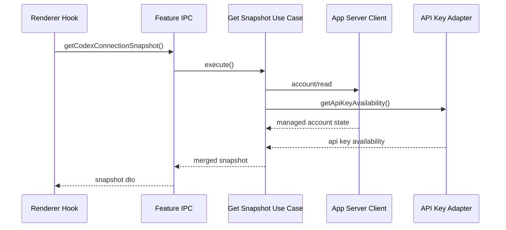
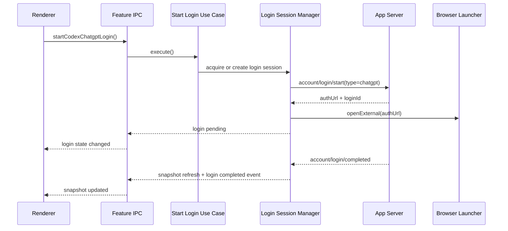
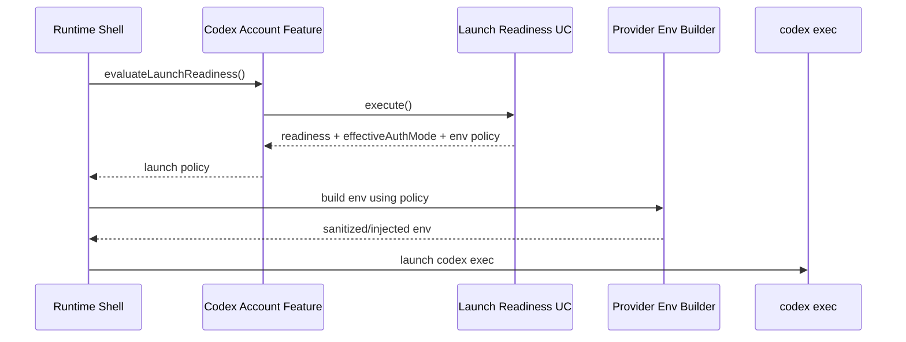
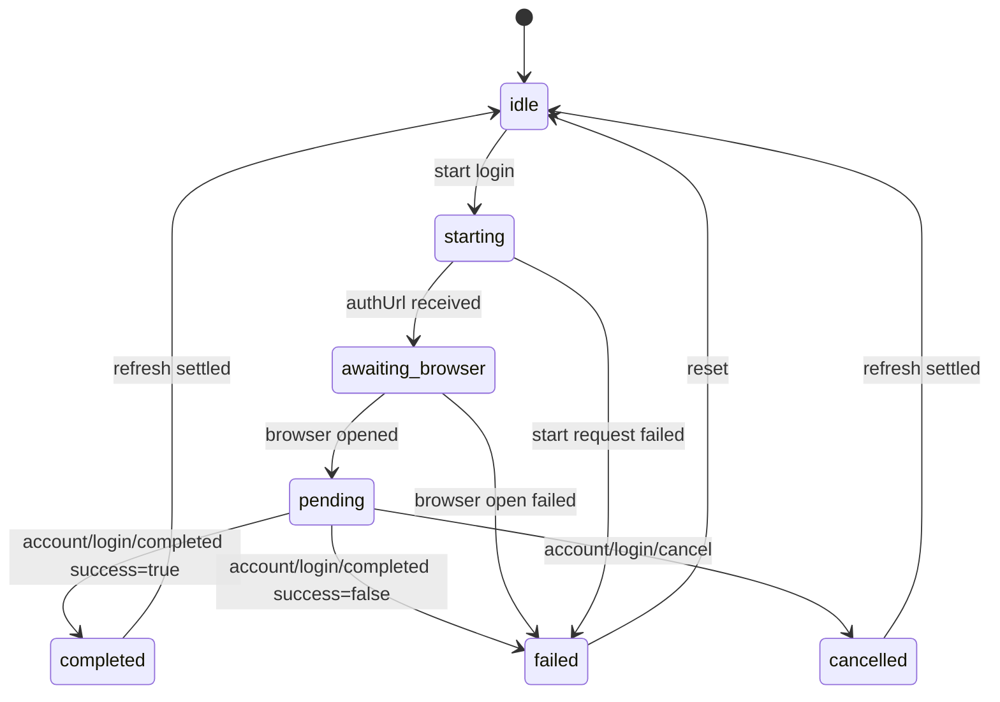

# Codex App-Server Account Feature - Detailed Implementation Plan

**Date**: 2026-04-20  
**Status**: Reference-quality implementation plan  
**Primary repo**: `claude_team`  
**Secondary repo**: `agent_teams_orchestrator` only for later parity, not on the first critical path  
**Canonical architecture reference**: [FEATURE_ARCHITECTURE_STANDARD.md](../FEATURE_ARCHITECTURE_STANDARD.md)

## Executive Summary

We should restore the old strong Codex subscription UX, but we should **not** bring back the old legacy Codex transport or legacy OAuth semantics.

The correct design is:

- keep **execution** on the current `codex-native` runtime path
- introduce a new dedicated feature slice: `src/features/codex-account`
- use **official `codex app-server` account APIs** as the managed-account control plane
- keep **app-owned API key storage** in the app
- explicitly merge the three different truths:
  - managed ChatGPT account truth from `codex app-server`
  - API key availability truth from app secure storage and ambient env detection
  - real execution truth from `codex exec`

This feature should become the source of truth for:

- autodetect of an already logged-in Codex / ChatGPT account
- login / cancel / logout UI flow
- plan type display
- rate limit display
- subscription-first connection copy
- launch-readiness policy for ChatGPT-backed Codex
- deterministic per-launch auth-mode forcing

Core rule:

- `codex exec` remains the execution seam
- `codex app-server` becomes the account control-plane seam
- legacy Codex transport stays deleted
- legacy Codex OAuth stays deleted
- direct `auth.json` parsing stays forbidden
- `chatgptAuthTokens` host-managed mode stays out of scope

## Goals And Non-Goals

### Goals

- restore strong Codex subscription UX on top of the native runtime
- make managed ChatGPT account truth first-class again in the app
- keep API key support without letting it hijack subscription semantics
- keep runtime execution on `codex exec`
- keep ownership boundaries aligned with `FEATURE_ARCHITECTURE_STANDARD.md`
- make rollout safe through additive, testable composition

### Non-goals

This feature is **not** trying to:

- revive legacy Codex transport
- revive legacy Codex OAuth implementation details
- parse `~/.codex/auth.json`
- add browser-mode local app-server support in the first wave
- add app-server-managed API key login in the first wave
- add per-member auth preferences or per-member Codex backend preferences
- redesign the whole CLI shell UX for other providers
- bundle plugin/app-server enrichment beyond account control-plane needs
- solve orchestrator parity in the same first implementation

## Glossary

These terms are used repeatedly in the plan and must stay consistent.

### Preferred auth mode

Persisted user intent.

Allowed values:

- `auto`
- `chatgpt`
- `api_key`

### Effective auth mode

The auth mode the next launch will actually use after runtime evaluation.

Allowed values:

- `chatgpt`
- `api_key`
- `null`

### Snapshot state

High-level UI/account state describing what the app currently believes about Codex account
availability.

Examples:

- `managed_account_connected`
- `both_available`
- `degraded`

### Launch readiness

Execution-oriented state used to decide whether the app should launch Codex and under which auth
mode.

Examples:

- `ready_chatgpt`
- `ready_api_key`
- `missing_auth`

### Managed account

A ChatGPT-authenticated Codex account owned and persisted by Codex itself.

### API key availability

Whether the app can supply an OpenAI API key from its own secure storage or ambient env detection.

### Degraded

A state where the control plane cannot fully verify Codex account truth right now, but the app may
still have partial or fresh-enough knowledge to present a careful status and in some cases still
launch.

### Last-known-good snapshot

The most recent successful account snapshot that came from a real app-server read and passed normal
merge and validation logic.

### Freshness window

A bounded period during which the feature may temporarily reuse last-known-good managed-account
truth while the app-server is degraded.

### Control plane

The account-management seam implemented via `codex app-server`.

### Execution plane

The actual task-running seam implemented via `codex exec`.

## Chosen Plan Assessment

Chosen plan:

- full Codex app-server account seam as a dedicated feature slice, while keeping `codex-native` execution

Assessment:

- `🎯 9   🛡️ 9   🧠 7`
- estimated implementation size: `1800-3200` lines in `claude_team`, plus tests and docs

## Top 3 Viable Shapes

### 1. Full app-server account feature slice - chosen

`🎯 9   🛡️ 9   🧠 7`  
Estimated size: `1800-3200` lines

Idea:

- build a dedicated `codex-account` feature
- use `codex app-server` for account state, login lifecycle, and rate limits
- keep API keys app-owned
- keep execution on `codex exec`

Why this wins:

- best long-term architecture
- truthful subscription UX
- avoids legacy transport return
- creates a clean seam between account control plane and execution plane
- aligns with the repo's feature architecture standard

Main cost:

- more moving parts than simple CLI probing
- requires careful runtime-policy integration

### 2. Hybrid read-via-app-server and login-via-cli

`🎯 8   🛡️ 8   🧠 6`  
Estimated size: `1200-2200` lines

Idea:

- `account/read` and rate limits via app-server
- login/logout still via `codex login` / `codex logout`

Pros:

- simpler login integration
- still gets rich autodetect and plan truth

Cons:

- split control plane
- less internally coherent
- more transitional than final

### 3. CLI-only managed-account seam

`🎯 8   🛡️ 8   🧠 4`  
Estimated size: `700-1200` lines

Idea:

- use `codex login status`, `codex login`, `codex logout`
- build UI around plain CLI probing

Pros:

- simpler
- safer if we were optimizing only for speed

Cons:

- poorer structured account metadata
- weak rate-limit surface
- less extensible
- does not justify a full feature slice as well

## Final Decision

We are taking option 1.

Reason:

- the user requirement is not just "support subscription somehow"
- the requirement is "bring back the strong legacy-quality Codex subscription UX, but on the native runtime"
- for that requirement, the app-server account seam is the cleanest and most future-proof architecture

## Resolved Decisions Register

This section keeps the most important architectural choices explicit, so they do not get
re-litigated ad hoc during implementation.

### Resolved - execution seam

Decision:

- keep execution on raw `codex exec`

Why:

- it matches the current cutover direction
- it avoids reopening the legacy transport question inside this feature

### Resolved - control-plane seam

Decision:

- use `codex app-server` for account lifecycle and rate-limit truth

Why:

- it is the official structured surface
- it supports managed account autodetect and login lifecycle without file parsing

### Resolved - secret ownership

Decision:

- ChatGPT managed auth belongs to Codex
- API key ownership remains app-owned

Why:

- avoids dual key stores
- keeps responsibility boundaries clear

### Resolved - Codex connection naming

Decision:

- persisted preference uses `preferredAuthMode: "auto" | "chatgpt" | "api_key"`

Why:

- `oauth` is legacy wording and no longer the right semantic label for Codex

### Resolved - browser mode

Decision:

- browser-mode app-server support is deferred

Why:

- desktop Electron path is the real target for the first implementation
- we should not hide platform limitations behind fake parity

### Resolved - device code

Decision:

- ChatGPT browser flow is first-class
- `chatgptDeviceCode` is deferred unless required by a real blocker

Why:

- browser flow better matches the intended legacy-quality desktop UX

### Resolved - degraded launch policy

Decision:

- degraded control-plane state may still be launchable only with positive current or sufficiently
  fresh prior managed-account evidence

Why:

- prevents false hard blocks
- also prevents indefinite stale-account lies

## Problem Statement

### What is wrong today

The current codebase has fully cut over to `codex-native` execution, but the account and UX layer was flattened too far.

Current product truth:

- Codex runtime lane is native-only
- Codex UI is effectively API-key-only
- Codex managed ChatGPT subscription autodetect is gone from app UX
- Codex login/logout from app UI was removed
- current launch-readiness policy still assumes API key credentials are required

This creates a product and architecture mismatch:

- the real Codex native runtime supports ChatGPT account auth
- but the app currently acts as if only API keys exist

### Why this is dangerous

If we only restore cosmetic UI copy and do not change runtime policy, we will create a worse failure mode:

- UI says subscription is available
- but launch still fails because the app hard-gates on `OPENAI_API_KEY` or `CODEX_API_KEY`

That would be a deceptive product state.

So the plan must fix:

1. managed account detection
2. managed login flow
3. runtime launch policy
4. UI presentation

all together

## Confirmed Facts And Constraints

This section lists facts the plan relies on.

## Official Codex facts

Based on the current public OpenAI Codex docs, plus the protocol schemas generated from the
installed Codex binary on this machine:

- Codex supports both ChatGPT account auth and API key auth
- `codex app-server` supports:
  - `account/read`
  - `account/login/start`
  - `account/login/cancel`
  - `account/logout`
  - `account/rateLimits/read`
  - `account/updated`
  - `account/login/completed`
  - `account/rateLimits/updated`
- `account/read` returns:
  - `account | null`
  - `requiresOpenaiAuth`
- when `account.type === "chatgpt"`, the current schema requires:
  - `email`
  - `planType`
- when `account.type === "apiKey"`, the current schema exposes only:
  - `type`
- current generated `account/updated` schema includes nullable:
  - `authMode`
  - `planType`
- current documented `authMode` values include:
  - `apikey`
  - `chatgpt`
  - `chatgptAuthTokens`
  - `null`
- current generated `account/rateLimits/read` schema exposes:
  - `rateLimits`
  - `rateLimitsByLimitId`
  - per-snapshot `planType | null`
- Codex config supports:
  - `forced_login_method = "chatgpt"`
  - `forced_login_method = "api"`
- Codex tools accept config overrides via top-level `-c key=value`
- current app-server docs explicitly show ChatGPT browser flow via:
  - `type: "chatgpt"`
- current app-server docs explicitly show externally managed token mode via:
  - `type: "chatgptAuthTokens"`
- the generated protocol types explicitly mark `chatgptAuthTokens` as unstable / internal-only, so
  the first implementation must not depend on it

Interpretation rule:

- steady-state managed-account identity must still come from successful `account/read`
- notification fields are freshness accelerators, not a durable replacement read model

Sources:

- [Authentication - Codex](https://developers.openai.com/codex/auth)
- [App Server - Codex](https://developers.openai.com/codex/app-server)

## Locally verified facts

Verified on this machine on 2026-04-20:

- `codex login status` returns `Logged in using ChatGPT`
- `codex app-server` starts locally
- `account/read` returned:
  - `account.type = "chatgpt"`
  - `email = "quantjumppro@gmail.com"`
  - `planType = "pro"`
  - `requiresOpenaiAuth = true`

Practical implication:

- managed-account autodetect is real
- it does not require reverse-engineering auth storage

## Current repo facts

Current relevant code facts:

- `recent-projects` already uses `codex app-server` over short-lived JSON-RPC stdio sessions
- generic Codex runtime status currently sits in:
  - `src/main/services/runtime/ClaudeMultimodelBridgeService.ts`
- generic provider connection logic currently sits in:
  - `src/main/services/runtime/ProviderConnectionService.ts`
- launch env assembly currently sits in:
  - `src/main/services/runtime/providerAwareCliEnv.ts`
- Codex UI currently flattened to API-key-only sits in:
  - `src/renderer/components/runtime/ProviderRuntimeSettingsDialog.tsx`
  - `src/renderer/components/runtime/providerConnectionUi.ts`
  - `src/renderer/components/dashboard/CliStatusBanner.tsx`
  - `src/renderer/components/settings/sections/CliStatusSection.tsx`

## Current schema facts

Current config and shared-type state:

- `providerConnections.codex` is currently `Record<string, never>`
- `configValidation` currently rejects real Codex connection fields except for ignored stale legacy fields
- shared `AppConfig` mirrors still declare Codex provider connections as empty

Practical implication:

- this feature requires deliberate config schema expansion and migration logic

## App-Server Compatibility Facts

Current local code and generated protocol schemas show:

- `recent-projects` already initializes app-server with:
  - `experimentalApi: false`
  - `optOutNotificationMethods`
- generated `initialize` response includes:
  - `codexHome`
  - `platformFamily`
  - `platformOs`
- generated login response for `type: "chatgpt"` includes:
  - `loginId`
  - `authUrl`

Practical implication:

- the feature can and should stay on the stable app-server surface
- compatibility should be decided by an initialize-plus-required-method handshake, not by semver
  parsing alone
- auth-root diagnostics can use `initialize.codexHome` as a first-class observed fact instead of
  only inferring from environment variables

## Honest Confidence Hotspots

These are the places where confidence is lower than the rest of the plan and where we should be
deliberately conservative.

### Hotspot 1 - undocumented or lightly documented auth variants

Assessment:

- `🎯 6   🛡️ 9   🧠 3`

What we know:

- official app-server docs clearly show:
  - `chatgpt`
  - `apiKey`
  - `chatgptAuthTokens`
- local schema / CLI evidence suggests more variants may exist

Plan decision:

- first implementation depends only on the clearly documented browser-flow `chatgpt` path
- do not build phase 1 around additional auth variants

Why this is the safe choice:

- avoids coupling to protocol surfaces that may be less stable or less publicly specified

### Hotspot 2 - exact ordering of app-server notifications

Assessment:

- `🎯 7   🛡️ 9   🧠 4`

What we know:

- docs and local evidence show `account/login/completed` and `account/updated`
- but we should not assume stronger guarantees than we have to

Plan decision:

- notifications accelerate freshness
- explicit snapshot refresh remains the recovery source of truth

Why this is the safe choice:

- even if event order changes slightly, the feature still converges to the correct steady state

### Hotspot 3 - rate-limits payload usefulness for the first UI

Assessment:

- `🎯 7   🛡️ 8   🧠 4`

What we know:

- app-server exposes ChatGPT rate-limit reads and updates
- exact display value of every field may not be necessary for phase 1 UX

Plan decision:

- keep rate-limits lazy
- present the minimal truthful subset first
- avoid making base account UX depend on rate-limit richness

Why this is the safe choice:

- avoids blocking the critical auth/launch story on secondary UI detail

### Hotspot 4 - `forced_login_method` long-term contract stability

Assessment:

- `🎯 7   🛡️ 8   🧠 3`

What we know:

- the auth docs and local behavior support the approach
- the CLI reference page is not the strongest canonical place for this exact contract

Plan decision:

- isolate this override behind the coordinator/env builder seam
- do not scatter it through renderer or generic shell logic

Why this is the safe choice:

- if the exact override mechanism ever changes, the blast radius stays small

### Hotspot 5 - precedence of account fields across read, notification, and rate-limit surfaces

Assessment:

- `🎯 7   🛡️ 9   🧠 4`

What we know:

- the generated protocol schema shows `account/updated` carries nullable `authMode` and `planType`
- `account/rateLimits/read` also carries `planType`
- notifications are best-effort and should not be treated as a durable replay log

Plan decision:

- the latest successful `account/read` owns steady-state account identity
- `account/updated` and rate-limit snapshots may refresh hints and trigger coalesced rereads
- they must never synthesize account presence on their own

Why this is the safe choice:

- avoids phantom login or phantom subscription UI caused by late, partial, or duplicated
  notifications

### Hotspot 6 - binary compatibility and stable-vs-experimental app-server surface

Assessment:

- `🎯 8   🛡️ 9   🧠 4`

What we know:

- official app-server docs describe `initialize.params.capabilities.experimentalApi`
- current local `recent-projects` integration already uses `experimentalApi: false`
- generated `initialize` response exposes `codexHome`, `platformFamily`, and `platformOs`

Plan decision:

- first-wave `codex-account` must depend only on stable account APIs
- feature readiness must be gated by successful initialize plus required stable method support
- do not make product behavior depend on parsing CLI semver strings alone

Why this is the safe choice:

- reduces risk from partial protocol drift across installed Codex binaries
- keeps compatibility logic tied to the actual negotiated surface

### Hotspot 7 - managed workspace restriction behavior in admin-controlled installs

Assessment:

- `🎯 6   🛡️ 8   🧠 4`

What we know:

- official auth docs support `forced_chatgpt_workspace_id`
- official docs say mismatched credentials cause Codex to log the user out and exit
- the app does not currently own workspace selection or workspace switching for Codex

Plan decision:

- first wave treats workspace restriction as admin policy truth, not as generic missing-auth
- the UI must not invent a workspace picker or a fake remediation flow the app does not own

Why this is the safe choice:

- preserves truthful UX in managed environments without expanding scope into unsupported account
  management

### Hotspot 8 - trust boundary around `authUrl` and sensitive login metadata

Assessment:

- `🎯 7   🛡️ 9   🧠 3`

What we know:

- `account/login/start { type: "chatgpt" }` returns `authUrl` and `loginId`
- existing generic `shell:openExternal` allows `http`, `https`, and `mailto`
- the feature only needs browser auth URLs, not general-purpose URL opening

Plan decision:

- keep raw `authUrl` handling in main only
- require a stricter feature-specific validation policy before opening:
  - scheme must be `https`
  - no renderer round-trip for the raw URL
  - no raw URL logging
- treat `loginId` as process-lifecycle metadata, not as user-facing state

Why this is the safe choice:

- reduces accidental leakage of login URLs or correlation ids across IPC, logs, and renderer state

### Hotspot 9 - mutation races and app-server session topology

Assessment:

- `🎯 7   🛡️ 9   🧠 5`

What we know:

- `account/login/completed`, `account/login/cancel`, `account/logout`, and forced snapshot refreshes
  can overlap in time
- app-server notifications are connection-scoped
- `recent-projects` already uses separate short-lived stdio app-server sessions

Plan decision:

- serialize mutating account operations in the main-process feature
- keep the login session on its own dedicated app-server connection
- keep passive reads on separate short-lived sessions
- let fresh steady-state snapshot truth settle races instead of trusting action intent alone

Why this is the safe choice:

- avoids cross-session notification bleed, duplicate side effects, and stale mutations reanimating
  old UI state

## Pre-Implementation Confidence Burn-Down Checklist

These checks are the shortest path to reducing the remaining honest uncertainty before or during the
first implementation steps.

### Burn-down check 1 - capture real browser-login notification sequence

Goal:

- observe the real order of:
  - `account/login/completed`
  - `account/updated`
  - any adjacent auth-related notifications

Why:

- confirms our event-ordering assumptions are conservative enough

Expected outcome:

- even if order differs slightly from expectation, the explicit refresh model remains valid

### Burn-down check 2 - capture one real `account/rateLimits/read` sample

Goal:

- verify the actual payload shape we want to expose in the first UI

Why:

- reduces uncertainty around which fields are worth surfacing in phase F

Expected outcome:

- confirm minimal truthful fields for initial UI
- defer decorative/secondary fields safely

### Burn-down check 3 - re-verify ChatGPT launch path with ambient API keys present

Goal:

- prove that the chosen env sanitization plus auth override actually forces the intended ChatGPT path

Why:

- this is the highest-value correctness risk in the whole feature

Expected outcome:

- capture one signoff artifact that launch uses ChatGPT semantics even when API-key env vars are
  present in the parent shell

### Burn-down check 4 - verify logout semantics against stale cached state

Goal:

- prove that explicit logout wins over last-known-good snapshot reuse

Why:

- prevents the most embarrassing stale-account resurrection bug

Expected outcome:

- logout clears managed-account truth immediately
- degraded follow-up reads cannot resurrect it

### Burn-down check 5 - confirm app-server and exec share identical auth-store roots

Goal:

- compare resolved `HOME`, `USERPROFILE`, and `CODEX_HOME` across both paths

Why:

- split auth store is a high-severity, low-visibility failure mode

Expected outcome:

- one centralized env normalization path is sufficient for both control plane and execution plane

### Burn-down check 6 - capture one real `account/updated` payload sequence

Goal:

- observe whether `authMode` and `planType` arrive as expected across login, logout, and steady
  state refreshes

Why:

- confirms the precedence rules stay conservative against nullable or partial notification payloads

Expected outcome:

- keep `account/read` as the steady-state owner
- use notifications only as accelerators and invalidation hints

### Burn-down check 7 - verify initialize handshake on the stable surface

Goal:

- confirm the feature can derive a compatibility verdict from stable initialize plus required method
  support

Why:

- prevents false-ready UI on installs where `codex app-server` exists but the required account
  surface is too old or otherwise incompatible

Expected outcome:

- initialize succeeds with `experimentalApi: false`
- the feature records `codexHome`, `platformFamily`, and `platformOs` for diagnostics
- unsupported/mismatched installs become `app-server-incompatible`, not generic auth failure

### Burn-down check 8 - capture one real ChatGPT login URL handling sample

Goal:

- validate the actual `authUrl` scheme/shape and prove the browser-open path can stay main-only

Why:

- closes the last trust-boundary uncertainty around login URL handling without expanding scope into
  brittle host-specific assumptions

Expected outcome:

- the real login URL is `https`
- raw `authUrl` never needs to cross IPC
- logs can record only redacted/derived diagnostics such as scheme and hostname when necessary

### Burn-down check 9 - exercise cancel/completion/logout race resolution

Goal:

- prove that overlapping account mutations still converge to one truthful steady state

Why:

- this is one of the easiest places to create zombie pending state or accidental false logout

Expected outcome:

- cancel followed by late login completion does not force a false disconnect
- logout during pending login still ends in logged-out truth
- stale pre-mutation reads cannot overwrite post-mutation state

## Recommended Placement Of Burn-Down Checks In The Phase Plan

To keep momentum, we should not treat all uncertainty as a separate research project.

### Before or during Phase B

- Burn-down check 1
- Burn-down check 2
- Burn-down check 6
- Burn-down check 7
- Burn-down check 8

Reason:

- these directly shape contracts and event handling

### Before or during Phase D

- Burn-down check 3
- Burn-down check 5

Reason:

- these directly shape launch correctness and env routing

### Before or during Phase E

- Burn-down check 4
- Burn-down check 9

Reason:

- this directly shapes logout semantics, mutation ordering, and stale-state invalidation

## Uncertainty Triage - What Must Be Settled Before Broad Coding

Not every unknown deserves to block the feature. The plan should distinguish hard preconditions from
safe rollout follow-ups.

### Must be explicit before the feature spreads across shell and renderer

- account field precedence between `account/read`, `account/updated`, and `account/rateLimits/read`
- stable-surface compatibility gate for installed `codex app-server`
- containment rules for `authUrl`, `loginId`, and account email across main, IPC, and logs
- mutation serialization and race-settlement policy for login/cancel/logout
- shared auth-store root resolution for app-server and `codex exec`
- launch-time env sanitization when ambient API keys exist
- logout invalidation semantics and last-known-good clearing rules

Why:

- each of these can create silent false truth in UI or billing/auth mismatches at runtime

### Can be refined during rollout without invalidating the architecture

- how rich the first rate-limit UI should be
- whether degraded state needs an extra badge in addition to text
- whether we surface plan-type changes instantly from notifications or only after follow-up reads
- how aggressively background refresh should coalesce under bursty notification traffic
- whether managed-workspace restriction gets a dedicated visual badge or text-only treatment

Why:

- these change UX sharpness, not the core correctness contract

## Known Current Mismatches The Plan Must Explicitly Eliminate

These are not abstract concerns. They already exist in the current code and must be treated as
first-class implementation targets.

### Mismatch 1 - Codex connection truth is still API-key-first

Current reality:

- `ProviderConnectionService` still treats Codex readiness as "API key exists"
- `getConfiguredConnectionIssue()` still says Codex native requires `OPENAI_API_KEY` or
  `CODEX_API_KEY`

Why this is dangerous:

- once ChatGPT account UX is restored, launch policy can still lie and hard-fail incorrectly

### Mismatch 2 - shell UI copy still flattens Codex to API key management

Current reality:

- `providerConnectionUi.ts` still uses:
  - `Configure API key`
  - `Saved API key available in Manage`
  - `Codex native ready`
- there is no first-class Codex managed account summary

Why this is dangerous:

- the renderer will keep presenting the wrong mental model even if the runtime becomes correct

### Mismatch 3 - shell login/logout flow is terminal-modal based

Current reality:

- `CliStatusBanner.tsx`
- `CliStatusSection.tsx`

still drive provider login/logout through terminal modals and shell commands.

Why this is dangerous:

- even if app-server account logic exists, the visible UX would still route through the wrong seam

### Mismatch 4 - config schema has no real Codex connection preference

Current reality:

- `providerConnections.codex` is still effectively empty
- validation only tolerates stale legacy keys instead of modeling the current desired state

Why this is dangerous:

- renderer state, persistence, and launch policy can drift because there is no canonical stored
  preference

### Mismatch 5 - app-server infrastructure is feature-owned by `recent-projects`

Current reality:

- generic JSON-RPC stdio transport is currently nested under `recent-projects`

Why this is dangerous:

- a second feature would either duplicate the transport or deep-import another feature's internals

### Mismatch 6 - current multimodel shell status cannot be the Codex account source of truth

Current reality:

- `CliProviderStatus` is useful for binary/backend/model truth
- it is not sufficient for login lifecycle, plan display, or dual-surface auth truth

Why this is dangerous:

- forcing all Codex account truth into `CliProviderStatus` would create a leaky, provider-specific
  blob in generic shell status contracts

## Hard constraints

The implementation must respect all of the following:

1. Execution must stay on `codex-native` / `codex exec`.
2. The feature must not recreate legacy Codex transport.
3. The feature must not parse `~/.codex/auth.json`.
4. The feature must not duplicate API key storage responsibility into Codex-managed storage.
5. The feature must not hard-block launch only because app-server is transiently degraded.
6. The feature must keep auth truth and execution truth separate.
7. The feature must keep app-server and `codex exec` running against the same auth storage context.

## Why This Must Be A Feature Slice

This is not just another Codex-specific if-statement.

This work:

- spans `main -> preload -> renderer`
- owns transport wiring
- owns its own use cases
- owns provider-specific business policy
- is expected to grow

That matches the feature standard's criteria for a full slice.

So the implementation should **not** be buried into:

- `ProviderConnectionService`
- `ProviderRuntimeSettingsDialog`
- `CliStatusBanner`
- `CliStatusSection`

Those shell modules should consume this feature, not own it.

## Feature Topology

```text
src/features/codex-account/
  contracts/
    api.ts
    channels.ts
    dto.ts
    events.ts
    index.ts
  core/
    domain/
      CodexConnectionPreference.ts
      CodexManagedAccount.ts
      CodexLaunchReadiness.ts
      CodexConnectionSnapshot.ts
      CodexLoginState.ts
    application/
      ports/
        CodexManagedAccountSourcePort.ts
        CodexManagedLoginPort.ts
        CodexRateLimitSourcePort.ts
        CodexApiKeyAvailabilityPort.ts
        CodexBinaryResolverPort.ts
        CodexShellEnvPort.ts
        BrowserLauncherPort.ts
        ClockPort.ts
        LoggerPort.ts
      use-cases/
        GetCodexConnectionSnapshotUseCase.ts
        RefreshCodexConnectionSnapshotUseCase.ts
        StartCodexChatgptLoginUseCase.ts
        CancelCodexLoginUseCase.ts
        LogoutCodexManagedAccountUseCase.ts
        ReadCodexRateLimitsUseCase.ts
        EvaluateCodexLaunchReadinessUseCase.ts
  main/
    composition/
      createCodexAccountFeature.ts
    adapters/
      input/
        ipc/registerCodexAccountIpc.ts
      output/
        presenters/
          CodexConnectionSnapshotPresenter.ts
          CodexRateLimitsPresenter.ts
          CodexAccountEventPresenter.ts
        runtime/
          ProviderConnectionApiKeySourceAdapter.ts
          CodexLaunchReadinessRuntimeAdapter.ts
        shell/
          ElectronBrowserLauncherAdapter.ts
    infrastructure/
      cache/
        InMemoryCodexAccountCache.ts
      codex/
        CodexAccountAppServerClient.ts
        CodexLoginSessionManager.ts
        CodexAccountEnvBuilder.ts
  preload/
    createCodexAccountBridge.ts
    index.ts
  renderer/
    index.ts
    adapters/
      codexAccountViewModel.ts
      codexProviderShellAdapter.ts
    hooks/
      useCodexAccount.ts
      useCodexLoginFlow.ts
      useCodexRateLimits.ts
    ui/
      CodexAccountConnectionPanel.tsx
      CodexLoginPendingPanel.tsx
      CodexRateLimitsPanel.tsx
      CodexConnectionSummaryBadge.tsx
```

## Responsibility Split By Layer

### `contracts/`

Contains:

- DTOs
- event payloads
- IPC channel names
- preload API contract

Must not contain:

- Electron APIs
- runtime policy
- child-process details

### `core/domain/`

Contains:

- preference model
- managed-account model
- launch-readiness model
- invariants for combining account and API key truth

Must not contain:

- `ipcRenderer`
- `electron`
- shell env access
- JSON-RPC transport

### `core/application/`

Contains:

- use cases
- ports
- merge rules
- state transition rules

Must not contain:

- actual app-server spawn logic
- actual browser open logic
- app config singleton access

### `main/composition/`

Contains:

- wiring of ports to infrastructure
- export of a small feature facade

### `main/adapters/input/`

Contains:

- IPC registration only

### `main/adapters/output/`

Contains:

- translation from existing shell services into feature ports
- presenters for IPC-safe DTOs

### `main/infrastructure/`

Contains:

- app-server stdio JSON-RPC details
- login session lifecycle management
- env sanitization and assembly
- cache implementation

### `preload/`

Contains:

- bridge methods and event subscriptions

### `renderer/`

Contains:

- hooks
- view-model mapping
- Codex-specific UI pieces

## Feature Facade And Public Contract Shape

To keep SRP and interface segregation intact, the feature should expose a small facade rather than
letting shell code reach into individual infrastructure pieces.

Recommended main-process facade shape:

```ts
interface CodexAccountFeatureFacade {
  getSnapshot(options?: { forceFresh?: boolean }): Promise<CodexConnectionSnapshotDto>;
  refreshSnapshot(): Promise<CodexConnectionSnapshotDto>;
  startChatgptLogin(): Promise<CodexLoginStateDto>;
  cancelLogin(): Promise<CodexLoginStateDto>;
  logout(): Promise<CodexConnectionSnapshotDto>;
  getRateLimits(options?: { forceFresh?: boolean }): Promise<CodexRateLimitsDto | null>;
  evaluateLaunchReadiness(options: {
    binaryPath?: string | null;
    preferredAuthMode?: 'auto' | 'chatgpt' | 'api_key' | null;
  }): Promise<CodexLaunchReadinessDto>;
  subscribe(listener: (event: CodexAccountEventDto) => void): () => void;
}
```

Design rule:

- the shell should depend on this facade or its IPC equivalent
- the shell should not call:
  - `CodexAccountAppServerClient`
  - `CodexLoginSessionManager`
  - cache objects
  - low-level env builders

This keeps the implementation open for extension without forcing broad shell rewrites later.

## Shared Infrastructure Extraction Plan

We already have generic app-server transport primitives hiding under `recent-projects`.

That code should be extracted before `codex-account` is built, otherwise `recent-projects` becomes the owner of unrelated infrastructure.

Recommended extraction target:

```text
src/main/services/infrastructure/codex-app-server/
  JsonRpcStdioClient.ts
  CodexAppServerSessionFactory.ts
  codexAppServerDefaults.ts
```

What gets extracted:

- generic stdio JSON-RPC client
- generic initialize/initialized session bootstrap
- default request timeout values
- default suppressed notification configuration

What stays inside `recent-projects`:

- thread-list request logic
- recent-projects-specific source adapter

What stays inside `codex-account`:

- account request logic
- login lifecycle logic
- rate-limits logic

Important DRY rule:

- extract transport primitives
- do **not** create one giant "CodexService" that mixes unrelated product features

## Architecture Decision On Sources Of Truth

This feature only works if source-of-truth boundaries are explicit.

## Truth 1 - managed account truth

Source:

- `codex app-server account/read`

Used for:

- whether a managed ChatGPT account exists
- account email
- plan type
- account auth mode

## Truth 1a - field precedence inside managed account truth

The feature must not treat every app-server field as equally authoritative.

Precedence rules:

1. `account/read` owns steady-state identity:
   - whether an account exists
   - `account.type`
   - `email`
   - baseline `planType`
   - `requiresOpenaiAuth`
2. `account/updated.authMode` may update an observed auth hint immediately, but must not by itself
   create or delete a managed account.
3. `account/updated.planType` may refresh displayed subscription metadata when present, but if it
   arrives as `null` or arrives without a known account, the feature should trigger a coalesced
   follow-up `account/read` before changing steady-state account identity.
4. `account/rateLimits/read.planType` may corroborate subscription UI, but must not create account
   presence or override a newer successful `account/read`.
5. explicit logout clears managed-account truth synchronously before any background refresh result
   is accepted.
6. degraded reads may reuse last-known-good account truth only within the freshness window and only
   if no explicit logout happened after that snapshot.

Implementation consequence:

- `planType` is a field with precedence and fallback rules
- it is not a standalone durable source of truth from notifications alone

## Truth 2 - API key truth

Source:

- existing app API key storage plus ambient env detection

Used for:

- whether the app can launch Codex using API key mode
- whether an app-managed OpenAI key is stored
- where the key comes from

## Truth 3 - execution truth

Source:

- `codex exec`

Used for:

- whether a real Codex run starts
- real failure or success at execution time

## Truth 4 - renderer shell status truth

Source:

- composed presentation model from:
  - generic runtime provider status
  - Codex account feature snapshot

Important design choice:

- we should **not** force all Codex account fields into `CliProviderStatus`
- `CliProviderStatus` remains the source of truth for:
  - binary/runtime/backend/model status
- the feature snapshot remains the source of truth for:
  - managed account
  - preferred and effective auth mode
  - launch readiness
  - login lifecycle
  - rate limits

The shell must compose these two bounded contexts at presentation time.

This is not "two conflicting sources of truth".

It is:

- one runtime status context
- one account status context

## Ownership Matrix

This table is the practical anti-bug contract for the feature.

| Concern | Canonical source | Owning layer | Persisted? | Cache TTL | Used by | Must not be inferred from |
| --- | --- | --- | --- | --- | --- | --- |
| Codex binary path / binary installed | existing multimodel runtime status | shell runtime services | no | existing shell TTL | shell cards, launch gating | `codex-account` snapshot |
| Codex backend lane | existing runtime config `runtime.providerBackends.codex` | shell runtime services | yes | n/a | launch, status, provisioning | account auth state |
| Codex preferred auth mode | `providerConnections.codex.preferredAuthMode` | `codex-account` feature | yes | n/a | account panel, launch policy | `CliProviderStatus.authMethod` |
| Managed account presence | `account/read` | `codex-account` feature | no | 3-10s | account panel, readiness | local file parsing |
| Managed account email | `account/read` | `codex-account` feature | no | 3-10s | account panel | renderer local state |
| Managed account plan type | latest successful `account/read`; nullable refresh hints from `account/updated` and `account/rateLimits/read` | `codex-account` feature | no | 3-10s | subscription UI, rate limits | static plan assumptions or notification-only state |
| Requires OpenAI auth | `account/read.requiresOpenaiAuth` | `codex-account` feature | no | 3-10s | readiness messaging | provider id alone |
| API key availability | app secure storage plus ambient env detection | provider connection adapter | no | 0-3s | readiness, secondary badges | app-server account state |
| Effective auth mode for next launch | `EvaluateCodexLaunchReadinessUseCase` | `codex-account` feature | no | request-scoped | launch env builder | raw config alone |
| Login pending state | `CodexLoginSessionManager` | `codex-account` feature | no | live | UI pending panels | cached snapshot |
| Rate limits | `account/rateLimits/read` | `codex-account` feature | no | 30-60s | account detail panel | plan type alone |
| Final execution success / failure | `codex exec` | runtime execution lane | no | live | launch result UX | account snapshot |

Implementation rule:

- if a field is not canonical in this table, the layer may display it but must not own it

## Dependency Direction And Anti-Corruption Rules

To stay aligned with `FEATURE_ARCHITECTURE_STANDARD.md`, the new feature must preserve these
directions:

1. `renderer` depends on:
   - `@features/codex-account/renderer`
   - `@features/codex-account/contracts`
2. `preload` depends on:
   - `@features/codex-account/contracts`
3. `main shell` depends on:
   - `@features/codex-account/main`
4. `codex-account/core/*` depends only on:
   - feature-local ports and domain models
5. `codex-account/main/infrastructure/*` may depend on:
   - Electron
   - child process / stdio
   - shared shell env helpers
6. `recent-projects` must not become a transitive dependency of `codex-account`

Anti-corruption rule:

- the feature may adapt values out of `CliProviderStatus`
- it must not reshape its domain around `CliProviderStatus`

This is important because `CliProviderStatus` is a generic shell contract, not the Codex account
domain model.

## Dependency Enforcement Recommendations

The architecture standard already gives the broad rules. For this feature, we should make the most
important ones operational.

### Recommended import discipline

- shell code imports only:
  - `@features/codex-account/main`
  - `@features/codex-account/contracts`
  - `@features/codex-account/renderer`
  - `@features/codex-account/preload`
- tests may deep-import internals when needed
- production code outside the feature should not deep-import internal adapters, ports, or
  infrastructure

### Recommended lint / review guardrails

Watch specifically for:

- `src/renderer/components/*` importing feature `main/*`
- feature `core/*` importing `electron`, child-process modules, or shell services
- unrelated features importing `codex-account/main/infrastructure/*`
- `recent-projects` becoming a transport owner again through back references

### Practical enforcement rule

If a shell file needs a new Codex-specific detail and that detail is not in the feature facade or
contracts yet:

- extend the facade or contracts
- do not bypass the boundary with a deep import

## Explicitly forbidden truth sources

- `~/.codex/auth.json`
- legacy OAuth state
- terminal output parsing as the steady-state account model
- `chatgptAuthTokens`
- stale renderer-only cached assumptions

## Domain Model

## Connection preference

New persisted preference:

- `auto`
- `chatgpt`
- `api_key`

Recommended config key:

- `providerConnections.codex.preferredAuthMode`

Important decision:

- do **not** reuse legacy `oauth` naming for Codex

Reason:

- `oauth` is legacy wording from the old implementation
- `chatgpt` maps much more clearly to the new managed-account seam

## Effective auth mode

Resolved per snapshot:

- `chatgpt`
- `api_key`
- `null`

This can differ from user preference when:

- preferred mode is `auto`
- one surface is unavailable

## Snapshot state

Recommended states:

- `runtime_missing`
- `checking`
- `not_connected`
- `managed_account_connected`
- `api_key_available`
- `both_available`
- `login_in_progress`
- `logout_in_progress`
- `degraded`

## Launch readiness

Recommended states:

- `ready_chatgpt`
- `ready_api_key`
- `ready_both`
- `warning_degraded_but_launchable`
- `missing_auth`
- `runtime_missing`

## Domain invariants

1. A managed ChatGPT account and an API key can both exist simultaneously.
2. API key presence must not erase managed account metadata.
3. Managed account presence must not erase API key availability.
4. Launch policy must resolve one effective auth mode per run.
5. Account metadata is display state, not secret state.
6. Login state is transient and process-owned.
7. A degraded app-server read must not automatically mean "logged out".

## State Resolution Matrix

This matrix is the fastest way to keep renderer, use cases, and runtime policy aligned.

| Binary available | Managed account | API key available | App-server health | Preferred auth | Snapshot state | Launch readiness | Effective auth mode | UI headline |
| --- | --- | --- | --- | --- | --- | --- | --- | --- |
| no | any | any | any | any | `runtime_missing` | `runtime_missing` | `null` | Codex runtime missing |
| yes | no | no | healthy | auto | `not_connected` | `missing_auth` | `null` | Connect ChatGPT account or add API key |
| yes | yes | no | healthy | auto | `managed_account_connected` | `ready_chatgpt` | `chatgpt` | ChatGPT account connected |
| yes | no | yes | healthy | auto | `api_key_available` | `ready_api_key` | `api_key` | API key available |
| yes | yes | yes | healthy | auto | `both_available` | `ready_both` | `chatgpt` | ChatGPT account connected - API key also available |
| yes | yes | yes | healthy | chatgpt | `both_available` | `ready_chatgpt` | `chatgpt` | ChatGPT account preferred |
| yes | yes | yes | healthy | api_key | `both_available` | `ready_api_key` | `api_key` | API key preferred - ChatGPT account also connected |
| yes | yes | no | degraded | auto or chatgpt | `degraded` | `warning_degraded_but_launchable` | `chatgpt` | ChatGPT account detected - unable to fully verify right now |
| yes | no | yes | degraded | auto or api_key | `degraded` | `ready_api_key` | `api_key` | API key available - account status degraded |
| yes | no | no | degraded | auto | `degraded` | `missing_auth` or warning only if last good account still fresh | `null` or last-good-derived | Unable to verify Codex account state |

Interpretation rule:

- `snapshot state` is broader UX truth
- `launch readiness` is stricter execution truth
- they are related but must not be collapsed into one boolean

## Managed Workspace Restriction Policy

Official Codex auth/config docs allow administrators to set:

- `forced_login_method`
- `forced_chatgpt_workspace_id`

Docs also state that if active credentials do not match the configured restriction, Codex logs the
user out and exits.

### First-wave product policy

- do not add a workspace picker or workspace-switch UI in this feature
- do not pretend the app can resolve admin-managed workspace policy on the user's behalf
- do surface workspace restriction as a distinct normalized policy state when detected

### Expected UX treatment

If the installed Codex runtime is restricted to another ChatGPT workspace:

- do not show generic `Connect ChatGPT account` copy as the only explanation
- do not claim the subscription is simply missing
- show an admin-policy-oriented message such as:
  - `This Codex installation is restricted to a different ChatGPT workspace`

### Architecture implication

Workspace restriction should be modeled as:

- a normalized error/policy category
- potentially `not_connected` or `missing_auth` at the raw launch-readiness layer
- but with policy-specific renderer messaging

This avoids exploding the core state machine while still keeping the UX honest.

## Config And Migration Plan

## New config shape

Update:

- `ConfigManager.ProviderConnectionsConfig`
- shared `AppConfig`
- config validation
- settings reset defaults

Recommended new shape:

```ts
providerConnections: {
  anthropic: {
    authMode: 'auto' | 'oauth' | 'api_key'
  },
  codex: {
    preferredAuthMode: 'auto' | 'chatgpt' | 'api_key'
  }
}
```

## Migration rules

On config read:

1. If `providerConnections.codex.preferredAuthMode` is missing:
   - default to `auto`
2. If stale legacy `providerConnections.codex.authMode === 'oauth'`:
   - migrate to `preferredAuthMode = 'chatgpt'`
3. If stale legacy `providerConnections.codex.authMode === 'api_key'`:
   - migrate to `preferredAuthMode = 'api_key'`
4. If stale legacy `providerConnections.codex.authMode === 'auto'`:
   - migrate to `preferredAuthMode = 'auto'`
5. Ignore `apiKeyBetaEnabled` completely after migration
6. Write back only the new shape

## Migration algorithm - exact behavior

This part needs to be exact because configuration drift is one of the easiest ways to create
hard-to-debug launch mismatches.

### Read-time normalization order

When config is loaded:

1. load raw JSON from disk
2. apply generic config defaults
3. normalize `runtime.providerBackends.codex`
4. normalize `providerConnections.codex`
5. validate the normalized shape
6. persist normalized config only if it changed materially

### Exact Codex connection normalization rules

Given `raw.providerConnections.codex`:

- if it is missing or not an object:
  - replace with `{ preferredAuthMode: "auto" }`
- if `preferredAuthMode` exists and is one of:
  - `auto`
  - `chatgpt`
  - `api_key`
  - keep it
- otherwise, inspect stale keys in this order:
  - `authMode === "oauth"` -> `preferredAuthMode = "chatgpt"`
  - `authMode === "api_key"` -> `preferredAuthMode = "api_key"`
  - `authMode === "auto"` -> `preferredAuthMode = "auto"`
  - everything else -> `preferredAuthMode = "auto"`

Then:

- drop `authMode`
- drop `apiKeyBetaEnabled`
- drop any unknown Codex connection keys

### Backward-compatibility rule

Old configs must be:

- readable
- normalizable
- writable into the new shape

but they must not keep legacy Codex connection fields alive after one clean save cycle.

### Migration idempotency and corrupt-input hardening rules

Normalization must be safe under repeated reads and partially corrupted user config.

Rules:

1. repeated load -> normalize -> save cycles must converge to the same Codex connection subtree
2. non-object `providerConnections.codex` values must normalize to:
   - `{ preferredAuthMode: "auto" }`
3. malformed or unknown Codex connection keys must not block app startup
4. already-normalized config should not be rewritten just because the normalizer ran again
5. backup/restore and import paths must reuse the same Codex normalizer instead of re-implementing
   migration logic separately

Practical consequence:

- migration is a deterministic cleanup step, not an ongoing source of config churn

### Migration safety rule

Config migration must never infer:

- "user prefers API key" merely because an API key exists
- "user prefers ChatGPT" merely because a managed account exists

Preference is persisted user intent. Availability is runtime-observed fact. They must remain
distinct.

## Validation rules

`configValidation` must:

- accept only `preferredAuthMode` under `providerConnections.codex`
- accept values:
  - `auto`
  - `chatgpt`
  - `api_key`
- tolerate stale legacy keys during migration path only if they are normalized before persistence

## Critical Runtime Policy

This is the highest-risk part of the feature.

### Why current policy is wrong

Today Codex launch policy effectively means:

- if no `OPENAI_API_KEY` or `CODEX_API_KEY`, Codex launch is treated as not ready

That is incompatible with the desired product once ChatGPT-managed auth comes back.

### New launch policy

The feature must own launch-readiness evaluation.

Inputs:

- Codex binary availability
- managed account presence
- API key availability
- preferred auth mode
- app-server health

Outputs:

- launch readiness state
- effective auth mode
- env mutation instructions
- user-facing advisory message

### Policy rules

1. If preferred mode is `chatgpt` and managed account exists:
   - launch is ready
   - effective auth mode is `chatgpt`
2. If preferred mode is `api_key` and API key exists:
   - launch is ready
   - effective auth mode is `api_key`
3. If preferred mode is `auto`:
   - prefer ChatGPT when managed account exists
   - otherwise use API key when available
   - otherwise missing-auth
4. If app-server is degraded:
   - do not hard-fail launch automatically unless there is explicit evidence auth is absent
   - return warning-level degraded readiness where appropriate

### Why app-server degradation must not hard-block launch

`codex app-server` is an account control-plane seam.

It is **not** the execution seam.

A transient app-server issue must not cause the app to say:

- "Codex cannot launch"

when `codex exec` itself could still work.

That would create a false negative and a serious product bug.

## Launch Policy Decision Table

This table should directly drive the implementation of
`EvaluateCodexLaunchReadinessUseCase`.

| Preferred auth | Managed account detected | API key available | App-server degraded | Resulting readiness | Effective auth | Required exec env policy | User-facing message |
| --- | --- | --- | --- | --- | --- | --- | --- |
| `chatgpt` | yes | any | no | `ready_chatgpt` | `chatgpt` | strip API keys, `forced_login_method="chatgpt"` | Launch using ChatGPT account |
| `chatgpt` | yes | any | yes | `warning_degraded_but_launchable` | `chatgpt` | strip API keys, `forced_login_method="chatgpt"` | ChatGPT account detected - verification degraded |
| `chatgpt` | no | yes | no | `missing_auth` | `null` | no launch | Preferred ChatGPT account is not connected |
| `chatgpt` | no | no | no | `missing_auth` | `null` | no launch | Connect a ChatGPT account to use the selected auth mode |
| `api_key` | any | yes | any | `ready_api_key` | `api_key` | inject key, `forced_login_method="api"` | Launch using API key |
| `api_key` | any | no | any | `missing_auth` | `null` | no launch | Add an API key to use the selected auth mode |
| `auto` | yes | yes | no | `ready_both` | `chatgpt` | strip API keys, `forced_login_method="chatgpt"` | Auto selected ChatGPT account |
| `auto` | yes | no | no | `ready_chatgpt` | `chatgpt` | strip API keys, `forced_login_method="chatgpt"` | Auto selected ChatGPT account |
| `auto` | no | yes | no | `ready_api_key` | `api_key` | inject key, `forced_login_method="api"` | Auto selected API key |
| `auto` | yes | yes | yes | `warning_degraded_but_launchable` | `chatgpt` | strip API keys, `forced_login_method="chatgpt"` | Auto selected ChatGPT account - account verification degraded |
| `auto` | no | yes | yes | `ready_api_key` | `api_key` | inject key, `forced_login_method="api"` | Auto selected API key - account verification degraded |
| `auto` | no | no | yes | `missing_auth` unless last-good account freshness rule applies | `null` | no launch | Unable to verify Codex authentication |

Important interpretation:

- degraded app-server state does not grant permission to guess a missing managed account forever
- the only acceptable degraded-launch case is when there is positive current or sufficiently fresh
  prior evidence that the managed account exists

## Core Algorithm Sketches

These sketches are intentionally close to implementation logic so that multiple contributors do not
invent subtly different policies.

### Snapshot merge algorithm - pseudocode

```ts
function buildCodexSnapshot(input: {
  binaryAvailable: boolean;
  preferredAuthMode: 'auto' | 'chatgpt' | 'api_key';
  managedAccountResult:
    | { kind: 'success'; account: ManagedAccount | null; requiresOpenaiAuth: boolean }
    | { kind: 'degraded'; reason: string };
  apiKeyAvailability: ApiKeyAvailability;
  loginState: LoginState;
  lastKnownGoodManagedAccount: ManagedAccount | null;
  lastKnownGoodObservedAt: number | null;
  now: number;
  freshnessWindowMs: number;
}): CodexConnectionSnapshot {
  if (!input.binaryAvailable) {
    return runtimeMissingSnapshot(input.preferredAuthMode, input.loginState, input.now);
  }

  const managedContext = resolveManagedAccountContext({
    managedAccountResult: input.managedAccountResult,
    lastKnownGoodManagedAccount: input.lastKnownGoodManagedAccount,
    lastKnownGoodObservedAt: input.lastKnownGoodObservedAt,
    now: input.now,
    freshnessWindowMs: input.freshnessWindowMs,
  });

  return mergeManagedAndApiKeyTruth({
    preferredAuthMode: input.preferredAuthMode,
    managedContext,
    apiKeyAvailability: input.apiKeyAvailability,
    loginState: input.loginState,
    now: input.now,
  });
}
```

### Launch readiness algorithm - pseudocode

```ts
function evaluateLaunchReadiness(snapshot: CodexConnectionSnapshot): CodexLaunchReadiness {
  if (!snapshot.binaryAvailable) {
    return { state: 'runtime_missing', effectiveAuthMode: null, message: 'Codex runtime missing' };
  }

  switch (snapshot.preferredAuthMode) {
    case 'chatgpt':
      if (snapshot.managedAccount?.type === 'chatgpt') {
        return snapshot.state === 'degraded'
          ? degradedChatgptReady()
          : chatgptReady();
      }
      return missingChatgptAuth();

    case 'api_key':
      return snapshot.apiKey.available ? apiKeyReady() : missingApiKeyAuth();

    case 'auto':
      if (snapshot.managedAccount?.type === 'chatgpt') {
        return snapshot.state === 'degraded'
          ? degradedChatgptReady()
          : (snapshot.apiKey.available ? readyBoth() : chatgptReady());
      }
      if (snapshot.apiKey.available) {
        return apiKeyReady();
      }
      return missingAnyAuth();
  }
}
```

### Account event reconciliation algorithm - pseudocode

```ts
function onAccountUpdated(event: { authMode: AuthMode | null; planType: PlanType | null }) {
  cache.lastObservedAuthMode = event.authMode ?? cache.lastObservedAuthMode ?? null;

  if (event.planType !== null) {
    cache.lastObservedPlanTypeHint = event.planType;
  }

  scheduleCoalescedSnapshotRefresh('account-updated');
}
```

Critical rule:

- notification handlers must not clear `managedAccount` only because `authMode` or `planType`
  arrives as `null`
- destructive transitions belong to explicit logout handling and successful follow-up `account/read`
  results

### Exec env mutation algorithm - pseudocode

```ts
function buildExecEnv(baseEnv: Env, readiness: CodexLaunchReadiness, apiKey: string | null): Env {
  const env = { ...baseEnv };

  if (readiness.effectiveAuthMode === 'chatgpt') {
    delete env.OPENAI_API_KEY;
    delete env.CODEX_API_KEY;
    env.CODEX_FORCED_LOGIN_METHOD = 'chatgpt';
    return env;
  }

  if (readiness.effectiveAuthMode === 'api_key') {
    if (apiKey) {
      env.OPENAI_API_KEY = apiKey;
      env.CODEX_API_KEY = apiKey;
    }
    env.CODEX_FORCED_LOGIN_METHOD = 'api';
    return env;
  }

  return env;
}
```

Implementation note:

- the real implementation should pass `forced_login_method` via Codex config override arguments, not
  invent a new environment variable contract
- the pseudocode uses a symbolic field only to make the decision process readable

## Extremely important env semantics

This section is subtle and non-optional.

### Problem 1 - ambient API keys can poison managed-account autodetect

If an app-server child process inherits:

- `OPENAI_API_KEY`
- `CODEX_API_KEY`

then account reads may reflect API-key auth instead of the managed ChatGPT account the user expects to see.

### Problem 2 - execution can silently use the wrong auth surface

If ChatGPT mode is selected but execution still inherits:

- `OPENAI_API_KEY`
- `CODEX_API_KEY`

then the run may silently go through API-key auth.

That creates the worst possible bug:

- UI says subscription is active
- but runtime actually bills via API key

### Required env policy

For **managed-account control-plane sessions**:

- sanitize `OPENAI_API_KEY`
- sanitize `CODEX_API_KEY`
- do not set `forced_login_method`
- preserve the same resolved auth storage context as execution

Reason:

- control-plane reads should discover unbiased managed-account truth

For **execution sessions in `chatgpt` mode**:

- sanitize `OPENAI_API_KEY`
- sanitize `CODEX_API_KEY`
- pass `-c forced_login_method="chatgpt"`

For **execution sessions in `api_key` mode**:

- inject the resolved API key env
- pass `-c forced_login_method="api"`

For **execution sessions in `auto -> chatgpt` resolution**:

- same as `chatgpt`

For **execution sessions in `auto -> api_key` resolution**:

- same as `api_key`

### Shared auth storage context rule

`account/read`, login, logout, and `codex exec` must use the same resolved:

- `HOME`
- `USERPROFILE`
- `CODEX_HOME`

or the UI can observe one auth store while execution uses another.

That would create a second class of severe bug:

- UI sees a logged-in account
- but `codex exec` runs against a different auth store and fails

So the feature must centralize Codex env resolution.

## Platform-Specific Runtime Notes

This feature is cross-process and cross-platform enough that platform rules should be explicit.

### Auth-store env precedence

Recommended precedence for auth-store-related env resolution:

1. explicit per-call overrides provided by the app
2. resolved interactive shell env
3. process env fallback

### `HOME`, `USERPROFILE`, `CODEX_HOME`

Rules:

- always resolve a single canonical auth root
- materialize both `HOME` and `USERPROFILE` consistently to avoid child-process drift
- preserve an explicit `CODEX_HOME` if one exists
- do not silently invent different auth roots for app-server vs exec

Diagnostics rule:

- when available, compare the app's resolved auth root with `initialize.codexHome`
- treat disagreement as a first-class diagnostic signal, not as a silent implementation detail

### Windows nuance

On Windows, child processes may consult `USERPROFILE` even when `HOME` is also set.

Implementation implication:

- the env builder should not treat `HOME` alone as sufficient on Windows-capable flows

### macOS and Linux nuance

On Unix-like systems, `HOME` is usually the primary root.

Implementation implication:

- if `USERPROFILE` is absent, we should still fill it consistently once we have a canonical root so
  both app-server and exec see the same store contract

### Browser-launch nuance

Desktop login should use the Electron/browser-launch adapter, not shell command guessing.

Implementation implication:

- browser opening belongs to the feature infrastructure adapter
- it should not be scattered across banner/section/dialog components

### PATH and shell env nuance

The feature should inherit enough environment to find the Codex binary and preserve normal shell
behavior, but auth-critical env values must still be rewritten deterministically.

Implementation implication:

- preserve normal shell-derived env where safe
- sanitize only the auth-critical variables the policy explicitly owns

## Concurrency, Ordering, And Race Policy

This section is necessary because the feature will combine:

- cached reads
- explicit refresh
- login notifications
- logout actions
- shell status refreshes

Without a strict ordering contract, the UI can easily regress into stale or contradictory state.

### Snapshot sequencing rule

Every refresh path should carry:

- `requestId`
- `startedAt`
- `observedAt`

The feature should only publish a snapshot if it is newer than the last settled snapshot for the
same source epoch.

Practical rule:

- a slow degraded read must not overwrite a newer successful read
- a pre-login cached snapshot must not overwrite a post-login snapshot
- a pre-logout cached snapshot must not overwrite a post-logout snapshot

### Single-flight rule

Passive snapshot refreshes from:

- dashboard banner
- settings dialog
- provider card refresh

must collapse into one in-flight promise per main-process feature instance.

### Login lifecycle exclusivity rule

At most one login session may be live at a time.

If the user clicks login repeatedly:

- return the current pending login state
- do not start parallel app-server login sessions

### Renderer subscription rule

Renderer hooks must treat `snapshot-updated` and `login-state-changed` as additive feature events,
not as implicit replacement for shell runtime status.

This avoids one subtle class of bug:

- account snapshot event arrives
- shell status is still loading
- UI accidentally treats feature snapshot as full provider status

### Cache invalidation rule

Invalidate snapshot cache immediately on:

- login start
- login completion
- logout success
- preferred auth mode change
- explicit manual refresh

Do not wait for TTL expiry after user-initiated auth transitions.

## Freshness Window And Last-Known-Good Policy

This is intentionally separated from generic cache policy because it affects safety semantics, not
just performance.

### Recommended default

- keep a `lastKnownGoodManagedAccountSnapshot`
- keep a `lastKnownGoodObservedAt`
- use a default freshness window around `60 seconds`

Why not longer by default:

- too long and the app starts lying after real logout or auth expiry

Why not shorter by default:

- too short and transient app-server failures collapse the UX into false logout too easily

### What may be carried forward

During a degraded control-plane read, the feature may carry forward only:

- managed account presence
- managed account email
- managed account plan type
- effective auth mode only if it was derived from the managed account path

### What must be recomputed fresh

The feature must recompute or re-read fresh:

- API key availability
- binary/runtime availability
- current preferred auth mode from config
- login pending state
- logout in progress state

### What must never be carried forward

Do not carry forward:

- pending login state
- failed login state
- logout in progress
- rate limit snapshots beyond their own TTL
- a degraded state as if it were a successful state

### Freshness expiration rule

Once the freshness window expires:

- the feature may still show `degraded`
- but it must stop treating stale managed-account evidence as sufficient for launchability

### Post-logout rule

After explicit logout success:

- clear the last-known-good managed-account snapshot immediately
- do not allow degraded reads to resurrect the old account state

## Feature Data Contracts

## DTOs

### `CodexConnectionSnapshotDto`

Fields:

- `state`
- `preferredAuthMode`
- `effectiveAuthMode`
- `binaryAvailable`
- `requiresOpenaiAuth`
- `managedAccount`
- `apiKey`
- `launchReadiness`
- `degradedReason`
- `login`
- `observedAt`

### `CodexManagedAccountDto`

Fields:

- `type: "chatgpt" | "apiKey" | null`
- `email?: string | null`
- `planType?: "free" | "go" | "plus" | "pro" | "team" | "business" | "enterprise" | "edu" | "unknown" | null`

Important note:

- we are not planning to use app-server `apiKey` login mode, but the DTO should still model it defensively because the protocol supports it

### `CodexApiKeyAvailabilityDto`

Fields:

- `available: boolean`
- `source: "stored" | "environment" | null`
- `label?: string | null`

### `CodexLaunchReadinessDto`

Fields:

- `state`
- `message`
- `effectiveAuthMode`

### `CodexLoginStateDto`

Fields:

- `state: "idle" | "starting" | "awaiting_browser" | "pending" | "completed" | "cancelled" | "failed"`
- `loginId?: string | null`
- `message?: string | null`

Sensitive-field rule:

- `loginId` is process-lifecycle metadata and should not be rendered to the user
- renderer-facing contracts may omit `loginId` entirely if cancellation and status updates can be
  driven by main-owned session state
- raw `authUrl` must never appear in renderer-facing DTOs

### `CodexRateLimitsDto`

Fields:

- `rateLimits`
- `rateLimitsByLimitId?`
- `planType?`
- `observedAt`

## Event contract

Recommended event union:

- `snapshot-updated`
- `login-state-changed`
- `rate-limits-updated`
- `degraded`

These should be emitted over one feature event channel and consumed by renderer hooks.

## DTO And Event Shape Examples

The plan should include concrete examples so that main, preload, and renderer do not each invent
their own interpretation.

### Example `CodexConnectionSnapshotDto`

```json
{
  "state": "both_available",
  "preferredAuthMode": "auto",
  "effectiveAuthMode": "chatgpt",
  "binaryAvailable": true,
  "requiresOpenaiAuth": true,
  "managedAccount": {
    "type": "chatgpt",
    "email": "user@example.com",
    "planType": "pro"
  },
  "apiKey": {
    "available": true,
    "source": "stored",
    "label": "Stored in app"
  },
  "launchReadiness": {
    "state": "ready_both",
    "message": "ChatGPT account connected - API key also available",
    "effectiveAuthMode": "chatgpt"
  },
  "degradedReason": null,
  "login": {
    "state": "idle",
    "loginId": null,
    "message": null
  },
  "observedAt": 1776640000000
}
```

### Example degraded snapshot

```json
{
  "state": "degraded",
  "preferredAuthMode": "auto",
  "effectiveAuthMode": "chatgpt",
  "binaryAvailable": true,
  "requiresOpenaiAuth": true,
  "managedAccount": {
    "type": "chatgpt",
    "email": "user@example.com",
    "planType": "pro"
  },
  "apiKey": {
    "available": false,
    "source": null,
    "label": null
  },
  "launchReadiness": {
    "state": "warning_degraded_but_launchable",
    "message": "ChatGPT account detected - verification degraded",
    "effectiveAuthMode": "chatgpt"
  },
  "degradedReason": "app-server-timeout",
  "login": {
    "state": "idle",
    "loginId": null,
    "message": null
  },
  "observedAt": 1776640005000
}
```

### Example `login-state-changed` event

```json
{
  "type": "login-state-changed",
  "payload": {
    "state": "pending",
    "message": "Waiting for ChatGPT browser login to complete"
  },
  "observedAt": 1776640002000
}
```

### Example `snapshot-updated` event

```json
{
  "type": "snapshot-updated",
  "payload": {
    "state": "managed_account_connected",
    "preferredAuthMode": "chatgpt",
    "effectiveAuthMode": "chatgpt"
  },
  "observedAt": 1776640008000
}
```

Contract rule:

- event payloads may be smaller than full DTOs
- snapshot read methods must still return the full DTO
- renderer must not assume an event payload is a complete replacement snapshot unless the contract
  explicitly says so

Sensitive-field containment rule:

- `authUrl` must never be emitted over the feature event channel
- incremental events should not include full account email unless a full snapshot read is actually
  required for UI rendering
- `loginId` should stay main-owned unless there is a concrete renderer need that cannot be solved by
  process-owned cancel/status APIs

## Error Normalization Matrix

The feature should normalize raw transport/process failures into stable categories so renderer copy
and metrics stay coherent.

| Raw failure family | Normalized category | Typical feature impact | UI treatment |
| --- | --- | --- | --- |
| app-server initialize timeout | `app-server-timeout` | degraded snapshot or failed login start | degraded / retryable message |
| app-server process spawn failure | `app-server-unavailable` | degraded snapshot or hard login failure | binary/runtime dependent messaging |
| app-server initialize succeeds but required stable account surface is unavailable | `app-server-incompatible` | feature hidden/locked or hard login failure | update-runtime / incompatible-runtime messaging |
| login returned unsafe or unsupported browser URL | `unsafe-auth-url` | login fails before browser open | explicit security-oriented error, no open attempt |
| browser open failure | `browser-open-failed` | login failed | explicit action error |
| login cancelled by user | `login-cancelled` | login state settles to cancelled | non-destructive informational state |
| login completed with error | `login-failed` | login failed, snapshot refresh follows | explicit error |
| logout RPC failure | `logout-failed` | logout stays unresolved, snapshot preserved | explicit error |
| admin-managed workspace or login policy rejects current account | `workspace-restricted` | login blocked or account cleared by Codex policy | policy-specific guidance, not generic auth-missing |
| app restarted or shut down while login was pending | `login-session-lost` | pending login abandoned, fresh snapshot required on next startup | informational recovery message, settle to idle |
| rate-limits read failure | `rate-limits-unavailable` | rate-limit panel degraded only | non-blocking warning |
| stale result received after newer state | `stale-result-ignored` | no user-visible state change | debug-level logging only |

Normalization rule:

- renderer copy should key off normalized categories
- raw stderr / transport text may be attached for diagnostics, but should not drive UX wording

## Event Ordering And Delivery Rules

These rules matter because most user-visible bugs in this feature will come from correct data
arriving in the wrong order.

### Preferred event ordering

For login success:

1. `login-state-changed: starting`
2. `login-state-changed: awaiting_browser`
3. `login-state-changed: pending`
4. app-server `account/login/completed success=true`
5. `login-state-changed: completed`
6. forced snapshot refresh
7. `snapshot-updated`
8. optional `rate-limits-updated` after explicit or lazy read
9. `login-state-changed: idle` once settled

For logout success:

1. local logout action enters pending state
2. `account/logout`
3. clear last-known-good managed-account snapshot
4. forced snapshot refresh
5. `snapshot-updated`
6. local logout pending state clears

### Delivery rule

Feature event delivery should be best-effort and additive:

- missing one event must not make the renderer permanently stale
- the renderer must always be able to recover by reading a fresh snapshot

### Idempotency rule

Renderer and main-side subscribers should tolerate:

- duplicate `login-state-changed`
- duplicate `snapshot-updated`
- late degraded events that are older than the currently rendered snapshot

### Staleness rejection rule

If an incoming event or refresh result is older than the settled snapshot already in memory:

- ignore it
- log a low-level diagnostic if useful

Do not let older results reanimate older UI state.

## Cross-Window And Subscriber Coherence Rules

The main process must remain the single owner of mutable Codex account state.

### Main-process ownership rule

The following state must live in one main-process feature instance, not in renderer-local stores:

- latest settled snapshot
- last-known-good managed account snapshot
- active login session state
- rate-limit cache
- compatibility verdict for the installed app-server seam

### Renderer subscription rule

Any renderer may subscribe late, unsubscribe early, or restart independently.

Therefore:

- late subscribers must bootstrap from `getSnapshot()` and not rely on having seen past events
- feature events are accelerators, not the only source of truth
- one renderer closing must not cancel a login session started by another renderer

### Broadcast rule

If multiple renderer surfaces are open at once:

- all should receive the same normalized feature events from the same main-process owner
- no renderer should start a second login flow just because it missed an earlier local UI state

### Shutdown rule

If the last renderer unsubscribes while a login is pending:

- the main-process feature may keep the login session alive until:
  - completion
  - explicit cancel
  - timeout
  - app shutdown

This avoids coupling correctness to whichever window happened to open the flow.

## App Restart, Crash, And Pending Login Recovery Policy

Login session state is explicitly process-owned, not durable product state.

### Startup recovery rule

On app startup:

- do not restore a previously pending login from persisted config or renderer state
- initialize login state as `idle`
- perform a fresh snapshot read to determine the actual steady state

### Shutdown rule

On app shutdown while login is pending:

- do not block app quit waiting for remote login completion
- a best-effort `account/login/cancel` is optional, but correctness must not depend on it
- local session state should settle as lost/abandoned for diagnostics only

### Crash/reload rule

If the renderer reloads or the app restarts during login:

- the next session should not show a phantom permanently pending state
- the feature should converge via fresh `account/read`, not by trying to resume an old `loginId`

### Persistence rule

Do not persist:

- pending login state
- `loginId`
- `authUrl`

Persist only durable user intent:

- preferred auth mode

## Operation Serialization And Race Resolution Policy

The feature must treat auth mutations as serialized control-plane operations, not as unrelated UI
button handlers.

### Serialization rule

Serialize these operations through one main-process account-operation gate:

- start login
- cancel login
- logout
- explicit auth-recovery refresh that escalates to `refreshToken = true`

Passive reads may coalesce, but mutating operations must not run in parallel.

### Race resolution rule

If mutation intent and observed remote completion disagree, final truth comes from the freshest
successful post-mutation snapshot, not from the earlier button click alone.

### Required race outcomes

1. cancel requested, then late `login/completed success=true` arrives:
   - do a forced snapshot refresh
   - if the snapshot shows a connected managed account, show connected state
   - do not force logout just to honor the earlier cancel intent
2. logout requested during pending login:
   - best-effort cancel login first if needed
   - then run logout
   - final logged-out truth must win over any stale pre-logout account evidence
3. stale read started before logout settles after logout:
   - ignore the stale read result
   - never resurrect the old managed account from that stale result

### Preference-change rule

Changing preferred auth mode during a pending login affects future launch choice only.

It must not:

- silently cancel an in-flight login unless product explicitly chooses that UX later
- rewrite the meaning of a login session that already started under the prior preference

## Protocol Assumptions We Intentionally Avoid Relying On

The feature should stay robust even if some secondary protocol details vary.

Do not rely on:

- `account/updated` always arriving before or after `account/login/completed`
- rate-limit notifications being delivered during every app lifecycle
- undocumented auth variants being available in every Codex build
- raw CLI reference pages being the only authoritative source for auth override details
- exact raw transport error text remaining stable enough for renderer copy

Instead, rely on:

- explicit snapshot refresh for steady-state truth
- normalized error categories
- narrow, documented auth variants for first-wave behavior

## IPC channels

Recommended channels:

- `CODEX_ACCOUNT_GET_SNAPSHOT`
- `CODEX_ACCOUNT_REFRESH_SNAPSHOT`
- `CODEX_ACCOUNT_START_CHATGPT_LOGIN`
- `CODEX_ACCOUNT_CANCEL_LOGIN`
- `CODEX_ACCOUNT_LOGOUT`
- `CODEX_ACCOUNT_GET_RATE_LIMITS`
- `CODEX_ACCOUNT_EVENT`

## IPC Request / Response Matrix

This matrix keeps the cross-process contract explicit and prevents renderer/main drift.

| Channel | Request shape | Response shape | Side effects | Cache interaction | Failure shape |
| --- | --- | --- | --- | --- | --- |
| `CODEX_ACCOUNT_GET_SNAPSHOT` | `{ forceFresh?: boolean }` or no payload | `CodexConnectionSnapshotDto` | none | may serve cached snapshot unless `forceFresh` | returns rejected IPC promise with normalized error message |
| `CODEX_ACCOUNT_REFRESH_SNAPSHOT` | no payload | `CodexConnectionSnapshotDto` | forces control-plane refresh | bypasses normal snapshot TTL | returns rejected IPC promise with normalized error message |
| `CODEX_ACCOUNT_START_CHATGPT_LOGIN` | no payload | `CodexLoginStateDto` | starts login session, may open browser | invalidates snapshot cache on state transitions | returns failed login state or rejected IPC promise for hard failures |
| `CODEX_ACCOUNT_CANCEL_LOGIN` | no payload | `CodexLoginStateDto` | cancels active login if present | no steady-state cache effect except follow-up refresh | safe no-op if no active login |
| `CODEX_ACCOUNT_LOGOUT` | no payload | `CodexConnectionSnapshotDto` | logs out managed account and refreshes snapshot | clears last-known-good managed-account snapshot | rejected IPC promise or error-bearing snapshot depending on final implementation choice |
| `CODEX_ACCOUNT_GET_RATE_LIMITS` | `{ forceFresh?: boolean }` or no payload | `CodexRateLimitsDto \| null` | none | may serve rate-limit cache unless `forceFresh` | returns `null` or rejected IPC promise depending on error-handling contract |
| `CODEX_ACCOUNT_EVENT` | subscription only | `CodexAccountEventDto` | none | n/a | best-effort delivery only |

Contract rule:

- all IPC errors should be normalized into stable, user-safe messages
- renderer code must not depend on raw transport/process error text

## Electron API integration

Extend:

- `src/shared/types/api.ts`
- `src/preload/index.ts`

Pattern should match existing feature slices like `recent-projects`.

## Preload And Renderer API Shape

The renderer-facing API should be explicit so we do not leak main-process internals into UI code.

Recommended preload-facing contract:

```ts
export interface CodexAccountElectronApi {
  getSnapshot: (options?: { forceFresh?: boolean }) => Promise<CodexConnectionSnapshotDto>;
  refreshSnapshot: () => Promise<CodexConnectionSnapshotDto>;
  startChatgptLogin: () => Promise<CodexLoginStateDto>;
  cancelLogin: () => Promise<CodexLoginStateDto>;
  logout: () => Promise<CodexConnectionSnapshotDto>;
  getRateLimits: (options?: { forceFresh?: boolean }) => Promise<CodexRateLimitsDto | null>;
  onEvent: (callback: (event: CodexAccountEventDto) => void) => () => void;
}
```

Integration rule:

- this contract belongs under `src/features/codex-account/contracts`
- `src/preload/index.ts` should only bridge it
- renderer hooks should consume this contract through the app API abstraction, not directly through
  ad hoc `window.electronAPI` calls spread across components

## Account Control-Plane Flows

## App-Server Method Matrix

This matrix documents how the feature is expected to use the official app-server surface.

| Method / notification | Used in phase | Typical caller | Input | Expected output | Notes |
| --- | --- | --- | --- | --- | --- |
| `account/read` | B+ | snapshot use cases | `{ refreshToken?: boolean }` | current account plus `requiresOpenaiAuth` | passive reads should default `refreshToken` to `false` |
| `account/login/start` with `type: "chatgpt"` | E+ | login use case | no extra payload | `loginId` plus `authUrl` | browser flow is first-class |
| `account/login/cancel` | E+ | cancel use case / session manager | active `loginId` | success or no-op | safe to call only when login is active |
| `account/logout` | E+ | logout use case | none | logout acknowledgement | should be followed by forced snapshot refresh |
| `account/rateLimits/read` | F+ | rate-limit use case | none or method-specific default params | plan/rate-limit snapshot | should stay lazy by default |
| `account/updated` | E+ | login session manager / event bridge | notification only | auth mode plus plan changes | may arrive outside explicit reads |
| `account/login/completed` | E+ | login session manager | notification only | success or error for a specific `loginId` | must drive pending-state settlement |
| `account/rateLimits/updated` | F+ | optional rate-limit subscription handling | notification only | updated rate-limit view | should not be required for base snapshot correctness |

Usage rule:

- `account/read` is the canonical steady-state read path
- notifications are accelerators for freshness, not replacements for a recoverable read model

## `refreshToken` Usage Policy

Official app-server docs and local schema expose `account/read { refreshToken?: boolean }`.

This flag is powerful enough that the plan should constrain it explicitly.

### Default rule

- passive background reads use `refreshToken = false`
- normal explicit refresh also starts with `refreshToken = false`

### Escalation rule

Allow a one-time `refreshToken = true` read only when there is a concrete auth-staleness reason,
for example:

- a just-completed login has not converged after the first normal snapshot read
- explicit user recovery action after an auth-related degraded state

### Forbidden rule

Do not:

- set `refreshToken = true` on every poll
- loop repeated token-refresh reads in the background
- use token refresh as a substitute for the normal snapshot model

### Operational reason

- overusing token refresh increases latency and creates another path to false logout or confusing
  transient state

## App-Server Compatibility Gate

The feature must not equate "binary exists" with "account seam is supported".

### Stable-surface rule

First-wave `codex-account` should initialize app-server with:

- `experimentalApi: false`
- only the notification subscriptions it actually needs

Do not opt into experimental API just to make the first wave easier.

### Required handshake contract

Before the feature reports the managed-account seam as supported, it must prove:

1. `codex app-server` starts
2. `initialize` succeeds on the stable surface
3. the initialize response yields diagnostics we can record:
   - `codexHome`
   - `platformFamily`
   - `platformOs`
4. required stable methods behave as expected:
   - `account/read`
   - `account/login/start`
   - `account/login/cancel`
   - `account/logout`
   - `account/rateLimits/read`

### Compatibility verdict rule

If initialize works but one of the required stable account methods is absent, rejected as
experimental-only, or otherwise incompatible with the expected shape:

- classify the feature state as `app-server-incompatible`
- do not classify it as generic missing auth
- do not offer misleading login or subscription controls

### Versioning rule

Prefer capability/protocol evidence over string-parsed `codex --version`.

Semver may still be logged for diagnostics, but:

- semver alone must not unlock the feature
- semver alone must not disable the feature when the stable handshake succeeds

## Flow 1 - autodetect existing account



## Flow 2 - start ChatGPT login



## Flow 3 - launch Codex



## Login State Machine



## Subscription Lifecycle Semantics

This section describes the intended steady-state lifecycle of a managed ChatGPT-backed Codex
subscription as the app should understand it.

### Lifecycle phases

1. no managed account detected
2. login initiated
3. browser auth pending
4. managed account connected
5. temporarily degraded verification
6. explicit logout

### Important semantic rules

- `managed account connected` means the control plane has positive evidence of a ChatGPT-backed
  account
- `degraded` does not mean disconnected
- explicit logout is stronger than cached prior evidence and must clear it immediately
- API key availability may coexist with any lifecycle phase except `runtime_missing`

### User-visible implication

The UI should present the managed account as:

- connected
- pending
- degraded
- disconnected

and should not collapse these into one binary `authenticated` flag for Codex.

## Main-Side Use Cases

### `GetCodexConnectionSnapshotUseCase`

Responsibilities:

- get a cached or fresh merged snapshot
- merge managed account and API key availability
- derive effective auth mode and launch readiness

Must not:

- open browser
- mutate config

### `RefreshCodexConnectionSnapshotUseCase`

Responsibilities:

- force a fresh read from app-server
- optionally request proactive token refresh only on explicit user action

Important nuance:

- do **not** set `refreshToken = true` on every passive read
- reserve that for explicit manual refresh or post-login reconciliation

### `StartCodexChatgptLoginUseCase`

Responsibilities:

- ensure a single in-flight login
- start login via app-server
- open browser
- update login state

Must handle:

- duplicate click while login already pending
- browser open failure
- login timeout

First implementation decision:

- browser flow via `type: "chatgpt"` is in scope
- device code flow via `type: "chatgptDeviceCode"` is explicitly deferred unless we discover a real
  Electron/browser-launch blocker

Reason:

- browser flow matches the prior UX expectation more closely
- device-code support is valuable, but it is not required to restore the intended desktop UX

### `CancelCodexLoginUseCase`

Responsibilities:

- cancel active login if any
- cleanly tear down pending session

### `LogoutCodexManagedAccountUseCase`

Responsibilities:

- perform app-server `account/logout`
- refresh snapshot

### `ReadCodexRateLimitsUseCase`

Responsibilities:

- load rate limits lazily
- avoid blocking basic connection UI

### `EvaluateCodexLaunchReadinessUseCase`

Responsibilities:

- compute launch policy from feature truth
- return:
  - readiness state
  - effective auth mode
  - env mutation instructions
  - user-facing advisory

This use case must become the shell's single source of truth for Codex launch auth policy.

## Main Infrastructure Design

## `CodexAccountEnvBuilder`

Purpose:

- build consistent env for app-server account sessions
- build deterministic env mutation instructions for execution

Inputs:

- resolved shell env
- binary path
- selected auth mode
- API key value or absence

Outputs:

- account-session env
- exec-session env policy

This module exists because generic `buildProviderAwareCliEnv()` currently knows only the old Codex API-key-only world.

## `CodexAccountAppServerClient`

Purpose:

- short-lived request client for:
  - `account/read`
  - `account/logout`
  - `account/rateLimits/read`

Behavior:

- request-scoped sessions only
- initialize and dispose per request

## `CodexLoginSessionManager`

Purpose:

- own one long-lived login session while login is pending

Responsibilities:

- start login
- observe notifications
- cancel login
- timeout pending login
- emit feature events

Important rule:

- there can be at most one active login session at a time

## Module Responsibility Matrix

This table is the SRP-oriented version of the implementation design.

| Module | Owns | Must not own | Typical collaborators |
| --- | --- | --- | --- |
| `CodexAccountAppServerClient` | request-scoped app-server RPC for account/read, logout, rate limits | login session lifecycle, renderer events, config | session factory, logger |
| `CodexLoginSessionManager` | long-lived login session, login notifications, timeout, cancel | generic account/read cache, API key storage, shell copy | app-server transport, browser launcher, logger |
| `CodexAccountEnvBuilder` | auth-store env normalization, auth-sensitive env mutation policy | launch decision semantics, config migration | shell env port, binary resolver port |
| `GetCodexConnectionSnapshotUseCase` | merge snapshot truth and caching policy | browser opening, low-level process logic | managed account source, api key source, cache, clock |
| `EvaluateCodexLaunchReadinessUseCase` | effective auth mode selection and readiness semantics | actual child-process spawning | snapshot/domain models |
| `CodexConnectionCoordinator` | shell-facing launch integration and env assembly handoff | account lifecycle, renderer subscriptions | feature facade, provider connection service |
| presenter adapters | stable DTO/event shaping | domain policy changes | use cases, contracts |
| renderer hooks | subscription orchestration and action wiring | business truth invention | preload API, view-model adapters |
| feature UI components | rendering | transport, config mutation, process logic | hooks, view models |

Review rule:

- if a new change makes one row start owning another row's responsibilities, stop and split the
  concern before continuing

## Session And Timeout Policy

### Short-lived read sessions

Use for:

- account/read
- rateLimits/read
- logout

Recommended timeouts:

- initialize timeout: aligned with existing app-server defaults
- request timeout: short and bounded

### Long-lived login session

Use for:

- start login
- wait for `account/login/completed`

Recommended timeout:

- hard max pending duration around `10 minutes`

Reason:

- long enough for browser auth
- short enough to avoid zombie sessions

## App-Server Session Topology Rule

The feature should make session ownership explicit so connection-scoped notifications do not leak
between concerns.

### Topology

- passive reads:
  - short-lived dedicated app-server sessions
- rate-limits reads:
  - short-lived dedicated app-server sessions or reused read-session helper, but not the live login
    session
- login flow:
  - one dedicated long-lived session that owns:
    - `account/login/start`
    - login notifications
    - optional `account/login/cancel`

### No-pooling rule

Do not multiplex in the first wave:

- `recent-projects` and `codex-account` over one shared live app-server child
- login notifications and passive reads over one generic pooled session

### Cleanup rule

When a feature-owned app-server session is disposed:

- kill the child deterministically
- reject outstanding requests
- ignore any late results or notifications from that disposed session generation

This keeps process cleanup and notification ownership unambiguous.

### Notification suppression policy

For read sessions:

- suppress noisy thread notifications

For login session:

- do **not** suppress:
  - `account/login/completed`
  - `account/updated`

## Timeout Defaults Table

These defaults should remain centralized so different callers do not invent incompatible timing.

| Interaction | Recommended default | Why |
| --- | --- | --- |
| app-server initialize for read sessions | align with existing shared app-server defaults | keeps transport consistent with `recent-projects` |
| `account/read` request timeout | short and bounded | passive reads should fail fast into degraded state |
| `account/logout` request timeout | short and bounded | logout should resolve or fail clearly |
| `account/rateLimits/read` timeout | short-medium | secondary UI should not hang the page |
| login pending max duration | around `10 minutes` | enough for browser auth, short enough to avoid zombie state |
| snapshot cache TTL | around `3-10 seconds` | enough dedupe without stale-feeling UI |
| rate-limits cache TTL | around `30-60 seconds` | secondary UI can be less fresh |
| freshness window for last-known-good managed account | around `60 seconds` | balances resilience and honesty |

Consistency rule:

- do not hardcode these values independently in multiple modules
- centralize them in feature-local configuration/constants or shared transport defaults where
  appropriate

## Retry And Backoff Policy

Retries are one of the easiest ways to accidentally hide truth or create duplicate state
transitions. This feature should be conservative.

### What may retry automatically

- passive `account/read` refresh after a transient initialization or timeout failure

Recommended default:

- at most one immediate retry for passive reads
- only when the failure is clearly transport-level

### What should not auto-retry

- login start
- logout
- cancel login
- manual refresh button actions
- any request that already has a user-visible action outcome

Why:

- auto-retrying user actions can create duplicate browser flows, duplicate state transitions, or
  surprising side effects

### Backoff rule

If passive background refresh keeps failing:

- do not spin
- let the feature surface `degraded`
- wait for next normal refresh trigger or explicit user action

### Timeout handling rule

Timeout must be surfaced as a first-class degraded reason category, not collapsed into generic
"not connected".

## Caching And Refresh Policy

### Snapshot cache

Recommended:

- in-memory cache in main feature
- small TTL around `3-10 seconds`
- single-flight refresh collapse

Reason:

- dashboard banner and settings dialog can ask for the same snapshot nearly simultaneously

### Rate-limits cache

Recommended:

- separate cache
- longer TTL around `30-60 seconds`

Reason:

- rate limits are secondary UI, not critical hot-path state

### Post-action invalidation

After:

- login success
- logout success
- explicit refresh

invalidate the snapshot cache immediately.

## Shell Integration Plan

This section makes the integration concrete.

## Main process composition

Add feature creation in:

- `src/main/index.ts`

Pattern:

- create the feature alongside `recent-projects`
- register its IPC handlers after feature construction

Later, if browser-mode support is desired:

- wire the feature into `src/main/standalone.ts`
- add HTTP adapter endpoints

## Preload integration

Add to:

- `src/preload/index.ts`

Pattern:

- same as `recent-projects`
- spread `createCodexAccountBridge()` into `window.electronAPI`

## Shared API type integration

Extend:

- `src/shared/types/api.ts`

with a new feature API contract interface.

## Renderer integration

Shell components that must stop owning Codex business logic:

- `ProviderRuntimeSettingsDialog`
- `CliStatusBanner`
- `CliStatusSection`
- `providerConnectionUi.ts`

How they should change:

1. `ProviderRuntimeSettingsDialog`
   - for provider `codex`, render `CodexAccountConnectionPanel`
   - stop hardcoding Codex as API-key-only
2. `CliStatusBanner`
   - stop using terminal modal login/logout for Codex
   - use feature hook actions
3. `CliStatusSection`
   - same as banner
4. `providerConnectionUi.ts`
   - stop flattening Codex auth summary
   - use feature adapter output for Codex-specific text

## Legacy UX Parity Policy

The user requirement here is not just "make auth work". It is also "restore the good legacy Codex
subscription UX while keeping the new native runtime".

That means we should reuse the current shell surfaces and preserve their visual grammar, instead of
inventing a new Codex settings screen.

### Required UX shape

The feature should plug into the existing surfaces:

- provider manage dialog
- dashboard CLI banner
- settings CLI section

It should not introduce:

- a separate standalone Codex settings page
- a second disconnected login modal system
- a renderer-only fake status card

### Required visible information

For Codex, the composed UI should be able to show:

- current preferred auth mode
- managed account connected or not
- account email when available
- plan type when available
- API key also available or not
- effective launch mode in auto
- pending login / cancelling / logout states
- degraded-but-still-launchable states

### Required action set

For Codex, the composed UI should expose:

- connect ChatGPT account
- cancel login while pending
- disconnect managed account
- choose preferred auth mode
- manage API key without implying it is the only path
- refresh account state

### Copy policy

When Codex is managed-account-backed:

- do not flatten everything to "Connected via API key"
- do not label the primary action as `Configure API key`
- do not use Anthropic-specific `OAuth` wording

Preferred wording family:

- `ChatGPT account`
- `Codex subscription`
- `Plan`
- `API key also available`
- `Auto - prefer ChatGPT account`

### Visual ownership rule

The feature owns Codex-specific content blocks.

The shell owns:

- container cards
- section framing
- generic button spacing/layout primitives
- provider ordering

This preserves legacy familiarity without duplicating layout systems.

## Surface-By-Surface UI Contract

Each visible shell surface should have a clear responsibility so the same state is not explained in
three conflicting ways.

### `ProviderRuntimeSettingsDialog`

Purpose:

- authoritative management surface for Codex auth preference and account state

Must show:

- preferred auth mode selector
- managed account summary
- API key secondary availability
- login / cancel / logout actions
- degraded state explanation
- rate-limit section when requested or expanded

Must not:

- pretend to be a generic provider card when provider is `codex`

### `CliStatusBanner`

Purpose:

- concise dashboard summary and quick action entry point

Must show:

- one-line Codex status summary derived from the feature
- manage/open action into the richer settings surface
- degraded warning when appropriate

Must not:

- become the full account management UI

### `CliStatusSection`

Purpose:

- settings-level operational summary for the installed runtime

Must show:

- consistent Codex account summary
- launch-relevant status
- path into full manage dialog

Must not:

- use different wording than the manage dialog for the same auth truth

### Shared UI consistency rule

For the same underlying snapshot:

- headline wording
- effective auth mode wording
- degraded wording
- connect/disconnect affordances

must all stay semantically consistent across surfaces, even if the amount of detail differs.

## What remains shell-owned

- generic provider card structure
- generic runtime/backend status
- generic model availability presentation

## What becomes feature-owned

- Codex account summary copy
- Codex connect/disconnect actions
- Codex login pending UI
- Codex rate-limit presentation
- Codex auth-mode selection UI

## Renderer Hook Composition Contract

To keep renderer code aligned with the feature standard, hooks and adapters should have explicit
roles.

### `useCodexAccount`

Responsibilities:

- fetch and subscribe to the current snapshot
- expose refresh action
- expose derived loading/error/degraded flags for feature UI

Must not:

- open browser directly
- compute shell layout copy inline

### `useCodexLoginFlow`

Responsibilities:

- expose login, cancel, and logout actions
- surface pending action state and latest action error

Must not:

- own snapshot caching
- own rate-limit fetching

### `useCodexRateLimits`

Responsibilities:

- fetch rate limits lazily
- respect dedicated rate-limit TTL and pending state

Must not:

- block base snapshot rendering

### `codexAccountViewModel` / `codexProviderShellAdapter`

Responsibilities:

- merge feature DTOs with generic shell provider status into stable view models
- keep wording and badge semantics consistent across surfaces

Must not:

- call transport directly
- mutate app config

### UI component rule

Feature UI components should be as close to pure renderers as possible:

- inputs in
- callbacks out

This keeps renderer complexity low and makes snapshot-state regression tests much easier.

## Browser-mode policy

Initial implementation recommendation:

- Electron / preload path is the first-class path
- browser-mode support is explicitly deferred unless product requires it immediately

If browser mode is visible:

- Codex account feature should degrade honestly as unsupported or unavailable
- do not silently attempt local app-server control through browser mode without explicit HTTP support

This keeps the architecture clean and avoids half-working local machine assumptions in browser sessions.

## Browser Auth URL Handling Policy

The feature should treat login URLs as sensitive, short-lived control-plane data.

### Open rule

For Codex ChatGPT login:

- open the URL from main process only
- validate the URL before opening
- require `https:` scheme
- reject `http:`, `mailto:`, custom schemes, or malformed URLs for this feature-specific path

### Trust rule

Do not hardcode a hostname allowlist in the first wave unless official docs start guaranteeing a
stable host set.

Instead:

- trust app-server as the source of the URL
- enforce `https` scheme
- avoid logging the full URL
- record only derived diagnostics when needed, such as scheme/hostname

### IPC rule

- renderer asks to start login
- main starts login and opens the validated URL
- renderer never receives the raw `authUrl`

### Failure rule

If URL validation fails:

- classify as `unsafe-auth-url`
- fail login cleanly
- do not attempt browser open

## Runtime Integration Plan

This is where the feature touches existing runtime services.

## Existing problem

`providerAwareCliEnv.ts` and `ProviderConnectionService.ts` currently encode the rule:

- Codex readiness requires API key presence

That must change.

## Recommended integration pattern

Introduce a small runtime-side coordinator:

- `src/main/services/runtime/CodexConnectionCoordinator.ts`

Responsibilities:

- ask the feature for launch readiness
- ask `ProviderConnectionService` for API key value resolution when needed
- apply auth-mode-specific env mutation policy

Why a coordinator is better than stuffing more into `ProviderConnectionService`:

- keeps provider-generic code smaller
- avoids turning `ProviderConnectionService` into a God object
- keeps Codex feature policy close to the feature seam

## Responsibilities after the coordinator exists

### `ProviderConnectionService` keeps responsibility for:

- app-owned API key discovery
- app-owned API key injection primitives
- Anthropic-specific connection mode handling

### `CodexConnectionCoordinator` owns:

- choosing ChatGPT vs API key for Codex launch
- deciding which env vars must be sanitized
- deciding which `forced_login_method` override to pass

### `providerAwareCliEnv.ts` becomes:

- provider-generic env assembly plus delegation to Codex coordinator when provider is `codex`

### `ClaudeMultimodelBridgeService.ts` becomes:

- generic runtime status reader
- plus additive merge of Codex account snapshot for Codex-specific presentation

## Detailed Touch Points

Likely first-wave touch points:

- `src/main/index.ts`
- `src/preload/index.ts`
- `src/shared/types/api.ts`
- `src/main/services/infrastructure/ConfigManager.ts`
- `src/main/ipc/configValidation.ts`
- `src/shared/types/notifications.ts`
- `src/main/services/runtime/providerAwareCliEnv.ts`
- `src/main/services/runtime/ProviderConnectionService.ts`
- `src/main/services/runtime/ClaudeMultimodelBridgeService.ts`
- `src/renderer/components/runtime/ProviderRuntimeSettingsDialog.tsx`
- `src/renderer/components/runtime/providerConnectionUi.ts`
- `src/renderer/components/dashboard/CliStatusBanner.tsx`
- `src/renderer/components/settings/sections/CliStatusSection.tsx`

Important design rule:

- shell files should mostly lose Codex-specific conditional logic, not gain more of it

## File-Level Implementation Map

This section translates the architecture into concrete repo edits so the work stays transparent.

### New feature files

Expected first-wave additions:

- `src/features/codex-account/contracts/api.ts`
- `src/features/codex-account/contracts/channels.ts`
- `src/features/codex-account/contracts/dto.ts`
- `src/features/codex-account/contracts/events.ts`
- `src/features/codex-account/contracts/index.ts`
- `src/features/codex-account/core/domain/*`
- `src/features/codex-account/core/application/ports/*`
- `src/features/codex-account/core/application/use-cases/*`
- `src/features/codex-account/main/composition/createCodexAccountFeature.ts`
- `src/features/codex-account/main/adapters/input/ipc/registerCodexAccountIpc.ts`
- `src/features/codex-account/main/adapters/output/presenters/*`
- `src/features/codex-account/main/adapters/output/runtime/*`
- `src/features/codex-account/main/infrastructure/cache/*`
- `src/features/codex-account/main/infrastructure/codex/*`
- `src/features/codex-account/preload/createCodexAccountBridge.ts`
- `src/features/codex-account/preload/index.ts`
- `src/features/codex-account/renderer/index.ts`
- `src/features/codex-account/renderer/adapters/*`
- `src/features/codex-account/renderer/hooks/*`
- `src/features/codex-account/renderer/ui/*`

### Existing files that should mostly gain composition hooks, not deep new business logic

#### `src/main/index.ts`

Should:

- instantiate the feature
- register IPC
- expose a small facade to shell services

Should not:

- implement account/read logic inline
- manage login state inline

#### `src/preload/index.ts`

Should:

- merge the feature bridge into `window.electronAPI`

Should not:

- contain auth logic
- transform account domain state into shell copy

#### `src/main/services/infrastructure/ConfigManager.ts`

Should:

- add persisted `providerConnections.codex.preferredAuthMode`
- normalize stale legacy Codex connection values

Should not:

- resolve runtime effective auth mode

#### `src/main/ipc/configValidation.ts`

Should:

- accept only the new normalized Codex connection field
- reject new unknown fields after migration normalization

Should not:

- infer defaults that belong to `ConfigManager`

#### `src/main/services/runtime/ProviderConnectionService.ts`

Should:

- remain owner of app API key storage lookup and injection primitives

Should not:

- remain final authority for Codex launch readiness
- own ChatGPT managed-account policy

#### `src/main/services/runtime/providerAwareCliEnv.ts`

Should:

- delegate Codex-specific env policy to the coordinator / feature seam

Should not:

- continue hardcoding API-key-only Codex logic

#### `src/main/services/runtime/ClaudeMultimodelBridgeService.ts`

Should:

- keep generic provider/runtime status probing
- optionally compose Codex account snapshot into Codex-facing presentation

Should not:

- become the owner of Codex account lifecycle

#### `src/renderer/components/runtime/ProviderRuntimeSettingsDialog.tsx`

Should:

- host the feature-owned Codex panel

Should not:

- directly own Codex login flow logic
- directly derive Codex copy from generic provider flags alone

#### `src/renderer/components/runtime/providerConnectionUi.ts`

Should:

- become thinner for Codex
- consume feature adapters for Codex-specific labels

Should not:

- remain the place where Codex account semantics are invented

#### `src/renderer/components/dashboard/CliStatusBanner.tsx`
#### `src/renderer/components/settings/sections/CliStatusSection.tsx`

Should:

- call feature actions / hooks
- render feature-composed Codex status segments

Should not:

- keep normal Codex login/logout on terminal modal commands once the feature is complete

## Failure Modes And Safety Policy

### Failure mode: no Codex binary

Behavior:

- state becomes `runtime_missing`
- login actions disabled
- connection panel explains binary missing

### Failure mode: app-server initialize failure

Behavior:

- managed-account state becomes degraded
- API key availability remains visible
- do not auto-mark user as logged out
- do not hard-stop launch if execution could still work

Additional rule:

- if the last successful snapshot is still within the acceptable freshness window, prefer showing
  `degraded` over collapsing to `not_connected`

### Failure mode: account read timeout

Behavior:

- same as degraded
- last good snapshot may be reused briefly if not stale beyond TTL

### Failure mode: login start failure

Behavior:

- `login.state = failed`
- snapshot remains refreshable

### Failure mode: unsafe auth URL

Behavior:

- `login.state = failed`
- do not attempt browser open
- surface a security-oriented error category rather than a generic browser failure

### Failure mode: browser open failure

Behavior:

- `login.state = failed`
- no implicit retry loop
- preserve returned login metadata in memory long enough to support explicit retry or diagnostics

### Failure mode: login completed false

Behavior:

- keep explicit error message
- invalidate login session
- refresh snapshot once

### Failure mode: logout failure

Behavior:

- keep current snapshot
- surface error

### Failure mode: app restart or shutdown during pending login

Behavior:

- next app session starts from `idle`
- no persisted phantom pending state
- fresh snapshot determines whether login actually completed elsewhere or must be retried

### Failure mode: rate-limits failure

Behavior:

- degrade only the rate-limit panel
- do not mark account disconnected

## Diagnostics And Logging Policy

We want enough observability to debug auth issues, but not enough to leak secrets or create false
confidence from logs.

### Recommended structured events

Add additive logs around:

- account snapshot refresh started
- account snapshot refresh settled
- login started
- login browser open attempted
- login completed
- login cancelled
- logout started
- logout settled
- launch readiness resolved
- execution auth mode resolved
- degraded account read

### Safe fields to log

- provider id
- backend id
- preferred auth mode
- effective auth mode
- snapshot state
- readiness state
- requiresOpenaiAuth
- binary available
- degraded reason category

### Fields to avoid logging verbatim

- `authUrl`
- API keys
- refresh tokens
- full account email if logging policy treats it as sensitive
- raw `loginId` unless support/debug mode explicitly needs it

Recommended compromise for email:

- either do not log it
- or log only a redacted form for support diagnostics

Recommended compromise for `loginId`:

- either do not log it
- or log only a short fingerprint / suffix that cannot be used as a live control token

Recommended compromise for `authUrl`:

- log at most:
  - URL scheme
  - hostname
  - whether validation passed
- never log query parameters or full path verbatim

### Important anti-lie rule

Logs must distinguish:

- `app-server degraded`
- `managed account absent`
- `execution failed`

These are different operational truths and must not be collapsed into one generic auth error.

## Telemetry And Operational Metrics

We do not need heavy telemetry to build the feature, but we should design enough observability to
see whether rollout is healthy.

### Recommended counters

- `codex_account_snapshot_refresh_total`
- `codex_account_snapshot_refresh_degraded_total`
- `codex_account_login_start_total`
- `codex_account_login_success_total`
- `codex_account_login_failure_total`
- `codex_account_login_cancel_total`
- `codex_account_logout_total`
- `codex_account_launch_ready_chatgpt_total`
- `codex_account_launch_ready_api_key_total`
- `codex_account_launch_missing_auth_total`

### Recommended timers / histograms

- snapshot refresh latency
- app-server initialize latency
- `account/read` latency
- login time to completion
- logout latency

### Recommended rollout health signals

During rollout, we should watch for:

- degraded refresh rate
- login failure rate
- mismatch rate between expected and effective auth mode
- launch failures after a `ready_chatgpt` decision

### Anti-goal

Do not let telemetry become a hidden source of truth for auth semantics.

It is for diagnosis only, not for deciding whether the user is connected.

## Troubleshooting Playbook

When this feature misbehaves, these are the most likely symptom clusters and where to look first.

### Symptom - UI says ChatGPT account connected, but launch behaves like API key

Check:

- ChatGPT launch env sanitization
- `forced_login_method="chatgpt"` override actually being passed
- whether ambient `OPENAI_API_KEY` or `CODEX_API_KEY` survived into exec env

Likely owner:

- `CodexConnectionCoordinator`
- `CodexAccountEnvBuilder`

### Symptom - UI loses account state after a transient refresh failure

Check:

- degraded-path handling
- freshness window logic
- last-known-good snapshot clearing behavior

Likely owner:

- snapshot merge use case
- cache / freshness policy

### Symptom - login opens browser twice or gets stuck pending

Check:

- login session exclusivity guard
- duplicate-click handling
- notification delivery and timeout cleanup

Likely owner:

- `CodexLoginSessionManager`

### Symptom - login never resumes after app restart

Check:

- whether pending login was incorrectly persisted
- whether startup incorrectly restored stale renderer-local login state
- whether the first fresh snapshot after restart was skipped

Likely owner:

- startup recovery policy
- main-process feature initialization

### Symptom - cancel appears to work, but account still becomes connected

Check:

- whether cancel raced with a login that had already completed upstream
- whether the final post-cancel snapshot was used as the source of truth
- whether UI incorrectly treated cancel intent as stronger than fresh steady-state truth

Likely owner:

- operation serialization policy
- login session manager
- post-mutation snapshot settlement

### Symptom - renderer surfaces disagree about current state

Check:

- feature view-model adapters
- whether one surface is reading raw provider status instead of the feature snapshot
- whether stale event ordering is overriding newer state

Likely owner:

- renderer adapters / hooks
- shell composition boundary

### Symptom - app-server sees account, but exec does not

Check:

- resolved `HOME`
- resolved `USERPROFILE`
- resolved `CODEX_HOME`
- whether app-server and exec are built from the same auth-root normalization path

Likely owner:

- env builder
- shell env source adapter

## Security And Privacy Rules

These are non-negotiable.

1. Do not parse `auth.json`.
2. Do not copy Codex-managed tokens into app storage.
3. Do not log auth URLs verbatim if they may include sensitive values.
4. Do not persist login session ids beyond process lifetime.
5. Keep account metadata in memory by default.
6. Keep API keys in the app's existing secure storage only.
7. Do not use `account/login/start { type: "apiKey" }` in the first implementation.
8. Do not send raw `authUrl` over IPC to renderer.
9. Do not persist `loginId` or pending login state across restarts.
10. Validate login URLs with a feature-specific `https`-only policy before browser open.

### Why we should not use app-server API-key login mode

Because it would create two overlapping secret owners:

- app secure storage
- Codex internal storage

That violates:

- DRY
- single responsibility
- clear ownership

So the rule is:

- managed ChatGPT account is owned by Codex
- API key is owned by the app

## Security Review Checklist

Before rollout, the implementation should be reviewed against this checklist.

### Secret handling

- no API key written into feature logs
- no auth URL logged verbatim
- no ChatGPT managed token copied into app storage
- no legacy auth files parsed directly

### Process/env handling

- ChatGPT launches strip `OPENAI_API_KEY`
- ChatGPT launches strip `CODEX_API_KEY`
- API-key launches inject only the intended key
- app-server and exec use the same auth-store env roots

### Persistence handling

- only `preferredAuthMode` is persisted for Codex connection preference
- login ids are not persisted across process lifetime
- last-known-good managed account cache is memory-only

### UI honesty

- degraded control-plane state is not shown as confirmed logout
- API-key availability is not shown as managed-account connection
- managed-account connection is not shown as API-key billing

### Rollout safety

- no hidden automatic fallback from ChatGPT launch failure to API-key launch
- no normal UI path silently invokes legacy Codex transport

## Testing Strategy

## Unit tests - feature core

Add tests for:

- managed account + API key merge rules
- effective auth mode resolution
- launch readiness resolution
- degraded-state behavior
- migration defaults

## Unit tests - main infrastructure

Add tests for:

- `CodexAccountEnvBuilder`
- `CodexAccountAppServerClient`
- `CodexLoginSessionManager`
- cache TTL and single-flight behavior
- app-server timeout handling
- env sanitization rules

Critical cases:

1. managed account exists and ambient API key is present
2. ChatGPT mode must strip API keys
3. API-key mode must inject API key
4. account read must not inherit ambient API keys
5. same HOME / USERPROFILE / CODEX_HOME resolution used for read and exec

## Unit tests - renderer

Add tests for:

- ChatGPT connected state
- API-key only state
- both-available state
- degraded state
- runtime missing state
- login pending state
- plan type display
- rate-limit panel visibility

## Integration tests - shell

Update existing shell tests:

- `ProviderRuntimeSettingsDialog.test.ts`
- `CliStatusVisibility.test.ts`
- `providerAwareCliEnv.test.ts`
- `ProviderConnectionService.test.ts`
- `ClaudeMultimodelBridgeService.test.ts`

## Test Matrix - must-cover scenarios

This matrix should be used to ensure we are not only testing the happy path.

| Scenario | Snapshot expectation | Launch expectation | UI expectation | Test level |
| --- | --- | --- | --- | --- |
| Binary missing | `runtime_missing` | blocked | login disabled, missing runtime copy | unit + renderer |
| Managed account only | `managed_account_connected` | ChatGPT launch | plan/email visible | unit + integration |
| API key only | `api_key_available` | API-key launch | API key available copy | unit + integration |
| Both available with `auto` | `both_available` | ChatGPT launch | Auto prefers ChatGPT | unit + integration |
| Both available with `api_key` | `both_available` | API-key launch | API key preferred copy | unit + integration |
| Managed account detected but app-server degraded | `degraded` | warning launchable | degraded banner, not false logout | unit + integration |
| No auth and app-server degraded | `degraded` or `not_connected` depending freshness | blocked unless freshness rule applies | unable to verify copy | unit |
| App-server stable handshake incompatible | feature locked or degraded with incompatibility verdict | no misleading login affordance | update-runtime / incompatible-runtime copy | unit + integration |
| Login pending | `login_in_progress` or pending login state | no duplicate login start | cancel action visible | unit + renderer |
| Two renderer subscribers during one login flow | shared pending state in both surfaces | one login only | consistent pending/cancel UI in both places | unit + renderer integration |
| Pending login lost on app restart | fresh snapshot wins, no phantom pending state | login can be retried cleanly | informational recovery or silent idle reset | unit + integration |
| Unsafe login URL returned | login fails before open | no browser open side effect | explicit safe error state | unit |
| Cancel races with late login completion | freshest post-race snapshot wins | no forced false logout | pending clears into truthful connected or idle state | unit + integration |
| Logout races with stale pre-logout read | post-logout truth wins | no resurrection of old account | disconnected state remains stable | unit + integration |
| Corrupted legacy Codex config subtree | normalizes to safe default | no launch-preference crash | settings load with sane default copy | unit |
| Browser open failure | failed login state | no launch behavior change | explicit error surfaced | unit + renderer |
| Logout success | no managed account | auto may fall back to API key | UI clears managed account | integration |
| Managed workspace restriction | no phantom managed account | launch blocked with policy truth | workspace-restricted copy, no fake workspace switcher | unit + renderer |
| Stale slow read after fast successful read | latest successful snapshot preserved | none | no regression flicker | unit |
| Ambient API key present during ChatGPT launch | managed account still primary | keys stripped | no API-key-primary wording | unit + integration |

## Test doubles and harness requirements

To keep the implementation testable, we should plan the following fakes:

- fake app-server client for deterministic `account/read`, `account/logout`, and rate-limit reads
- fake app-server initialize handshake that can:
  - succeed with stable account support
  - succeed but reject required methods as incompatible
  - return diagnostic `codexHome` / platform metadata
- fake login session transport that can emit:
  - success
  - failure
  - timeout
  - duplicate notification
  - late success after cancel intent
- fake browser launcher that can:
  - succeed
  - fail
- fake login URL validator that can:
  - accept valid `https` URLs
  - reject unsafe schemes or malformed values
- fake clock for TTL and freshness testing
- fake API key source adapter
- fake shell env source for `HOME` / `USERPROFILE` / `CODEX_HOME` determinism
- fake config input fixtures covering:
  - missing Codex subtree
  - stale legacy keys
  - malformed non-object Codex subtree

Important rule:

- do not make most tests spawn the real `codex app-server`
- reserve real app-server checks for live signoff and a very small number of high-value integration tests

## Live signoff

Required live or semi-live signoff:

1. already logged-in ChatGPT account autodetects without relogin
2. launch succeeds with ChatGPT auth and no API key
3. launch succeeds with API key mode
4. both-available state prefers ChatGPT in auto mode
5. chatgpt mode strips API keys from the exec env
6. login opens browser and completes
7. logout clears managed account state
8. initialize diagnostics capture the expected `codexHome` and compatibility verdict
9. if a managed-policy environment is available, workspace restriction surfaces policy-specific copy
10. restarting during a pending login does not leave the next app session stuck pending
8. app-server degradation does not falsely report logged out
9. app-server degradation does not falsely hard-block `codex exec`

## Manual QA And Failure Injection Checklist

In addition to automated tests, the following manual checks are high value because they exercise
real process boundaries and browser behavior.

### Happy-path manual checks

- open the app with an already logged-in ChatGPT-backed Codex account
- verify autodetect without relogin
- verify `auto` chooses ChatGPT
- verify explicit `api_key` preference still works when an API key exists

### Failure-injection manual checks

- break or suspend app-server startup and verify the UI shows `degraded`, not false logout
- remove the stored API key and verify `api_key` preference becomes `missing_auth`
- keep an ambient API key in the shell env and verify explicit ChatGPT launch still strips it
- trigger login and close/cancel before completion
- trigger login and force browser-open failure if possible via a fake or test harness
- logout and verify stale degraded reads do not resurrect the old account state

### Visual parity checks

- compare dashboard banner, settings section, and manage dialog for the same state
- verify wording consistency for:
  - connected ChatGPT account
  - API-key-only availability
  - both available
  - degraded
  - runtime missing

## Signoff Artifacts And Evidence Discipline

To keep rollout transparent, each significant phase should leave behind explicit evidence.

### Recommended evidence file

Create and maintain:

- `docs/research/codex-app-server-account-signoff-evidence.md`

### What evidence should include

For each completed phase:

- date
- branch / commit SHA
- what scenarios were exercised
- what test suites were run
- what live manual checks were run
- whether any known gaps remain

### Minimum evidence snippets

Capture:

- one managed-account autodetect result
- one API-key-only result
- one both-available result
- one degraded-path result
- one ChatGPT launch proof with API keys absent from effective exec env

### Anti-handwave rule

Do not mark a phase "done" based only on:

- unit tests
- visual inspection
- a single happy-path local login

We need evidence that the failure and degraded paths behave truthfully too.

## Recommended Signoff Commands

These commands should be treated as the default signoff baseline for this repo unless implementation
details require a small adjustment.

### Targeted runtime and UI suite

```bash
pnpm test -- \
  test/main/services/runtime/providerAwareCliEnv.test.ts \
  test/main/services/runtime/ProviderConnectionService.test.ts \
  test/main/services/runtime/ClaudeMultimodelBridgeService.test.ts \
  test/main/ipc/configValidation.test.ts \
  test/renderer/components/runtime/ProviderRuntimeSettingsDialog.test.ts \
  test/renderer/components/runtime/providerConnectionUi.test.ts \
  test/renderer/components/cli/CliStatusVisibility.test.ts
```

### Targeted `recent-projects` safety suite

```bash
pnpm test -- \
  test/features/recent-projects/main/infrastructure/CodexAppServerClient.test.ts \
  test/features/recent-projects/main/adapters/output/CodexRecentProjectsSourceAdapter.test.ts \
  test/features/recent-projects/core/application/ListDashboardRecentProjectsUseCase.test.ts \
  test/features/recent-projects/contracts/normalizeDashboardRecentProjectsPayload.test.ts \
  test/features/recent-projects/renderer/adapters/RecentProjectsSectionAdapter.test.ts
```

### Typecheck baseline

```bash
pnpm typecheck
```

### Lint baseline

```bash
pnpm lint
```

### Full repo safety pass before wider rollout

```bash
pnpm test
pnpm typecheck
pnpm lint
```

### Live manual signoff

There is no single universal script for this yet, so the plan should expect a small manual desktop
signoff pass covering:

- autodetect existing ChatGPT account
- ChatGPT-backed launch without API key
- API-key-backed launch
- degraded-path truthfulness
- logout and stale-state non-resurrection

## Release Readiness Checklist

Before wider rollout or merge into the main delivery branch, the implementation should satisfy this
checklist end-to-end.

### Contract readiness

- feature contracts compile cleanly
- preload bridge matches contracts
- renderer hooks consume only the supported API surface

### Runtime readiness

- ChatGPT and API-key launches both work
- exec env sanitization is verified
- app-server degradation is truthful and non-destructive

### UI readiness

- dashboard, settings, and manage dialog agree on the same state
- Codex wording no longer flattens everything to API key
- terminal-modal Codex login path is removed or intentionally retained only per rollout policy

### Safety readiness

- security checklist is green
- troubleshooting playbook scenarios have at least been spot-checked
- signoff evidence file has current results

### Regression readiness

- targeted runtime/UI suites pass
- targeted `recent-projects` safety suite passes
- typecheck and lint pass

## Post-Release Triage Checklist

If issues appear after internal rollout, use this triage order before making design changes.

### 1. Determine the symptom class

- wrong UI state
- wrong launch auth mode
- login lifecycle bug
- degraded-state regression
- rate-limit-only issue

### 2. Confirm whether steady-state snapshot is correct

Ask:

- does a forced fresh snapshot show the right account truth?

If yes:

- the bug is more likely in event ordering, caching, or renderer composition

If no:

- the bug is more likely in control-plane reads, env routing, or migration/config

### 3. Confirm whether execution env matches launch decision

Ask:

- did the launch decision say `chatgpt` or `api_key`?
- did the actual exec env honor that?

### 4. Confirm whether auth-store roots match

Ask:

- did app-server and exec use the same `HOME` / `USERPROFILE` / `CODEX_HOME`?

### 5. Only then consider rollback or feature hiding

The first response should usually be:

- diagnose
- patch the narrow seam

not:

- broaden fallback
- revive legacy transport

## Rollout Plan

## Recommended rollout shape

1. land feature behind internal enablement
2. wire read-only autodetect first
3. wire launch policy next
4. wire login/logout UI after launch policy is correct
5. remove Codex terminal modal login path only after feature login is green

## Why this order matters

The most dangerous intermediate state is:

- UI claims subscription support
- runtime still hard-requires API key

So launch policy must land before or together with user-facing subscription affordances.

## Safe Disable And Rollback Policy

This feature should be additive enough that we can disable exposure without corrupting runtime
truth.

### Safe disable rule

If the feature must be temporarily hidden during rollout:

- hide Codex managed-account UI affordances
- keep persisted `preferredAuthMode` readable
- do not auto-rewrite user preference
- do not silently remap ChatGPT preference to API-key preference

### What rollback must not do

Do not respond to rollout stress by:

- reintroducing legacy Codex transport
- auto-falling back from failed ChatGPT launch to API key without user intent
- erasing Codex account metadata from config or UI state

### Acceptable temporary rollback shape

If we need a temporary rollback during early rollout:

- feature UI can be hidden or marked internal
- launch policy can remain additive and guarded
- the old terminal-modal Codex login path may remain only until the feature is fully proven

This preserves correctness without lying about runtime semantics.

## Remaining Open Questions And Recommended Defaults

The plan is intentionally decisive, but a few implementation choices can still remain configurable.
These should not block the first pass because we already have recommended defaults.

### Open question 1 - exact freshness window duration

Recommended default:

- `60 seconds`

Rationale:

- long enough to survive brief app-server instability
- short enough to avoid long-lived stale-account lies

### Open question 2 - whether rate limits should auto-load or stay lazy

Recommended default:

- lazy-load rate limits

Rationale:

- account summary and launch readiness are higher priority
- rate limits should not slow the base snapshot path

### Open question 3 - whether device-code login should land in phase 1

Recommended default:

- no, keep it deferred

Rationale:

- browser flow is more aligned with the intended UX
- device code adds scope without unblocking the primary desktop path

### Open question 4 - whether to expose degraded state as a separate badge vs text-only warning

Recommended default:

- keep degraded as explicit text/state first, add badge only if it materially improves clarity

Rationale:

- textual honesty is more important than visual flourish

### Open question 5 - whether to hard-pin a minimum Codex binary version

Recommended default:

- no hard semver pin for the first wave beyond diagnostics and troubleshooting

Rationale:

- protocol/capability handshake is a safer unlock mechanism than guessing from version strings
- hard pins are still possible later if rollout evidence shows a real compatibility floor

### Open question 6 - whether Codex account snapshot should be folded more deeply into generic runtime status

Recommended default:

- no, keep it as a separate feature snapshot and compose at the shell boundary

Rationale:

- preserves clean bounded contexts
- avoids poisoning generic provider contracts with Codex-specific semantics

### Open question 7 - whether to hard-allowlist ChatGPT login hostnames

Recommended default:

- no hard hostname allowlist in the first wave, only strict `https` validation plus redacted
  diagnostics

Rationale:

- current docs and schema establish the existence of `authUrl`, but not a future-proof hostname
  contract
- strict scheme validation gives strong safety without coupling the feature to undocumented host
  choices

### Open question 8 - whether explicit user refresh should immediately escalate to `refreshToken = true`

Recommended default:

- no, start with a normal read and escalate only on concrete auth-staleness evidence

Rationale:

- keeps manual refresh predictable without overusing token refresh as a blunt instrument
- preserves a clear distinction between ordinary state refresh and auth recovery

## Risk Register

This section lists the most important remaining implementation risks and how the plan contains them.

### Risk 1 - false subscription billing semantics

Failure shape:

- UI says ChatGPT account is active
- launch silently uses API key

Mitigation:

- ChatGPT execution must strip `OPENAI_API_KEY` and `CODEX_API_KEY`
- force `forced_login_method="chatgpt"`
- add dedicated tests for this exact case

### Risk 2 - split auth store between control plane and execution

Failure shape:

- app-server sees logged-in account
- `codex exec` uses different `HOME` / `CODEX_HOME`

Mitigation:

- centralize env resolution
- test exact parity of resolved auth store env for read/login/logout/exec

### Risk 3 - false logout on transient app-server failure

Failure shape:

- timeout or initialize failure
- UI collapses to `not connected`

Mitigation:

- degraded state is first-class
- freshness window can preserve last-known-good account truth temporarily

### Risk 4 - shell regains ownership and recreates coupling

Failure shape:

- banner/dialog/section each re-implement Codex logic differently

Mitigation:

- feature owns Codex semantics
- shell only hosts composition and generic layout

### Risk 5 - config drift creates silent preference flips

Failure shape:

- presence of API key or account implicitly changes user preference

Mitigation:

- explicit separation of persisted preference and observed availability
- one-way normalization with no inferred preference writes

### Risk 6 - rollout exposes login before launch policy is correct

Failure shape:

- user can log into ChatGPT in UI
- runtime still blocks without API key

Mitigation:

- rollout gate order enforces launch policy before or alongside subscription UX

### Risk 7 - over-expansion of scope into browser mode or apiKey app-server login

Failure shape:

- feature accumulates multiple control planes in first wave

Mitigation:

- browser mode explicitly deferred
- app-server `apiKey` login explicitly out of first implementation

## Follow-On Plan For `agent_teams_orchestrator`

This feature is intentionally scoped to `claude_team` first, but we should document the expected
later parity path now so the first implementation does not paint us into a corner.

### What should carry over later

- normalized Codex auth vocabulary
  - `preferredAuthMode`
  - `effectiveAuthMode`
  - `degraded`
  - managed-account vs API-key truth
- same launch-readiness semantics
- same exec env sanitization rules
- same no-silent-fallback rule

### What should not be copied blindly

- Electron-specific browser launch adapters
- preload contracts
- renderer hook design

### Suggested parity order

1. share only pure policy and data-shape concepts first
2. extract any provider-agnostic launch-readiness helpers only if duplication is real
3. keep transport/UI/process integration repo-specific

### Important guardrail

Do not prematurely contort the `claude_team` implementation around orchestrator parity if it makes
the desktop feature worse or harder to reason about.

## Phase Gates And Go / No-Go Rules

This section is the release-quality version of the rollout.

### Gate 1 - read-only truth is trustworthy

Must be true before exposing any new login affordance:

- autodetect works for already logged-in ChatGPT users
- API key availability still shows correctly
- degraded account reads do not erase last-known-good truth immediately
- no current non-Codex provider behavior regresses

### Gate 2 - launch policy is trustworthy

Must be true before defaulting UI toward subscription messaging:

- ChatGPT-backed launch works with no API key present
- ChatGPT-backed launch strips API keys from env
- API-key launch still works
- auto mode resolves deterministically and observably

### Gate 3 - interactive login is trustworthy

Must be true before removing terminal-modal login for Codex:

- browser login starts reliably
- duplicate clicks do not create duplicate sessions
- cancel works
- logout works
- stale cached snapshots do not reappear after login/logout transitions

### Gate 4 - UI parity is trustworthy

Must be true before calling the feature complete:

- no normal Codex UI path still says API key is the only connection mechanism
- dashboard and settings surfaces agree on account truth
- the rendered Codex panel uses the same account truth as launch policy

### Hard no-go conditions

Do not ship the feature if any of these remain true:

- ChatGPT mode can still execute with inherited API keys
- app-server and exec use different auth storage roots
- degraded app-server reads collapse to false logout
- `ProviderConnectionService` remains the final readiness authority for Codex
- Codex login in normal UI still routes through terminal modal commands

## Implementation Phases And Commit Boundaries

### Phase A - shared transport extraction

Goal:

- extract reusable app-server transport primitives from `recent-projects`

Estimated size:

- `250-450` lines

Suggested commit:

- `refactor(codex-account): extract shared app-server transport`

Primary deliverables:

- extracted generic JSON-RPC stdio primitives
- no deep import from `recent-projects` into the new feature
- `recent-projects` still green on the extracted transport

Acceptance criteria:

- no behavior change for `recent-projects`
- extracted transport owns initialize/initialized handshake
- transport defaults are centralized in one place

### Phase B - feature skeleton and read-only snapshot

Goal:

- create the feature slice
- implement `account/read`
- implement snapshot DTO and IPC bridge

Estimated size:

- `450-750` lines

Suggested commit:

- `feat(codex-account): add managed account snapshot feature`

Primary deliverables:

- feature slice exists with contracts, main, preload, renderer entrypoints
- `account/read` wired through feature IPC
- API key availability merged into snapshot
- cached snapshot and degraded state logic working

Acceptance criteria:

- already logged-in ChatGPT user is detected
- API-key-only user is detected
- degraded app-server read does not present false logout

### Phase C - config, migration, and renderer composition

Goal:

- add `preferredAuthMode`
- integrate feature panel into runtime settings and provider cards

Estimated size:

- `300-550` lines

Suggested commit:

- `feat(codex-account): add codex auth preference and shell composition`

Primary deliverables:

- persisted `preferredAuthMode`
- config migration on load and save
- shell surfaces render the feature-owned Codex panel

Acceptance criteria:

- stale legacy Codex config normalizes forward
- renderer can display auto/chatgpt/api_key preference correctly
- generic shell layout remains unchanged for non-Codex providers

### Phase D - runtime launch policy integration

Goal:

- remove API-key-only hard gate
- add env sanitization and `forced_login_method` policy

Estimated size:

- `300-600` lines

Suggested commit:

- `feat(codex-account): wire codex launch readiness policy`

Primary deliverables:

- Codex launch readiness no longer owned by API-key-only logic
- ChatGPT env sanitization wired
- `forced_login_method` wired per effective auth mode

Acceptance criteria:

- ChatGPT launch works without API key
- API-key launch still works
- ambient API keys cannot hijack ChatGPT launch mode

### Phase E - login, cancel, logout

Goal:

- full managed login lifecycle via app-server

Estimated size:

- `350-650` lines

Suggested commit:

- `feat(codex-account): add codex app-server login lifecycle`

Primary deliverables:

- browser login flow
- cancel flow
- logout flow
- live login session manager with timeout and duplicate-click safety

Acceptance criteria:

- one login session at a time
- login success refreshes snapshot
- logout clears managed account state in UI

### Phase F - rate limits and final shell cleanup

Goal:

- add rate limits
- remove Codex terminal modal auth path

Estimated size:

- `150-300` lines

Suggested commit:

- `refactor(codex-account): finalize native codex account ui`

Primary deliverables:

- rate-limit panel
- final Codex copy cleanup
- terminal-modal Codex login/logout removed from normal UI paths

Acceptance criteria:

- dashboard and settings show consistent Codex account story
- plan type and rate limits are visible when available
- no normal Codex UI path still presents API key as the only connection method

## Phase-By-Phase Task Checklist

This section gives the recommended execution order inside each phase so implementation can proceed
with fewer ambiguous jumps.

### Phase A checklist

1. extract generic JSON-RPC stdio transport primitives out of `recent-projects`
2. move initialize/initialized handshake helpers into shared Codex app-server infrastructure
3. repoint `recent-projects` to the extracted transport
4. verify no behavior change in `recent-projects`

### Phase B checklist

1. scaffold `src/features/codex-account` public entrypoints
2. define DTOs, channels, and event contracts
3. implement `account/read` client
4. implement managed-account plus API-key merge logic
5. add cache and single-flight snapshot reads
6. register IPC and preload bridge
7. verify read-only snapshot in renderer/devtools path

### Phase C checklist

1. add `providerConnections.codex.preferredAuthMode` to config types
2. implement read-time and write-time normalization
3. update validation to the new shape
4. create feature-owned Codex panel and adapters
5. integrate panel into runtime settings/manage surfaces
6. remove API-key-only wording from Codex-specific renderer paths

### Phase D checklist

1. implement launch-readiness use case
2. implement auth-specific exec env policy
3. introduce runtime coordinator for Codex launch decisions
4. delegate Codex env assembly away from API-key-only logic
5. verify ChatGPT launch, API-key launch, and degraded-path behavior

### Phase E checklist

1. implement login session manager
2. implement browser login start flow
3. implement cancel flow
4. implement logout flow
5. wire login events into snapshot refresh and renderer subscriptions
6. verify duplicate-click safety and timeout behavior

### Phase F checklist

1. implement lazy rate-limit reads and cache
2. surface plan/rate-limit info in feature UI
3. remove normal Codex terminal-modal login/logout path
4. harmonize dashboard/settings/manage wording
5. capture final signoff evidence and residual known gaps

## PR Slicing And Review Discipline

Even with a strong plan, this feature can create bugs if we ship overly broad mixed PRs.

### Recommended slicing rule

Prefer one phase per PR when possible.

If a phase becomes too wide, split it by seam, not by random files.

Good split examples:

- transport extraction
- read-only snapshot and IPC
- config migration and shell composition
- runtime launch policy
- login lifecycle
- rate limits and cleanup

Bad split examples:

- "main changes" vs "renderer changes" when both are needed to make one behavior coherent
- mixing migration, login, and runtime policy into one giant PR

### Review checklist for each PR

Every PR should answer:

1. what is the new source of truth introduced or changed
2. what existing source of truth stops owning that behavior
3. what failure mode is newly covered
4. what migration risk exists
5. what tests prove the behavior

### Green-state rule

Each PR should leave the app in a coherent state:

- no UI promise without runtime support
- no runtime support hidden behind stale UI wording
- no half-migrated config shape exposed to renderer code

## Implementation Anti-Patterns To Avoid

These are the failure modes most likely to reintroduce the problems this plan is trying to solve.

### Anti-pattern 1 - generic shell service quietly regains Codex policy

Bad shape:

- `ProviderConnectionService` or `ClaudeMultimodelBridgeService` starts accumulating special-case
  Codex account logic again

Why it is bad:

- recreates the coupling we are explicitly trying to remove

### Anti-pattern 2 - renderer computes business truth from badges and booleans

Bad shape:

- UI derives Codex auth semantics from generic `authenticated`, `authMethod`, or `statusMessage`
  flags alone

Why it is bad:

- produces inconsistent copy and launch assumptions across surfaces

### Anti-pattern 3 - migration infers preference from availability

Bad shape:

- existing API key or managed account silently rewrites `preferredAuthMode`

Why it is bad:

- mutates user intent based on incidental environment state

### Anti-pattern 4 - degraded becomes a synonym for connected

Bad shape:

- stale evidence is treated as permanently sufficient proof of current auth state

Why it is bad:

- creates false readiness and false billing semantics

### Anti-pattern 5 - launch fallback becomes silent

Bad shape:

- failed ChatGPT launch silently retries with API key

Why it is bad:

- destroys trust in the runtime story and billing expectations

## Definition Of Done

This feature is done only when all of the following are true:

1. A previously logged-in ChatGPT Codex account autodetects automatically.
2. The UI clearly distinguishes managed account and API key availability.
3. `auto` mode works and prefers ChatGPT when available.
4. Launch policy no longer falsely requires API key when managed account exists.
5. ChatGPT-mode execution sanitizes API-key env vars.
6. API-key mode still works.
7. Login, cancel, and logout work from the real UI.
8. Codex terminal-login path is no longer used in normal UI flows.
9. `recent-projects` remains green.
10. Existing non-Codex provider UX remains unchanged.

## Explicit Rejections

The following approaches are intentionally rejected.

### Rejected - read `~/.codex/auth.json`

Reason:

- brittle
- storage backend may vary
- security-sensitive

### Rejected - revive legacy Codex OAuth transport

Reason:

- wrong architecture
- incompatible with native-only cutover intent

### Rejected - put all Codex account logic into `ProviderConnectionService`

Reason:

- violates SRP
- creates provider-specific policy blob
- fights the feature architecture standard

### Rejected - hard-block launch whenever app-server is degraded

Reason:

- false negative risk
- execution seam and account control plane are different

### Rejected - use app-server API-key login mode in the first wave

Reason:

- creates dual key stores
- unclear ownership

## Final Recommendation

Implement this as a full feature slice with:

- extracted shared app-server transport primitives
- app-server-managed account truth
- app-owned API key truth
- feature-owned launch-readiness policy
- shell integration through composition, not more Codex branches in shell components

The critical correctness points are:

- unify auth storage context across app-server and exec
- sanitize API-key env vars in ChatGPT mode
- do not let app-server degradation become a false execution blocker

If those three rules are followed, this plan should fit the orchestrator/UI architecture cleanly and restore the right Codex UX without reintroducing the old legacy path.
