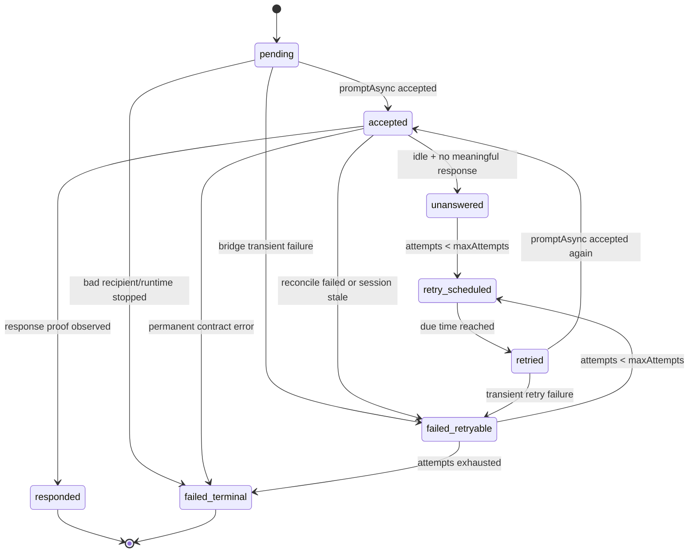

# OpenCode Delivery Ledger And Bounded Retry Plan

## Summary

Recommended implementation: add an OpenCode prompt-delivery ledger with explicit `accepted`, `responded`, `unanswered`, `retried`, and `failed` states, plus a bounded retry watchdog.

Goal: when the app delivers an inbox row into a live OpenCode teammate session, we stop treating `promptAsync()` acceptance as success. Acceptance only means the bridge accepted the prompt. A row is fully delivered only after OpenCode shows evidence that the teammate acted on it.

Expected implementation size:

- `claude_team`: 🎯 8   🛡️ 9   🧠 7 - roughly `950-1450` changed lines.
- `agent_teams_orchestrator`: 🎯 8   🛡️ 9   🧠 6 - roughly `500-850` changed lines.
- Tests and fixtures: 🎯 9   🛡️ 9   🧠 6 - roughly `750-1250` changed lines.

The plan is intentionally OpenCode-only. Native Codex, Claude, and Gemini teammate delivery paths stay unchanged.

## Why This Is Needed

Current OpenCode relay semantics are too optimistic:

1. `claude_team` writes an inbox row to `inboxes/<member>.json`.
2. `relayOpenCodeMemberInboxMessages()` sees the unread row.
3. It calls `deliverOpenCodeMemberMessage()`.
4. `OpenCodeTeamRuntimeAdapter.sendMessageToMember()` calls the orchestrator bridge.
5. `OpenCodeBridgeCommandHandler.runSendMessage()` calls `promptAsync()`.
6. The bridge returns `accepted: true`.
7. `claude_team` marks the inbox row `read: true`.

The problem: `accepted: true` only proves that OpenCode accepted a prompt into a session. It does not prove the model used tools, sent a visible message, touched a task, or even produced meaningful assistant text.

Observed failure mode from `beacon-desk-92121221`:

- Jack and Tom had task assignment rows marked read.
- The OpenCode sessions had received the app-delivery prompts.
- The transcript showed empty assistant turns after those prompts.
- The assigned tasks stayed `in_progress`.
- No comments, task events, or visible messages were produced.

That is a durable message-loss bug because the inbox row is already `read`, so normal retry logic has nothing left to pick up.

## Current Code Paths

### App-side OpenCode delivery

Primary files:

- `src/main/services/team/TeamProvisioningService.ts`
- `src/main/services/team/runtime/OpenCodeTeamRuntimeAdapter.ts`
- `src/main/services/team/opencode/bridge/OpenCodeBridgeCommandContract.ts`
- `src/main/ipc/teams.ts`
- `src/shared/types/team.ts`

Important current behavior:

```ts
// TeamProvisioningService.ts
const delivery = await this.deliverOpenCodeMemberMessage(teamName, {
  memberName,
  text: message.text,
  messageId: message.messageId,
  replyRecipient,
  actionMode,
  taskRefs,
});

if (delivery.delivered) {
  await this.markInboxMessagesRead(teamName, memberName, [message]);
}
```

`delivery.delivered` currently means bridge prompt acceptance. It should become "bridge accepted plus response proof exists" for OpenCode inbox relay completion.

### Deeper research findings

The highest-risk parts after code review are:

1. `promptAsync()` returns `Promise<void>`.
   It does not return the OpenCode user message id created by `/session/:id/prompt_async`, so v1 cannot rely on a prompt return value as proof. The response observer must use transcript reconcile.

2. `sendSessionMessage()` does return an `OpenCodeMessage`, but it is the synchronous `/session/:id/message` path with a long request timeout. It is a bad default for live app delivery because it can block UI/runtime relay behind model execution. It is useful as a future fallback, not the v1 delivery primitive.

3. `markInboxMessagesRead()` writes a separate JSON file from any new ledger file. There is no atomic cross-file commit. The ledger must represent "response observed, inbox read commit still pending" so crashes or mark-read failures do not cause duplicate prompts.

4. Controller inbox writes always create a `messageId` when one is missing. Task assignment notifications use `messageStore.buildMessage()`, so they have stable ids. That means the OpenCode prompt ledger can require `inboxMessageId` for every eligible OpenCode relay row.

5. OpenCode runtime stores are lane-scoped for secondary lanes. The prompt delivery ledger should be lane-scoped too, not only team-root scoped, because run id, session id, and manifest recovery are lane facts.

6. Existing `relayedMemberInboxMessageIds` is a native relay dedupe cache. It is not durable, it is not response-aware, and it should not be reused as the OpenCode delivery truth.

7. `opencode.sendMessage` in `OpenCodeReadinessBridge` is already a direct bridge command, not a state-changing command service call. The new observe command should follow this pattern. Do not route observe through `OpenCodeStateChangingBridgeCommandService`, because observe must not acquire state-changing command leases, write command-ledger entries, or commit runtime-store manifests.

8. State-changing bridge service is currently only for:

```ts
'opencode.launchTeam' | 'opencode.reconcileTeam' | 'opencode.stopTeam'
```

`opencode.observeMessageDelivery` must not be added to that union. It should be added only to the general bridge command contract and orchestrator supported-command dispatch.

9. `reconcileSession(record, { limit })` can miss old prompt history when a long OpenCode session has many later events. If the observer cannot find the inbound `messageId` or the `prePromptCursor` inside the limited transcript, it must do one wider/full-history reconcile before returning `prompt_not_indexed` or `empty_assistant_turn`.

10. Real OpenCode fixtures use canonical MCP tool ids like `agent-teams_message_send`, but tool names can also appear as `mcp__agent-teams__message_send` or, in lower-level proof paths, plain names such as `message_send`. The observer must normalize tool names before classifying response proof.

11. Real OpenCode fixtures also use normal tool names such as `bash` and `read` in lowercase. Execution-tool response proof must not only match Codex-style display names like `Bash`.

12. If the bridge command itself times out after the prompt may have been submitted, the app cannot know whether OpenCode accepted the prompt. Treat that as `failed_retryable` with `acceptanceUnknown: true`, and make the watchdog observe the transcript before sending any retry. Do not immediately send a duplicate retry after an acceptance-unknown timeout.

13. `messageStore` and renderer/feed services already understand `relayOfMessageId`, but the OpenCode MCP `message_send` schema does not expose it yet. Exposing the existing field is lower risk than inventing a new reply-id contract, and it gives the watchdog a non-heuristic visible-reply correlation signal.

### Orchestrator-side OpenCode bridge

Primary files:

- `/Users/belief/dev/projects/claude/agent_teams_orchestrator/src/services/opencode/OpenCodeBridgeCommandHandler.ts`
- `/Users/belief/dev/projects/claude/agent_teams_orchestrator/src/services/opencode/OpenCodeSessionBridge.ts`
- `/Users/belief/dev/projects/claude/agent_teams_orchestrator/src/services/opencode/OpenCodeEventTranslator.ts`
- `/Users/belief/dev/projects/claude/agent_teams_orchestrator/src/services/opencode/OpenCodeTranscriptProjector.ts`

Important current behavior:

```ts
await openCodeSessionBridge.promptAsync(record, {
  text: identityReminder ? `${identityReminder}\n\n${text}` : text,
  agent: asString(body.agent) ?? 'teammate',
  noReply: body.noReply === true,
});

const reconciled = await withTimeout(
  openCodeSessionBridge.reconcileSession(record, { limit: 50 }),
  OPENCODE_SEND_RECONCILE_TIMEOUT_MS,
);

return {
  accepted: true,
  sessionId: record.opencodeSessionId,
  memberName,
  runtimePid,
  diagnostics: reconcileDiagnostics,
};
```

This already does a post-accept reconcile, but it does not turn the reconcile summary into a response-proof contract.

### Transcript capabilities

`OpenCodeTranscriptProjector` already gives enough normalized fields:

```ts
export type OpenCodeCanonicalMessage = {
  id: string | null;
  parentId: string | null;
  role: 'user' | 'assistant' | 'system' | 'unknown';
  completedAt: number | null;
  text: string;
  reasoningText: string;
  previewText: string | null;
  partTypes: string[];
  toolCalls: OpenCodeCanonicalToolCall[];
  finishReason: string | null;
  hasError: boolean;
};
```

This is enough to classify a prompt outcome.

## Key Design Decision

### Recommended read semantics

Do not mark OpenCode member inbox rows `read: true` at `accepted`.

Mark them read only when the delivery ledger reaches a terminal success state:

- `responded` with a tool call that is sufficient for the message intent.
- `responded` with visible `agent-teams_message_send`.
- `responded` with a useful plain assistant answer, with diagnostic warning because visible UI capture may not happen.

Do not auto-mark `failed_terminal` rows read in v1. Keep them unread and surface diagnostics. A later product action can add explicit "ack failed delivery" behavior, but the delivery watchdog should not hide failed OpenCode prompts.

This is the safest model because `inboxes/<member>.json` remains the durable queue of uncommitted work.

### Options Considered

1. Recommended: keep row unread until response proof, ledger suppresses duplicate relays.
   🎯 9   🛡️ 9   🧠 6 - roughly `650-1050` lines total.
   This preserves durable queue truth and fixes the actual loss bug. The complexity is in preventing the file watcher from retrying immediately.

2. Mark row read at prompt acceptance, but use a separate retry ledger.
   🎯 7   🛡️ 7   🧠 5 - roughly `400-750` lines total.
   Easier to bolt on, but it keeps inbox truth dishonest. Recovery after app restart is harder because the original row no longer looks pending.

3. Make UI send block until OpenCode response proof.
   🎯 6   🛡️ 8   🧠 4 - roughly `250-450` lines total.
   Simpler conceptually, but bad UX and still incomplete for watcher-driven task assignment rows.

Use option 1.

## Ledger Model

Add a new OpenCode-specific prompt delivery ledger. Do not reuse `RuntimeDeliveryJournal`; that journal is for the opposite direction, where a runtime writes into canonical app destinations through `runtime_deliver_message`.

Recommended file for secondary OpenCode lanes:

```txt
<team>/.opencode-runtime/lanes/<encodeURIComponent(laneId)>/opencode-prompt-delivery-ledger.json
```

Recommended schema name:

```ts
'opencode.promptDeliveryLedger'
```

Add it to the runtime store manifest descriptors, schema-name validator, cross-store invariant input, and lane-scoped manifest recovery checks:

```ts
{
  schemaName: 'opencode.promptDeliveryLedger',
  schemaVersion: 1,
  relativePath: 'opencode-prompt-delivery-ledger.json',
  criticality: 'rebuildable_from_canonical_destination',
  owner: 'delivery',
  rebuildStrategy: 'verify_canonical_destinations',
}
```

Do not store secondary-lane prompt delivery truth in the team root `.opencode-runtime` directory. Use `getOpenCodeLaneScopedRuntimeFilePath()` and the lane manifest path from `getOpenCodeRuntimeManifestPath(teamsBasePath, teamName, laneId)`.

Reason: `activeRunId`, runtime session id, stale runtime detection, and durable launch evidence are lane scoped. A team-root ledger would make mixed launches harder to recover correctly after app restart or lane replacement.

Readiness impact:

- Prompt ledger corruption should not block OpenCode provider/model readiness.
- It should surface degraded diagnostics and force conservative observe-first reconstruction.
- Launch should not fail only because the prompt ledger is missing; unread inbox rows remain the canonical destination.

### Missing Or Quarantined Ledger Recovery

Because the ledger is `rebuildable_from_canonical_destination`, a missing ledger can be reconstructed from unread inbox rows. But reconstruction must be conservative.

If the ledger is missing/quarantined while OpenCode lane/session evidence exists:

1. Read unread OpenCode member inbox rows.
2. Create reconstructed records with `status: 'failed_retryable'`, `responseState: 'not_observed'`, and `acceptanceUnknown: true`.
3. Run `opencode.observeMessageDelivery` before sending any new prompt.
4. Only prompt if observation cannot find a delivered user prompt or response proof after the normal grace window.

Reason: app crash or file corruption may have happened after `promptAsync()` accepted but before the ledger persisted `accepted`. Rebuilding directly as `pending` and immediately prompting can duplicate messages.

If no active lane/session can be resolved, keep the reconstructed record `failed_retryable` with `opencode_runtime_not_active`; do not prompt until the runtime is live again.

### Record Shape

```ts
export type OpenCodePromptDeliveryStatus =
  | 'pending'
  | 'accepted'
  | 'responded'
  | 'unanswered'
  | 'retry_scheduled'
  | 'retried'
  | 'failed_retryable'
  | 'failed_terminal';

export type OpenCodePromptResponseState =
  | 'not_observed'
  | 'pending'
  | 'prompt_not_indexed'
  | 'responded_tool_call'
  | 'responded_visible_message'
  | 'responded_non_visible_tool'
  | 'responded_plain_text'
  | 'permission_blocked'
  | 'tool_error'
  | 'empty_assistant_turn'
  | 'session_stale'
  | 'session_error'
  | 'reconcile_failed';

export interface OpenCodePromptDeliveryLedgerRecord {
  id: string;
  teamName: string;
  memberName: string;
  laneId: string;
  runId: string | null;
  runtimeSessionId: string | null;
  inboxMessageId: string;
  inboxTimestamp: string;
  source: 'watcher' | 'ui-send' | 'manual' | 'watchdog';
  replyRecipient: string;
  actionMode: 'do' | 'ask' | 'delegate' | null;
  taskRefs: TaskRef[];
  payloadHash: string;
  status: OpenCodePromptDeliveryStatus;
  responseState: OpenCodePromptResponseState;
  attempts: number;
  maxAttempts: number;
  acceptanceUnknown: boolean;
  nextAttemptAt: string | null;
  lastAttemptAt: string | null;
  lastObservedAt: string | null;
  acceptedAt: string | null;
  respondedAt: string | null;
  failedAt: string | null;
  inboxReadCommittedAt: string | null;
  inboxReadCommitError: string | null;
  prePromptCursor: string | null;
  postPromptCursor: string | null;
  deliveredUserMessageId: string | null;
  observedAssistantMessageId: string | null;
  observedToolCallNames: string[];
  observedVisibleMessageId: string | null;
  visibleReplyMessageId: string | null;
  visibleReplyInbox: string | null;
  visibleReplyCorrelation:
    | 'relayOfMessageId'
    | 'direct_child_message_send'
    | 'plain_assistant_text'
    | null;
  lastReason: string | null;
  diagnostics: string[];
  createdAt: string;
  updatedAt: string;
}
```

### Stable Record ID

Use a stable deterministic ID:

```ts
sha256([
  'opencode-prompt-delivery-v1',
  teamName,
  memberName.toLowerCase(),
  laneId,
  inboxMessageId,
].join('\0'))
```

Do not use message text as the primary key. Two different messages can have identical text and both must be delivered.

Use `payloadHash` only as a safety check. If the same record ID appears with a different payload hash, mark `failed_terminal` and log a diagnostic because the inbox row identity is corrupt or reused.

Payload hash input should include:

- message text,
- summary,
- actionMode,
- taskRefs,
- replyRecipient,
- attachment metadata ids/filenames/mime types/sizes,
- source/from/to,
- conversation ids if present.

Do not hash attachment file bytes in v1. The watchdog needs stable delivery identity, not expensive file integrity checks.

### Runtime Identity Binding

The first delivery attempt must resolve and persist:

- `laneId`,
- `runId` if known,
- `runtimeSessionId` when available,
- `memberName` canonical casing,
- `providerId: 'opencode'`.

Retries and observations must use the ledger `laneId`, not recompute a new lane from current member config unless the ledger is being created for the first time.

If the member's current provider/model changes while a record is non-terminal:

- do not redirect the old OpenCode delivery to a new provider or lane,
- mark the record `failed_terminal` with `opencode_recipient_runtime_identity_changed`,
- leave the inbox row unread with diagnostics,
- let any new user message use the new provider path normally.

Reason: a retry belongs to the original runtime session that accepted or may have accepted the prompt. Re-resolving from mutable team config can deliver stale messages to the wrong runtime.

### Response Versus Inbox Commit

`responded` means OpenCode acted. It does not necessarily mean the inbox read flag was committed.

Track this separately:

```ts
status: 'responded',
inboxReadCommittedAt: null,
inboxReadCommitError: 'write failed'
```

Relay behavior for this state:

- Do not re-prompt.
- Retry only the `markInboxMessagesRead()` commit.
- Once read commit succeeds, set `inboxReadCommittedAt`.

This closes the crash window between observing a response and flipping `read: true`.

### Why Not Use `sendSessionMessage()` For v1

There is a tempting alternative: replace `promptAsync()` with synchronous `sendSessionMessage()` because it returns an `OpenCodeMessage`.

Options:

1. Recommended: keep `promptAsync()` plus observe-only reconcile.
   🎯 9   🛡️ 9   🧠 6 - roughly `550-950` lines total.
   It preserves non-blocking relay and gives durable response proof through the watchdog.

2. Use `sendSessionMessage()` for all OpenCode deliveries.
   🎯 5   🛡️ 6   🧠 4 - roughly `250-500` lines total.
   It may block up to the model execution timeout, couples UI send to model latency, and still needs transcript projection for tool side effects.

3. Hybrid: use `sendSessionMessage()` only for manual UI sends, keep `promptAsync()` for watcher deliveries.
   🎯 6   🛡️ 6   🧠 7 - roughly `450-800` lines total.
   It creates two delivery semantics and makes failures harder to reason about.

Use option 1.

## State Machine



Important semantics:

- `pending`: ledger row exists but no bridge attempt has completed.
- `accepted`: OpenCode accepted a prompt, but no meaningful response proof exists yet.
- `responded`: OpenCode acted. This is the only normal success state that commits the inbox row as read.
- `unanswered`: OpenCode became idle and the transcript has no meaningful response after the delivered user prompt.
- `retry_scheduled`: watchdog will retry after `nextAttemptAt`.
- `retried`: diagnostic state for audit; implementation can immediately move from `retry_scheduled` to `accepted` after the next attempt.
- `failed_retryable`: transient bridge/runtime issue.
- `failed_terminal`: no more retries or permanent error.

## Response Proof Contract

Add a pure response observer in the orchestrator:

```txt
/Users/belief/dev/projects/claude/agent_teams_orchestrator/src/services/opencode/OpenCodeDeliveryResponseObserver.ts
```

Suggested API:

```ts
export interface OpenCodeDeliveryResponseObservation {
  state:
    | 'pending'
    | 'responded_tool_call'
    | 'responded_visible_message'
    | 'responded_plain_text'
    | 'responded_non_visible_tool'
    | 'permission_blocked'
    | 'tool_error'
    | 'empty_assistant_turn'
    | 'not_observed'
    | 'prompt_not_indexed'
    | 'session_stale'
    | 'session_error'
    | 'reconcile_failed';
  deliveredUserMessageId: string | null;
  assistantMessageId: string | null;
  toolCallNames: string[];
  visibleMessageToolCallId: string | null;
  visibleReplyMessageId: string | null;
  visibleReplyCorrelation:
    | 'relayOfMessageId'
    | 'direct_child_message_send'
    | 'plain_assistant_text'
    | null;
  visibleReplyMissingRelayOfMessageId?: boolean;
  latestAssistantPreview: string | null;
  needsFullHistory?: boolean;
  reason: string | null;
}
```

### How To Identify The Delivered Prompt

The app-delivery prompt already embeds:

```txt
The inbound app messageId is "<messageId>"
```

Observer should:

1. Collect all `user` canonical messages whose text contains the exact inbound `messageId`.
2. Also pass `prePromptCursor`, usually the session record's `lastCanonicalCursor` before `promptAsync()`.
3. If exact `messageId` matches exist, treat them as attempts for the same logical delivery. A sufficient response to any matching attempt proves the delivery.
4. Use the newest exact `messageId` match only for pending/unanswered diagnostics when no matching attempt has sufficient response proof.
5. Fallback to the first `user` message after `prePromptCursor` only if exactly one candidate exists and the inbound `messageId` is missing from the indexed text.
6. If neither the exact `messageId` nor the `prePromptCursor` appears in the limited reconcile result, run one wider reconcile before classifying the prompt as missing.
7. Return `prompt_not_indexed` if the prompt is not yet visible in transcript and raw status is `busy` or `retry`.
8. Never use "latest user message" without either exact message-id match or a cursor-bounded unique candidate, because OpenCode sessions can contain bootstrap, briefing, assignment, comment, and retry prompts.

`prompt_not_indexed` is not a failure. It means OpenCode accepted the async prompt but `/session/:id/message` history has not caught up yet.

### Visible Reply Correlation Contract

The response observer should not rely on text/time heuristics to decide whether a visible OpenCode reply belongs to an app-delivered inbox row.

The app already has a durable message id for every relayable inbox row. The controller message store already persists `relayOfMessageId`. The missing piece is exposing it through the OpenCode-visible MCP `message_send` schema and teaching the runtime prompt to use it.

Recommended v1 contract:

- Extend `agent-teams_message_send` / `message_send` parameters with `relayOfMessageId?: string`.
- Preserve `relayOfMessageId` through the MCP server, controller `messages.sendMessage()`, and `messageStore.sendInboxMessage()`.
- In `buildOpenCodeRuntimeMessageText()`, instruct OpenCode replies to include:

```txt
source="runtime_delivery"
relayOfMessageId="<inbound app messageId>"
```

- If the message has `taskRefs`, still include those `taskRefs` exactly.
- Do not introduce a second field named `replyToMessageId` in v1. Use existing `relayOfMessageId` so renderer, feed services, and `TeamDataService` can share one correlation primitive.

Suggested prompt wording:

```txt
The inbound app messageId is "<messageId>".
When you reply with agent-teams_message_send, include source="runtime_delivery" and relayOfMessageId="<messageId>".
```

Strongest visible response proof is a canonical destination row where:

```ts
message.from === memberName
message.relayOfMessageId === inboxMessageId
message.source === 'runtime_delivery'
```

For the normal user-directed case, this row is in `inboxes/user.json`. If the reply target is a same-team teammate or lead, check that recipient's inbox file instead of assuming user inbox.

The transcript observer still matters because OpenCode can act with task tools or execution tools without creating a visible inbox message. But for visible replies, destination-store proof should outrank transcript-only proof because it proves the app actually received the reply, not only that OpenCode attempted a tool call.

Recommended proof priority for visible replies:

1. Destination row with matching `relayOfMessageId`.
2. Successful direct-child `message_send` tool call whose arguments include matching `relayOfMessageId`.
3. Successful direct-child `message_send` tool call without `relayOfMessageId`, accepted only as a fallback with diagnostic `visible_reply_missing_relayOfMessageId`.
4. Plain assistant text, accepted only as `responded_plain_text` with diagnostic because it may not appear in Messages UI.

Do not use `TeamDataService.linkPassiveUserReplySummaries()` or summary/time matching as OpenCode delivery proof. That method is useful for rendering passive duplicate summaries, but it is intentionally heuristic and should not decide inbox read commits.

### Visible Reply Semantic Sufficiency

Correlation proves that a reply belongs to a delivered message. It does not prove that the reply is useful.

For visible `message_send` replies, evaluate semantic sufficiency before read commit:

```ts
function isVisibleReplySemanticallySufficient(input: {
  actionMode: 'do' | 'ask' | 'delegate' | null;
  taskRefs: TaskRef[];
  text: string;
  summary?: string | null;
}): boolean
```

Rules:

- For `actionMode: 'ask'`, ack-only text such as `Понял`, `Ок`, `Understood`, `Got it`, `I'll check`, or `I'll do it` is not sufficient. The reply must contain an answer, a blocking question, or a concrete status/result.
- For no action mode and no task refs, use the same rule as `ask`.
- For `taskRefs.length > 0`, ack-only visible text alone is not sufficient unless there is also a successful task tool or execution tool. The goal is not just acknowledgement; the prompt delivery should produce task-side action or a concrete status.
- For `actionMode: 'do'`, ack-only visible text alone is not sufficient unless there is also successful task/execution proof.
- For `actionMode: 'delegate'`, a visible message is sufficient only if it names the delegated action, target, or status. Pure acknowledgement is not enough.

Ack-only detection must be intentionally narrow:

- Normalize whitespace and lowercase.
- Only treat as ack-only when the combined text/summary is short, for example under 120 characters.
- Match exact phrases or simple phrase prefixes from a small allow-reviewed list: `понял`, `ок`, `принял`, `сделаю`, `разберусь`, `understood`, `got it`, `ok`, `will do`, `I'll check`, `I'll take a look`.
- If the text contains a concrete blocker, question, result, file path, task id, error, number, code span, or more than one sentence of substance, treat it as sufficient.
- If uncertain, prefer sufficient and log `visible_reply_semantic_uncertain`. False retries are usually worse than accepting a borderline concrete status.

If a visible reply is correlated but semantically insufficient:

- keep the ledger `accepted`,
- set `responseState = 'responded_visible_message'`,
- set `lastReason = 'visible_reply_ack_only_still_requires_answer'`,
- do not mark the original OpenCode inbox row read,
- retry after grace with copy asking for a concrete answer/status, not just acknowledgement.

This is deliberately stricter than the controller-level idle/ack-only guard. The controller guard decides whether to persist a message. The watchdog read-commit policy decides whether that persisted message satisfies the delivered prompt.

### OpenCode Ack-Only Guard Tightening

Current controller logic treats any non-empty `source` as explicit delivery context for the idle/ack-only guard. That is too broad for OpenCode because a model can emit `source="runtime_delivery"` on a generic "Понял" / "Understood" message that is not tied to an app-delivered row.

For OpenCode senders, `hasExplicitDeliveryContext()` should treat a message as explicit delivery context only when at least one of these is true:

- `relayOfMessageId` is present and non-empty.
- `taskRefs` is present and non-empty.
- `attachments` is present and non-empty.
- `leadSessionId` is present for a real lead-session reply.
- Another future typed delivery context field is present.

`source="runtime_delivery"` alone is metadata, not proof. It should not bypass ack-only filtering unless it is paired with `relayOfMessageId` or task/action context.

This keeps the guard from dropping useful non-ack answers: a substantive answer with text still passes because the idle/ack-only detector only rejects ack/no-task/no-work phrases. The stricter context rule only affects OpenCode ack-only noise.

### Reconcile Limit Fallback

The first post-send reconcile should stay bounded for latency:

```ts
await reconcileSession(record, { limit: 80 });
```

But bounded history is not enough for durable watchdog observation. If `observeOpenCodeDeliveryResponse()` cannot find either:

- the exact inbound `messageId`, or
- the `prePromptCursor` that was captured before `promptAsync()`,

then `runObserveMessageDelivery()` must retry with a wider/full transcript once:

```ts
const limited = await reconcileSession(record, { limit: 80 });
const first = observeOpenCodeDeliveryResponse({ ...limited, prePromptCursor });

if (first.state === 'prompt_not_indexed' && first.needsFullHistory === true) {
  const full = await reconcileSession(record);
  return observeOpenCodeDeliveryResponse({ ...full, prePromptCursor });
}
```

Do not add this full-history fallback to every `sendMessage` call. Use it in watchdog/observe paths and only when the anchor is missing. UI send should stay latency bounded.

### What Counts As Responded

Use a direct child assistant message where:

```ts
assistant.parentId === deliveredUserMessage.id
```

There can be multiple assistant children for one delivered user prompt. Classify all children and choose the strongest successful response proof, not just the first or last child.

Classify as success if any of these are true:

1. Tool call exists:

```ts
assistant.toolCalls.length > 0
```

This is the strongest signal, but only after filtering tool calls.

Meaningful tool calls:

- `agent-teams_message_send`
- `mcp__agent-teams__message_send`
- `message_send`
- `agent-teams_task_*`
- `mcp__agent-teams__task_*`
- `task_*`
- normal execution tools when the prompt action mode is `do`, such as shell/edit/read tools, if exposed by OpenCode in canonical transcript

Non-meaningful tool calls for delivery proof:

- `runtime_bootstrap_checkin`
- `agent-teams_runtime_bootstrap_checkin`
- `mcp__agent-teams__runtime_bootstrap_checkin`
- `member_briefing`
- `agent-teams_member_briefing`
- `mcp__agent-teams__member_briefing`
- `runtime_heartbeat`
- `process_register`
- `process_list`

Reason: identity/bootstrap tools can be emitted because of the prepended reminder, not because the agent responded to the delivered message.

Tool-name normalization should happen before classification:

```ts
function normalizeToolName(name: string): string {
  return name
    .replace(/^mcp__agent-teams__/, '')
    .replace(/^agent-teams_/, '')
    .toLowerCase();
}
```

Then classify by normalized names:

- visible message tool: `message_send`
- task tools: `task_get`, `task_start`, `task_add_comment`, `task_complete`, and other `task_` names
- bootstrap tools: `runtime_bootstrap_checkin`, `member_briefing`, `runtime_heartbeat`, `process_register`, `process_list`
- execution tools for `actionMode: 'do'`: `bash`, `read`, `edit`, `write`, `grep`, `glob`, and OpenCode equivalents observed in fixtures

Real fixture coverage should include at least these observed names:

- `agent-teams_runtime_bootstrap_checkin`
- `agent-teams_member_briefing`
- `agent-teams_message_send`
- `agent-teams_task_get`
- `agent-teams_task_start`
- `agent-teams_task_add_comment`
- `agent-teams_task_complete`
- `bash`
- `read`

2. Visible team message tool call exists:

```ts
assistant.toolCalls.some((tool) =>
  normalizeToolName(tool.toolName) === 'message_send'
)
```

This should classify as `responded_visible_message`.

If the tool call arguments include `relayOfMessageId` matching the inbound inbox `messageId`, set `visibleReplyCorrelation = 'relayOfMessageId'`.

If the tool call is a direct child of the delivered prompt but lacks `relayOfMessageId`, still classify it as `responded_visible_message` in v1, but emit diagnostic `visible_reply_missing_relayOfMessageId`. This avoids losing a real answer during rollout while making the missing correlation visible in logs/tests.

3. Meaningful non-visible tool call exists:

This classifies as `responded_non_visible_tool`.

For task assignment prompts, this is enough to mark the message responded if the tool call is a task tool or execution tool. The delivery watchdog is proving that the prompt was noticed, not that the whole task is complete.

For direct user questions, non-visible tool activity is not always enough. A `read` or `bash` call can prove the model noticed the prompt, but it does not prove the user got an answer. The read-commit policy must use `actionMode` and `taskRefs`, not only `responseState`.

4. Non-empty assistant text exists:

```ts
assistant.text.trim().length > 0 || assistant.previewText?.trim()
```

This classifies as `responded_plain_text`, not ideal success. It prevents prompt spam when the model actually answered in plain text, but diagnostics should warn that the app may not show it as a normal team message.

Reasoning-only output is not a user-visible answer:

```ts
assistant.reasoningText.trim().length > 0 && assistant.text.trim().length === 0
```

Do not classify this as `responded_plain_text`. Treat it like no visible response unless a meaningful successful tool call exists.

5. Tool call exists but all meaningful calls are errored:

```ts
assistant.toolCalls.some((tool) => tool.isError)
```

This classifies as `tool_error`, not responded. Do not mark the inbox row read unless there is also a successful meaningful tool call or non-empty plain text.

6. Assistant error exists:

```ts
assistant.hasError === true
```

This is not success. It should map to `session_error` and `failed_retryable` or `failed_terminal` depending on error type.

7. Pending permission exists:

```ts
summary.pendingPermissionRequestIds.length > 0
```

This is `permission_blocked`. Do not retry automatically while blocked.

### What Counts As Unanswered

Classify as `empty_assistant_turn` if a direct assistant child exists but all are true:

```ts
assistant.toolCalls.length === 0
assistant.text.trim().length === 0
assistant.reasoningText.trim().length === 0
assistant.completedAt == null
assistant.finishReason == null
assistant.hasError === false
```

Classify as `pending` if:

- raw status is `busy` or `retry`, and no meaningful child exists yet.

Classify as `empty_assistant_turn` or `unanswered` if:

- raw status is `idle`.
- no meaningful child exists.
- no permission block exists.

Do not rely on `replyPendingSinceMessageId` from `OpenCodeEventTranslator` alone. It currently treats any child message as a reply, including the empty assistant-turn failure.

If the direct child contains only reasoning/step metadata and no visible text or meaningful successful tool call, treat it as unanswered for delivery-read purposes.

### Response Proof Priority

Use this classification order:

1. `session_stale` if reconcile outcome is stale.
2. `permission_blocked` if pending permissions exist.
3. `prompt_not_indexed` if the delivered prompt is not indexed yet and raw status is `busy` or `retry`.
4. `pending` if direct child has running tool calls or session status is `busy`/`retry`.
5. `responded_visible_message` if a successful visible message tool call exists.
6. `responded_non_visible_tool` if a successful meaningful non-visible tool call exists.
7. `responded_tool_call` only as a backward-compatible generic response if the implementation cannot distinguish visible vs non-visible tool classes.
8. `responded_plain_text` if non-empty assistant text exists.
9. `tool_error` if errored meaningful tool calls exist and no success signal exists.
10. `empty_assistant_turn` if direct assistant child is empty or session is idle with no child.

### Response Sufficiency Policy

`responseState` is observation. Inbox read commit is policy.

Use this policy:

| Message intent | Sufficient to commit read | Not sufficient by itself |
| --- | --- | --- |
| `taskRefs.length > 0` | semantically sufficient visible message, plain text with concrete status, successful task tool, successful execution tool | bootstrap/identity tools, errored tools, ack-only visible message with no task/execution proof |
| `actionMode: 'do'` | semantically sufficient visible message, plain text with concrete status, successful meaningful execution or task tool | bootstrap/identity tools, errored tools, ack-only visible message with no tool proof |
| `actionMode: 'delegate'` | visible message that names target/action/status, plain text with concrete status, successful task tool or `message_send` delegation/status | unrelated execution-only tool with no task/message effect, ack-only text |
| `actionMode: 'ask'` | visible message or plain text that contains an answer, blocking question, or concrete status | non-visible execution/task lookup only, ack-only text |
| no action mode and no task refs | visible message or plain text that contains an answer, blocking question, or concrete status | non-visible tool activity only, ack-only text |

This avoids the most dangerous false success: a user asks an OpenCode teammate a question, the model performs a `read`, then goes idle without sending any answer. That should stay pending or become retryable; it should not mark the inbox row read.

Before committing read for `responded_visible_message`, the app should prefer destination-store proof:

```ts
const visibleReply = await findVisibleReplyByRelayOfMessageId({
  teamName,
  replyRecipient,
  from: memberName,
  relayOfMessageId: inboxMessageId,
});
```

If destination proof exists, commit read even if the bounded transcript observation is still delayed. The MCP tool call already wrote the canonical app row, which is stronger than waiting for OpenCode transcript indexing.

If destination proof does not exist but transcript proof shows a successful direct-child `message_send`, keep the normal transcript-based policy and log `visible_reply_destination_not_found_yet`. Do not immediately retry; re-observe/re-scan once because inbox writes and transcript reconciliation can race in either direction.

If `responded_non_visible_tool` is not sufficient for the message intent:

- keep the ledger non-terminal as `accepted`,
- store `responseState: 'responded_non_visible_tool'`,
- set `lastReason: 'visible_reply_still_required'`,
- re-observe after a short delay,
- after grace, retry with copy asking for a visible `agent-teams_message_send` or plain answer.

## Bridge Contract Extension

Extend both sides of the OpenCode bridge:

```ts
export interface OpenCodeSendMessageCommandData {
  accepted: boolean;
  sessionId?: string;
  memberName: string;
  runtimePid?: number;
  prePromptCursor?: string | null;
  responseObservation?: OpenCodeDeliveryResponseObservation;
  diagnostics: OpenCodeTeamBridgeDiagnostic[];
}
```

Orchestrator `runSendMessage()` should still return `accepted: true` after `promptAsync()` succeeds, even if response observation is pending or unanswered.

Reason: acceptance and response are different facts. The bridge should not turn post-accept reconcile weakness into a prompt delivery failure.

### Add Observe-Only Bridge Command

The watchdog must be able to inspect a previous accepted prompt without sending a new prompt.

Add a new command:

```ts
export interface OpenCodeObserveMessageDeliveryCommandBody {
  runId?: string;
  laneId: string;
  teamId: string;
  teamName: string;
  projectPath: string;
  memberName: string;
  messageId: string;
  prePromptCursor?: string | null;
}

export interface OpenCodeObserveMessageDeliveryCommandData {
  observed: boolean;
  sessionId?: string;
  memberName: string;
  runtimePid?: number;
  responseObservation: OpenCodeDeliveryResponseObservation;
  diagnostics: OpenCodeTeamBridgeDiagnostic[];
}
```

Recommended command name:

```txt
opencode.observeMessageDelivery
```

Why this is required:

- Calling `opencode.sendMessage` for "check before retry" would create a duplicate prompt.
- `claude_team` does not have direct OpenCode transcript access.
- The orchestrator already owns session records, stale-session detection, host access, and transcript projection.

`observeMessageDelivery` should run the same runtime/session validation as `sendMessage` except it must not call `promptAsync()`.
This is intentionally not an app-side state-changing bridge command.

It is acceptable to reuse the orchestrator-side runtime precondition validator even if the current helper name includes "StateChanging". The hard boundary is app-side command execution: observe must not use the state-changing command service or its command ledger.

Concrete bridge wiring:

- Add `opencode.observeMessageDelivery` to `OpenCodeBridgeCommandName` and `VALID_COMMANDS` in `OpenCodeBridgeCommandContract.ts`.
- Add it to orchestrator `SUPPORTED_COMMANDS` and the dispatch switch in `OpenCodeBridgeCommandHandler.ts`.
- Add `observeOpenCodeTeamMessageDelivery()` to `OpenCodeReadinessBridge`.
- Add `observeMessageDelivery()` to `OpenCodeTeamRuntimeAdapter` and the bridge port type.
- Use direct `this.bridge.execute('opencode.observeMessageDelivery', ...)`, matching current `sendOpenCodeTeamMessage()`.
- Do not add it to `OpenCodeStateChangingTeamCommandName`.
- Do not route it through `OpenCodeStateChangingBridgeCommandService`.
- Do not create command-ledger entries or runtime-store manifest commits for observe.
- Use a short observe timeout separate from send timeout, for example `OPENCODE_OBSERVE_MESSAGE_TIMEOUT_MS = 8_000`.

Reason: observe is read-only from the app perspective. It reconciles an existing OpenCode session and returns response evidence. Treating it as a state-changing command would add lease/idempotency behavior intended for launch/reconcile/stop and would create failure modes unrelated to delivery observation.

Clarification: `reconcileSession()` may still update the orchestrator's own session record, for example stale flags or last cursor. That is acceptable. The constraint is that the app bridge must not treat observe as a launch/reconcile/stop command and must not commit app runtime-store manifests for it.

Implementation sketch:

```ts
async function runObserveMessageDelivery(envelope: BridgeEnvelope) {
  const record = await openCodeSessionStore.get(teamId, laneId, memberName);
  const limited = await openCodeSessionBridge.reconcileSession(record, { limit: 80 });
  let responseObservation = observeOpenCodeDeliveryResponse({
    inboundMessageId: messageId,
    prePromptCursor,
    summary: limited.summary,
  });
  if (responseObservation.needsFullHistory === true) {
    const full = await openCodeSessionBridge.reconcileSession(record);
    responseObservation = observeOpenCodeDeliveryResponse({
      inboundMessageId: messageId,
      prePromptCursor,
      summary: full.summary,
    });
  }
  return { snapshot, data: { observed: true, responseObservation, ... } };
}
```

Watchdog flow must be:

1. Observe existing prompt.
2. If response is now proven, commit read.
3. If pending or blocked, wait.
4. If unanswered and retry due, send a retry prompt.

Never retry first and observe second.

## Retry Policy

Recommended defaults:

```ts
const OPENCODE_PROMPT_DELIVERY_MAX_ATTEMPTS = 3;
const OPENCODE_PROMPT_DELIVERY_RETRY_DELAYS_MS = [30_000, 90_000, 180_000];
const OPENCODE_PROMPT_RESPONSE_GRACE_MS = 20_000;
const OPENCODE_PROMPT_RESPONSE_GRACE_FOR_TASK_MS = 45_000;
const OPENCODE_PROMPT_WATCHDOG_SCAN_MS = 15_000;
```

Rules:

1. UI send gets one immediate bridge attempt.
2. Watcher delivery gets one immediate bridge attempt.
3. Watchdog always calls `opencode.observeMessageDelivery` before deciding to retry.
4. If OpenCode is `busy` or `retry`, keep the record `accepted` or `pending` and scan later.
5. If OpenCode is `idle` with empty/no response after grace period, mark `unanswered`.
6. Schedule retry if attempts remain.
7. Retry prompt should include a short retry header:

```txt
<opencode_delivery_retry>
Previous app message delivery was accepted by OpenCode but no action was observed.
Retry attempt 2/3 for inbound app messageId "<messageId>".
If you already acted on this message, do not duplicate work; send a concrete status via agent-teams_message_send with relayOfMessageId="<messageId>" or update the related task. Do not reply only with acknowledgement.
</opencode_delivery_retry>
```

For direct `ask` messages where OpenCode already used non-visible tools but did not answer visibly, use a different header:

```txt
<opencode_delivery_retry>
Previous app message delivery was noticed, but no visible answer was observed.
Retry attempt 2/3 for inbound app messageId "<messageId>".
Please reply with agent-teams_message_send to "<replyRecipient>" and include relayOfMessageId="<messageId>". If that tool is unavailable, provide a concise plain-text answer. Do not repeat tool work unless needed and do not reply only with acknowledgement.
</opencode_delivery_retry>
```

8. After attempts are exhausted, mark `failed_terminal`.

### Acceptance-Unknown Bridge Failures

Some failures happen at the command boundary after the prompt may already have reached OpenCode. Example: the app bridge times out while the orchestrator is still inside or just after `promptAsync()`.

For these cases:

- Create or update the ledger record as `failed_retryable`.
- Set `acceptanceUnknown: true`.
- Store `responseState: 'not_observed'` and the bridge timeout diagnostic.
- The next watchdog action must be `opencode.observeMessageDelivery`.
- Only retry the prompt if observe finds no matching delivered user prompt or meaningful response after the normal grace window.

Do not immediately retry acceptance-unknown failures. That would turn a transport timeout into duplicate user prompts.

### UI Timeout Is Not Delivery Failure

The current IPC send path wraps OpenCode live relay in a short UI timeout. That timeout protects the renderer, but it does not necessarily cancel the underlying relay promise. The relay may still accept the prompt and update the ledger after the UI receives a timeout-shaped result.

Therefore:

- `OPENCODE_RUNTIME_DELIVERY_UI_TIMEOUT_MS` should produce `runtimeDelivery.responsePending = true`, not a terminal failed delivery.
- The ledger record should be left `pending` or `failed_retryable` with `acceptanceUnknown: true`.
- The watchdog must observe before any retry.
- The UI copy should say that live delivery is still being checked, not that the message definitively failed.
- If the underlying relay later records response proof, normal read commit should complete.

Suggested reason code:

```ts
'opencode_runtime_delivery_ui_timeout_pending'
```

Do not reuse the old hard-failure copy for this state.

### Retry Eligibility Matrix

| Observation state | Retry? | Commit inbox read? | Notes |
| --- | --- | --- | --- |
| `responded_tool_call` | Depends | Depends | Generic responded state, prefer more specific visible/non-visible states when possible. Apply response sufficiency policy. |
| `responded_visible_message` | Depends | Depends | Commit only when correlated and semantically sufficient for the message intent. Ack-only visible replies can require retry. |
| `responded_non_visible_tool` | Depends | Depends | Commit for task/do/delegate when sufficient. For ask/direct questions, require visible/plain reply. |
| `responded_plain_text` | No | Yes | Warn because app Messages may not show it as normal teammate reply. |
| `permission_blocked` | No | No | Wait for permission resolution. |
| `prompt_not_indexed` | No | No | Re-observe after short delay. |
| `pending` | No | No | Re-observe after short delay. |
| `empty_assistant_turn` | Yes, if due | No | Core retry path. |
| `tool_error` | Yes, if retryable | No | Retry only after grace and bounded attempts. |
| `session_stale` | Not immediately | No | Require lane/session recovery first. |
| `reconcile_failed` | Yes, if retryable | No | Prefer observe retry before prompt retry. |
| `not_observed` with `acceptanceUnknown` | Observe first | No | Never retry prompt before transcript observation. |

## Single Outstanding Delivery Per OpenCode Member

This is important.

Current relay processes up to 10 unread rows per member in one loop. For OpenCode, that can hammer a model session with multiple prompts before it has acted on the first one. That increases the chance of empty turns, ignored tasks, or responses to the wrong prompt.

Recommended v1 behavior:

- For OpenCode members, process only the oldest eligible unread row if there is no active non-terminal ledger record for that member.
- If a record is `accepted`, `pending`, `unanswered` with future `nextAttemptAt`, or `retry_scheduled`, do not relay newer rows for that member yet.
- Once the active record becomes `responded` or `failed_terminal`, the next scan can pick the next inbox row.
- Rows with `failed_terminal` ledger records stay unread for visibility, but automatic relay selection must skip them unless the user explicitly retries that failed message.

This is not required for native teammates because native runtimes already consume inbox files directly and have their own event loops.

### Required Serialization

Use one per-member OpenCode delivery mutex for all entry points:

- inbox file watcher relay,
- UI send relay,
- manual relay,
- watchdog observe/retry,
- startup recovery.

The existing `openCodeMemberInboxRelayInFlight` pattern is the right shape, but v1 must ensure the watchdog also goes through the same per-member gate. Do not create a second independent watchdog path that can race the relay path.

The mutex should cover:

1. reading inbox rows,
2. checking active ledger state,
3. creating or resuming a ledger record,
4. deciding whether a bridge call is allowed,
5. applying the bridge result or observation.

Do not hold an inbox file lock across a bridge call. The durable guard is the ledger record, written before the bridge call. The in-memory per-member mutex prevents duplicate bridge calls inside one app process.

Lock ordering:

1. Acquire per-member in-memory delivery gate.
2. Mutate ledger with `VersionedJsonStore.updateLocked()`, then release ledger file lock.
3. Call bridge if needed, with no inbox or ledger file lock held.
4. Mutate ledger with result/observation, then release ledger file lock.
5. If read commit is allowed, call `markInboxMessagesRead()` with inbox lock.
6. Mutate ledger to record `inboxReadCommittedAt` or `inboxReadCommitError`.

Never hold ledger and inbox file locks at the same time. This keeps the watchdog compatible with existing inbox writer/reader paths and avoids lock inversion.

If another call arrives with `onlyMessageId` while a different message is active:

- wait for the existing per-member work to finish,
- re-read the ledger and inbox,
- return queued/pending for the new message if it is still unread,
- do not report the new message as delivered just because the older in-flight relay finished.

### Active Record Definition

A record blocks newer OpenCode inbox rows for the same member if:

```ts
record.status !== 'responded' &&
record.status !== 'failed_terminal'
```

or if:

```ts
record.status === 'responded' && record.inboxReadCommittedAt == null
```

The second case blocks newer rows only until the read commit is retried. It should not send another prompt.

### Failed Terminal Rows

`failed_terminal` is terminal for automatic delivery attempts, not for user visibility.

Rules:

- Do not mark the inbox row read automatically.
- Do not select that row again in normal oldest-unread relay scans.
- Do not let that row block newer unread rows for the same member.
- Show diagnostics on the member/card/message surface.
- Allow a future explicit manual retry action to reset the ledger record or create a new attempt.

This avoids both bad outcomes: hiding a failed message by marking it read, or permanently blocking the member queue behind a failed unread row.

### UI Send Exception

If the user sends a direct UI message to a member while an older OpenCode delivery is active:

Recommended v1 behavior:

- Persist the new inbox row as usual.
- Return `runtimeDelivery.responsePending = true`.
- Do not bypass the active record and send the new prompt immediately.
- Show copy like `Message saved. OpenCode is still processing an earlier delivery.`

Reason: letting UI sends bypass the ordering rule can reintroduce the same prompt collision that caused lost task assignments.

## App-Side Relay Changes

### New Service

Add:

```txt
src/main/services/team/opencode/delivery/OpenCodePromptDeliveryLedger.ts
```

Responsibilities:

- Create or read records by `teamName/memberName/laneId/inboxMessageId`.
- Enforce payload hash consistency.
- Transition records with validation.
- List due retry records.
- List active member records.
- Prune terminal records older than a retention window.
- Use `VersionedJsonStore.updateLocked()` for every mutation.

Suggested retention:

```ts
const RESPONDED_RETENTION_MS = 7 * 24 * 60 * 60 * 1000;
const FAILED_RETENTION_MS = 30 * 24 * 60 * 60 * 1000;
```

### Ledger API Surface

Recommended methods:

```ts
interface OpenCodePromptDeliveryLedgerStore {
  ensurePending(input: EnsurePromptDeliveryInput): Promise<OpenCodePromptDeliveryLedgerRecord>;
  getByInboxMessage(input: DeliveryRecordKeyInput): Promise<OpenCodePromptDeliveryLedgerRecord | null>;
  getActiveForMember(input: { teamName: string; laneId: string; memberName: string }): Promise<OpenCodePromptDeliveryLedgerRecord | null>;
  listDue(input: { teamName?: string; now: Date; limit: number }): Promise<OpenCodePromptDeliveryLedgerRecord[]>;
  markAccepted(input: MarkAcceptedInput): Promise<OpenCodePromptDeliveryLedgerRecord>;
  applyObservation(input: ApplyObservationInput): Promise<OpenCodePromptDeliveryLedgerRecord>;
  applyDestinationProof(input: ApplyDestinationProofInput): Promise<OpenCodePromptDeliveryLedgerRecord>;
  markRetryScheduled(input: MarkRetryScheduledInput): Promise<OpenCodePromptDeliveryLedgerRecord>;
  markRetryAttempted(input: MarkRetryAttemptedInput): Promise<OpenCodePromptDeliveryLedgerRecord>;
  markInboxReadCommitted(input: { id: string; committedAt: string }): Promise<OpenCodePromptDeliveryLedgerRecord>;
  markInboxReadCommitFailed(input: { id: string; error: string }): Promise<OpenCodePromptDeliveryLedgerRecord>;
  markFailed(input: MarkFailedInput): Promise<OpenCodePromptDeliveryLedgerRecord>;
}
```

Suggested destination proof input:

```ts
interface ApplyDestinationProofInput {
  id: string;
  visibleReplyInbox: string;
  visibleReplyMessageId: string;
  visibleReplyCorrelation: 'relayOfMessageId';
  visibleReplyText: string;
  visibleReplySummary?: string | null;
  semanticallySufficient: boolean;
  observedAt: string;
}
```

`applyObservation()` must be idempotent. Re-observing a previously responded record must not change attempts or schedule another prompt.

`applyDestinationProof()` must also be idempotent. It should set `responseState = 'responded_visible_message'` and visible-reply fields without incrementing attempts. It should set `status = 'responded'` and `respondedAt` only when `semanticallySufficient === true`; otherwise keep the delivery non-terminal and set `lastReason = 'visible_reply_ack_only_still_requires_answer'`.

Implementation constraints:

- Use the existing `RuntimeDeliveryJournalStore` style as a template, but do not copy its `begin()` attempt semantics blindly.
- `ensurePending()` must not increment `attempts` when a duplicate watcher event sees the same pending or accepted record.
- Increment `attempts` only when a new prompt attempt is actually about to be sent.
- `markRetryAttempted()` should be the only normal transition that increments attempts after the initial attempt.
- Validate duplicate ids on read, like `RuntimeDeliveryJournalStore` does.
- A payload hash conflict is terminal for that record and must not send a prompt.
- Ledger mutation methods should return the updated record so relay/watchdog code never reasons from stale in-memory copies.

### TeamProvisioningService Relay Flow

Current simplified flow:

```ts
for (const message of unread.slice(0, 10)) {
  const delivery = await deliverOpenCodeMemberMessage(...);
  if (delivery.delivered) {
    await markInboxMessagesRead(...);
  }
}
```

New flow:

```ts
const active = await promptDeliveryLedger.getActiveForMember(teamName, memberName);
if (active && !isDueForRetry(active, now)) {
  return {
    relayed: 0,
    attempted: 0,
    delivered: 0,
    failed: 0,
    lastDelivery: {
      delivered: true,
      responsePending: true,
      reason: 'opencode_delivery_response_pending',
    },
  };
}

const message = selectOldestEligibleUnreadMessage(...);
let record = await promptDeliveryLedger.ensurePending(...);

const delivery = await deliverOpenCodeMemberMessage(...);
record = await promptDeliveryLedger.applyDeliveryResult(record.id, delivery);

const visibleReply = await findOpenCodeVisibleReplyByRelayOfMessageId({
  teamName,
  replyRecipient: record.replyRecipient,
  from: memberName,
  relayOfMessageId: record.inboxMessageId,
});

if (visibleReply) {
  record = await promptDeliveryLedger.applyDestinationProof({
    id: record.id,
    visibleReplyInbox: visibleReply.inboxName,
    visibleReplyMessageId: visibleReply.messageId,
    visibleReplyText: visibleReply.text,
    visibleReplySummary: visibleReply.summary,
    visibleReplyCorrelation: 'relayOfMessageId',
    semanticallySufficient: isVisibleReplySemanticallySufficient({
      actionMode: record.actionMode,
      taskRefs: record.taskRefs,
      text: visibleReply.text,
      summary: visibleReply.summary,
    }),
    observedAt: new Date().toISOString(),
  });
}

if (isOpenCodeDeliveryReadCommitAllowed(delivery, record)) {
  await markInboxMessagesRead(teamName, memberName, [message]);
  await promptDeliveryLedger.markInboxReadCommitted(...);
}
```

`selectOldestEligibleUnreadMessage()` must skip unread rows whose ledger record is `failed_terminal`, unless `options.onlyMessageId` explicitly targets that message for a manual retry path.

`isOpenCodeDeliveryReadCommitAllowed()` should return true for:

- semantically sufficient visible response: `responded_visible_message`,
- plain assistant text: `responded_plain_text`,
- generic `responded_tool_call` only when it can be classified as sufficient for the message intent,
- non-visible tool activity only when `actionMode`/`taskRefs` make that sufficient.

It should return false for:

- `responded_non_visible_tool` on direct `ask` messages without task refs,
- `tool_error`,
- bootstrap/identity-only tools,
- `pending`,
- `prompt_not_indexed`,
- `empty_assistant_turn`,
- `reconcile_failed`,
- `session_stale`.

Destination proof helper:

```ts
async function findOpenCodeVisibleReplyByRelayOfMessageId(input: {
  teamName: string;
  replyRecipient: string;
  from: string;
  relayOfMessageId: string;
}): Promise<{
  inboxName: string;
  messageId: string;
  timestamp: string;
  text: string;
  summary: string | null;
} | null>
```

Rules:

- For `replyRecipient === 'user'`, read `inboxes/user.json`.
- For lead aliases, resolve to the configured lead inbox name.
- For same-team teammate recipients, resolve to that teammate inbox name.
- Require exact `from` match after member-name canonicalization.
- Require exact `relayOfMessageId` match.
- Prefer a row with `source === 'runtime_delivery'`, but allow missing source only as fallback with diagnostic `visible_reply_missing_runtime_delivery_source`.
- Do not match by text, summary, timestamp, or task display id.

If destination proof appears after the first bridge response observation, the next watchdog scan should mark the delivery `responded`, commit the original OpenCode recipient row read, and not send another prompt.

`applyDeliveryResult()` must persist:

- `acceptedAt` when bridge accepted.
- `prePromptCursor` returned by the orchestrator.
- `runtimeSessionId` and `runtimePid` if present.
- `acceptanceUnknown` when a command-boundary timeout means prompt acceptance cannot be proven.
- `responseState`, `deliveredUserMessageId`, `observedAssistantMessageId`, and `observedToolCallNames` when observation is available.
- `visibleReplyMessageId`, `visibleReplyInbox`, and `visibleReplyCorrelation` when destination-store proof exists.

If `delivery.responseState` is already `responded_*` but `markInboxMessagesRead()` fails, the relay must not treat that as prompt failure. It should store `inboxReadCommitError` and retry the read commit on the next scan.

If an unread row already has a ledger record with `status: 'responded'` and `inboxReadCommittedAt: null`, relay should only retry `markInboxMessagesRead()`.

### Delivery Result Shape

Extend internal delivery result:

```ts
interface OpenCodeMemberInboxDelivery {
  delivered: boolean;          // bridge accepted or full response? See below.
  accepted?: boolean;
  responsePending?: boolean;
  responseState?: OpenCodePromptResponseState;
  ledgerStatus?: OpenCodePromptDeliveryStatus;
  acceptanceUnknown?: boolean;
  visibleReplyMessageId?: string;
  visibleReplyCorrelation?: 'relayOfMessageId' | 'direct_child_message_send' | 'plain_assistant_text';
  queuedBehindMessageId?: string;
  reason?: string;
  diagnostics?: string[];
}
```

For internal relay completion:

- `accepted: true`, `responsePending: true`, `delivered: true` is acceptable for UI feedback, but must not mark row read.
- `responseState: responded_*`, `delivered: true`, `responsePending: false` commits read.
- `delivered: false` means prompt acceptance failed.

For `SendMessageResult.runtimeDelivery`, keep backward compatibility:

```ts
runtimeDelivery: {
  providerId: 'opencode',
  attempted: true,
  delivered: accepted,
  responsePending: observation is not responded,
  responseState,
  ledgerStatus,
  acceptanceUnknown,
  visibleReplyMessageId,
  visibleReplyCorrelation,
  queuedBehindMessageId,
  reason,
  diagnostics,
}
```

This avoids making UI send look like a hard failure when OpenCode accepted the message but has not responded yet.

## Watchdog Scheduling

Add a lightweight app-side scheduler:

```txt
src/main/services/team/opencode/delivery/OpenCodePromptDeliveryWatchdog.ts
```

Responsibilities:

- Wake after inbox relay creates `accepted`, `unanswered`, or `retry_scheduled`.
- On app startup or team activation, scan due records.
- For each due record, first call the observe-only bridge path.
- If observe shows response proof, commit the inbox row read.
- If observe shows pending/blocked, reschedule without prompt retry.
- If observe shows unanswered and retry is due, call back into `TeamProvisioningService.relayOpenCodeMemberInboxMessages(teamName, memberName, { onlyMessageId, source: 'watchdog' })`.
- Cap concurrency globally and per member.
- Use the same per-member OpenCode delivery gate as relay, not a separate parallel executor for the same member.

Recommended caps:

```ts
const OPENCODE_PROMPT_WATCHDOG_GLOBAL_CONCURRENCY = 2;
const OPENCODE_PROMPT_WATCHDOG_PER_TEAM_CONCURRENCY = 1;
```

Do not use a tight interval. Use:

- a delayed timer for the nearest `nextAttemptAt`,
- plus opportunistic scans on inbox watcher events,
- plus app/team startup recovery.

### Startup Recovery Algorithm

On app startup or when a team detail view becomes active:

1. Read OpenCode lane index.
2. For each active lane, read lane-scoped prompt delivery ledger.
3. For each `responded` record with `inboxReadCommittedAt === null`, retry only `markInboxMessagesRead()`.
4. For each `accepted` or `retry_scheduled` record, call `opencode.observeMessageDelivery`.
5. For each due `unanswered` record, observe first, then retry only if still unanswered.
6. For missing/quarantined prompt ledger files, reconstruct unread inbox rows as `acceptanceUnknown` and observe before prompt.
7. Ignore records whose lane is no longer active unless the row is still unread and the team is running. In that case classify as `failed_retryable` with `opencode_runtime_not_active`.

Recovery must group work by `(teamName, laneId, memberName)` and run each group through the per-member gate. Do not let startup recovery observe/retry a member while the inbox watcher is also relaying that member.

This avoids retrying stale prompts immediately after app restart.

## Orchestrator Response Observer

### New Pure Helper

Add:

```txt
/Users/belief/dev/projects/claude/agent_teams_orchestrator/src/services/opencode/OpenCodeDeliveryResponseObserver.ts
```

Example:

```ts
export function observeOpenCodeDeliveryResponse(input: {
  inboundMessageId: string | null;
  prePromptCursor: string | null;
  summary: OpenCodeSessionReconcileSummary;
}): OpenCodeDeliveryResponseObservation {
  if (input.summary.reconcileOutcome === 'stale') {
    return { state: 'session_stale', ... };
  }

  if (input.summary.pendingPermissionRequestIds.length > 0) {
    return { state: 'permission_blocked', ... };
  }

  const deliveryAttempts = findDeliveredUserMessageAttempts(
    input.summary.messages,
    input.inboundMessageId,
    input.prePromptCursor,
  );
  if (deliveryAttempts.length === 0) {
    return input.summary.rawStatus === 'busy' || input.summary.rawStatus === 'retry'
      ? { state: 'pending', ... }
      : { state: 'empty_assistant_turn', reason: 'delivered_user_message_not_found', ... };
  }

  const attemptChildren = deliveryAttempts.map((attempt) => ({
    deliveredUser: attempt,
    assistantChildren: input.summary.messages.filter(
      (message) => message.role === 'assistant' && message.parentId === attempt.id
    ),
  }));

  return classifyDeliveryAttempts(attemptChildren, input.summary.rawStatus);
}
```

Keep this helper pure so fixture tests are cheap and deterministic.

### Bridge Integration

Update `runSendMessage()`:

```ts
const inboundMessageId = asString(body.messageId);
const prePromptCursor = record.lastCanonicalCursor ?? null;

await openCodeSessionBridge.promptAsync(...);

let responseObservation: OpenCodeDeliveryResponseObservation = {
  state: 'pending',
  ...
};

try {
  const reconciled = await withTimeout(...);
  responseObservation = observeOpenCodeDeliveryResponse({
    inboundMessageId,
    prePromptCursor,
    summary: reconciled.summary,
  });
} catch (error) {
  responseObservation = {
    state: 'reconcile_failed',
    reason: stringifyError(error),
    ...
  };
}

return {
  accepted: true,
  prePromptCursor,
  responseObservation,
  ...
};
```

The app ledger must persist the returned `prePromptCursor` with the delivery record. If the bridge cannot return it because the command failed before loading a session record, store `null` and rely only on exact `messageId` matching.

## UI Semantics

UI should not synthesize replies.

For user sends to OpenCode:

- If inbox persistence succeeds and bridge acceptance fails: show warning as today.
- If bridge acceptance succeeds but response is pending: show a non-blocking warning/info:

```txt
Message delivered to OpenCode. Waiting for teammate response...
```

- If watchdog later marks `failed_terminal`: surface diagnostic in team warning area or member card, not as a fake message from the teammate.

Add fields to `SendMessageResult.runtimeDelivery`:

```ts
responsePending?: boolean;
responseState?: OpenCodePromptResponseState;
ledgerStatus?: OpenCodePromptDeliveryStatus;
acceptanceUnknown?: boolean;
visibleReplyMessageId?: string;
visibleReplyCorrelation?: 'relayOfMessageId' | 'direct_child_message_send' | 'plain_assistant_text';
queuedBehindMessageId?: string;
```

Renderer store should continue to return the `SendMessageResult` and only rethrow real send failures.

Important current UI detail:

- The renderer inserts an optimistic copy of the user's sent message with `read: true` in the sender-side message feed.
- That is separate from the recipient's inbox row and should not be changed by the OpenCode prompt ledger.
- The ledger controls only `inboxes/<opencode-member>.json` read commit.

Warning copy should distinguish three cases:

1. Bridge failed:

```txt
OpenCode runtime delivery failed: <reason>. Message was saved to inbox.
```

2. UI timeout while delivery is still being checked:

```txt
OpenCode delivery is still being checked. Message was saved and will be observed before retry.
```

3. Bridge accepted but response pending:

```txt
Message delivered to OpenCode. Waiting for teammate response...
```

4. Message queued behind older OpenCode delivery:

```txt
Message saved. OpenCode is still processing an earlier delivery.
```

5. Previous OpenCode delivery exhausted retries:

```txt
OpenCode did not respond after retries. Message is still unread and will not be retried automatically.
```

Renderer pending-reply behavior:

- Keep the recipient in a pending state for `responsePending: true`.
- Clear pending when a real message from that member appears in `inboxes/user.json`.
- Clear pending when runtime delivery fails terminally.
- Do not clear pending merely because `delivered: true`; for OpenCode that can mean prompt accepted, not teammate answered.

## Task Assignment Integration

Task assignment notifications are the highest-risk OpenCode path because they are often watcher-driven, not UI-driven.

Required behavior:

- Assignment inbox rows must include `taskRefs`.
- OpenCode delivery prompt already includes taskRefs when present.
- Watchdog response proof for task rows accepts task MCP tool calls as success.
- Direct user `ask` rows should not be closed by a non-visible tool call alone; they need visible message or plain assistant text.
- If OpenCode sends a visible message saying blocked or busy with concrete blocker/status, classify as responded and mark read.
- If OpenCode does nothing, retry bounded.

Already fixed in controller during research:

- `agent-teams-controller/src/internal/tasks.js` now includes the assigned task as a structured `taskRefs` item in owner assignment notifications.
- Test added: `includes the assigned task ref in owner assignment notifications`.

This should be part of the final implementation baseline.

### Delivery Watchdog Is Not A Task Stall Monitor

The delivery ledger should answer only one question:

```txt
Did OpenCode notice and act on this delivered inbox row?
```

It should not try to prove:

- the task is complete,
- the implementation is correct,
- the teammate is making enough progress after the first action.

If an agent responds to an assignment by calling `task_get` or `task_start`, the delivery should be considered responded. If the task later stalls, that belongs to the task stall monitor or a separate OpenCode task-progress watchdog.

This boundary avoids turning message delivery into a broad autonomous task supervisor.

Do not enable or rewrite the global task-stall monitor as part of this v1. It is a separate product behavior with different thresholds, recipients, and false-positive risks. The only v1 integration is that task-related MCP tool calls can prove prompt delivery.

## Edge Cases

### Duplicate inbox watcher events

Problem: leaving rows unread until `responded` means file watchers can repeatedly call relay.

Mitigation:

- Ledger lookup happens before any bridge call.
- If active record is not due, relay returns `responsePending: true` without sending another prompt.

### App restart after accepted prompt

Problem: app exits after prompt acceptance but before response proof.

Mitigation:

- Ledger persists `accepted`.
- Startup recovery scans accepted records.
- If transcript now shows response proof, mark `responded` and commit inbox row read.
- If still unanswered and due, retry.

### OpenCode session stale after behavior/config change

Problem: `reconcileSession()` can return stale because behavior fingerprint changed.

Mitigation:

- Observer returns `session_stale`.
- Ledger moves to `failed_retryable` with diagnostic.
- If active lane recovery later resolves session identity, retry can continue.
- If no active runtime can be resolved, move to `failed_terminal` after max attempts or team stop.

### Permission request blocks the session

Problem: OpenCode may need tool permission approval.

Mitigation:

- Observer returns `permission_blocked`.
- Do not retry while blocked.
- Keep row unread.
- Existing permission UI should handle the request.
- After permission answer, watchdog scan should re-check response state.

### Plain assistant text

Problem: OpenCode may answer as plain text instead of `agent-teams_message_send`.

Mitigation:

- Classify as `responded_plain_text`.
- Mark row read to avoid prompt spam.
- Emit diagnostic warning because app Messages may not display that as a normal teammate message unless transcript projection surfaces it elsewhere.

Do not retry plain text. Retrying would likely produce duplicate or contradictory answers.

### Multiple unread messages

Problem: old code can deliver up to 10 unread OpenCode prompts in one loop.

Mitigation:

- One outstanding non-terminal ledger record per OpenCode member.
- Newer rows wait in inbox until the active one is answered or terminal.

### Same text, multiple messages

Problem: duplicate text should not dedupe distinct messages.

Mitigation:

- Primary key is `inboxMessageId`.
- Payload hash only detects corruption.

### Message text changed under same messageId

Problem: inbox row edited after ledger creation.

Mitigation:

- If payload hash differs for same record ID, do not retry silently.
- Mark `failed_terminal` with `opencode_prompt_delivery_payload_mismatch`.

### Team stopped while retries are scheduled

Problem: retries after stop would resurrect stale runtime assumptions.

Mitigation:

- Watchdog checks current team/run/lane before retry.
- If runtime stopped, mark `failed_terminal` or `failed_retryable` depending on whether team is still running.

### Lead is OpenCode

Pure OpenCode lead remains unsupported in v1.

If recipient is OpenCode lead and no stored lead session exists:

- Do not fake delivery.
- Leave inbox unread.
- Emit explicit diagnostic.

This plan is for OpenCode secondary teammate delivery.

### Attachments

Current renderer UX only supports file attachments for live team-lead sends. OpenCode secondary teammate live delivery does not have an attachment transport in v1.

Rules:

- Do not add OpenCode attachment transport in this watchdog work.
- If an OpenCode secondary inbox row has attachments anyway, include attachment metadata in `payloadHash`.
- Do not embed file contents into the OpenCode prompt.
- Return `failed_terminal` with `opencode_attachments_not_supported_for_secondary_runtime` unless a later implementation adds a real attachment delivery contract.
- Keep the row unread and surface the diagnostic.

Reason: silently delivering only text for an attachment-bearing message would be another form of message loss.

## Implementation Phases

### Phase 0b - MCP Visible Reply Correlation

Files:

- `mcp-server/src/tools/messageTools.ts`
- `agent-teams-controller/src/internal/messages.js`
- `agent-teams-controller/src/internal/messageStore.js`
- `src/main/services/team/runtime/OpenCodeTeamRuntimeAdapter.ts`
- `src/main/services/team/TeamDataService.ts`
- `src/main/services/team/TeamMessageFeedService.ts`
- `src/renderer/store/slices/teamSlice.ts`
- `test/controller.test.js`

Definition of done:

- `message_send` accepts optional `relayOfMessageId`.
- Controller passes `relayOfMessageId` through to the message store without inventing it.
- Message store persists `relayOfMessageId` on the visible reply row.
- OpenCode runtime prompt asks for `relayOfMessageId="<inbound app messageId>"` on visible runtime replies.
- OpenCode ack-only guard does not treat `source` alone as explicit delivery context.
- Existing renderer/feed correlation by `relayOfMessageId` continues to work for native and OpenCode messages.
- No existing `message_send` caller is required to provide `relayOfMessageId`; the field is only mandatory for OpenCode runtime-delivery prompt wording.

This phase is small but important. It gives the watchdog a hard correlation signal and prevents future implementation from falling back to summary/time heuristics.

### Phase 1 - Orchestrator Response Observer

Files:

- `/Users/belief/dev/projects/claude/agent_teams_orchestrator/src/services/opencode/OpenCodeDeliveryResponseObserver.ts`
- `/Users/belief/dev/projects/claude/agent_teams_orchestrator/src/services/opencode/OpenCodeBridgeCommandHandler.ts`
- `/Users/belief/dev/projects/claude/agent_teams_orchestrator/src/services/opencode/types.ts`
- `/Users/belief/dev/projects/claude/agent_teams_orchestrator/src/services/opencode/OpenCodeBridgeCommandHandler.test.ts`

Definition of done:

- `runSendMessage()` still returns `accepted: true` after `promptAsync()` succeeds.
- Response observation is included when reconcile succeeds.
- Reconcile failure after prompt acceptance returns `accepted: true` with `responseObservation.state = 'reconcile_failed'`.
- Empty assistant child is classified as unanswered, not responded.
- Tool call child is classified as responded.
- Plain assistant text is classified as `responded_plain_text`.
- `prompt_not_indexed` is returned when async prompt acceptance has not appeared in history yet.

### Phase 1b - Observe-Only Bridge Command

Files:

- `/Users/belief/dev/projects/claude/agent_teams_orchestrator/src/services/opencode/OpenCodeBridgeCommandHandler.ts`
- `/Users/belief/dev/projects/claude/agent_teams_orchestrator/src/services/opencode/OpenCodeBridgeCommandHandler.test.ts`
- `src/main/services/team/opencode/bridge/OpenCodeBridgeCommandContract.ts`
- `src/main/services/team/opencode/bridge/OpenCodeReadinessBridge.ts`
- `src/main/services/team/runtime/OpenCodeTeamRuntimeAdapter.ts`

Definition of done:

- `opencode.observeMessageDelivery` validates runtime/session preconditions.
- It does not call `promptAsync()`.
- It is executed as a direct bridge command, like current `opencode.sendMessage`.
- It is not part of `OpenCodeStateChangingTeamCommandName`.
- It does not use `OpenCodeStateChangingBridgeCommandService`.
- It returns the same response observation shape as `opencode.sendMessage`.
- App watchdog uses this before every retry.

### Phase 2 - Bridge Contract Propagation In claude_team

Files:

- `src/main/services/team/opencode/bridge/OpenCodeBridgeCommandContract.ts`
- `src/main/services/team/runtime/OpenCodeTeamRuntimeAdapter.ts`
- `src/main/services/team/TeamProvisioningService.ts`
- `src/shared/types/team.ts`

Definition of done:

- `OpenCodeTeamRuntimeAdapter.sendMessageToMember()` maps bridge `responseObservation`.
- `OpenCodeTeamRuntimeAdapter.observeMessageDelivery()` maps observe-only bridge `responseObservation`.
- `deliverOpenCodeMemberMessage()` returns `accepted`, `responsePending`, and `responseState`.
- IPC UI relay timeout maps to `responsePending` plus `acceptanceUnknown`, not terminal failure.
- UI `SendMessageResult.runtimeDelivery` can show pending response without treating it as send failure.

### Phase 3 - Prompt Delivery Ledger

Files:

- `src/main/services/team/opencode/delivery/OpenCodePromptDeliveryLedger.ts`
- `src/main/services/team/opencode/store/RuntimeStoreManifest.ts`
- `test/main/services/team/OpenCodePromptDeliveryLedger.test.ts`

Definition of done:

- Store is versioned and validates records.
- Store is lane-scoped for secondary OpenCode lanes.
- `RuntimeStoreSchemaName`, `OPENCODE_RUNTIME_STORE_DESCRIPTORS`, and schema validators know `opencode.promptDeliveryLedger`.
- Duplicate record with same payload is idempotent.
- Same record ID with different payload hash fails loudly.
- Due retry query works.
- Terminal record pruning is deterministic.

### Phase 4 - Relay Integration

Files:

- `src/main/services/team/TeamProvisioningService.ts`
- `test/main/services/team/TeamProvisioningServiceRelay.test.ts`

Definition of done:

- OpenCode row is not marked read at prompt acceptance if response is pending/unanswered.
- OpenCode row is marked read when response proof is `responded_*`.
- OpenCode row is not re-prompted when response is observed but read commit failed.
- Duplicate watcher events do not re-prompt before `nextAttemptAt`.
- One outstanding OpenCode delivery per member is enforced.
- Existing native relay tests still pass.

### Phase 5 - Watchdog Scheduler

Files:

- `src/main/services/team/opencode/delivery/OpenCodePromptDeliveryWatchdog.ts`
- `src/main/services/team/TeamProvisioningService.ts`
- `src/main/index.ts`
- `test/main/services/team/TeamProvisioningServiceRelay.test.ts`

Definition of done:

- Startup/team activation scans due OpenCode prompt deliveries.
- File watcher events schedule nearest retry instead of tight loops.
- Bounded retry stops at `maxAttempts`.
- Team stop cancels or ignores due retries.

### Phase 6 - UI Diagnostics

Files:

- `src/shared/types/team.ts`
- `src/renderer/store/slices/teamSlice.ts`
- `src/renderer/components/team/messages/MessageComposer.tsx`
- `src/renderer/components/team/dialogs/SendMessageDialog.tsx`
- `src/renderer/components/team/messages/MessagesPanel.tsx`

Definition of done:

- UI send does not clear as hard failure when OpenCode accepted but response pending.
- UI shows a clear pending response diagnostic.
- UI does not synthesize teammate replies.
- Real bridge failure still shows warning and preserves draft behavior.

### Phase 7 - Fixture E2E Coverage

Files:

- `/Users/belief/dev/projects/claude/agent_teams_orchestrator/src/services/opencode/fixtures/`
- `test/fixtures/team/opencode/`
- new orchestrator observer tests.
- new app relay ledger tests.

Required fixture scenarios:

1. Real success with OpenCode task/message tool calls.
2. Empty assistant turn after delivered prompt.
3. Session stale after prompt acceptance.
4. Permission blocked.
5. Plain assistant text fallback.
6. Multiple unread rows with one active outstanding record.
7. App restart with accepted ledger record and later transcript proof.
8. Long transcript where limited reconcile misses the delivered prompt and full-history fallback finds it.
9. Bridge timeout after possible prompt acceptance, followed by observe-before-retry.

### Minimum Real-Fixture Assertions

For every real OpenCode fixture test, assert all of these:

- Delivered prompt is matched by inbound `messageId`, not by latest-user heuristic.
- Multiple retry prompts with the same inbound `messageId` are treated as one logical delivery.
- Multiple assistant children under one delivered prompt are all inspected.
- Empty assistant child does not count as responded.
- Bootstrap-only tool calls do not count as responded.
- Successful `agent-teams_message_send` counts as visible response, but read commit still requires correlation and semantic sufficiency.
- Successful task tool call counts as delivery response for task assignment.
- Errored `agent-teams_message_send` does not mark inbox read.
- Plain text response counts as responded but emits diagnostic.
- Tool names are normalized across `agent-teams_`, `mcp__agent-teams__`, and plain forms.
- Lowercase OpenCode execution tools such as `bash` and `read` count only when `actionMode` allows execution response proof.

## Test Plan

### Orchestrator

```bash
cd /Users/belief/dev/projects/claude/agent_teams_orchestrator
bun test src/services/opencode/OpenCodeBridgeCommandHandler.test.ts src/services/opencode/OpenCodeDeliveryResponseObserver.test.ts
```

Target tests:

- `sendMessage returns accepted with responded_tool_call when child assistant has MCP tool call`.
- `sendMessage returns visibleReplyCorrelation relayOfMessageId when message_send args reference inbound messageId`.
- `sendMessage returns visible_reply_missing_relayOfMessageId diagnostic when direct-child message_send lacks relayOfMessageId`.
- `sendMessage returns accepted with empty_assistant_turn when child assistant has no text/tool/error/finish`.
- `sendMessage returns accepted with pending when OpenCode is busy and no child exists`.
- `sendMessage returns accepted with permission_blocked when pending permission exists`.
- `sendMessage returns accepted with reconcile_failed warning when reconcile throws`.
- `observeMessageDelivery does not call promptAsync`.
- `observeMessageDelivery returns prompt_not_indexed for accepted prompt not visible in transcript yet`.
- `observeMessageDelivery uses full-history fallback when limited reconcile misses the prompt anchor`.
- `observeMessageDelivery is not routed through state-changing bridge command service`.
- `observer normalizes agent-teams, mcp agent-teams, and plain tool names`.
- Fixture test for real OpenCode transcript projection.

### App main process

```bash
cd /Users/belief/dev/projects/claude/claude_team
pnpm vitest run \
  test/main/services/team/TeamProvisioningServiceRelay.test.ts \
  test/main/services/team/OpenCodeTeamRuntimeAdapter.test.ts \
  test/main/ipc/teams.test.ts
```

Target tests:

- `visible reply with relayOfMessageId commits OpenCode inbox read even when transcript observe is still prompt_not_indexed`.
- `visible reply destination row is preferred over transcript-only response proof`.
- `transcript message_send without destination row is re-observed once before retry`.
- `correlated ack-only visible reply to ask message stays unread and schedules visible answer retry`.
- `correlated ack-only visible reply to task assignment stays unread unless task or execution proof exists`.
- `semantic sufficiency classifier only blocks short exact ack-only phrases and allows concrete status text`.
- `accepted pending OpenCode delivery keeps inbox row unread and ledger accepted`.
- `responded OpenCode delivery marks inbox row read`.
- `direct ask with only non-visible tool activity stays unread and requests visible reply`.
- `reasoning-only assistant child does not mark direct ask read`.
- `task assignment with task_start marks delivery responded and read`.
- `missing ledger rebuilds unread row as acceptanceUnknown and observes before prompt`.
- `failed_terminal unread row is skipped by automatic relay and does not block newer rows`.
- `OpenCode secondary row with attachments fails terminal with attachment unsupported diagnostic and is not text-only delivered`.
- `pending record is not retried into a different lane after recipient provider/model changes`.
- `responded but mark-read failed stores inboxReadCommitError and does not retry prompt`.
- `duplicate watcher while accepted does not call bridge again`.
- `watchdog and watcher share one per-member delivery gate`.
- `onlyMessageId request behind active older delivery returns queued pending, not delivered`.
- `due unanswered row retries once and increments attempts`.
- `watchdog observes before retry and skips prompt when response appeared after previous timeout`.
- `bridge timeout with acceptanceUnknown observes before retrying`.
- `max attempts moves to failed_terminal`.
- `one outstanding record blocks newer unread rows`.
- `app restart scans accepted ledger and commits read when transcript now proves response`.

### Controller

```bash
cd /Users/belief/dev/projects/claude/claude_team
pnpm --filter agent-teams-controller test -- test/controller.test.js
```

Must stay green, including assignment notification taskRefs.

Additional target tests:

- `message_send accepts relayOfMessageId and persists it`.
- `OpenCode ack-only runtime_delivery without relayOfMessageId is rejected`.
- `OpenCode substantive runtime_delivery without relayOfMessageId is allowed but not treated as correlated delivery proof`.
- `source alone does not bypass idle ack filtering for OpenCode senders`.

### Renderer

```bash
cd /Users/belief/dev/projects/claude/claude_team
pnpm vitest run \
  test/renderer/store/teamSlice.test.ts \
  test/renderer/components/team/messages/MessagesPanel.test.ts \
  test/renderer/components/team/dialogs/SendMessageDialog.test.tsx
```

Target tests:

- OpenCode accepted but response pending is not treated as send failure.
- OpenCode UI relay timeout is shown as pending/unknown, not terminal failure.
- Bridge failure still returns warning.
- Draft is not cleared on true send failure.
- Pending reply indicator remains while `responsePending` is true and clears on real reply or terminal delivery failure.
- Pending reply indicator clears when a user-inbox row arrives with matching `relayOfMessageId`.
- No fake teammate reply is projected.

## Rollout And Safety

Recommended rollout:

- Default enabled for OpenCode only.
- Add an emergency kill switch:

```ts
CLAUDE_TEAM_OPENCODE_PROMPT_DELIVERY_WATCHDOG=0
```

If disabled:

- Keep current prompt delivery behavior.
- Log that OpenCode prompt delivery watchdog is disabled.

This is a pragmatic safety valve, not a product feature flag.

## Logging

Add structured logs for these events:

- `opencode_prompt_delivery_ledger_created`
- `opencode_prompt_delivery_prompt_accepted`
- `opencode_prompt_delivery_response_observed`
- `opencode_prompt_delivery_unanswered`
- `opencode_prompt_delivery_retry_scheduled`
- `opencode_prompt_delivery_retry_attempted`
- `opencode_prompt_delivery_terminal_failure`
- `opencode_prompt_delivery_inbox_committed_read`

Minimum fields:

```ts
{
  teamName,
  memberName,
  laneId,
  runId,
  inboxMessageId,
  runtimeSessionId,
  status,
  responseState,
  attempts,
  nextAttemptAt,
  visibleReplyCorrelation,
  visibleReplySemanticallySufficient,
  reason,
}
```

Do not log full message text by default. Log `payloadHash` and first safe preview only under debug.

## Production Risks And Mitigations

### Risk: legitimate long-running work gets retried

Mitigation:

- If OpenCode status is `busy` or `retry`, do not retry.
- For task assignments, use longer grace.
- Meaningful tool calls count as response proof after filtering bootstrap and identity-only tools.

### Risk: plain text response is not visible in Messages UI

Mitigation:

- Classify plain text as `responded_plain_text`.
- Do not retry.
- Add diagnostic so we can later improve transcript-to-UI projection.

### Risk: unread rows accumulate after terminal failure

Mitigation:

- Keep terminal diagnostics in ledger.
- Skip terminal-failed rows during automatic relay selection so they do not block newer rows.
- Optionally mark terminal failures read only if UI has an explicit "ack failed delivery" action. Do not auto-read in v1.

### Risk: user asks a question, model uses a tool, but never answers

Mitigation:

- Treat non-visible tool activity as sufficient only for task/do/delegate intents.
- For `ask` messages, require visible `agent-teams_message_send` or plain assistant text before read commit.
- Retry with copy that asks for a visible answer if the session goes idle after only non-visible tool activity.

### Risk: model sends correlated acknowledgement but no answer/action

Mitigation:

- `relayOfMessageId` proves correlation only, not semantic completion.
- For asks and direct messages, ack-only text is not read-commit sufficient.
- For task/do delivery, ack-only text needs task or execution proof before read commit.
- Retry copy asks for concrete answer/status and tells the model not to send only acknowledgement.

### Risk: retry prompt causes duplicate task work

Mitigation:

- Retry prompt explicitly says not to duplicate if already acted.
- Observer checks transcript before every retry.
- One outstanding delivery per member reduces prompt collisions.

### Risk: app and orchestrator disagree on response states

Mitigation:

- Response state enum lives in bridge contract.
- App treats unknown response states as pending with diagnostic, not success.

## Implementation Guardrails

Reject an implementation if any of these are true:

- It marks an OpenCode member inbox row read immediately after `promptAsync()` acceptance.
- It marks direct `ask` messages read after only non-visible tool activity.
- It uses summary/time/passive-message linking as OpenCode delivery proof instead of explicit `relayOfMessageId` or transcript parent/child proof.
- It treats `source="runtime_delivery"` alone as explicit context for OpenCode ack-only messages.
- It marks direct asks or task deliveries read after a correlated but ack-only visible message with no answer/status/tool proof.
- It requires every `message_send` caller to provide `relayOfMessageId`; only OpenCode runtime-delivery replies should be prompted to include it.
- It retries a prompt before running observe-only reconcile.
- It uses latest user message as response-proof anchor without exact `messageId` or pre-prompt cursor.
- It returns terminal missing-prompt states from a bounded transcript before trying full-history fallback when the anchor is absent.
- It treats bootstrap-only tools as response proof.
- It routes `opencode.observeMessageDelivery` through the state-changing bridge command service.
- It uses a team-root prompt ledger for secondary OpenCode lanes.
- It allows multiple active non-terminal OpenCode prompt deliveries for the same member.
- It treats mark-read failure after response proof as a reason to re-prompt.
- It hides terminal OpenCode delivery failure by silently marking the inbox row read.
- It lets a `failed_terminal` unread row block newer automatic OpenCode deliveries forever.
- It silently drops attachments when delivering an OpenCode secondary inbox row.
- It retries a ledger record through a newly resolved lane/provider instead of the record's original OpenCode lane identity.
- It changes native Codex, Claude, or Gemini teammate inbox semantics.

The core invariant:

```txt
OpenCode prompt accepted != OpenCode teammate responded.
```

Everything else follows from this.

## Open Questions

These are not blockers for v1, but they should be decided before implementation review:

1. Should `failed_terminal` rows remain unread forever, or should the UI get an explicit "ack failed delivery" action?
   Recommended: keep unread and surface diagnostics in v1. 🎯 8   🛡️ 8   🧠 4

2. Should `responded_plain_text` be enough to mark read?
   Recommended: yes, with warning. Retrying plain text is more dangerous than accepting it. 🎯 8   🛡️ 8   🧠 3

3. Should max attempts be 3 or 2?
   Recommended: 3 with delays `[30s, 90s, 180s]`. 🎯 8   🛡️ 8   🧠 2

4. Should OpenCode process only one unread row per member at a time?
   Recommended: yes. This is probably as important as the retry ledger. 🎯 9   🛡️ 9   🧠 5

## Final Recommendation

Implement the ledger with read-on-responded semantics and one outstanding OpenCode delivery per member.

This fixes the real bug class:

- prompt accepted but no action,
- inbox row already read,
- task stuck forever,
- no durable retry path.

It also avoids the two common bad fixes:

- prompt spam loops,
- fake frontend replies.
